Rasch
================

전처리
------

This is an R Markdown format used for publishing markdown documents to GitHub. When you click the **Knit** button all R code chunks are run and a markdown file (.md) suitable for publishing to GitHub is generated.

Including Code
--------------

You can include R code in the document as follows:

``` r
library(TAM)
```

    ## Warning: package 'TAM' was built under R version 3.6.3

    ## Loading required package: CDM

    ## Warning: package 'CDM' was built under R version 3.6.3

    ## Loading required package: mvtnorm

    ## Warning: package 'mvtnorm' was built under R version 3.6.3

    ## **********************************
    ## ** CDM 7.5-15 (2020-03-10 14:19:21)      
    ## ** Cognitive Diagnostic Models  **
    ## **********************************

    ## * TAM 3.5-19 (2020-05-05 22:45:39)

``` r
hls2 <- read.csv("data_step0.csv", header = T)

#str(hls2)
hls2[hls2 =="2"]<- NA
str(hls2)
```

    ## 'data.frame':    748 obs. of  33 variables:
    ##  $ achieve_1: int  0 0 0 NA 1 1 3 3 1 3 ...
    ##  $ achieve_3: int  1 NA 4 NA 0 3 4 0 NA 1 ...
    ##  $ achieve_4: int  0 NA 1 0 0 1 NA 0 NA 1 ...
    ##  $ self_1   : int  0 0 NA NA 1 0 0 0 NA NA ...
    ##  $ self_3   : int  3 0 0 0 0 1 0 0 NA 1 ...
    ##  $ self_4   : int  NA 4 3 0 NA NA 4 0 NA 1 ...
    ##  $ self_5   : int  3 4 1 0 NA 3 NA 4 3 1 ...
    ##  $ self_7   : int  1 0 1 0 1 0 1 1 1 1 ...
    ##  $ self_8   : int  0 0 3 0 NA 3 1 1 3 NA ...
    ##  $ curio_1  : int  0 0 1 0 0 0 0 0 4 0 ...
    ##  $ curio_3  : int  1 0 3 0 0 NA 0 4 4 0 ...
    ##  $ curio_4  : int  1 0 1 0 0 0 0 4 0 1 ...
    ##  $ curio_5  : int  1 0 0 4 1 1 0 1 0 1 ...
    ##  $ curio_6  : int  0 0 0 4 NA NA 0 0 0 1 ...
    ##  $ curio_7  : int  1 0 0 0 0 0 0 0 0 1 ...
    ##  $ curio_8  : int  NA 0 1 NA 1 3 0 4 0 4 ...
    ##  $ curio_9  : int  1 0 0 NA 0 0 0 0 0 1 ...
    ##  $ curio_10 : int  0 0 0 4 NA 0 0 4 0 0 ...
    ##  $ curio_11 : int  0 0 0 0 0 0 0 0 0 1 ...
    ##  $ deci_2   : int  3 0 NA NA 4 4 NA 0 NA 3 ...
    ##  $ deci_4   : int  NA NA 0 NA NA NA 4 4 NA 4 ...
    ##  $ deci_5   : int  NA NA 4 4 3 NA 4 3 NA 4 ...
    ##  $ info_1   : int  0 0 0 0 0 0 0 0 0 0 ...
    ##  $ info_3   : int  0 0 1 0 0 0 0 0 0 1 ...
    ##  $ info_4   : int  0 0 0 0 0 0 NA 0 1 NA ...
    ##  $ info_5   : int  0 0 0 0 0 0 0 1 0 0 ...
    ##  $ info_6   : int  NA 0 1 0 NA 0 NA 0 0 3 ...
    ##  $ inter_d_1: int  1 0 NA 4 4 4 NA 4 NA NA ...
    ##  $ inter_d_3: int  NA 4 1 NA 4 3 NA 4 NA NA ...
    ##  $ inter_d_4: int  1 0 NA 1 4 1 4 4 NA 0 ...
    ##  $ inter_d_5: int  1 4 NA NA 0 1 NA 0 NA 0 ...
    ##  $ inter_d_7: int  0 0 3 0 0 1 0 1 NA 1 ...
    ##  $ inter_d_8: int  0 0 0 3 0 NA 0 0 NA 1 ...

``` r
names(hls2)
```

    ##  [1] "achieve_1" "achieve_3" "achieve_4" "self_1"    "self_3"    "self_4"   
    ##  [7] "self_5"    "self_7"    "self_8"    "curio_1"   "curio_3"   "curio_4"  
    ## [13] "curio_5"   "curio_6"   "curio_7"   "curio_8"   "curio_9"   "curio_10" 
    ## [19] "curio_11"  "deci_2"    "deci_4"    "deci_5"    "info_1"    "info_3"   
    ## [25] "info_4"    "info_5"    "info_6"    "inter_d_1" "inter_d_3" "inter_d_4"
    ## [31] "inter_d_5" "inter_d_7" "inter_d_8"

``` r
mod2 <- tam(hls2)
```

    ## ....................................................
    ## Processing Data      2020-08-24 00:24:18 
    ##     * Response Data: 748 Persons and  33 Items 
    ##     * Numerical integration with 21 nodes
    ##     * Created Design Matrices   ( 2020-08-24 00:24:18 )
    ##     * Calculated Sufficient Statistics   ( 2020-08-24 00:24:18 )
    ## ....................................................
    ## Iteration 1     2020-08-24 00:24:19
    ## E Step
    ## M Step Intercepts   |----
    ##   Deviance = 43947.2845
    ##   Maximum item intercept parameter change: 1.725142
    ##   Maximum item slope parameter change: 0
    ##   Maximum regression parameter change: 0
    ##   Maximum variance parameter change: 0.135927
    ## ....................................................
    ## Iteration 2     2020-08-24 00:24:19
    ## E Step
    ## M Step Intercepts   |----
    ##   Deviance = 39918.1508 | Absolute change: 4029.134 | Relative change: 0.1009349
    ##   Maximum item intercept parameter change: 0.975829
    ##   Maximum item slope parameter change: 0
    ##   Maximum regression parameter change: 0
    ##   Maximum variance parameter change: 0.192312
    ## ....................................................
    ## Iteration 3     2020-08-24 00:24:19
    ## E Step
    ## M Step Intercepts   |----
    ##   Deviance = 38393.6672 | Absolute change: 1524.484 | Relative change: 0.03970664
    ##   Maximum item intercept parameter change: 0.801058
    ##   Maximum item slope parameter change: 0
    ##   Maximum regression parameter change: 0
    ##   Maximum variance parameter change: 0.166791
    ## ....................................................
    ## Iteration 4     2020-08-24 00:24:19
    ## E Step
    ## M Step Intercepts   |----
    ##   Deviance = 37569.0656 | Absolute change: 824.6015 | Relative change: 0.02194895
    ##   Maximum item intercept parameter change: 0.626407
    ##   Maximum item slope parameter change: 0
    ##   Maximum regression parameter change: 0
    ##   Maximum variance parameter change: 0.074819
    ## ....................................................
    ## Iteration 5     2020-08-24 00:24:19
    ## E Step
    ## M Step Intercepts   |----
    ##   Deviance = 37179.9905 | Absolute change: 389.0752 | Relative change: 0.01046464
    ##   Maximum item intercept parameter change: 0.416018
    ##   Maximum item slope parameter change: 0
    ##   Maximum regression parameter change: 0
    ##   Maximum variance parameter change: 0.030761
    ## ....................................................
    ## Iteration 6     2020-08-24 00:24:19
    ## E Step
    ## M Step Intercepts   |----
    ##   Deviance = 36973.367 | Absolute change: 206.6235 | Relative change: 0.00558844
    ##   Maximum item intercept parameter change: 0.349002
    ##   Maximum item slope parameter change: 0
    ##   Maximum regression parameter change: 0
    ##   Maximum variance parameter change: 0.018646
    ## ....................................................
    ## Iteration 7     2020-08-24 00:24:19
    ## E Step
    ## M Step Intercepts   |----
    ##   Deviance = 36832.0945 | Absolute change: 141.2725 | Relative change: 0.00383558
    ##   Maximum item intercept parameter change: 0.296309
    ##   Maximum item slope parameter change: 0
    ##   Maximum regression parameter change: 0
    ##   Maximum variance parameter change: 0.008299
    ## ....................................................
    ## Iteration 8     2020-08-24 00:24:19
    ## E Step
    ## M Step Intercepts   |----
    ##   Deviance = 36715.9837 | Absolute change: 116.1108 | Relative change: 0.0031624
    ##   Maximum item intercept parameter change: 0.235407
    ##   Maximum item slope parameter change: 0
    ##   Maximum regression parameter change: 0
    ##   Maximum variance parameter change: 0.009296
    ## ....................................................
    ## Iteration 9     2020-08-24 00:24:19
    ## E Step
    ## M Step Intercepts   |----
    ##   Deviance = 36625.5545 | Absolute change: 90.4292 | Relative change: 0.00246902
    ##   Maximum item intercept parameter change: 0.232005
    ##   Maximum item slope parameter change: 0
    ##   Maximum regression parameter change: 0
    ##   Maximum variance parameter change: 0.00303
    ## ....................................................
    ## Iteration 10     2020-08-24 00:24:19
    ## E Step
    ## M Step Intercepts   |----
    ##   Deviance = 36544.8148 | Absolute change: 80.7396 | Relative change: 0.00220933
    ##   Maximum item intercept parameter change: 0.193438
    ##   Maximum item slope parameter change: 0
    ##   Maximum regression parameter change: 0
    ##   Maximum variance parameter change: 0.00646
    ## ....................................................
    ## Iteration 11     2020-08-24 00:24:19
    ## E Step
    ## M Step Intercepts   |----
    ##   Deviance = 36478.7107 | Absolute change: 66.1041 | Relative change: 0.00181213
    ##   Maximum item intercept parameter change: 0.190031
    ##   Maximum item slope parameter change: 0
    ##   Maximum regression parameter change: 0
    ##   Maximum variance parameter change: 0.003328
    ## ....................................................
    ## Iteration 12     2020-08-24 00:24:19
    ## E Step
    ## M Step Intercepts   |----
    ##   Deviance = 36417.3949 | Absolute change: 61.3159 | Relative change: 0.0016837
    ##   Maximum item intercept parameter change: 0.246002
    ##   Maximum item slope parameter change: 0
    ##   Maximum regression parameter change: 0
    ##   Maximum variance parameter change: 0.00727
    ## ....................................................
    ## Iteration 13     2020-08-24 00:24:19
    ## E Step
    ## M Step Intercepts   |----
    ##   Deviance = 36355.5855 | Absolute change: 61.8093 | Relative change: 0.00170013
    ##   Maximum item intercept parameter change: 0.165038
    ##   Maximum item slope parameter change: 0
    ##   Maximum regression parameter change: 0
    ##   Maximum variance parameter change: 0.008815
    ## ....................................................
    ## Iteration 14     2020-08-24 00:24:19
    ## E Step
    ## M Step Intercepts   |----
    ##   Deviance = 36311.8284 | Absolute change: 43.7571 | Relative change: 0.00120504
    ##   Maximum item intercept parameter change: 0.142654
    ##   Maximum item slope parameter change: 0
    ##   Maximum regression parameter change: 0
    ##   Maximum variance parameter change: 0.006245
    ## ....................................................
    ## Iteration 15     2020-08-24 00:24:19
    ## E Step
    ## M Step Intercepts   |----
    ##   Deviance = 36275.5595 | Absolute change: 36.269 | Relative change: 0.00099982
    ##   Maximum item intercept parameter change: 0.126416
    ##   Maximum item slope parameter change: 0
    ##   Maximum regression parameter change: 0
    ##   Maximum variance parameter change: 0.005512
    ## ....................................................
    ## Iteration 16     2020-08-24 00:24:19
    ## E Step
    ## M Step Intercepts   |----
    ##   Deviance = 36244.1595 | Absolute change: 31.4 | Relative change: 0.00086635
    ##   Maximum item intercept parameter change: 0.119153
    ##   Maximum item slope parameter change: 0
    ##   Maximum regression parameter change: 0
    ##   Maximum variance parameter change: 0.003585
    ## ....................................................
    ## Iteration 17     2020-08-24 00:24:19
    ## E Step
    ## M Step Intercepts   |----
    ##   Deviance = 36217.249 | Absolute change: 26.9105 | Relative change: 0.00074303
    ##   Maximum item intercept parameter change: 0.104618
    ##   Maximum item slope parameter change: 0
    ##   Maximum regression parameter change: 0
    ##   Maximum variance parameter change: 0.00268
    ## ....................................................
    ## Iteration 18     2020-08-24 00:24:19
    ## E Step
    ## M Step Intercepts   |----
    ##   Deviance = 36193.256 | Absolute change: 23.993 | Relative change: 0.00066291
    ##   Maximum item intercept parameter change: 0.103038
    ##   Maximum item slope parameter change: 0
    ##   Maximum regression parameter change: 0
    ##   Maximum variance parameter change: 0.002337
    ## ....................................................
    ## Iteration 19     2020-08-24 00:24:19
    ## E Step
    ## M Step Intercepts   |----
    ##   Deviance = 36170.9541 | Absolute change: 22.3018 | Relative change: 0.00061657
    ##   Maximum item intercept parameter change: 0.103618
    ##   Maximum item slope parameter change: 0
    ##   Maximum regression parameter change: 0
    ##   Maximum variance parameter change: 0.001935
    ## ....................................................
    ## Iteration 20     2020-08-24 00:24:19
    ## E Step
    ## M Step Intercepts   |----
    ##   Deviance = 36151.925 | Absolute change: 19.0291 | Relative change: 0.00052636
    ##   Maximum item intercept parameter change: 0.119986
    ##   Maximum item slope parameter change: 0
    ##   Maximum regression parameter change: 0
    ##   Maximum variance parameter change: 0.000194
    ## ....................................................
    ## Iteration 21     2020-08-24 00:24:19
    ## E Step
    ## M Step Intercepts   |----
    ##   Deviance = 36135.8281 | Absolute change: 16.0969 | Relative change: 0.00044546
    ##   Maximum item intercept parameter change: 0.079344
    ##   Maximum item slope parameter change: 0
    ##   Maximum regression parameter change: 0
    ##   Maximum variance parameter change: 0.000566
    ## ....................................................
    ## Iteration 22     2020-08-24 00:24:19
    ## E Step
    ## M Step Intercepts   |----
    ##   Deviance = 36123.8995 | Absolute change: 11.9287 | Relative change: 0.00033022
    ##   Maximum item intercept parameter change: 0.0659
    ##   Maximum item slope parameter change: 0
    ##   Maximum regression parameter change: 0
    ##   Maximum variance parameter change: 6.5e-05
    ## ....................................................
    ## Iteration 23     2020-08-24 00:24:19
    ## E Step
    ## M Step Intercepts   |----
    ##   Deviance = 36114.0574 | Absolute change: 9.8421 | Relative change: 0.00027253
    ##   Maximum item intercept parameter change: 0.072785
    ##   Maximum item slope parameter change: 0
    ##   Maximum regression parameter change: 0
    ##   Maximum variance parameter change: 0.000937
    ## ....................................................
    ## Iteration 24     2020-08-24 00:24:19
    ## E Step
    ## M Step Intercepts   |----
    ##   Deviance = 36104.5382 | Absolute change: 9.5192 | Relative change: 0.00026366
    ##   Maximum item intercept parameter change: 0.060196
    ##   Maximum item slope parameter change: 0
    ##   Maximum regression parameter change: 0
    ##   Maximum variance parameter change: 6.9e-05
    ## ....................................................
    ## Iteration 25     2020-08-24 00:24:19
    ## E Step
    ## M Step Intercepts   |----
    ##   Deviance = 36096.4706 | Absolute change: 8.0676 | Relative change: 0.0002235
    ##   Maximum item intercept parameter change: 0.06521
    ##   Maximum item slope parameter change: 0
    ##   Maximum regression parameter change: 0
    ##   Maximum variance parameter change: 0.000704
    ## ....................................................
    ## Iteration 26     2020-08-24 00:24:19
    ## E Step
    ## M Step Intercepts   |----
    ##   Deviance = 36088.5551 | Absolute change: 7.9155 | Relative change: 0.00021933
    ##   Maximum item intercept parameter change: 0.055603
    ##   Maximum item slope parameter change: 0
    ##   Maximum regression parameter change: 0
    ##   Maximum variance parameter change: 2.4e-05
    ## ....................................................
    ## Iteration 27     2020-08-24 00:24:19
    ## E Step
    ## M Step Intercepts   |----
    ##   Deviance = 36081.73 | Absolute change: 6.8251 | Relative change: 0.00018916
    ##   Maximum item intercept parameter change: 0.063959
    ##   Maximum item slope parameter change: 0
    ##   Maximum regression parameter change: 0
    ##   Maximum variance parameter change: 0.000512
    ## ....................................................
    ## Iteration 28     2020-08-24 00:24:19
    ## E Step
    ## M Step Intercepts   |----
    ##   Deviance = 36074.9027 | Absolute change: 6.8273 | Relative change: 0.00018925
    ##   Maximum item intercept parameter change: 0.050675
    ##   Maximum item slope parameter change: 0
    ##   Maximum regression parameter change: 0
    ##   Maximum variance parameter change: 6e-06
    ## ....................................................
    ## Iteration 29     2020-08-24 00:24:19
    ## E Step
    ## M Step Intercepts   |----
    ##   Deviance = 36068.6269 | Absolute change: 6.2758 | Relative change: 0.000174
    ##   Maximum item intercept parameter change: 0.059341
    ##   Maximum item slope parameter change: 0
    ##   Maximum regression parameter change: 0
    ##   Maximum variance parameter change: 0.000344
    ## ....................................................
    ## Iteration 30     2020-08-24 00:24:19
    ## E Step
    ## M Step Intercepts   |----
    ##   Deviance = 36062.2051 | Absolute change: 6.4218 | Relative change: 0.00017808
    ##   Maximum item intercept parameter change: 0.050303
    ##   Maximum item slope parameter change: 0
    ##   Maximum regression parameter change: 0
    ##   Maximum variance parameter change: 5.8e-05
    ## ....................................................
    ## Iteration 31     2020-08-24 00:24:19
    ## E Step
    ## M Step Intercepts   |----
    ##   Deviance = 36056.5586 | Absolute change: 5.6465 | Relative change: 0.0001566
    ##   Maximum item intercept parameter change: 0.056331
    ##   Maximum item slope parameter change: 0
    ##   Maximum regression parameter change: 0
    ##   Maximum variance parameter change: 0.000248
    ## ....................................................
    ## Iteration 32     2020-08-24 00:24:19
    ## E Step
    ## M Step Intercepts   |----
    ##   Deviance = 36051.0047 | Absolute change: 5.5539 | Relative change: 0.00015406
    ##   Maximum item intercept parameter change: 0.047433
    ##   Maximum item slope parameter change: 0
    ##   Maximum regression parameter change: 0
    ##   Maximum variance parameter change: 1e-06
    ## ....................................................
    ## Iteration 33     2020-08-24 00:24:19
    ## E Step
    ## M Step Intercepts   |----
    ##   Deviance = 36045.8053 | Absolute change: 5.1994 | Relative change: 0.00014424
    ##   Maximum item intercept parameter change: 0.05202
    ##   Maximum item slope parameter change: 0
    ##   Maximum regression parameter change: 0
    ##   Maximum variance parameter change: 0.000182
    ## ....................................................
    ## Iteration 34     2020-08-24 00:24:19
    ## E Step
    ## M Step Intercepts   |----
    ##   Deviance = 36040.7407 | Absolute change: 5.0646 | Relative change: 0.00014052
    ##   Maximum item intercept parameter change: 0.045591
    ##   Maximum item slope parameter change: 0
    ##   Maximum regression parameter change: 0
    ##   Maximum variance parameter change: 2.5e-05
    ## ....................................................
    ## Iteration 35     2020-08-24 00:24:19
    ## E Step
    ## M Step Intercepts   |----
    ##   Deviance = 36036.0741 | Absolute change: 4.6667 | Relative change: 0.0001295
    ##   Maximum item intercept parameter change: 0.048604
    ##   Maximum item slope parameter change: 0
    ##   Maximum regression parameter change: 0
    ##   Maximum variance parameter change: 0.000173
    ## ....................................................
    ## Iteration 36     2020-08-24 00:24:19
    ## E Step
    ## M Step Intercepts   |----
    ##   Deviance = 36031.5136 | Absolute change: 4.5605 | Relative change: 0.00012657
    ##   Maximum item intercept parameter change: 0.043101
    ##   Maximum item slope parameter change: 0
    ##   Maximum regression parameter change: 0
    ##   Maximum variance parameter change: 5e-06
    ## ....................................................
    ## Iteration 37     2020-08-24 00:24:19
    ## E Step
    ## M Step Intercepts   |----
    ##   Deviance = 36027.2188 | Absolute change: 4.2948 | Relative change: 0.00011921
    ##   Maximum item intercept parameter change: 0.046283
    ##   Maximum item slope parameter change: 0
    ##   Maximum regression parameter change: 0
    ##   Maximum variance parameter change: 0.000131
    ## ....................................................
    ## Iteration 38     2020-08-24 00:24:19
    ## E Step
    ## M Step Intercepts   |----
    ##   Deviance = 36023.0406 | Absolute change: 4.1781 | Relative change: 0.00011599
    ##   Maximum item intercept parameter change: 0.041208
    ##   Maximum item slope parameter change: 0
    ##   Maximum regression parameter change: 0
    ##   Maximum variance parameter change: 1.1e-05
    ## ....................................................
    ## Iteration 39     2020-08-24 00:24:19
    ## E Step
    ## M Step Intercepts   |----
    ##   Deviance = 36019.1612 | Absolute change: 3.8794 | Relative change: 0.0001077
    ##   Maximum item intercept parameter change: 0.043018
    ##   Maximum item slope parameter change: 0
    ##   Maximum regression parameter change: 0
    ##   Maximum variance parameter change: 0.000167
    ## ....................................................
    ## Iteration 40     2020-08-24 00:24:19
    ## E Step
    ## M Step Intercepts   |----
    ##   Deviance = 36015.4005 | Absolute change: 3.7608 | Relative change: 0.00010442
    ##   Maximum item intercept parameter change: 0.041065
    ##   Maximum item slope parameter change: 0
    ##   Maximum regression parameter change: 0
    ##   Maximum variance parameter change: 1e-06
    ## ....................................................
    ## Iteration 41     2020-08-24 00:24:19
    ## E Step
    ## M Step Intercepts   |----
    ##   Deviance = 36011.8351 | Absolute change: 3.5654 | Relative change: 9.901e-05
    ##   Maximum item intercept parameter change: 0.041591
    ##   Maximum item slope parameter change: 0
    ##   Maximum regression parameter change: 0
    ##   Maximum variance parameter change: 6.7e-05
    ## ....................................................
    ## Iteration 42     2020-08-24 00:24:19
    ## E Step
    ## M Step Intercepts   |----
    ##   Deviance = 36008.3073 | Absolute change: 3.5278 | Relative change: 9.797e-05
    ##   Maximum item intercept parameter change: 0.038152
    ##   Maximum item slope parameter change: 0
    ##   Maximum regression parameter change: 0
    ##   Maximum variance parameter change: 4.9e-05
    ## ....................................................
    ## Iteration 43     2020-08-24 00:24:19
    ## E Step
    ## M Step Intercepts   |----
    ##   Deviance = 36004.9523 | Absolute change: 3.355 | Relative change: 9.318e-05
    ##   Maximum item intercept parameter change: 0.03953
    ##   Maximum item slope parameter change: 0
    ##   Maximum regression parameter change: 0
    ##   Maximum variance parameter change: 0.000154
    ## ....................................................
    ## Iteration 44     2020-08-24 00:24:19
    ## E Step
    ## M Step Intercepts   |----
    ##   Deviance = 36001.7325 | Absolute change: 3.2198 | Relative change: 8.943e-05
    ##   Maximum item intercept parameter change: 0.036596
    ##   Maximum item slope parameter change: 0
    ##   Maximum regression parameter change: 0
    ##   Maximum variance parameter change: 2.3e-05
    ## ....................................................
    ## Iteration 45     2020-08-24 00:24:19
    ## E Step
    ## M Step Intercepts   |----
    ##   Deviance = 35998.6581 | Absolute change: 3.0744 | Relative change: 8.54e-05
    ##   Maximum item intercept parameter change: 0.0372
    ##   Maximum item slope parameter change: 0
    ##   Maximum regression parameter change: 0
    ##   Maximum variance parameter change: 7.5e-05
    ## ....................................................
    ## Iteration 46     2020-08-24 00:24:19
    ## E Step
    ## M Step Intercepts   |----
    ##   Deviance = 35995.6925 | Absolute change: 2.9656 | Relative change: 8.239e-05
    ##   Maximum item intercept parameter change: 0.035287
    ##   Maximum item slope parameter change: 0
    ##   Maximum regression parameter change: 0
    ##   Maximum variance parameter change: 1.7e-05
    ## ....................................................
    ## Iteration 47     2020-08-24 00:24:19
    ## E Step
    ## M Step Intercepts   |----
    ##   Deviance = 35992.859 | Absolute change: 2.8335 | Relative change: 7.872e-05
    ##   Maximum item intercept parameter change: 0.034698
    ##   Maximum item slope parameter change: 0
    ##   Maximum regression parameter change: 0
    ##   Maximum variance parameter change: 0.000106
    ## ....................................................
    ## Iteration 48     2020-08-24 00:24:19
    ## E Step
    ## M Step Intercepts   |----
    ##   Deviance = 35990.1188 | Absolute change: 2.7401 | Relative change: 7.614e-05
    ##   Maximum item intercept parameter change: 0.034167
    ##   Maximum item slope parameter change: 0
    ##   Maximum regression parameter change: 0
    ##   Maximum variance parameter change: 1e-05
    ## ....................................................
    ## Iteration 49     2020-08-24 00:24:19
    ## E Step
    ## M Step Intercepts   |----
    ##   Deviance = 35987.4704 | Absolute change: 2.6485 | Relative change: 7.359e-05
    ##   Maximum item intercept parameter change: 0.033676
    ##   Maximum item slope parameter change: 0
    ##   Maximum regression parameter change: 0
    ##   Maximum variance parameter change: 7.7e-05
    ## ....................................................
    ## Iteration 50     2020-08-24 00:24:19
    ## E Step
    ## M Step Intercepts   |----
    ##   Deviance = 35984.9074 | Absolute change: 2.5629 | Relative change: 7.122e-05
    ##   Maximum item intercept parameter change: 0.033065
    ##   Maximum item slope parameter change: 0
    ##   Maximum regression parameter change: 0
    ##   Maximum variance parameter change: 5e-06
    ## ....................................................
    ## Iteration 51     2020-08-24 00:24:19
    ## E Step
    ## M Step Intercepts   |----
    ##   Deviance = 35982.4397 | Absolute change: 2.4677 | Relative change: 6.858e-05
    ##   Maximum item intercept parameter change: 0.032596
    ##   Maximum item slope parameter change: 0
    ##   Maximum regression parameter change: 0
    ##   Maximum variance parameter change: 7.4e-05
    ## ....................................................
    ## Iteration 52     2020-08-24 00:24:19
    ## E Step
    ## M Step Intercepts   |----
    ##   Deviance = 35980.0558 | Absolute change: 2.3839 | Relative change: 6.626e-05
    ##   Maximum item intercept parameter change: 0.031939
    ##   Maximum item slope parameter change: 0
    ##   Maximum regression parameter change: 0
    ##   Maximum variance parameter change: 9e-06
    ## ....................................................
    ## Iteration 53     2020-08-24 00:24:19
    ## E Step
    ## M Step Intercepts   |----
    ##   Deviance = 35977.7597 | Absolute change: 2.296 | Relative change: 6.382e-05
    ##   Maximum item intercept parameter change: 0.031545
    ##   Maximum item slope parameter change: 0
    ##   Maximum regression parameter change: 0
    ##   Maximum variance parameter change: 6.9e-05
    ## ....................................................
    ## Iteration 54     2020-08-24 00:24:19
    ## E Step
    ## M Step Intercepts   |----
    ##   Deviance = 35975.535 | Absolute change: 2.2247 | Relative change: 6.184e-05
    ##   Maximum item intercept parameter change: 0.030889
    ##   Maximum item slope parameter change: 0
    ##   Maximum regression parameter change: 0
    ##   Maximum variance parameter change: 7e-06
    ## ....................................................
    ## Iteration 55     2020-08-24 00:24:19
    ## E Step
    ## M Step Intercepts   |----
    ##   Deviance = 35973.3929 | Absolute change: 2.1421 | Relative change: 5.955e-05
    ##   Maximum item intercept parameter change: 0.030546
    ##   Maximum item slope parameter change: 0
    ##   Maximum regression parameter change: 0
    ##   Maximum variance parameter change: 6.7e-05
    ## ....................................................
    ## Iteration 56     2020-08-24 00:24:19
    ## E Step
    ## M Step Intercepts   |----
    ##   Deviance = 35971.3162 | Absolute change: 2.0767 | Relative change: 5.773e-05
    ##   Maximum item intercept parameter change: 0.029883
    ##   Maximum item slope parameter change: 0
    ##   Maximum regression parameter change: 0
    ##   Maximum variance parameter change: 5e-06
    ## ....................................................
    ## Iteration 57     2020-08-24 00:24:19
    ## E Step
    ## M Step Intercepts   |----
    ##   Deviance = 35969.3173 | Absolute change: 1.9988 | Relative change: 5.557e-05
    ##   Maximum item intercept parameter change: 0.029568
    ##   Maximum item slope parameter change: 0
    ##   Maximum regression parameter change: 0
    ##   Maximum variance parameter change: 6.5e-05
    ## ....................................................
    ## Iteration 58     2020-08-24 00:24:19
    ## E Step
    ## M Step Intercepts   |----
    ##   Deviance = 35967.3731 | Absolute change: 1.9443 | Relative change: 5.406e-05
    ##   Maximum item intercept parameter change: 0.029031
    ##   Maximum item slope parameter change: 0
    ##   Maximum regression parameter change: 0
    ##   Maximum variance parameter change: 3e-06
    ## ....................................................
    ## Iteration 59     2020-08-24 00:24:19
    ## E Step
    ## M Step Intercepts   |----
    ##   Deviance = 35965.4887 | Absolute change: 1.8844 | Relative change: 5.24e-05
    ##   Maximum item intercept parameter change: 0.028749
    ##   Maximum item slope parameter change: 0
    ##   Maximum regression parameter change: 0
    ##   Maximum variance parameter change: 5.9e-05
    ## ....................................................
    ## Iteration 60     2020-08-24 00:24:19
    ## E Step
    ## M Step Intercepts   |----
    ##   Deviance = 35963.66 | Absolute change: 1.8286 | Relative change: 5.085e-05
    ##   Maximum item intercept parameter change: 0.028196
    ##   Maximum item slope parameter change: 0
    ##   Maximum regression parameter change: 0
    ##   Maximum variance parameter change: 4e-06
    ## ....................................................
    ## Iteration 61     2020-08-24 00:24:19
    ## E Step
    ## M Step Intercepts   |----
    ##   Deviance = 35961.8877 | Absolute change: 1.7724 | Relative change: 4.928e-05
    ##   Maximum item intercept parameter change: 0.027923
    ##   Maximum item slope parameter change: 0
    ##   Maximum regression parameter change: 0
    ##   Maximum variance parameter change: 5.7e-05
    ## ....................................................
    ## Iteration 62     2020-08-24 00:24:19
    ## E Step
    ## M Step Intercepts   |----
    ##   Deviance = 35960.1672 | Absolute change: 1.7205 | Relative change: 4.784e-05
    ##   Maximum item intercept parameter change: 0.027373
    ##   Maximum item slope parameter change: 0
    ##   Maximum regression parameter change: 0
    ##   Maximum variance parameter change: 1e-06
    ## ....................................................
    ## Iteration 63     2020-08-24 00:24:19
    ## E Step
    ## M Step Intercepts   |----
    ##   Deviance = 35958.5034 | Absolute change: 1.6638 | Relative change: 4.627e-05
    ##   Maximum item intercept parameter change: 0.027121
    ##   Maximum item slope parameter change: 0
    ##   Maximum regression parameter change: 0
    ##   Maximum variance parameter change: 5.7e-05
    ## ....................................................
    ## Iteration 64     2020-08-24 00:24:19
    ## E Step
    ## M Step Intercepts   |----
    ##   Deviance = 35956.8843 | Absolute change: 1.619 | Relative change: 4.503e-05
    ##   Maximum item intercept parameter change: 0.026624
    ##   Maximum item slope parameter change: 0
    ##   Maximum regression parameter change: 0
    ##   Maximum variance parameter change: 3e-06
    ## ....................................................
    ## Iteration 65     2020-08-24 00:24:19
    ## E Step
    ## M Step Intercepts   |----
    ##   Deviance = 35955.3087 | Absolute change: 1.5756 | Relative change: 4.382e-05
    ##   Maximum item intercept parameter change: 0.026404
    ##   Maximum item slope parameter change: 0
    ##   Maximum regression parameter change: 0
    ##   Maximum variance parameter change: 5e-05
    ## ....................................................
    ## Iteration 66     2020-08-24 00:24:19
    ## E Step
    ## M Step Intercepts   |----
    ##   Deviance = 35953.7774 | Absolute change: 1.5313 | Relative change: 4.259e-05
    ##   Maximum item intercept parameter change: 0.025908
    ##   Maximum item slope parameter change: 0
    ##   Maximum regression parameter change: 0
    ##   Maximum variance parameter change: 0
    ## ....................................................
    ## Iteration 67     2020-08-24 00:24:19
    ## E Step
    ## M Step Intercepts   |----
    ##   Deviance = 35952.294 | Absolute change: 1.4834 | Relative change: 4.126e-05
    ##   Maximum item intercept parameter change: 0.0257
    ##   Maximum item slope parameter change: 0
    ##   Maximum regression parameter change: 0
    ##   Maximum variance parameter change: 5e-05
    ## ....................................................
    ## Iteration 68     2020-08-24 00:24:19
    ## E Step
    ## M Step Intercepts   |----
    ##   Deviance = 35950.8492 | Absolute change: 1.4448 | Relative change: 4.019e-05
    ##   Maximum item intercept parameter change: 0.025255
    ##   Maximum item slope parameter change: 0
    ##   Maximum regression parameter change: 0
    ##   Maximum variance parameter change: 5e-06
    ## ....................................................
    ## Iteration 69     2020-08-24 00:24:19
    ## E Step
    ## M Step Intercepts   |----
    ##   Deviance = 35949.4405 | Absolute change: 1.4087 | Relative change: 3.918e-05
    ##   Maximum item intercept parameter change: 0.025034
    ##   Maximum item slope parameter change: 0
    ##   Maximum regression parameter change: 0
    ##   Maximum variance parameter change: 4.6e-05
    ## ....................................................
    ## Iteration 70     2020-08-24 00:24:19
    ## E Step
    ## M Step Intercepts   |----
    ##   Deviance = 35948.0708 | Absolute change: 1.3697 | Relative change: 3.81e-05
    ##   Maximum item intercept parameter change: 0.024578
    ##   Maximum item slope parameter change: 0
    ##   Maximum regression parameter change: 0
    ##   Maximum variance parameter change: 2e-06
    ## ....................................................
    ## Iteration 71     2020-08-24 00:24:19
    ## E Step
    ## M Step Intercepts   |----
    ##   Deviance = 35946.7415 | Absolute change: 1.3293 | Relative change: 3.698e-05
    ##   Maximum item intercept parameter change: 0.0244
    ##   Maximum item slope parameter change: 0
    ##   Maximum regression parameter change: 0
    ##   Maximum variance parameter change: 4.5e-05
    ## ....................................................
    ## Iteration 72     2020-08-24 00:24:19
    ## E Step
    ## M Step Intercepts   |----
    ##   Deviance = 35945.4434 | Absolute change: 1.2981 | Relative change: 3.611e-05
    ##   Maximum item intercept parameter change: 0.024002
    ##   Maximum item slope parameter change: 0
    ##   Maximum regression parameter change: 0
    ##   Maximum variance parameter change: 3e-06
    ## ....................................................
    ## Iteration 73     2020-08-24 00:24:19
    ## E Step
    ## M Step Intercepts   |----
    ##   Deviance = 35944.176 | Absolute change: 1.2674 | Relative change: 3.526e-05
    ##   Maximum item intercept parameter change: 0.023805
    ##   Maximum item slope parameter change: 0
    ##   Maximum regression parameter change: 0
    ##   Maximum variance parameter change: 4.1e-05
    ## ....................................................
    ## Iteration 74     2020-08-24 00:24:19
    ## E Step
    ## M Step Intercepts   |----
    ##   Deviance = 35942.9419 | Absolute change: 1.2341 | Relative change: 3.433e-05
    ##   Maximum item intercept parameter change: 0.023388
    ##   Maximum item slope parameter change: 0
    ##   Maximum regression parameter change: 0
    ##   Maximum variance parameter change: 3e-06
    ## ....................................................
    ## Iteration 75     2020-08-24 00:24:19
    ## E Step
    ## M Step Intercepts   |----
    ##   Deviance = 35941.7426 | Absolute change: 1.1993 | Relative change: 3.337e-05
    ##   Maximum item intercept parameter change: 0.023231
    ##   Maximum item slope parameter change: 0
    ##   Maximum regression parameter change: 0
    ##   Maximum variance parameter change: 4.1e-05
    ## ....................................................
    ## Iteration 76     2020-08-24 00:24:19
    ## E Step
    ## M Step Intercepts   |----
    ##   Deviance = 35940.5699 | Absolute change: 1.1727 | Relative change: 3.263e-05
    ##   Maximum item intercept parameter change: 0.022867
    ##   Maximum item slope parameter change: 0
    ##   Maximum regression parameter change: 0
    ##   Maximum variance parameter change: 2e-06
    ## ....................................................
    ## Iteration 77     2020-08-24 00:24:19
    ## E Step
    ## M Step Intercepts   |----
    ##   Deviance = 35939.4235 | Absolute change: 1.1464 | Relative change: 3.19e-05
    ##   Maximum item intercept parameter change: 0.02269
    ##   Maximum item slope parameter change: 0
    ##   Maximum regression parameter change: 0
    ##   Maximum variance parameter change: 3.8e-05
    ## ....................................................
    ## Iteration 78     2020-08-24 00:24:19
    ## E Step
    ## M Step Intercepts   |----
    ##   Deviance = 35938.3059 | Absolute change: 1.1177 | Relative change: 3.11e-05
    ##   Maximum item intercept parameter change: 0.022306
    ##   Maximum item slope parameter change: 0
    ##   Maximum regression parameter change: 0
    ##   Maximum variance parameter change: 3e-06
    ## ....................................................
    ## Iteration 79     2020-08-24 00:24:19
    ## E Step
    ## M Step Intercepts   |----
    ##   Deviance = 35937.2184 | Absolute change: 1.0875 | Relative change: 3.026e-05
    ##   Maximum item intercept parameter change: 0.022162
    ##   Maximum item slope parameter change: 0
    ##   Maximum regression parameter change: 0
    ##   Maximum variance parameter change: 3.8e-05
    ## ....................................................
    ## Iteration 80     2020-08-24 00:24:19
    ## E Step
    ## M Step Intercepts   |----
    ##   Deviance = 35936.1538 | Absolute change: 1.0646 | Relative change: 2.962e-05
    ##   Maximum item intercept parameter change: 0.021833
    ##   Maximum item slope parameter change: 0
    ##   Maximum regression parameter change: 0
    ##   Maximum variance parameter change: 2e-06
    ## ....................................................
    ## Iteration 81     2020-08-24 00:24:19
    ## E Step
    ## M Step Intercepts   |----
    ##   Deviance = 35935.1119 | Absolute change: 1.0419 | Relative change: 2.899e-05
    ##   Maximum item intercept parameter change: 0.02167
    ##   Maximum item slope parameter change: 0
    ##   Maximum regression parameter change: 0
    ##   Maximum variance parameter change: 3.5e-05
    ## ....................................................
    ## Iteration 82     2020-08-24 00:24:19
    ## E Step
    ## M Step Intercepts   |----
    ##   Deviance = 35934.095 | Absolute change: 1.017 | Relative change: 2.83e-05
    ##   Maximum item intercept parameter change: 0.021321
    ##   Maximum item slope parameter change: 0
    ##   Maximum regression parameter change: 0
    ##   Maximum variance parameter change: 4e-06
    ## ....................................................
    ## Iteration 83     2020-08-24 00:24:19
    ## E Step
    ## M Step Intercepts   |----
    ##   Deviance = 35933.1044 | Absolute change: 0.9906 | Relative change: 2.757e-05
    ##   Maximum item intercept parameter change: 0.021192
    ##   Maximum item slope parameter change: 0
    ##   Maximum regression parameter change: 0
    ##   Maximum variance parameter change: 3.5e-05
    ## ....................................................
    ## Iteration 84     2020-08-24 00:24:19
    ## E Step
    ## M Step Intercepts   |----
    ##   Deviance = 35932.1348 | Absolute change: 0.9696 | Relative change: 2.699e-05
    ##   Maximum item intercept parameter change: 0.020881
    ##   Maximum item slope parameter change: 0
    ##   Maximum regression parameter change: 0
    ##   Maximum variance parameter change: 1e-06
    ## ....................................................
    ## Iteration 85     2020-08-24 00:24:19
    ## E Step
    ## M Step Intercepts   |----
    ##   Deviance = 35931.186 | Absolute change: 0.9487 | Relative change: 2.64e-05
    ##   Maximum item intercept parameter change: 0.020749
    ##   Maximum item slope parameter change: 0
    ##   Maximum regression parameter change: 0
    ##   Maximum variance parameter change: 3.2e-05
    ## ....................................................
    ## Iteration 86     2020-08-24 00:24:19
    ## E Step
    ## M Step Intercepts   |----
    ##   Deviance = 35930.2566 | Absolute change: 0.9294 | Relative change: 2.587e-05
    ##   Maximum item intercept parameter change: 0.02042
    ##   Maximum item slope parameter change: 0
    ##   Maximum regression parameter change: 0
    ##   Maximum variance parameter change: 3e-06
    ## ....................................................
    ## Iteration 87     2020-08-24 00:24:19
    ## E Step
    ## M Step Intercepts   |----
    ##   Deviance = 35929.3495 | Absolute change: 0.9071 | Relative change: 2.525e-05
    ##   Maximum item intercept parameter change: 0.020306
    ##   Maximum item slope parameter change: 0
    ##   Maximum regression parameter change: 0
    ##   Maximum variance parameter change: 3.2e-05
    ## ....................................................
    ## Iteration 88     2020-08-24 00:24:19
    ## E Step
    ## M Step Intercepts   |----
    ##   Deviance = 35928.4616 | Absolute change: 0.8879 | Relative change: 2.471e-05
    ##   Maximum item intercept parameter change: 0.020016
    ##   Maximum item slope parameter change: 0
    ##   Maximum regression parameter change: 0
    ##   Maximum variance parameter change: 0
    ## ....................................................
    ## Iteration 89     2020-08-24 00:24:19
    ## E Step
    ## M Step Intercepts   |----
    ##   Deviance = 35927.5912 | Absolute change: 0.8704 | Relative change: 2.423e-05
    ##   Maximum item intercept parameter change: 0.019895
    ##   Maximum item slope parameter change: 0
    ##   Maximum regression parameter change: 0
    ##   Maximum variance parameter change: 3e-05
    ## ....................................................
    ## Iteration 90     2020-08-24 00:24:19
    ## E Step
    ## M Step Intercepts   |----
    ##   Deviance = 35926.7385 | Absolute change: 0.8527 | Relative change: 2.373e-05
    ##   Maximum item intercept parameter change: 0.019598
    ##   Maximum item slope parameter change: 0
    ##   Maximum regression parameter change: 0
    ##   Maximum variance parameter change: 3e-06
    ## ....................................................
    ## Iteration 91     2020-08-24 00:24:19
    ## E Step
    ## M Step Intercepts   |----
    ##   Deviance = 35925.9063 | Absolute change: 0.8322 | Relative change: 2.316e-05
    ##   Maximum item intercept parameter change: 0.019493
    ##   Maximum item slope parameter change: 0
    ##   Maximum regression parameter change: 0
    ##   Maximum variance parameter change: 2.9e-05
    ## ....................................................
    ## Iteration 92     2020-08-24 00:24:19
    ## E Step
    ## M Step Intercepts   |----
    ##   Deviance = 35925.0895 | Absolute change: 0.8168 | Relative change: 2.274e-05
    ##   Maximum item intercept parameter change: 0.019218
    ##   Maximum item slope parameter change: 0
    ##   Maximum regression parameter change: 0
    ##   Maximum variance parameter change: 0
    ## ....................................................
    ## Iteration 93     2020-08-24 00:24:19
    ## E Step
    ## M Step Intercepts   |----
    ##   Deviance = 35924.2883 | Absolute change: 0.8013 | Relative change: 2.23e-05
    ##   Maximum item intercept parameter change: 0.019101
    ##   Maximum item slope parameter change: 0
    ##   Maximum regression parameter change: 0
    ##   Maximum variance parameter change: 2.8e-05
    ## ....................................................
    ## Iteration 94     2020-08-24 00:24:19
    ## E Step
    ## M Step Intercepts   |----
    ##   Deviance = 35923.5033 | Absolute change: 0.7849 | Relative change: 2.185e-05
    ##   Maximum item intercept parameter change: 0.018832
    ##   Maximum item slope parameter change: 0
    ##   Maximum regression parameter change: 0
    ##   Maximum variance parameter change: 3e-06
    ## ....................................................
    ## Iteration 95     2020-08-24 00:24:19
    ## E Step
    ## M Step Intercepts   |----
    ##   Deviance = 35922.7358 | Absolute change: 0.7675 | Relative change: 2.137e-05
    ##   Maximum item intercept parameter change: 0.01873
    ##   Maximum item slope parameter change: 0
    ##   Maximum regression parameter change: 0
    ##   Maximum variance parameter change: 2.8e-05
    ## ....................................................
    ## Iteration 96     2020-08-24 00:24:19
    ## E Step
    ## M Step Intercepts   |----
    ##   Deviance = 35921.9826 | Absolute change: 0.7532 | Relative change: 2.097e-05
    ##   Maximum item intercept parameter change: 0.018481
    ##   Maximum item slope parameter change: 0
    ##   Maximum regression parameter change: 0
    ##   Maximum variance parameter change: 2e-06
    ## ....................................................
    ## Iteration 97     2020-08-24 00:24:19
    ## E Step
    ## M Step Intercepts   |----
    ##   Deviance = 35921.2437 | Absolute change: 0.7389 | Relative change: 2.057e-05
    ##   Maximum item intercept parameter change: 0.01838
    ##   Maximum item slope parameter change: 0
    ##   Maximum regression parameter change: 0
    ##   Maximum variance parameter change: 2.5e-05
    ## ....................................................
    ## Iteration 98     2020-08-24 00:24:19
    ## E Step
    ## M Step Intercepts   |----
    ##   Deviance = 35920.5187 | Absolute change: 0.725 | Relative change: 2.018e-05
    ##   Maximum item intercept parameter change: 0.018125
    ##   Maximum item slope parameter change: 0
    ##   Maximum regression parameter change: 0
    ##   Maximum variance parameter change: 2e-06
    ## ....................................................
    ## Iteration 99     2020-08-24 00:24:19
    ## E Step
    ## M Step Intercepts   |----
    ##   Deviance = 35919.8093 | Absolute change: 0.7094 | Relative change: 1.975e-05
    ##   Maximum item intercept parameter change: 0.018043
    ##   Maximum item slope parameter change: 0
    ##   Maximum regression parameter change: 0
    ##   Maximum variance parameter change: 2.5e-05
    ## ....................................................
    ## Iteration 100     2020-08-24 00:24:19
    ## E Step
    ## M Step Intercepts   |----
    ##   Deviance = 35919.1119 | Absolute change: 0.6974 | Relative change: 1.942e-05
    ##   Maximum item intercept parameter change: 0.017807
    ##   Maximum item slope parameter change: 0
    ##   Maximum regression parameter change: 0
    ##   Maximum variance parameter change: 3e-06
    ## ....................................................
    ## Iteration 101     2020-08-24 00:24:19
    ## E Step
    ## M Step Intercepts   |----
    ##   Deviance = 35918.427 | Absolute change: 0.6848 | Relative change: 1.907e-05
    ##   Maximum item intercept parameter change: 0.0177
    ##   Maximum item slope parameter change: 0
    ##   Maximum regression parameter change: 0
    ##   Maximum variance parameter change: 2.6e-05
    ## ....................................................
    ## Iteration 102     2020-08-24 00:24:19
    ## E Step
    ## M Step Intercepts   |----
    ##   Deviance = 35917.7554 | Absolute change: 0.6717 | Relative change: 1.87e-05
    ##   Maximum item intercept parameter change: 0.017467
    ##   Maximum item slope parameter change: 0
    ##   Maximum regression parameter change: 0
    ##   Maximum variance parameter change: 2e-06
    ## ....................................................
    ## Iteration 103     2020-08-24 00:24:19
    ## E Step
    ## M Step Intercepts   |----
    ##   Deviance = 35917.0971 | Absolute change: 0.6582 | Relative change: 1.833e-05
    ##   Maximum item intercept parameter change: 0.017391
    ##   Maximum item slope parameter change: 0
    ##   Maximum regression parameter change: 0
    ##   Maximum variance parameter change: 2.5e-05
    ## ....................................................
    ## Iteration 104     2020-08-24 00:24:19
    ## E Step
    ## M Step Intercepts   |----
    ##   Deviance = 35916.45 | Absolute change: 0.6471 | Relative change: 1.802e-05
    ##   Maximum item intercept parameter change: 0.017175
    ##   Maximum item slope parameter change: 0
    ##   Maximum regression parameter change: 0
    ##   Maximum variance parameter change: 4e-06
    ## ....................................................
    ## Iteration 105     2020-08-24 00:24:19
    ## E Step
    ## M Step Intercepts   |----
    ##   Deviance = 35915.8148 | Absolute change: 0.6352 | Relative change: 1.769e-05
    ##   Maximum item intercept parameter change: 0.017084
    ##   Maximum item slope parameter change: 0
    ##   Maximum regression parameter change: 0
    ##   Maximum variance parameter change: 2.3e-05
    ## ....................................................
    ## Iteration 106     2020-08-24 00:24:19
    ## E Step
    ## M Step Intercepts   |----
    ##   Deviance = 35915.1912 | Absolute change: 0.6236 | Relative change: 1.736e-05
    ##   Maximum item intercept parameter change: 0.016855
    ##   Maximum item slope parameter change: 0
    ##   Maximum regression parameter change: 0
    ##   Maximum variance parameter change: 3e-06
    ## ....................................................
    ## Iteration 107     2020-08-24 00:24:19
    ## E Step
    ## M Step Intercepts   |----
    ##   Deviance = 35914.5803 | Absolute change: 0.6109 | Relative change: 1.701e-05
    ##   Maximum item intercept parameter change: 0.016787
    ##   Maximum item slope parameter change: 0
    ##   Maximum regression parameter change: 0
    ##   Maximum variance parameter change: 2.3e-05
    ## ....................................................
    ## Iteration 108     2020-08-24 00:24:19
    ## E Step
    ## M Step Intercepts   |----
    ##   Deviance = 35913.9788 | Absolute change: 0.6015 | Relative change: 1.675e-05
    ##   Maximum item intercept parameter change: 0.016582
    ##   Maximum item slope parameter change: 0
    ##   Maximum regression parameter change: 0
    ##   Maximum variance parameter change: 3e-06
    ## ....................................................
    ## Iteration 109     2020-08-24 00:24:19
    ## E Step
    ## M Step Intercepts   |----
    ##   Deviance = 35913.3869 | Absolute change: 0.5919 | Relative change: 1.648e-05
    ##   Maximum item intercept parameter change: 0.016494
    ##   Maximum item slope parameter change: 0
    ##   Maximum regression parameter change: 0
    ##   Maximum variance parameter change: 2.3e-05
    ## ....................................................
    ## Iteration 110     2020-08-24 00:24:19
    ## E Step
    ## M Step Intercepts   |----
    ##   Deviance = 35912.8057 | Absolute change: 0.5813 | Relative change: 1.619e-05
    ##   Maximum item intercept parameter change: 0.016287
    ##   Maximum item slope parameter change: 0
    ##   Maximum regression parameter change: 0
    ##   Maximum variance parameter change: 3e-06
    ## ....................................................
    ## Iteration 111     2020-08-24 00:24:19
    ## E Step
    ## M Step Intercepts   |----
    ##   Deviance = 35912.2353 | Absolute change: 0.5704 | Relative change: 1.588e-05
    ##   Maximum item intercept parameter change: 0.016221
    ##   Maximum item slope parameter change: 0
    ##   Maximum regression parameter change: 0
    ##   Maximum variance parameter change: 2.2e-05
    ## ....................................................
    ## Iteration 112     2020-08-24 00:24:19
    ## E Step
    ## M Step Intercepts   |----
    ##   Deviance = 35911.6739 | Absolute change: 0.5614 | Relative change: 1.563e-05
    ##   Maximum item intercept parameter change: 0.016032
    ##   Maximum item slope parameter change: 0
    ##   Maximum regression parameter change: 0
    ##   Maximum variance parameter change: 4e-06
    ## ....................................................
    ## Iteration 113     2020-08-24 00:24:19
    ## E Step
    ## M Step Intercepts   |----
    ##   Deviance = 35911.1221 | Absolute change: 0.5518 | Relative change: 1.537e-05
    ##   Maximum item intercept parameter change: 0.015958
    ##   Maximum item slope parameter change: 0
    ##   Maximum regression parameter change: 0
    ##   Maximum variance parameter change: 2.1e-05
    ## ....................................................
    ## Iteration 114     2020-08-24 00:24:19
    ## E Step
    ## M Step Intercepts   |----
    ##   Deviance = 35910.5797 | Absolute change: 0.5423 | Relative change: 1.51e-05
    ##   Maximum item intercept parameter change: 0.015755
    ##   Maximum item slope parameter change: 0
    ##   Maximum regression parameter change: 0
    ##   Maximum variance parameter change: 3e-06
    ## ....................................................
    ## Iteration 115     2020-08-24 00:24:19
    ## E Step
    ## M Step Intercepts   |----
    ##   Deviance = 35910.0477 | Absolute change: 0.532 | Relative change: 1.481e-05
    ##   Maximum item intercept parameter change: 0.015698
    ##   Maximum item slope parameter change: 0
    ##   Maximum regression parameter change: 0
    ##   Maximum variance parameter change: 2e-05
    ## ....................................................
    ## Iteration 116     2020-08-24 00:24:19
    ## E Step
    ## M Step Intercepts   |----
    ##   Deviance = 35909.5233 | Absolute change: 0.5244 | Relative change: 1.46e-05
    ##   Maximum item intercept parameter change: 0.015522
    ##   Maximum item slope parameter change: 0
    ##   Maximum regression parameter change: 0
    ##   Maximum variance parameter change: 3e-06
    ## ....................................................
    ## Iteration 117     2020-08-24 00:24:19
    ## E Step
    ## M Step Intercepts   |----
    ##   Deviance = 35909.0067 | Absolute change: 0.5167 | Relative change: 1.439e-05
    ##   Maximum item intercept parameter change: 0.015442
    ##   Maximum item slope parameter change: 0
    ##   Maximum regression parameter change: 0
    ##   Maximum variance parameter change: 2.1e-05
    ## ....................................................
    ## Iteration 118     2020-08-24 00:24:19
    ## E Step
    ## M Step Intercepts   |----
    ##   Deviance = 35908.4987 | Absolute change: 0.5079 | Relative change: 1.415e-05
    ##   Maximum item intercept parameter change: 0.015258
    ##   Maximum item slope parameter change: 0
    ##   Maximum regression parameter change: 0
    ##   Maximum variance parameter change: 3e-06
    ## ....................................................
    ## Iteration 119     2020-08-24 00:24:19
    ## E Step
    ## M Step Intercepts   |----
    ##   Deviance = 35907.9997 | Absolute change: 0.499 | Relative change: 1.39e-05
    ##   Maximum item intercept parameter change: 0.015203
    ##   Maximum item slope parameter change: 0
    ##   Maximum regression parameter change: 0
    ##   Maximum variance parameter change: 2e-05
    ## ....................................................
    ## Iteration 120     2020-08-24 00:24:19
    ## E Step
    ## M Step Intercepts   |----
    ##   Deviance = 35907.508 | Absolute change: 0.4917 | Relative change: 1.369e-05
    ##   Maximum item intercept parameter change: 0.015035
    ##   Maximum item slope parameter change: 0
    ##   Maximum regression parameter change: 0
    ##   Maximum variance parameter change: 4e-06
    ## ....................................................
    ## Iteration 121     2020-08-24 00:24:19
    ## E Step
    ## M Step Intercepts   |----
    ##   Deviance = 35907.0242 | Absolute change: 0.4838 | Relative change: 1.347e-05
    ##   Maximum item intercept parameter change: 0.014969
    ##   Maximum item slope parameter change: 0
    ##   Maximum regression parameter change: 0
    ##   Maximum variance parameter change: 1.9e-05
    ## ....................................................
    ## Iteration 122     2020-08-24 00:24:19
    ## E Step
    ## M Step Intercepts   |----
    ##   Deviance = 35906.5482 | Absolute change: 0.476 | Relative change: 1.326e-05
    ##   Maximum item intercept parameter change: 0.01479
    ##   Maximum item slope parameter change: 0
    ##   Maximum regression parameter change: 0
    ##   Maximum variance parameter change: 3e-06
    ## ....................................................
    ## Iteration 123     2020-08-24 00:24:19
    ## E Step
    ## M Step Intercepts   |----
    ##   Deviance = 35906.0807 | Absolute change: 0.4674 | Relative change: 1.302e-05
    ##   Maximum item intercept parameter change: 0.014742
    ##   Maximum item slope parameter change: 0
    ##   Maximum regression parameter change: 0
    ##   Maximum variance parameter change: 1.8e-05
    ## ....................................................
    ## Iteration 124     2020-08-24 00:24:19
    ## E Step
    ## M Step Intercepts   |----
    ##   Deviance = 35905.6195 | Absolute change: 0.4613 | Relative change: 1.285e-05
    ##   Maximum item intercept parameter change: 0.014583
    ##   Maximum item slope parameter change: 0
    ##   Maximum regression parameter change: 0
    ##   Maximum variance parameter change: 3e-06
    ## ....................................................
    ## Iteration 125     2020-08-24 00:24:19
    ## E Step
    ## M Step Intercepts   |----
    ##   Deviance = 35905.1646 | Absolute change: 0.4549 | Relative change: 1.267e-05
    ##   Maximum item intercept parameter change: 0.014517
    ##   Maximum item slope parameter change: 0
    ##   Maximum regression parameter change: 0
    ##   Maximum variance parameter change: 1.9e-05
    ## ....................................................
    ## Iteration 126     2020-08-24 00:24:19
    ## E Step
    ## M Step Intercepts   |----
    ##   Deviance = 35904.7169 | Absolute change: 0.4477 | Relative change: 1.247e-05
    ##   Maximum item intercept parameter change: 0.014354
    ##   Maximum item slope parameter change: 0
    ##   Maximum regression parameter change: 0
    ##   Maximum variance parameter change: 3e-06
    ## ....................................................
    ## Iteration 127     2020-08-24 00:24:19
    ## E Step
    ## M Step Intercepts   |----
    ##   Deviance = 35904.2767 | Absolute change: 0.4403 | Relative change: 1.226e-05
    ##   Maximum item intercept parameter change: 0.014307
    ##   Maximum item slope parameter change: 0
    ##   Maximum regression parameter change: 0
    ##   Maximum variance parameter change: 1.8e-05
    ## ....................................................
    ## Iteration 128     2020-08-24 00:24:19
    ## E Step
    ## M Step Intercepts   |----
    ##   Deviance = 35903.8424 | Absolute change: 0.4342 | Relative change: 1.209e-05
    ##   Maximum item intercept parameter change: 0.014158
    ##   Maximum item slope parameter change: 0
    ##   Maximum regression parameter change: 0
    ##   Maximum variance parameter change: 4e-06
    ## ....................................................
    ## Iteration 129     2020-08-24 00:24:19
    ## E Step
    ## M Step Intercepts   |----
    ##   Deviance = 35903.4148 | Absolute change: 0.4276 | Relative change: 1.191e-05
    ##   Maximum item intercept parameter change: 0.014102
    ##   Maximum item slope parameter change: 0
    ##   Maximum regression parameter change: 0
    ##   Maximum variance parameter change: 1.7e-05
    ## ....................................................
    ## Iteration 130     2020-08-24 00:24:19
    ## E Step
    ## M Step Intercepts   |----
    ##   Deviance = 35902.9936 | Absolute change: 0.4212 | Relative change: 1.173e-05
    ##   Maximum item intercept parameter change: 0.013939
    ##   Maximum item slope parameter change: 0
    ##   Maximum regression parameter change: 0
    ##   Maximum variance parameter change: 3e-06
    ## ....................................................
    ## Iteration 131     2020-08-24 00:24:19
    ## E Step
    ## M Step Intercepts   |----
    ##   Deviance = 35902.5797 | Absolute change: 0.414 | Relative change: 1.153e-05
    ##   Maximum item intercept parameter change: 0.013899
    ##   Maximum item slope parameter change: 0
    ##   Maximum regression parameter change: 0
    ##   Maximum variance parameter change: 1.7e-05
    ## ....................................................
    ## Iteration 132     2020-08-24 00:24:19
    ## E Step
    ## M Step Intercepts   |----
    ##   Deviance = 35902.1708 | Absolute change: 0.4089 | Relative change: 1.139e-05
    ##   Maximum item intercept parameter change: 0.013758
    ##   Maximum item slope parameter change: 0
    ##   Maximum regression parameter change: 0
    ##   Maximum variance parameter change: 3e-06
    ## ....................................................
    ## Iteration 133     2020-08-24 00:24:19
    ## E Step
    ## M Step Intercepts   |----
    ##   Deviance = 35901.7672 | Absolute change: 0.4036 | Relative change: 1.124e-05
    ##   Maximum item intercept parameter change: 0.013698
    ##   Maximum item slope parameter change: 0
    ##   Maximum regression parameter change: 0
    ##   Maximum variance parameter change: 1.7e-05
    ## ....................................................
    ## Iteration 134     2020-08-24 00:24:19
    ## E Step
    ## M Step Intercepts   |----
    ##   Deviance = 35901.37 | Absolute change: 0.3972 | Relative change: 1.106e-05
    ##   Maximum item intercept parameter change: 0.01355
    ##   Maximum item slope parameter change: 0
    ##   Maximum regression parameter change: 0
    ##   Maximum variance parameter change: 3e-06
    ## ....................................................
    ## Iteration 135     2020-08-24 00:24:19
    ## E Step
    ## M Step Intercepts   |----
    ##   Deviance = 35900.979 | Absolute change: 0.391 | Relative change: 1.089e-05
    ##   Maximum item intercept parameter change: 0.013507
    ##   Maximum item slope parameter change: 0
    ##   Maximum regression parameter change: 0
    ##   Maximum variance parameter change: 1.7e-05
    ## ....................................................
    ## Iteration 136     2020-08-24 00:24:19
    ## E Step
    ## M Step Intercepts   |----
    ##   Deviance = 35900.593 | Absolute change: 0.386 | Relative change: 1.075e-05
    ##   Maximum item intercept parameter change: 0.013376
    ##   Maximum item slope parameter change: 0
    ##   Maximum regression parameter change: 0
    ##   Maximum variance parameter change: 4e-06
    ## ....................................................
    ## Iteration 137     2020-08-24 00:24:19
    ## E Step
    ## M Step Intercepts   |----
    ##   Deviance = 35900.2123 | Absolute change: 0.3808 | Relative change: 1.061e-05
    ##   Maximum item intercept parameter change: 0.013328
    ##   Maximum item slope parameter change: 0
    ##   Maximum regression parameter change: 0
    ##   Maximum variance parameter change: 1.5e-05
    ## ....................................................
    ## Iteration 138     2020-08-24 00:24:19
    ## E Step
    ## M Step Intercepts   |----
    ##   Deviance = 35899.837 | Absolute change: 0.3753 | Relative change: 1.045e-05
    ##   Maximum item intercept parameter change: 0.013182
    ##   Maximum item slope parameter change: 0
    ##   Maximum regression parameter change: 0
    ##   Maximum variance parameter change: 3e-06
    ## ....................................................
    ## Iteration 139     2020-08-24 00:24:19
    ## E Step
    ## M Step Intercepts   |----
    ##   Deviance = 35899.4678 | Absolute change: 0.3692 | Relative change: 1.028e-05
    ##   Maximum item intercept parameter change: 0.013146
    ##   Maximum item slope parameter change: 0
    ##   Maximum regression parameter change: 0
    ##   Maximum variance parameter change: 1.5e-05
    ## ....................................................
    ## Iteration 140     2020-08-24 00:24:19
    ## E Step
    ## M Step Intercepts   |----
    ##   Deviance = 35899.1028 | Absolute change: 0.365 | Relative change: 1.017e-05
    ##   Maximum item intercept parameter change: 0.013025
    ##   Maximum item slope parameter change: 0
    ##   Maximum regression parameter change: 0
    ##   Maximum variance parameter change: 3e-06
    ## ....................................................
    ## Iteration 141     2020-08-24 00:24:19
    ## E Step
    ## M Step Intercepts   |----
    ##   Deviance = 35898.7425 | Absolute change: 0.3603 | Relative change: 1.004e-05
    ##   Maximum item intercept parameter change: 0.012962
    ##   Maximum item slope parameter change: 0
    ##   Maximum regression parameter change: 0
    ##   Maximum variance parameter change: 1.6e-05
    ## ....................................................
    ## Iteration 142     2020-08-24 00:24:19
    ## E Step
    ## M Step Intercepts   |----
    ##   Deviance = 35898.3869 | Absolute change: 0.3557 | Relative change: 9.91e-06
    ##   Maximum item intercept parameter change: 0.012834
    ##   Maximum item slope parameter change: 0
    ##   Maximum regression parameter change: 0
    ##   Maximum variance parameter change: 3e-06
    ## ....................................................
    ## Iteration 143     2020-08-24 00:24:19
    ## E Step
    ## M Step Intercepts   |----
    ##   Deviance = 35898.0366 | Absolute change: 0.3503 | Relative change: 9.76e-06
    ##   Maximum item intercept parameter change: 0.012793
    ##   Maximum item slope parameter change: 0
    ##   Maximum regression parameter change: 0
    ##   Maximum variance parameter change: 1.6e-05
    ## ....................................................
    ## Iteration 144     2020-08-24 00:24:19
    ## E Step
    ## M Step Intercepts   |----
    ##   Deviance = 35897.6908 | Absolute change: 0.3458 | Relative change: 9.63e-06
    ##   Maximum item intercept parameter change: 0.012685
    ##   Maximum item slope parameter change: 0
    ##   Maximum regression parameter change: 0
    ##   Maximum variance parameter change: 4e-06
    ## ....................................................
    ## Iteration 145     2020-08-24 00:24:19
    ## E Step
    ## M Step Intercepts   |----
    ##   Deviance = 35897.3497 | Absolute change: 0.3411 | Relative change: 9.5e-06
    ##   Maximum item intercept parameter change: 0.012631
    ##   Maximum item slope parameter change: 0
    ##   Maximum regression parameter change: 0
    ##   Maximum variance parameter change: 1.5e-05
    ## ....................................................
    ## Iteration 146     2020-08-24 00:24:19
    ## E Step
    ## M Step Intercepts   |----
    ##   Deviance = 35897.0129 | Absolute change: 0.3367 | Relative change: 9.38e-06
    ##   Maximum item intercept parameter change: 0.0125
    ##   Maximum item slope parameter change: 0
    ##   Maximum regression parameter change: 0
    ##   Maximum variance parameter change: 4e-06
    ## ....................................................
    ## Iteration 147     2020-08-24 00:24:19
    ## E Step
    ## M Step Intercepts   |----
    ##   Deviance = 35896.6814 | Absolute change: 0.3315 | Relative change: 9.24e-06
    ##   Maximum item intercept parameter change: 0.012467
    ##   Maximum item slope parameter change: 0
    ##   Maximum regression parameter change: 0
    ##   Maximum variance parameter change: 1.5e-05
    ## ....................................................
    ## Iteration 148     2020-08-24 00:24:19
    ## E Step
    ## M Step Intercepts   |----
    ##   Deviance = 35896.3537 | Absolute change: 0.3277 | Relative change: 9.13e-06
    ##   Maximum item intercept parameter change: 0.01236
    ##   Maximum item slope parameter change: 0
    ##   Maximum regression parameter change: 0
    ##   Maximum variance parameter change: 4e-06
    ## ....................................................
    ## Iteration 149     2020-08-24 00:24:19
    ## E Step
    ## M Step Intercepts   |----
    ##   Deviance = 35896.0298 | Absolute change: 0.3239 | Relative change: 9.02e-06
    ##   Maximum item intercept parameter change: 0.012307
    ##   Maximum item slope parameter change: 0
    ##   Maximum regression parameter change: 0
    ##   Maximum variance parameter change: 1.5e-05
    ## ....................................................
    ## Iteration 150     2020-08-24 00:24:19
    ## E Step
    ## M Step Intercepts   |----
    ##   Deviance = 35895.7101 | Absolute change: 0.3198 | Relative change: 8.91e-06
    ##   Maximum item intercept parameter change: 0.012187
    ##   Maximum item slope parameter change: 0
    ##   Maximum regression parameter change: 0
    ##   Maximum variance parameter change: 4e-06
    ## ....................................................
    ## Iteration 151     2020-08-24 00:24:19
    ## E Step
    ## M Step Intercepts   |----
    ##   Deviance = 35895.3948 | Absolute change: 0.3152 | Relative change: 8.78e-06
    ##   Maximum item intercept parameter change: 0.012155
    ##   Maximum item slope parameter change: 0
    ##   Maximum regression parameter change: 0
    ##   Maximum variance parameter change: 1.5e-05
    ## ....................................................
    ## Iteration 152     2020-08-24 00:24:19
    ## E Step
    ## M Step Intercepts   |----
    ##   Deviance = 35895.0834 | Absolute change: 0.3114 | Relative change: 8.68e-06
    ##   Maximum item intercept parameter change: 0.012053
    ##   Maximum item slope parameter change: 0
    ##   Maximum regression parameter change: 0
    ##   Maximum variance parameter change: 4e-06
    ## ....................................................
    ## Iteration 153     2020-08-24 00:24:19
    ## E Step
    ## M Step Intercepts   |----
    ##   Deviance = 35894.776 | Absolute change: 0.3074 | Relative change: 8.56e-06
    ##   Maximum item intercept parameter change: 0.012008
    ##   Maximum item slope parameter change: 0
    ##   Maximum regression parameter change: 0
    ##   Maximum variance parameter change: 1.3e-05
    ## ....................................................
    ## Iteration 154     2020-08-24 00:24:19
    ## E Step
    ## M Step Intercepts   |----
    ##   Deviance = 35894.4724 | Absolute change: 0.3036 | Relative change: 8.46e-06
    ##   Maximum item intercept parameter change: 0.011886
    ##   Maximum item slope parameter change: 0
    ##   Maximum regression parameter change: 0
    ##   Maximum variance parameter change: 4e-06
    ## ....................................................
    ## Iteration 155     2020-08-24 00:24:19
    ## E Step
    ## M Step Intercepts   |----
    ##   Deviance = 35894.1732 | Absolute change: 0.2992 | Relative change: 8.33e-06
    ##   Maximum item intercept parameter change: 0.011855
    ##   Maximum item slope parameter change: 0
    ##   Maximum regression parameter change: 0
    ##   Maximum variance parameter change: 1.4e-05
    ## ....................................................
    ## Iteration 156     2020-08-24 00:24:19
    ## E Step
    ## M Step Intercepts   |----
    ##   Deviance = 35893.8776 | Absolute change: 0.2956 | Relative change: 8.24e-06
    ##   Maximum item intercept parameter change: 0.011758
    ##   Maximum item slope parameter change: 0
    ##   Maximum regression parameter change: 0
    ##   Maximum variance parameter change: 4e-06
    ## ....................................................
    ## Iteration 157     2020-08-24 00:24:19
    ## E Step
    ## M Step Intercepts   |----
    ##   Deviance = 35893.585 | Absolute change: 0.2926 | Relative change: 8.15e-06
    ##   Maximum item intercept parameter change: 0.011715
    ##   Maximum item slope parameter change: 0
    ##   Maximum regression parameter change: 0
    ##   Maximum variance parameter change: 1.3e-05
    ## ....................................................
    ## Iteration 158     2020-08-24 00:24:19
    ## E Step
    ## M Step Intercepts   |----
    ##   Deviance = 35893.2957 | Absolute change: 0.2894 | Relative change: 8.06e-06
    ##   Maximum item intercept parameter change: 0.011602
    ##   Maximum item slope parameter change: 0
    ##   Maximum regression parameter change: 0
    ##   Maximum variance parameter change: 4e-06
    ## ....................................................
    ## Iteration 159     2020-08-24 00:24:19
    ## E Step
    ## M Step Intercepts   |----
    ##   Deviance = 35893.0107 | Absolute change: 0.285 | Relative change: 7.94e-06
    ##   Maximum item intercept parameter change: 0.01157
    ##   Maximum item slope parameter change: 0
    ##   Maximum regression parameter change: 0
    ##   Maximum variance parameter change: 1.4e-05
    ## ....................................................
    ## Iteration 160     2020-08-24 00:24:19
    ## E Step
    ## M Step Intercepts   |----
    ##   Deviance = 35892.7296 | Absolute change: 0.2811 | Relative change: 7.83e-06
    ##   Maximum item intercept parameter change: 0.011481
    ##   Maximum item slope parameter change: 0
    ##   Maximum regression parameter change: 0
    ##   Maximum variance parameter change: 3e-06
    ## ....................................................
    ## Iteration 161     2020-08-24 00:24:19
    ## E Step
    ## M Step Intercepts   |----
    ##   Deviance = 35892.4512 | Absolute change: 0.2783 | Relative change: 7.75e-06
    ##   Maximum item intercept parameter change: 0.011444
    ##   Maximum item slope parameter change: 0
    ##   Maximum regression parameter change: 0
    ##   Maximum variance parameter change: 1.2e-05
    ## ....................................................
    ## Iteration 162     2020-08-24 00:24:19
    ## E Step
    ## M Step Intercepts   |----
    ##   Deviance = 35892.1758 | Absolute change: 0.2754 | Relative change: 7.67e-06
    ##   Maximum item intercept parameter change: 0.011334
    ##   Maximum item slope parameter change: 0
    ##   Maximum regression parameter change: 0
    ##   Maximum variance parameter change: 4e-06
    ## ....................................................
    ## Iteration 163     2020-08-24 00:24:19
    ## E Step
    ## M Step Intercepts   |----
    ##   Deviance = 35891.9045 | Absolute change: 0.2713 | Relative change: 7.56e-06
    ##   Maximum item intercept parameter change: 0.011305
    ##   Maximum item slope parameter change: 0
    ##   Maximum regression parameter change: 0
    ##   Maximum variance parameter change: 1.3e-05
    ## ....................................................
    ## Iteration 164     2020-08-24 00:24:19
    ## E Step
    ## M Step Intercepts   |----
    ##   Deviance = 35891.6362 | Absolute change: 0.2683 | Relative change: 7.47e-06
    ##   Maximum item intercept parameter change: 0.011216
    ##   Maximum item slope parameter change: 0
    ##   Maximum regression parameter change: 0
    ##   Maximum variance parameter change: 4e-06
    ## ....................................................
    ## Iteration 165     2020-08-24 00:24:19
    ## E Step
    ## M Step Intercepts   |----
    ##   Deviance = 35891.3705 | Absolute change: 0.2657 | Relative change: 7.4e-06
    ##   Maximum item intercept parameter change: 0.011176
    ##   Maximum item slope parameter change: 0
    ##   Maximum regression parameter change: 0
    ##   Maximum variance parameter change: 1.2e-05
    ## ....................................................
    ## Iteration 166     2020-08-24 00:24:19
    ## E Step
    ## M Step Intercepts   |----
    ##   Deviance = 35891.1077 | Absolute change: 0.2629 | Relative change: 7.32e-06
    ##   Maximum item intercept parameter change: 0.011073
    ##   Maximum item slope parameter change: 0
    ##   Maximum regression parameter change: 0
    ##   Maximum variance parameter change: 4e-06
    ## ....................................................
    ## Iteration 167     2020-08-24 00:24:19
    ## E Step
    ## M Step Intercepts   |----
    ##   Deviance = 35890.8486 | Absolute change: 0.2591 | Relative change: 7.22e-06
    ##   Maximum item intercept parameter change: 0.011045
    ##   Maximum item slope parameter change: 0
    ##   Maximum regression parameter change: 0
    ##   Maximum variance parameter change: 1.3e-05
    ## ....................................................
    ## Iteration 168     2020-08-24 00:24:19
    ## E Step
    ## M Step Intercepts   |----
    ##   Deviance = 35890.5929 | Absolute change: 0.2557 | Relative change: 7.12e-06
    ##   Maximum item intercept parameter change: 0.010963
    ##   Maximum item slope parameter change: 0
    ##   Maximum regression parameter change: 0
    ##   Maximum variance parameter change: 3e-06
    ## ....................................................
    ## Iteration 169     2020-08-24 00:24:19
    ## E Step
    ## M Step Intercepts   |----
    ##   Deviance = 35890.3396 | Absolute change: 0.2533 | Relative change: 7.06e-06
    ##   Maximum item intercept parameter change: 0.010928
    ##   Maximum item slope parameter change: 0
    ##   Maximum regression parameter change: 0
    ##   Maximum variance parameter change: 1.1e-05
    ## ....................................................
    ## Iteration 170     2020-08-24 00:24:19
    ## E Step
    ## M Step Intercepts   |----
    ##   Deviance = 35890.0888 | Absolute change: 0.2508 | Relative change: 6.99e-06
    ##   Maximum item intercept parameter change: 0.010828
    ##   Maximum item slope parameter change: 0
    ##   Maximum regression parameter change: 0
    ##   Maximum variance parameter change: 4e-06
    ## ....................................................
    ## Iteration 171     2020-08-24 00:24:19
    ## E Step
    ## M Step Intercepts   |----
    ##   Deviance = 35889.8417 | Absolute change: 0.2472 | Relative change: 6.89e-06
    ##   Maximum item intercept parameter change: 0.010802
    ##   Maximum item slope parameter change: 0
    ##   Maximum regression parameter change: 0
    ##   Maximum variance parameter change: 1.2e-05
    ## ....................................................
    ## Iteration 172     2020-08-24 00:24:19
    ## E Step
    ## M Step Intercepts   |----
    ##   Deviance = 35889.5971 | Absolute change: 0.2445 | Relative change: 6.81e-06
    ##   Maximum item intercept parameter change: 0.010721
    ##   Maximum item slope parameter change: 0
    ##   Maximum regression parameter change: 0
    ##   Maximum variance parameter change: 4e-06
    ## ....................................................
    ## Iteration 173     2020-08-24 00:24:19
    ## E Step
    ## M Step Intercepts   |----
    ##   Deviance = 35889.3548 | Absolute change: 0.2423 | Relative change: 6.75e-06
    ##   Maximum item intercept parameter change: 0.010685
    ##   Maximum item slope parameter change: 0
    ##   Maximum regression parameter change: 0
    ##   Maximum variance parameter change: 1.2e-05
    ## ....................................................
    ## Iteration 174     2020-08-24 00:24:19
    ## E Step
    ## M Step Intercepts   |----
    ##   Deviance = 35889.115 | Absolute change: 0.2399 | Relative change: 6.68e-06
    ##   Maximum item intercept parameter change: 0.01059
    ##   Maximum item slope parameter change: 0
    ##   Maximum regression parameter change: 0
    ##   Maximum variance parameter change: 4e-06
    ## ....................................................
    ## Iteration 175     2020-08-24 00:24:19
    ## E Step
    ## M Step Intercepts   |----
    ##   Deviance = 35888.8785 | Absolute change: 0.2365 | Relative change: 6.59e-06
    ##   Maximum item intercept parameter change: 0.010564
    ##   Maximum item slope parameter change: 0
    ##   Maximum regression parameter change: 0
    ##   Maximum variance parameter change: 1.2e-05
    ## ....................................................
    ## Iteration 176     2020-08-24 00:24:20
    ## E Step
    ## M Step Intercepts   |----
    ##   Deviance = 35888.6447 | Absolute change: 0.2337 | Relative change: 6.51e-06
    ##   Maximum item intercept parameter change: 0.010487
    ##   Maximum item slope parameter change: 0
    ##   Maximum regression parameter change: 0
    ##   Maximum variance parameter change: 3e-06
    ## ....................................................
    ## Iteration 177     2020-08-24 00:24:20
    ## E Step
    ## M Step Intercepts   |----
    ##   Deviance = 35888.4132 | Absolute change: 0.2315 | Relative change: 6.45e-06
    ##   Maximum item intercept parameter change: 0.010455
    ##   Maximum item slope parameter change: 0
    ##   Maximum regression parameter change: 0
    ##   Maximum variance parameter change: 1.1e-05
    ## ....................................................
    ## Iteration 178     2020-08-24 00:24:20
    ## E Step
    ## M Step Intercepts   |----
    ##   Deviance = 35888.1841 | Absolute change: 0.2291 | Relative change: 6.38e-06
    ##   Maximum item intercept parameter change: 0.010366
    ##   Maximum item slope parameter change: 0
    ##   Maximum regression parameter change: 0
    ##   Maximum variance parameter change: 4e-06
    ## ....................................................
    ## Iteration 179     2020-08-24 00:24:20
    ## E Step
    ## M Step Intercepts   |----
    ##   Deviance = 35887.958 | Absolute change: 0.2261 | Relative change: 6.3e-06
    ##   Maximum item intercept parameter change: 0.010341
    ##   Maximum item slope parameter change: 0
    ##   Maximum regression parameter change: 0
    ##   Maximum variance parameter change: 1.1e-05
    ## ....................................................
    ## Iteration 180     2020-08-24 00:24:20
    ## E Step
    ## M Step Intercepts   |----
    ##   Deviance = 35887.7342 | Absolute change: 0.2238 | Relative change: 6.24e-06
    ##   Maximum item intercept parameter change: 0.010268
    ##   Maximum item slope parameter change: 0
    ##   Maximum regression parameter change: 0
    ##   Maximum variance parameter change: 4e-06
    ## ....................................................
    ## Iteration 181     2020-08-24 00:24:20
    ## E Step
    ## M Step Intercepts   |----
    ##   Deviance = 35887.5123 | Absolute change: 0.2219 | Relative change: 6.18e-06
    ##   Maximum item intercept parameter change: 0.010234
    ##   Maximum item slope parameter change: 0
    ##   Maximum regression parameter change: 0
    ##   Maximum variance parameter change: 1.1e-05
    ## ....................................................
    ## Iteration 182     2020-08-24 00:24:20
    ## E Step
    ## M Step Intercepts   |----
    ##   Deviance = 35887.2926 | Absolute change: 0.2197 | Relative change: 6.12e-06
    ##   Maximum item intercept parameter change: 0.010147
    ##   Maximum item slope parameter change: 0
    ##   Maximum regression parameter change: 0
    ##   Maximum variance parameter change: 4e-06
    ## ....................................................
    ## Iteration 183     2020-08-24 00:24:20
    ## E Step
    ## M Step Intercepts   |----
    ##   Deviance = 35887.0758 | Absolute change: 0.2168 | Relative change: 6.04e-06
    ##   Maximum item intercept parameter change: 0.010123
    ##   Maximum item slope parameter change: 0
    ##   Maximum regression parameter change: 0
    ##   Maximum variance parameter change: 1.1e-05
    ## ....................................................
    ## Iteration 184     2020-08-24 00:24:20
    ## E Step
    ## M Step Intercepts   |----
    ##   Deviance = 35886.8614 | Absolute change: 0.2143 | Relative change: 5.97e-06
    ##   Maximum item intercept parameter change: 0.010053
    ##   Maximum item slope parameter change: 0
    ##   Maximum regression parameter change: 0
    ##   Maximum variance parameter change: 3e-06
    ## ....................................................
    ## Iteration 185     2020-08-24 00:24:20
    ## E Step
    ## M Step Intercepts   |----
    ##   Deviance = 35886.6491 | Absolute change: 0.2124 | Relative change: 5.92e-06
    ##   Maximum item intercept parameter change: 0.010023
    ##   Maximum item slope parameter change: 0
    ##   Maximum regression parameter change: 0
    ##   Maximum variance parameter change: 1e-05
    ## ....................................................
    ## Iteration 186     2020-08-24 00:24:20
    ## E Step
    ## M Step Intercepts   |----
    ##   Deviance = 35886.4388 | Absolute change: 0.2103 | Relative change: 5.86e-06
    ##   Maximum item intercept parameter change: 0.009942
    ##   Maximum item slope parameter change: 0
    ##   Maximum regression parameter change: 0
    ##   Maximum variance parameter change: 4e-06
    ## ....................................................
    ## Iteration 187     2020-08-24 00:24:20
    ## E Step
    ## M Step Intercepts   |----
    ##   Deviance = 35886.2311 | Absolute change: 0.2077 | Relative change: 5.79e-06
    ##   Maximum item intercept parameter change: 0.009918
    ##   Maximum item slope parameter change: 0
    ##   Maximum regression parameter change: 0
    ##   Maximum variance parameter change: 1e-05
    ## ....................................................
    ## Iteration 188     2020-08-24 00:24:20
    ## E Step
    ## M Step Intercepts   |----
    ##   Deviance = 35886.0255 | Absolute change: 0.2056 | Relative change: 5.73e-06
    ##   Maximum item intercept parameter change: 0.009852
    ##   Maximum item slope parameter change: 0
    ##   Maximum regression parameter change: 0
    ##   Maximum variance parameter change: 4e-06
    ## ....................................................
    ## Iteration 189     2020-08-24 00:24:20
    ## E Step
    ## M Step Intercepts   |----
    ##   Deviance = 35885.8216 | Absolute change: 0.2039 | Relative change: 5.68e-06
    ##   Maximum item intercept parameter change: 0.009817
    ##   Maximum item slope parameter change: 0
    ##   Maximum regression parameter change: 0
    ##   Maximum variance parameter change: 1.1e-05
    ## ....................................................
    ## Iteration 190     2020-08-24 00:24:20
    ## E Step
    ## M Step Intercepts   |----
    ##   Deviance = 35885.6198 | Absolute change: 0.2017 | Relative change: 5.62e-06
    ##   Maximum item intercept parameter change: 0.009742
    ##   Maximum item slope parameter change: 0
    ##   Maximum regression parameter change: 0
    ##   Maximum variance parameter change: 4e-06
    ## ....................................................
    ## Iteration 191     2020-08-24 00:24:20
    ## E Step
    ## M Step Intercepts   |----
    ##   Deviance = 35885.4204 | Absolute change: 0.1994 | Relative change: 5.56e-06
    ##   Maximum item intercept parameter change: 0.009717
    ##   Maximum item slope parameter change: 0
    ##   Maximum regression parameter change: 0
    ##   Maximum variance parameter change: 1.1e-05
    ## ....................................................
    ## Iteration 192     2020-08-24 00:24:20
    ## E Step
    ## M Step Intercepts   |----
    ##   Deviance = 35885.2231 | Absolute change: 0.1973 | Relative change: 5.5e-06
    ##   Maximum item intercept parameter change: 0.009656
    ##   Maximum item slope parameter change: 0
    ##   Maximum regression parameter change: 0
    ##   Maximum variance parameter change: 4e-06
    ## ....................................................
    ## Iteration 193     2020-08-24 00:24:20
    ## E Step
    ## M Step Intercepts   |----
    ##   Deviance = 35885.0275 | Absolute change: 0.1956 | Relative change: 5.45e-06
    ##   Maximum item intercept parameter change: 0.009627
    ##   Maximum item slope parameter change: 0
    ##   Maximum regression parameter change: 0
    ##   Maximum variance parameter change: 1e-05
    ## ....................................................
    ## Iteration 194     2020-08-24 00:24:20
    ## E Step
    ## M Step Intercepts   |----
    ##   Deviance = 35884.8338 | Absolute change: 0.1937 | Relative change: 5.4e-06
    ##   Maximum item intercept parameter change: 0.00955
    ##   Maximum item slope parameter change: 0
    ##   Maximum regression parameter change: 0
    ##   Maximum variance parameter change: 4e-06
    ## ....................................................
    ## Iteration 195     2020-08-24 00:24:20
    ## E Step
    ## M Step Intercepts   |----
    ##   Deviance = 35884.6424 | Absolute change: 0.1914 | Relative change: 5.33e-06
    ##   Maximum item intercept parameter change: 0.00953
    ##   Maximum item slope parameter change: 0
    ##   Maximum regression parameter change: 0
    ##   Maximum variance parameter change: 1e-05
    ## ....................................................
    ## Iteration 196     2020-08-24 00:24:20
    ## E Step
    ## M Step Intercepts   |----
    ##   Deviance = 35884.4529 | Absolute change: 0.1895 | Relative change: 5.28e-06
    ##   Maximum item intercept parameter change: 0.009468
    ##   Maximum item slope parameter change: 0
    ##   Maximum regression parameter change: 0
    ##   Maximum variance parameter change: 4e-06
    ## ....................................................
    ## Iteration 197     2020-08-24 00:24:20
    ## E Step
    ## M Step Intercepts   |----
    ##   Deviance = 35884.2648 | Absolute change: 0.1881 | Relative change: 5.24e-06
    ##   Maximum item intercept parameter change: 0.009435
    ##   Maximum item slope parameter change: 0
    ##   Maximum regression parameter change: 0
    ##   Maximum variance parameter change: 1e-05
    ## ....................................................
    ## Iteration 198     2020-08-24 00:24:20
    ## E Step
    ## M Step Intercepts   |----
    ##   Deviance = 35884.0787 | Absolute change: 0.1861 | Relative change: 5.19e-06
    ##   Maximum item intercept parameter change: 0.009366
    ##   Maximum item slope parameter change: 0
    ##   Maximum regression parameter change: 0
    ##   Maximum variance parameter change: 4e-06
    ## ....................................................
    ## Iteration 199     2020-08-24 00:24:20
    ## E Step
    ## M Step Intercepts   |----
    ##   Deviance = 35883.8946 | Absolute change: 0.1841 | Relative change: 5.13e-06
    ##   Maximum item intercept parameter change: 0.009342
    ##   Maximum item slope parameter change: 0
    ##   Maximum regression parameter change: 0
    ##   Maximum variance parameter change: 1e-05
    ## ....................................................
    ## Iteration 200     2020-08-24 00:24:20
    ## E Step
    ## M Step Intercepts   |----
    ##   Deviance = 35883.7124 | Absolute change: 0.1822 | Relative change: 5.08e-06
    ##   Maximum item intercept parameter change: 0.009287
    ##   Maximum item slope parameter change: 0
    ##   Maximum regression parameter change: 0
    ##   Maximum variance parameter change: 4e-06
    ## ....................................................
    ## Iteration 201     2020-08-24 00:24:20
    ## E Step
    ## M Step Intercepts   |----
    ##   Deviance = 35883.5317 | Absolute change: 0.1807 | Relative change: 5.03e-06
    ##   Maximum item intercept parameter change: 0.00926
    ##   Maximum item slope parameter change: 0
    ##   Maximum regression parameter change: 0
    ##   Maximum variance parameter change: 9e-06
    ## ....................................................
    ## Iteration 202     2020-08-24 00:24:20
    ## E Step
    ## M Step Intercepts   |----
    ##   Deviance = 35883.3527 | Absolute change: 0.179 | Relative change: 4.99e-06
    ##   Maximum item intercept parameter change: 0.009189
    ##   Maximum item slope parameter change: 0
    ##   Maximum regression parameter change: 0
    ##   Maximum variance parameter change: 3e-06
    ## ....................................................
    ## Iteration 203     2020-08-24 00:24:20
    ## E Step
    ## M Step Intercepts   |----
    ##   Deviance = 35883.1758 | Absolute change: 0.1769 | Relative change: 4.93e-06
    ##   Maximum item intercept parameter change: 0.00917
    ##   Maximum item slope parameter change: 0
    ##   Maximum regression parameter change: 0
    ##   Maximum variance parameter change: 9e-06
    ## ....................................................
    ## Iteration 204     2020-08-24 00:24:20
    ## E Step
    ## M Step Intercepts   |----
    ##   Deviance = 35883.0006 | Absolute change: 0.1753 | Relative change: 4.88e-06
    ##   Maximum item intercept parameter change: 0.009113
    ##   Maximum item slope parameter change: 0
    ##   Maximum regression parameter change: 0
    ##   Maximum variance parameter change: 4e-06
    ## ....................................................
    ## Iteration 205     2020-08-24 00:24:20
    ## E Step
    ## M Step Intercepts   |----
    ##   Deviance = 35882.8266 | Absolute change: 0.174 | Relative change: 4.85e-06
    ##   Maximum item intercept parameter change: 0.009082
    ##   Maximum item slope parameter change: 0
    ##   Maximum regression parameter change: 0
    ##   Maximum variance parameter change: 9e-06
    ## ....................................................
    ## Iteration 206     2020-08-24 00:24:20
    ## E Step
    ## M Step Intercepts   |----
    ##   Deviance = 35882.6543 | Absolute change: 0.1723 | Relative change: 4.8e-06
    ##   Maximum item intercept parameter change: 0.009018
    ##   Maximum item slope parameter change: 0
    ##   Maximum regression parameter change: 0
    ##   Maximum variance parameter change: 3e-06
    ## ....................................................
    ## Iteration 207     2020-08-24 00:24:20
    ## E Step
    ## M Step Intercepts   |----
    ##   Deviance = 35882.4838 | Absolute change: 0.1704 | Relative change: 4.75e-06
    ##   Maximum item intercept parameter change: 0.008996
    ##   Maximum item slope parameter change: 0
    ##   Maximum regression parameter change: 0
    ##   Maximum variance parameter change: 1e-05
    ## ....................................................
    ## Iteration 208     2020-08-24 00:24:20
    ## E Step
    ## M Step Intercepts   |----
    ##   Deviance = 35882.3151 | Absolute change: 0.1687 | Relative change: 4.7e-06
    ##   Maximum item intercept parameter change: 0.008945
    ##   Maximum item slope parameter change: 0
    ##   Maximum regression parameter change: 0
    ##   Maximum variance parameter change: 4e-06
    ## ....................................................
    ## Iteration 209     2020-08-24 00:24:20
    ## E Step
    ## M Step Intercepts   |----
    ##   Deviance = 35882.1477 | Absolute change: 0.1674 | Relative change: 4.67e-06
    ##   Maximum item intercept parameter change: 0.008919
    ##   Maximum item slope parameter change: 0
    ##   Maximum regression parameter change: 0
    ##   Maximum variance parameter change: 9e-06
    ## ....................................................
    ## Iteration 210     2020-08-24 00:24:20
    ## E Step
    ## M Step Intercepts   |----
    ##   Deviance = 35881.9818 | Absolute change: 0.1659 | Relative change: 4.62e-06
    ##   Maximum item intercept parameter change: 0.008853
    ##   Maximum item slope parameter change: 0
    ##   Maximum regression parameter change: 0
    ##   Maximum variance parameter change: 3e-06
    ## ....................................................
    ## Iteration 211     2020-08-24 00:24:20
    ## E Step
    ## M Step Intercepts   |----
    ##   Deviance = 35881.8178 | Absolute change: 0.164 | Relative change: 4.57e-06
    ##   Maximum item intercept parameter change: 0.008835
    ##   Maximum item slope parameter change: 0
    ##   Maximum regression parameter change: 0
    ##   Maximum variance parameter change: 9e-06
    ## ....................................................
    ## Iteration 212     2020-08-24 00:24:20
    ## E Step
    ## M Step Intercepts   |----
    ##   Deviance = 35881.6552 | Absolute change: 0.1626 | Relative change: 4.53e-06
    ##   Maximum item intercept parameter change: 0.008783
    ##   Maximum item slope parameter change: 0
    ##   Maximum regression parameter change: 0
    ##   Maximum variance parameter change: 4e-06
    ## ....................................................
    ## Iteration 213     2020-08-24 00:24:20
    ## E Step
    ## M Step Intercepts   |----
    ##   Deviance = 35881.4937 | Absolute change: 0.1615 | Relative change: 4.5e-06
    ##   Maximum item intercept parameter change: 0.008754
    ##   Maximum item slope parameter change: 0
    ##   Maximum regression parameter change: 0
    ##   Maximum variance parameter change: 9e-06
    ## ....................................................
    ## Iteration 214     2020-08-24 00:24:20
    ## E Step
    ## M Step Intercepts   |----
    ##   Deviance = 35881.3339 | Absolute change: 0.1599 | Relative change: 4.46e-06
    ##   Maximum item intercept parameter change: 0.008695
    ##   Maximum item slope parameter change: 0
    ##   Maximum regression parameter change: 0
    ##   Maximum variance parameter change: 3e-06
    ## ....................................................
    ## Iteration 215     2020-08-24 00:24:20
    ## E Step
    ## M Step Intercepts   |----
    ##   Deviance = 35881.1756 | Absolute change: 0.1583 | Relative change: 4.41e-06
    ##   Maximum item intercept parameter change: 0.008674
    ##   Maximum item slope parameter change: 0
    ##   Maximum regression parameter change: 0
    ##   Maximum variance parameter change: 9e-06
    ## ....................................................
    ## Iteration 216     2020-08-24 00:24:20
    ## E Step
    ## M Step Intercepts   |----
    ##   Deviance = 35881.0189 | Absolute change: 0.1567 | Relative change: 4.37e-06
    ##   Maximum item intercept parameter change: 0.008627
    ##   Maximum item slope parameter change: 0
    ##   Maximum regression parameter change: 0
    ##   Maximum variance parameter change: 4e-06
    ## ....................................................
    ## Iteration 217     2020-08-24 00:24:20
    ## E Step
    ## M Step Intercepts   |----
    ##   Deviance = 35880.8633 | Absolute change: 0.1556 | Relative change: 4.34e-06
    ##   Maximum item intercept parameter change: 0.008601
    ##   Maximum item slope parameter change: 0
    ##   Maximum regression parameter change: 0
    ##   Maximum variance parameter change: 9e-06
    ## ....................................................
    ## Iteration 218     2020-08-24 00:24:20
    ## E Step
    ## M Step Intercepts   |----
    ##   Deviance = 35880.7092 | Absolute change: 0.1541 | Relative change: 4.29e-06
    ##   Maximum item intercept parameter change: 0.00854
    ##   Maximum item slope parameter change: 0
    ##   Maximum regression parameter change: 0
    ##   Maximum variance parameter change: 3e-06
    ## ....................................................
    ## Iteration 219     2020-08-24 00:24:20
    ## E Step
    ## M Step Intercepts   |----
    ##   Deviance = 35880.5567 | Absolute change: 0.1525 | Relative change: 4.25e-06
    ##   Maximum item intercept parameter change: 0.008525
    ##   Maximum item slope parameter change: 0
    ##   Maximum regression parameter change: 0
    ##   Maximum variance parameter change: 8e-06
    ## ....................................................
    ## Iteration 220     2020-08-24 00:24:20
    ## E Step
    ## M Step Intercepts   |----
    ##   Deviance = 35880.4055 | Absolute change: 0.1512 | Relative change: 4.21e-06
    ##   Maximum item intercept parameter change: 0.008477
    ##   Maximum item slope parameter change: 0
    ##   Maximum regression parameter change: 0
    ##   Maximum variance parameter change: 4e-06
    ## ....................................................
    ## Iteration 221     2020-08-24 00:24:20
    ## E Step
    ## M Step Intercepts   |----
    ##   Deviance = 35880.2553 | Absolute change: 0.1502 | Relative change: 4.19e-06
    ##   Maximum item intercept parameter change: 0.008448
    ##   Maximum item slope parameter change: 0
    ##   Maximum regression parameter change: 0
    ##   Maximum variance parameter change: 9e-06
    ## ....................................................
    ## Iteration 222     2020-08-24 00:24:20
    ## E Step
    ## M Step Intercepts   |----
    ##   Deviance = 35880.1066 | Absolute change: 0.1487 | Relative change: 4.14e-06
    ##   Maximum item intercept parameter change: 0.008392
    ##   Maximum item slope parameter change: 0
    ##   Maximum regression parameter change: 0
    ##   Maximum variance parameter change: 3e-06
    ## ....................................................
    ## Iteration 223     2020-08-24 00:24:20
    ## E Step
    ## M Step Intercepts   |----
    ##   Deviance = 35879.9592 | Absolute change: 0.1473 | Relative change: 4.11e-06
    ##   Maximum item intercept parameter change: 0.008375
    ##   Maximum item slope parameter change: 0
    ##   Maximum regression parameter change: 0
    ##   Maximum variance parameter change: 9e-06
    ## ....................................................
    ## Iteration 224     2020-08-24 00:24:20
    ## E Step
    ## M Step Intercepts   |----
    ##   Deviance = 35879.8133 | Absolute change: 0.146 | Relative change: 4.07e-06
    ##   Maximum item intercept parameter change: 0.008331
    ##   Maximum item slope parameter change: 0
    ##   Maximum regression parameter change: 0
    ##   Maximum variance parameter change: 4e-06
    ## ....................................................
    ## Iteration 225     2020-08-24 00:24:20
    ## E Step
    ## M Step Intercepts   |----
    ##   Deviance = 35879.6684 | Absolute change: 0.1449 | Relative change: 4.04e-06
    ##   Maximum item intercept parameter change: 0.008308
    ##   Maximum item slope parameter change: 0
    ##   Maximum regression parameter change: 0
    ##   Maximum variance parameter change: 8e-06
    ## ....................................................
    ## Iteration 226     2020-08-24 00:24:20
    ## E Step
    ## M Step Intercepts   |----
    ##   Deviance = 35879.5248 | Absolute change: 0.1436 | Relative change: 4e-06
    ##   Maximum item intercept parameter change: 0.008249
    ##   Maximum item slope parameter change: 0
    ##   Maximum regression parameter change: 0
    ##   Maximum variance parameter change: 3e-06
    ## ....................................................
    ## Iteration 227     2020-08-24 00:24:20
    ## E Step
    ## M Step Intercepts   |----
    ##   Deviance = 35879.3826 | Absolute change: 0.1422 | Relative change: 3.96e-06
    ##   Maximum item intercept parameter change: 0.008235
    ##   Maximum item slope parameter change: 0
    ##   Maximum regression parameter change: 0
    ##   Maximum variance parameter change: 8e-06
    ## ....................................................
    ## Iteration 228     2020-08-24 00:24:20
    ## E Step
    ## M Step Intercepts   |----
    ##   Deviance = 35879.2416 | Absolute change: 0.141 | Relative change: 3.93e-06
    ##   Maximum item intercept parameter change: 0.008191
    ##   Maximum item slope parameter change: 0
    ##   Maximum regression parameter change: 0
    ##   Maximum variance parameter change: 4e-06
    ## ....................................................
    ## Iteration 229     2020-08-24 00:24:20
    ## E Step
    ## M Step Intercepts   |----
    ##   Deviance = 35879.1015 | Absolute change: 0.1401 | Relative change: 3.91e-06
    ##   Maximum item intercept parameter change: 0.008164
    ##   Maximum item slope parameter change: 0
    ##   Maximum regression parameter change: 0
    ##   Maximum variance parameter change: 8e-06
    ## ....................................................
    ## Iteration 230     2020-08-24 00:24:20
    ## E Step
    ## M Step Intercepts   |----
    ##   Deviance = 35878.9627 | Absolute change: 0.1387 | Relative change: 3.87e-06
    ##   Maximum item intercept parameter change: 0.008111
    ##   Maximum item slope parameter change: 0
    ##   Maximum regression parameter change: 0
    ##   Maximum variance parameter change: 3e-06
    ## ....................................................
    ## Iteration 231     2020-08-24 00:24:20
    ## E Step
    ## M Step Intercepts   |----
    ##   Deviance = 35878.8252 | Absolute change: 0.1375 | Relative change: 3.83e-06
    ##   Maximum item intercept parameter change: 0.008095
    ##   Maximum item slope parameter change: 0
    ##   Maximum regression parameter change: 0
    ##   Maximum variance parameter change: 8e-06
    ## ....................................................
    ## Iteration 232     2020-08-24 00:24:20
    ## E Step
    ## M Step Intercepts   |----
    ##   Deviance = 35878.689 | Absolute change: 0.1363 | Relative change: 3.8e-06
    ##   Maximum item intercept parameter change: 0.008055
    ##   Maximum item slope parameter change: 0
    ##   Maximum regression parameter change: 0
    ##   Maximum variance parameter change: 4e-06
    ## ....................................................
    ## Iteration 233     2020-08-24 00:24:20
    ## E Step
    ## M Step Intercepts   |----
    ##   Deviance = 35878.5537 | Absolute change: 0.1353 | Relative change: 3.77e-06
    ##   Maximum item intercept parameter change: 0.008033
    ##   Maximum item slope parameter change: 0
    ##   Maximum regression parameter change: 0
    ##   Maximum variance parameter change: 8e-06
    ## ....................................................
    ## Iteration 234     2020-08-24 00:24:20
    ## E Step
    ## M Step Intercepts   |----
    ##   Deviance = 35878.4195 | Absolute change: 0.1341 | Relative change: 3.74e-06
    ##   Maximum item intercept parameter change: 0.007978
    ##   Maximum item slope parameter change: 0
    ##   Maximum regression parameter change: 0
    ##   Maximum variance parameter change: 3e-06
    ## ....................................................
    ## Iteration 235     2020-08-24 00:24:20
    ## E Step
    ## M Step Intercepts   |----
    ##   Deviance = 35878.2867 | Absolute change: 0.1328 | Relative change: 3.7e-06
    ##   Maximum item intercept parameter change: 0.007965
    ##   Maximum item slope parameter change: 0
    ##   Maximum regression parameter change: 0
    ##   Maximum variance parameter change: 8e-06
    ## ....................................................
    ## Iteration 236     2020-08-24 00:24:20
    ## E Step
    ## M Step Intercepts   |----
    ##   Deviance = 35878.1549 | Absolute change: 0.1318 | Relative change: 3.67e-06
    ##   Maximum item intercept parameter change: 0.007924
    ##   Maximum item slope parameter change: 0
    ##   Maximum regression parameter change: 0
    ##   Maximum variance parameter change: 4e-06
    ## ....................................................
    ## Iteration 237     2020-08-24 00:24:20
    ## E Step
    ## M Step Intercepts   |----
    ##   Deviance = 35878.0239 | Absolute change: 0.131 | Relative change: 3.65e-06
    ##   Maximum item intercept parameter change: 0.007898
    ##   Maximum item slope parameter change: 0
    ##   Maximum regression parameter change: 0
    ##   Maximum variance parameter change: 8e-06
    ## ....................................................
    ## Iteration 238     2020-08-24 00:24:20
    ## E Step
    ## M Step Intercepts   |----
    ##   Deviance = 35877.8942 | Absolute change: 0.1298 | Relative change: 3.62e-06
    ##   Maximum item intercept parameter change: 0.007849
    ##   Maximum item slope parameter change: 0
    ##   Maximum regression parameter change: 0
    ##   Maximum variance parameter change: 3e-06
    ## ....................................................
    ## Iteration 239     2020-08-24 00:24:20
    ## E Step
    ## M Step Intercepts   |----
    ##   Deviance = 35877.7655 | Absolute change: 0.1286 | Relative change: 3.59e-06
    ##   Maximum item intercept parameter change: 0.007834
    ##   Maximum item slope parameter change: 0
    ##   Maximum regression parameter change: 0
    ##   Maximum variance parameter change: 8e-06
    ## ....................................................
    ## Iteration 240     2020-08-24 00:24:20
    ## E Step
    ## M Step Intercepts   |----
    ##   Deviance = 35877.638 | Absolute change: 0.1275 | Relative change: 3.55e-06
    ##   Maximum item intercept parameter change: 0.007797
    ##   Maximum item slope parameter change: 0
    ##   Maximum regression parameter change: 0
    ##   Maximum variance parameter change: 4e-06
    ## ....................................................
    ## Iteration 241     2020-08-24 00:24:20
    ## E Step
    ## M Step Intercepts   |----
    ##   Deviance = 35877.5114 | Absolute change: 0.1267 | Relative change: 3.53e-06
    ##   Maximum item intercept parameter change: 0.007775
    ##   Maximum item slope parameter change: 0
    ##   Maximum regression parameter change: 0
    ##   Maximum variance parameter change: 7e-06
    ## ....................................................
    ## Iteration 242     2020-08-24 00:24:20
    ## E Step
    ## M Step Intercepts   |----
    ##   Deviance = 35877.3858 | Absolute change: 0.1256 | Relative change: 3.5e-06
    ##   Maximum item intercept parameter change: 0.007724
    ##   Maximum item slope parameter change: 0
    ##   Maximum regression parameter change: 0
    ##   Maximum variance parameter change: 3e-06
    ## ....................................................
    ## Iteration 243     2020-08-24 00:24:20
    ## E Step
    ## M Step Intercepts   |----
    ##   Deviance = 35877.2614 | Absolute change: 0.1244 | Relative change: 3.47e-06
    ##   Maximum item intercept parameter change: 0.007711
    ##   Maximum item slope parameter change: 0
    ##   Maximum regression parameter change: 0
    ##   Maximum variance parameter change: 7e-06
    ## ....................................................
    ## Iteration 244     2020-08-24 00:24:20
    ## E Step
    ## M Step Intercepts   |----
    ##   Deviance = 35877.138 | Absolute change: 0.1234 | Relative change: 3.44e-06
    ##   Maximum item intercept parameter change: 0.007674
    ##   Maximum item slope parameter change: 0
    ##   Maximum regression parameter change: 0
    ##   Maximum variance parameter change: 3e-06
    ## ....................................................
    ## Iteration 245     2020-08-24 00:24:20
    ## E Step
    ## M Step Intercepts   |----
    ##   Deviance = 35877.0152 | Absolute change: 0.1227 | Relative change: 3.42e-06
    ##   Maximum item intercept parameter change: 0.007649
    ##   Maximum item slope parameter change: 0
    ##   Maximum regression parameter change: 0
    ##   Maximum variance parameter change: 8e-06
    ## ....................................................
    ## Iteration 246     2020-08-24 00:24:20
    ## E Step
    ## M Step Intercepts   |----
    ##   Deviance = 35876.8936 | Absolute change: 0.1216 | Relative change: 3.39e-06
    ##   Maximum item intercept parameter change: 0.007603
    ##   Maximum item slope parameter change: 0
    ##   Maximum regression parameter change: 0
    ##   Maximum variance parameter change: 3e-06
    ## ....................................................
    ## Iteration 247     2020-08-24 00:24:20
    ## E Step
    ## M Step Intercepts   |----
    ##   Deviance = 35876.7731 | Absolute change: 0.1206 | Relative change: 3.36e-06
    ##   Maximum item intercept parameter change: 0.007588
    ##   Maximum item slope parameter change: 0
    ##   Maximum regression parameter change: 0
    ##   Maximum variance parameter change: 7e-06
    ## ....................................................
    ## Iteration 248     2020-08-24 00:24:20
    ## E Step
    ## M Step Intercepts   |----
    ##   Deviance = 35876.6535 | Absolute change: 0.1195 | Relative change: 3.33e-06
    ##   Maximum item intercept parameter change: 0.007554
    ##   Maximum item slope parameter change: 0
    ##   Maximum regression parameter change: 0
    ##   Maximum variance parameter change: 4e-06
    ## ....................................................
    ## Iteration 249     2020-08-24 00:24:20
    ## E Step
    ## M Step Intercepts   |----
    ##   Deviance = 35876.5347 | Absolute change: 0.1188 | Relative change: 3.31e-06
    ##   Maximum item intercept parameter change: 0.007533
    ##   Maximum item slope parameter change: 0
    ##   Maximum regression parameter change: 0
    ##   Maximum variance parameter change: 7e-06
    ## ....................................................
    ## Iteration 250     2020-08-24 00:24:20
    ## E Step
    ## M Step Intercepts   |----
    ##   Deviance = 35876.4169 | Absolute change: 0.1178 | Relative change: 3.28e-06
    ##   Maximum item intercept parameter change: 0.007486
    ##   Maximum item slope parameter change: 0
    ##   Maximum regression parameter change: 0
    ##   Maximum variance parameter change: 3e-06
    ## ....................................................
    ## Iteration 251     2020-08-24 00:24:20
    ## E Step
    ## M Step Intercepts   |----
    ##   Deviance = 35876.3002 | Absolute change: 0.1167 | Relative change: 3.25e-06
    ##   Maximum item intercept parameter change: 0.007474
    ##   Maximum item slope parameter change: 0
    ##   Maximum regression parameter change: 0
    ##   Maximum variance parameter change: 7e-06
    ## ....................................................
    ## Iteration 252     2020-08-24 00:24:20
    ## E Step
    ## M Step Intercepts   |----
    ##   Deviance = 35876.1843 | Absolute change: 0.1158 | Relative change: 3.23e-06
    ##   Maximum item intercept parameter change: 0.007439
    ##   Maximum item slope parameter change: 0
    ##   Maximum regression parameter change: 0
    ##   Maximum variance parameter change: 3e-06
    ## ....................................................
    ## Iteration 253     2020-08-24 00:24:20
    ## E Step
    ## M Step Intercepts   |----
    ##   Deviance = 35876.0691 | Absolute change: 0.1152 | Relative change: 3.21e-06
    ##   Maximum item intercept parameter change: 0.007415
    ##   Maximum item slope parameter change: 0
    ##   Maximum regression parameter change: 0
    ##   Maximum variance parameter change: 7e-06
    ## ....................................................
    ## Iteration 254     2020-08-24 00:24:20
    ## E Step
    ## M Step Intercepts   |----
    ##   Deviance = 35875.9549 | Absolute change: 0.1142 | Relative change: 3.18e-06
    ##   Maximum item intercept parameter change: 0.007372
    ##   Maximum item slope parameter change: 0
    ##   Maximum regression parameter change: 0
    ##   Maximum variance parameter change: 3e-06
    ## ....................................................
    ## Iteration 255     2020-08-24 00:24:20
    ## E Step
    ## M Step Intercepts   |----
    ##   Deviance = 35875.8416 | Absolute change: 0.1133 | Relative change: 3.16e-06
    ##   Maximum item intercept parameter change: 0.007358
    ##   Maximum item slope parameter change: 0
    ##   Maximum regression parameter change: 0
    ##   Maximum variance parameter change: 7e-06
    ## ....................................................
    ## Iteration 256     2020-08-24 00:24:20
    ## E Step
    ## M Step Intercepts   |----
    ##   Deviance = 35875.7293 | Absolute change: 0.1123 | Relative change: 3.13e-06
    ##   Maximum item intercept parameter change: 0.007326
    ##   Maximum item slope parameter change: 0
    ##   Maximum regression parameter change: 0
    ##   Maximum variance parameter change: 4e-06
    ## ....................................................
    ## Iteration 257     2020-08-24 00:24:20
    ## E Step
    ## M Step Intercepts   |----
    ##   Deviance = 35875.6176 | Absolute change: 0.1116 | Relative change: 3.11e-06
    ##   Maximum item intercept parameter change: 0.007306
    ##   Maximum item slope parameter change: 0
    ##   Maximum regression parameter change: 0
    ##   Maximum variance parameter change: 7e-06
    ## ....................................................
    ## Iteration 258     2020-08-24 00:24:20
    ## E Step
    ## M Step Intercepts   |----
    ##   Deviance = 35875.5069 | Absolute change: 0.1107 | Relative change: 3.09e-06
    ##   Maximum item intercept parameter change: 0.007262
    ##   Maximum item slope parameter change: 0
    ##   Maximum regression parameter change: 0
    ##   Maximum variance parameter change: 3e-06
    ## ....................................................
    ## Iteration 259     2020-08-24 00:24:20
    ## E Step
    ## M Step Intercepts   |----
    ##   Deviance = 35875.3971 | Absolute change: 0.1098 | Relative change: 3.06e-06
    ##   Maximum item intercept parameter change: 0.00725
    ##   Maximum item slope parameter change: 0
    ##   Maximum regression parameter change: 0
    ##   Maximum variance parameter change: 7e-06
    ## ....................................................
    ## Iteration 260     2020-08-24 00:24:20
    ## E Step
    ## M Step Intercepts   |----
    ##   Deviance = 35875.2882 | Absolute change: 0.1089 | Relative change: 3.04e-06
    ##   Maximum item intercept parameter change: 0.007217
    ##   Maximum item slope parameter change: 0
    ##   Maximum regression parameter change: 0
    ##   Maximum variance parameter change: 3e-06
    ## ....................................................
    ## Iteration 261     2020-08-24 00:24:20
    ## E Step
    ## M Step Intercepts   |----
    ##   Deviance = 35875.1798 | Absolute change: 0.1084 | Relative change: 3.02e-06
    ##   Maximum item intercept parameter change: 0.007194
    ##   Maximum item slope parameter change: 0
    ##   Maximum regression parameter change: 0
    ##   Maximum variance parameter change: 7e-06
    ## ....................................................
    ## Iteration 262     2020-08-24 00:24:20
    ## E Step
    ## M Step Intercepts   |----
    ##   Deviance = 35875.0723 | Absolute change: 0.1074 | Relative change: 2.99e-06
    ##   Maximum item intercept parameter change: 0.007154
    ##   Maximum item slope parameter change: 0
    ##   Maximum regression parameter change: 0
    ##   Maximum variance parameter change: 3e-06
    ## ....................................................
    ## Iteration 263     2020-08-24 00:24:20
    ## E Step
    ## M Step Intercepts   |----
    ##   Deviance = 35874.9657 | Absolute change: 0.1066 | Relative change: 2.97e-06
    ##   Maximum item intercept parameter change: 0.007141
    ##   Maximum item slope parameter change: 0
    ##   Maximum regression parameter change: 0
    ##   Maximum variance parameter change: 7e-06
    ## ....................................................
    ## Iteration 264     2020-08-24 00:24:20
    ## E Step
    ## M Step Intercepts   |----
    ##   Deviance = 35874.86 | Absolute change: 0.1057 | Relative change: 2.95e-06
    ##   Maximum item intercept parameter change: 0.007112
    ##   Maximum item slope parameter change: 0
    ##   Maximum regression parameter change: 0
    ##   Maximum variance parameter change: 3e-06
    ## ....................................................
    ## Iteration 265     2020-08-24 00:24:20
    ## E Step
    ## M Step Intercepts   |----
    ##   Deviance = 35874.7549 | Absolute change: 0.1051 | Relative change: 2.93e-06
    ##   Maximum item intercept parameter change: 0.007093
    ##   Maximum item slope parameter change: 0
    ##   Maximum regression parameter change: 0
    ##   Maximum variance parameter change: 7e-06
    ## ....................................................
    ## Iteration 266     2020-08-24 00:24:20
    ## E Step
    ## M Step Intercepts   |----
    ##   Deviance = 35874.6506 | Absolute change: 0.1043 | Relative change: 2.91e-06
    ##   Maximum item intercept parameter change: 0.00705
    ##   Maximum item slope parameter change: 0
    ##   Maximum regression parameter change: 0
    ##   Maximum variance parameter change: 3e-06
    ## ....................................................
    ## Iteration 267     2020-08-24 00:24:20
    ## E Step
    ## M Step Intercepts   |----
    ##   Deviance = 35874.5472 | Absolute change: 0.1034 | Relative change: 2.88e-06
    ##   Maximum item intercept parameter change: 0.007039
    ##   Maximum item slope parameter change: 0
    ##   Maximum regression parameter change: 0
    ##   Maximum variance parameter change: 6e-06
    ## ....................................................
    ## Iteration 268     2020-08-24 00:24:20
    ## E Step
    ## M Step Intercepts   |----
    ##   Deviance = 35874.4445 | Absolute change: 0.1026 | Relative change: 2.86e-06
    ##   Maximum item intercept parameter change: 0.007009
    ##   Maximum item slope parameter change: 0
    ##   Maximum regression parameter change: 0
    ##   Maximum variance parameter change: 3e-06
    ## ....................................................
    ## Iteration 269     2020-08-24 00:24:20
    ## E Step
    ## M Step Intercepts   |----
    ##   Deviance = 35874.3424 | Absolute change: 0.1022 | Relative change: 2.85e-06
    ##   Maximum item intercept parameter change: 0.006987
    ##   Maximum item slope parameter change: 0
    ##   Maximum regression parameter change: 0
    ##   Maximum variance parameter change: 7e-06
    ## ....................................................
    ## Iteration 270     2020-08-24 00:24:20
    ## E Step
    ## M Step Intercepts   |----
    ##   Deviance = 35874.2411 | Absolute change: 0.1013 | Relative change: 2.82e-06
    ##   Maximum item intercept parameter change: 0.006949
    ##   Maximum item slope parameter change: 0
    ##   Maximum regression parameter change: 0
    ##   Maximum variance parameter change: 3e-06
    ## ....................................................
    ## Iteration 271     2020-08-24 00:24:20
    ## E Step
    ## M Step Intercepts   |----
    ##   Deviance = 35874.1406 | Absolute change: 0.1005 | Relative change: 2.8e-06
    ##   Maximum item intercept parameter change: 0.006937
    ##   Maximum item slope parameter change: 0
    ##   Maximum regression parameter change: 0
    ##   Maximum variance parameter change: 7e-06
    ## ....................................................
    ## Iteration 272     2020-08-24 00:24:20
    ## E Step
    ## M Step Intercepts   |----
    ##   Deviance = 35874.0409 | Absolute change: 0.0997 | Relative change: 2.78e-06
    ##   Maximum item intercept parameter change: 0.006909
    ##   Maximum item slope parameter change: 0
    ##   Maximum regression parameter change: 0
    ##   Maximum variance parameter change: 3e-06
    ## ....................................................
    ## Iteration 273     2020-08-24 00:24:20
    ## E Step
    ## M Step Intercepts   |----
    ##   Deviance = 35873.9417 | Absolute change: 0.0992 | Relative change: 2.76e-06
    ##   Maximum item intercept parameter change: 0.006891
    ##   Maximum item slope parameter change: 0
    ##   Maximum regression parameter change: 0
    ##   Maximum variance parameter change: 6e-06
    ## ....................................................
    ## Iteration 274     2020-08-24 00:24:20
    ## E Step
    ## M Step Intercepts   |----
    ##   Deviance = 35873.8433 | Absolute change: 0.0984 | Relative change: 2.74e-06
    ##   Maximum item intercept parameter change: 0.006851
    ##   Maximum item slope parameter change: 0
    ##   Maximum regression parameter change: 0
    ##   Maximum variance parameter change: 3e-06
    ## ....................................................
    ## Iteration 275     2020-08-24 00:24:20
    ## E Step
    ## M Step Intercepts   |----
    ##   Deviance = 35873.7457 | Absolute change: 0.0976 | Relative change: 2.72e-06
    ##   Maximum item intercept parameter change: 0.006842
    ##   Maximum item slope parameter change: 0
    ##   Maximum regression parameter change: 0
    ##   Maximum variance parameter change: 6e-06
    ## ....................................................
    ## Iteration 276     2020-08-24 00:24:20
    ## E Step
    ## M Step Intercepts   |----
    ##   Deviance = 35873.6489 | Absolute change: 0.0969 | Relative change: 2.7e-06
    ##   Maximum item intercept parameter change: 0.006813
    ##   Maximum item slope parameter change: 0
    ##   Maximum regression parameter change: 0
    ##   Maximum variance parameter change: 3e-06
    ## ....................................................
    ## Iteration 277     2020-08-24 00:24:20
    ## E Step
    ## M Step Intercepts   |----
    ##   Deviance = 35873.5524 | Absolute change: 0.0965 | Relative change: 2.69e-06
    ##   Maximum item intercept parameter change: 0.006791
    ##   Maximum item slope parameter change: 0
    ##   Maximum regression parameter change: 0
    ##   Maximum variance parameter change: 7e-06
    ## ....................................................
    ## Iteration 278     2020-08-24 00:24:20
    ## E Step
    ## M Step Intercepts   |----
    ##   Deviance = 35873.4568 | Absolute change: 0.0956 | Relative change: 2.67e-06
    ##   Maximum item intercept parameter change: 0.006756
    ##   Maximum item slope parameter change: 0
    ##   Maximum regression parameter change: 0
    ##   Maximum variance parameter change: 3e-06
    ## ....................................................
    ## Iteration 279     2020-08-24 00:24:20
    ## E Step
    ## M Step Intercepts   |----
    ##   Deviance = 35873.3619 | Absolute change: 0.0949 | Relative change: 2.65e-06
    ##   Maximum item intercept parameter change: 0.006744
    ##   Maximum item slope parameter change: 0
    ##   Maximum regression parameter change: 0
    ##   Maximum variance parameter change: 6e-06
    ## ....................................................
    ## Iteration 280     2020-08-24 00:24:20
    ## E Step
    ## M Step Intercepts   |----
    ##   Deviance = 35873.2677 | Absolute change: 0.0942 | Relative change: 2.63e-06
    ##   Maximum item intercept parameter change: 0.006718
    ##   Maximum item slope parameter change: 0
    ##   Maximum regression parameter change: 0
    ##   Maximum variance parameter change: 3e-06
    ## ....................................................
    ## Iteration 281     2020-08-24 00:24:20
    ## E Step
    ## M Step Intercepts   |----
    ##   Deviance = 35873.174 | Absolute change: 0.0937 | Relative change: 2.61e-06
    ##   Maximum item intercept parameter change: 0.006701
    ##   Maximum item slope parameter change: 0
    ##   Maximum regression parameter change: 0
    ##   Maximum variance parameter change: 6e-06
    ## ....................................................
    ## Iteration 282     2020-08-24 00:24:20
    ## E Step
    ## M Step Intercepts   |----
    ##   Deviance = 35873.081 | Absolute change: 0.093 | Relative change: 2.59e-06
    ##   Maximum item intercept parameter change: 0.006663
    ##   Maximum item slope parameter change: 0
    ##   Maximum regression parameter change: 0
    ##   Maximum variance parameter change: 3e-06
    ## ....................................................
    ## Iteration 283     2020-08-24 00:24:20
    ## E Step
    ## M Step Intercepts   |----
    ##   Deviance = 35872.9888 | Absolute change: 0.0922 | Relative change: 2.57e-06
    ##   Maximum item intercept parameter change: 0.006654
    ##   Maximum item slope parameter change: 0
    ##   Maximum regression parameter change: 0
    ##   Maximum variance parameter change: 6e-06
    ## ....................................................
    ## Iteration 284     2020-08-24 00:24:20
    ## E Step
    ## M Step Intercepts   |----
    ##   Deviance = 35872.8972 | Absolute change: 0.0916 | Relative change: 2.55e-06
    ##   Maximum item intercept parameter change: 0.006627
    ##   Maximum item slope parameter change: 0
    ##   Maximum regression parameter change: 0
    ##   Maximum variance parameter change: 3e-06
    ## ....................................................
    ## Iteration 285     2020-08-24 00:24:20
    ## E Step
    ## M Step Intercepts   |----
    ##   Deviance = 35872.806 | Absolute change: 0.0912 | Relative change: 2.54e-06
    ##   Maximum item intercept parameter change: 0.006606
    ##   Maximum item slope parameter change: 0
    ##   Maximum regression parameter change: 0
    ##   Maximum variance parameter change: 6e-06
    ## ....................................................
    ## Iteration 286     2020-08-24 00:24:20
    ## E Step
    ## M Step Intercepts   |----
    ##   Deviance = 35872.7156 | Absolute change: 0.0904 | Relative change: 2.52e-06
    ##   Maximum item intercept parameter change: 0.006573
    ##   Maximum item slope parameter change: 0
    ##   Maximum regression parameter change: 0
    ##   Maximum variance parameter change: 3e-06
    ## ....................................................
    ## Iteration 287     2020-08-24 00:24:20
    ## E Step
    ## M Step Intercepts   |----
    ##   Deviance = 35872.6258 | Absolute change: 0.0898 | Relative change: 2.5e-06
    ##   Maximum item intercept parameter change: 0.006561
    ##   Maximum item slope parameter change: 0
    ##   Maximum regression parameter change: 0
    ##   Maximum variance parameter change: 6e-06
    ## ....................................................
    ## Iteration 288     2020-08-24 00:24:20
    ## E Step
    ## M Step Intercepts   |----
    ##   Deviance = 35872.5367 | Absolute change: 0.0891 | Relative change: 2.48e-06
    ##   Maximum item intercept parameter change: 0.006536
    ##   Maximum item slope parameter change: 0
    ##   Maximum regression parameter change: 0
    ##   Maximum variance parameter change: 3e-06
    ## ....................................................
    ## Iteration 289     2020-08-24 00:24:20
    ## E Step
    ## M Step Intercepts   |----
    ##   Deviance = 35872.4481 | Absolute change: 0.0887 | Relative change: 2.47e-06
    ##   Maximum item intercept parameter change: 0.00652
    ##   Maximum item slope parameter change: 0
    ##   Maximum regression parameter change: 0
    ##   Maximum variance parameter change: 6e-06
    ## ....................................................
    ## Iteration 290     2020-08-24 00:24:20
    ## E Step
    ## M Step Intercepts   |----
    ##   Deviance = 35872.3601 | Absolute change: 0.088 | Relative change: 2.45e-06
    ##   Maximum item intercept parameter change: 0.006485
    ##   Maximum item slope parameter change: 0
    ##   Maximum regression parameter change: 0
    ##   Maximum variance parameter change: 3e-06
    ## ....................................................
    ## Iteration 291     2020-08-24 00:24:20
    ## E Step
    ## M Step Intercepts   |----
    ##   Deviance = 35872.2728 | Absolute change: 0.0873 | Relative change: 2.43e-06
    ##   Maximum item intercept parameter change: 0.006476
    ##   Maximum item slope parameter change: 0
    ##   Maximum regression parameter change: 0
    ##   Maximum variance parameter change: 6e-06
    ## ....................................................
    ## Iteration 292     2020-08-24 00:24:20
    ## E Step
    ## M Step Intercepts   |----
    ##   Deviance = 35872.1861 | Absolute change: 0.0867 | Relative change: 2.42e-06
    ##   Maximum item intercept parameter change: 0.006451
    ##   Maximum item slope parameter change: 0
    ##   Maximum regression parameter change: 0
    ##   Maximum variance parameter change: 3e-06
    ## ....................................................
    ## Iteration 293     2020-08-24 00:24:20
    ## E Step
    ## M Step Intercepts   |----
    ##   Deviance = 35872.0997 | Absolute change: 0.0864 | Relative change: 2.41e-06
    ##   Maximum item intercept parameter change: 0.006431
    ##   Maximum item slope parameter change: 0
    ##   Maximum regression parameter change: 0
    ##   Maximum variance parameter change: 6e-06
    ## ....................................................
    ## Iteration 294     2020-08-24 00:24:20
    ## E Step
    ## M Step Intercepts   |----
    ##   Deviance = 35872.014 | Absolute change: 0.0856 | Relative change: 2.39e-06
    ##   Maximum item intercept parameter change: 0.006399
    ##   Maximum item slope parameter change: 0
    ##   Maximum regression parameter change: 0
    ##   Maximum variance parameter change: 3e-06
    ## ....................................................
    ## Iteration 295     2020-08-24 00:24:20
    ## E Step
    ## M Step Intercepts   |----
    ##   Deviance = 35871.929 | Absolute change: 0.0851 | Relative change: 2.37e-06
    ##   Maximum item intercept parameter change: 0.006388
    ##   Maximum item slope parameter change: 0
    ##   Maximum regression parameter change: 0
    ##   Maximum variance parameter change: 6e-06
    ## ....................................................
    ## Iteration 296     2020-08-24 00:24:20
    ## E Step
    ## M Step Intercepts   |----
    ##   Deviance = 35871.8446 | Absolute change: 0.0844 | Relative change: 2.35e-06
    ##   Maximum item intercept parameter change: 0.006364
    ##   Maximum item slope parameter change: 0
    ##   Maximum regression parameter change: 0
    ##   Maximum variance parameter change: 3e-06
    ## ....................................................
    ## Iteration 297     2020-08-24 00:24:20
    ## E Step
    ## M Step Intercepts   |----
    ##   Deviance = 35871.7606 | Absolute change: 0.084 | Relative change: 2.34e-06
    ##   Maximum item intercept parameter change: 0.00635
    ##   Maximum item slope parameter change: 0
    ##   Maximum regression parameter change: 0
    ##   Maximum variance parameter change: 6e-06
    ## ....................................................
    ## Iteration 298     2020-08-24 00:24:20
    ## E Step
    ## M Step Intercepts   |----
    ##   Deviance = 35871.6772 | Absolute change: 0.0834 | Relative change: 2.32e-06
    ##   Maximum item intercept parameter change: 0.006316
    ##   Maximum item slope parameter change: 0
    ##   Maximum regression parameter change: 0
    ##   Maximum variance parameter change: 3e-06
    ## ....................................................
    ## Iteration 299     2020-08-24 00:24:20
    ## E Step
    ## M Step Intercepts   |----
    ##   Deviance = 35871.5944 | Absolute change: 0.0828 | Relative change: 2.31e-06
    ##   Maximum item intercept parameter change: 0.006308
    ##   Maximum item slope parameter change: 0
    ##   Maximum regression parameter change: 0
    ##   Maximum variance parameter change: 6e-06
    ## ....................................................
    ## Iteration 300     2020-08-24 00:24:20
    ## E Step
    ## M Step Intercepts   |----
    ##   Deviance = 35871.5122 | Absolute change: 0.0822 | Relative change: 2.29e-06
    ##   Maximum item intercept parameter change: 0.006284
    ##   Maximum item slope parameter change: 0
    ##   Maximum regression parameter change: 0
    ##   Maximum variance parameter change: 3e-06
    ## ....................................................
    ## Iteration 301     2020-08-24 00:24:20
    ## E Step
    ## M Step Intercepts   |----
    ##   Deviance = 35871.4303 | Absolute change: 0.0819 | Relative change: 2.28e-06
    ##   Maximum item intercept parameter change: 0.006266
    ##   Maximum item slope parameter change: 0
    ##   Maximum regression parameter change: 0
    ##   Maximum variance parameter change: 6e-06
    ## ....................................................
    ## Iteration 302     2020-08-24 00:24:20
    ## E Step
    ## M Step Intercepts   |----
    ##   Deviance = 35871.349 | Absolute change: 0.0812 | Relative change: 2.26e-06
    ##   Maximum item intercept parameter change: 0.006235
    ##   Maximum item slope parameter change: 0
    ##   Maximum regression parameter change: 0
    ##   Maximum variance parameter change: 3e-06
    ## ....................................................
    ## Iteration 303     2020-08-24 00:24:20
    ## E Step
    ## M Step Intercepts   |----
    ##   Deviance = 35871.2683 | Absolute change: 0.0807 | Relative change: 2.25e-06
    ##   Maximum item intercept parameter change: 0.006224
    ##   Maximum item slope parameter change: 0
    ##   Maximum regression parameter change: 0
    ##   Maximum variance parameter change: 6e-06
    ## ....................................................
    ## Iteration 304     2020-08-24 00:24:20
    ## E Step
    ## M Step Intercepts   |----
    ##   Deviance = 35871.1882 | Absolute change: 0.0801 | Relative change: 2.23e-06
    ##   Maximum item intercept parameter change: 0.006202
    ##   Maximum item slope parameter change: 0
    ##   Maximum regression parameter change: 0
    ##   Maximum variance parameter change: 3e-06
    ## ....................................................
    ## Iteration 305     2020-08-24 00:24:20
    ## E Step
    ## M Step Intercepts   |----
    ##   Deviance = 35871.1085 | Absolute change: 0.0797 | Relative change: 2.22e-06
    ##   Maximum item intercept parameter change: 0.006187
    ##   Maximum item slope parameter change: 0
    ##   Maximum regression parameter change: 0
    ##   Maximum variance parameter change: 5e-06
    ## ....................................................
    ## Iteration 306     2020-08-24 00:24:20
    ## E Step
    ## M Step Intercepts   |----
    ##   Deviance = 35871.0294 | Absolute change: 0.0792 | Relative change: 2.21e-06
    ##   Maximum item intercept parameter change: 0.006156
    ##   Maximum item slope parameter change: 0
    ##   Maximum regression parameter change: 0
    ##   Maximum variance parameter change: 3e-06
    ## ....................................................
    ## Iteration 307     2020-08-24 00:24:20
    ## E Step
    ## M Step Intercepts   |----
    ##   Deviance = 35870.9508 | Absolute change: 0.0786 | Relative change: 2.19e-06
    ##   Maximum item intercept parameter change: 0.006148
    ##   Maximum item slope parameter change: 0
    ##   Maximum regression parameter change: 0
    ##   Maximum variance parameter change: 5e-06
    ## ....................................................
    ## Iteration 308     2020-08-24 00:24:20
    ## E Step
    ## M Step Intercepts   |----
    ##   Deviance = 35870.8727 | Absolute change: 0.0781 | Relative change: 2.18e-06
    ##   Maximum item intercept parameter change: 0.006125
    ##   Maximum item slope parameter change: 0
    ##   Maximum regression parameter change: 0
    ##   Maximum variance parameter change: 3e-06
    ## ....................................................
    ## Iteration 309     2020-08-24 00:24:20
    ## E Step
    ## M Step Intercepts   |----
    ##   Deviance = 35870.7949 | Absolute change: 0.0778 | Relative change: 2.17e-06
    ##   Maximum item intercept parameter change: 0.006108
    ##   Maximum item slope parameter change: 0
    ##   Maximum regression parameter change: 0
    ##   Maximum variance parameter change: 6e-06
    ## ....................................................
    ## Iteration 310     2020-08-24 00:24:20
    ## E Step
    ## M Step Intercepts   |----
    ##   Deviance = 35870.7178 | Absolute change: 0.0772 | Relative change: 2.15e-06
    ##   Maximum item intercept parameter change: 0.006078
    ##   Maximum item slope parameter change: 0
    ##   Maximum regression parameter change: 0
    ##   Maximum variance parameter change: 3e-06
    ## ....................................................
    ## Iteration 311     2020-08-24 00:24:20
    ## E Step
    ## M Step Intercepts   |----
    ##   Deviance = 35870.6411 | Absolute change: 0.0767 | Relative change: 2.14e-06
    ##   Maximum item intercept parameter change: 0.006068
    ##   Maximum item slope parameter change: 0
    ##   Maximum regression parameter change: 0
    ##   Maximum variance parameter change: 6e-06
    ## ....................................................
    ## Iteration 312     2020-08-24 00:24:20
    ## E Step
    ## M Step Intercepts   |----
    ##   Deviance = 35870.565 | Absolute change: 0.0761 | Relative change: 2.12e-06
    ##   Maximum item intercept parameter change: 0.006047
    ##   Maximum item slope parameter change: 0
    ##   Maximum regression parameter change: 0
    ##   Maximum variance parameter change: 3e-06
    ## ....................................................
    ## Iteration 313     2020-08-24 00:24:20
    ## E Step
    ## M Step Intercepts   |----
    ##   Deviance = 35870.4893 | Absolute change: 0.0758 | Relative change: 2.11e-06
    ##   Maximum item intercept parameter change: 0.006033
    ##   Maximum item slope parameter change: 0
    ##   Maximum regression parameter change: 0
    ##   Maximum variance parameter change: 5e-06
    ## ....................................................
    ## Iteration 314     2020-08-24 00:24:20
    ## E Step
    ## M Step Intercepts   |----
    ##   Deviance = 35870.414 | Absolute change: 0.0752 | Relative change: 2.1e-06
    ##   Maximum item intercept parameter change: 0.006003
    ##   Maximum item slope parameter change: 0
    ##   Maximum regression parameter change: 0
    ##   Maximum variance parameter change: 3e-06
    ## ....................................................
    ## Iteration 315     2020-08-24 00:24:20
    ## E Step
    ## M Step Intercepts   |----
    ##   Deviance = 35870.3393 | Absolute change: 0.0747 | Relative change: 2.08e-06
    ##   Maximum item intercept parameter change: 0.005996
    ##   Maximum item slope parameter change: 0
    ##   Maximum regression parameter change: 0
    ##   Maximum variance parameter change: 5e-06
    ## ....................................................
    ## Iteration 316     2020-08-24 00:24:20
    ## E Step
    ## M Step Intercepts   |----
    ##   Deviance = 35870.2651 | Absolute change: 0.0742 | Relative change: 2.07e-06
    ##   Maximum item intercept parameter change: 0.005974
    ##   Maximum item slope parameter change: 0
    ##   Maximum regression parameter change: 0
    ##   Maximum variance parameter change: 3e-06
    ## ....................................................
    ## Iteration 317     2020-08-24 00:24:20
    ## E Step
    ## M Step Intercepts   |----
    ##   Deviance = 35870.1912 | Absolute change: 0.074 | Relative change: 2.06e-06
    ##   Maximum item intercept parameter change: 0.005957
    ##   Maximum item slope parameter change: 0
    ##   Maximum regression parameter change: 0
    ##   Maximum variance parameter change: 6e-06
    ## ....................................................
    ## Iteration 318     2020-08-24 00:24:20
    ## E Step
    ## M Step Intercepts   |----
    ##   Deviance = 35870.1178 | Absolute change: 0.0734 | Relative change: 2.05e-06
    ##   Maximum item intercept parameter change: 0.00593
    ##   Maximum item slope parameter change: 0
    ##   Maximum regression parameter change: 0
    ##   Maximum variance parameter change: 3e-06
    ## ....................................................
    ## Iteration 319     2020-08-24 00:24:20
    ## E Step
    ## M Step Intercepts   |----
    ##   Deviance = 35870.0449 | Absolute change: 0.0729 | Relative change: 2.03e-06
    ##   Maximum item intercept parameter change: 0.00592
    ##   Maximum item slope parameter change: 0
    ##   Maximum regression parameter change: 0
    ##   Maximum variance parameter change: 5e-06
    ## ....................................................
    ## Iteration 320     2020-08-24 00:24:20
    ## E Step
    ## M Step Intercepts   |----
    ##   Deviance = 35869.9725 | Absolute change: 0.0724 | Relative change: 2.02e-06
    ##   Maximum item intercept parameter change: 0.0059
    ##   Maximum item slope parameter change: 0
    ##   Maximum regression parameter change: 0
    ##   Maximum variance parameter change: 3e-06
    ## ....................................................
    ## Iteration 321     2020-08-24 00:24:20
    ## E Step
    ## M Step Intercepts   |----
    ##   Deviance = 35869.9004 | Absolute change: 0.0721 | Relative change: 2.01e-06
    ##   Maximum item intercept parameter change: 0.005887
    ##   Maximum item slope parameter change: 0
    ##   Maximum regression parameter change: 0
    ##   Maximum variance parameter change: 5e-06
    ## ....................................................
    ## Iteration 322     2020-08-24 00:24:20
    ## E Step
    ## M Step Intercepts   |----
    ##   Deviance = 35869.8288 | Absolute change: 0.0716 | Relative change: 2e-06
    ##   Maximum item intercept parameter change: 0.005858
    ##   Maximum item slope parameter change: 0
    ##   Maximum regression parameter change: 0
    ##   Maximum variance parameter change: 3e-06
    ## ....................................................
    ## Iteration 323     2020-08-24 00:24:20
    ## E Step
    ## M Step Intercepts   |----
    ##   Deviance = 35869.7577 | Absolute change: 0.0711 | Relative change: 1.98e-06
    ##   Maximum item intercept parameter change: 0.005851
    ##   Maximum item slope parameter change: 0
    ##   Maximum regression parameter change: 0
    ##   Maximum variance parameter change: 5e-06
    ## ....................................................
    ## Iteration 324     2020-08-24 00:24:20
    ## E Step
    ## M Step Intercepts   |----
    ##   Deviance = 35869.687 | Absolute change: 0.0706 | Relative change: 1.97e-06
    ##   Maximum item intercept parameter change: 0.005831
    ##   Maximum item slope parameter change: 0
    ##   Maximum regression parameter change: 0
    ##   Maximum variance parameter change: 3e-06
    ## ....................................................
    ## Iteration 325     2020-08-24 00:24:20
    ## E Step
    ## M Step Intercepts   |----
    ##   Deviance = 35869.6166 | Absolute change: 0.0704 | Relative change: 1.96e-06
    ##   Maximum item intercept parameter change: 0.005814
    ##   Maximum item slope parameter change: 0
    ##   Maximum regression parameter change: 0
    ##   Maximum variance parameter change: 5e-06
    ## ....................................................
    ## Iteration 326     2020-08-24 00:24:20
    ## E Step
    ## M Step Intercepts   |----
    ##   Deviance = 35869.5468 | Absolute change: 0.0699 | Relative change: 1.95e-06
    ##   Maximum item intercept parameter change: 0.005788
    ##   Maximum item slope parameter change: 0
    ##   Maximum regression parameter change: 0
    ##   Maximum variance parameter change: 3e-06
    ## ....................................................
    ## Iteration 327     2020-08-24 00:24:20
    ## E Step
    ## M Step Intercepts   |----
    ##   Deviance = 35869.4773 | Absolute change: 0.0694 | Relative change: 1.94e-06
    ##   Maximum item intercept parameter change: 0.005779
    ##   Maximum item slope parameter change: 0
    ##   Maximum regression parameter change: 0
    ##   Maximum variance parameter change: 5e-06
    ## ....................................................
    ## Iteration 328     2020-08-24 00:24:20
    ## E Step
    ## M Step Intercepts   |----
    ##   Deviance = 35869.4084 | Absolute change: 0.069 | Relative change: 1.92e-06
    ##   Maximum item intercept parameter change: 0.00576
    ##   Maximum item slope parameter change: 0
    ##   Maximum regression parameter change: 0
    ##   Maximum variance parameter change: 3e-06
    ## ....................................................
    ## Iteration 329     2020-08-24 00:24:20
    ## E Step
    ## M Step Intercepts   |----
    ##   Deviance = 35869.3397 | Absolute change: 0.0687 | Relative change: 1.91e-06
    ##   Maximum item intercept parameter change: 0.005747
    ##   Maximum item slope parameter change: 0
    ##   Maximum regression parameter change: 0
    ##   Maximum variance parameter change: 5e-06
    ## ....................................................
    ## Iteration 330     2020-08-24 00:24:20
    ## E Step
    ## M Step Intercepts   |----
    ##   Deviance = 35869.2715 | Absolute change: 0.0682 | Relative change: 1.9e-06
    ##   Maximum item intercept parameter change: 0.00572
    ##   Maximum item slope parameter change: 0
    ##   Maximum regression parameter change: 0
    ##   Maximum variance parameter change: 3e-06
    ## ....................................................
    ## Iteration 331     2020-08-24 00:24:20
    ## E Step
    ## M Step Intercepts   |----
    ##   Deviance = 35869.2037 | Absolute change: 0.0677 | Relative change: 1.89e-06
    ##   Maximum item intercept parameter change: 0.005713
    ##   Maximum item slope parameter change: 0
    ##   Maximum regression parameter change: 0
    ##   Maximum variance parameter change: 5e-06
    ## ....................................................
    ## Iteration 332     2020-08-24 00:24:20
    ## E Step
    ## M Step Intercepts   |----
    ##   Deviance = 35869.1364 | Absolute change: 0.0673 | Relative change: 1.88e-06
    ##   Maximum item intercept parameter change: 0.005694
    ##   Maximum item slope parameter change: 0
    ##   Maximum regression parameter change: 0
    ##   Maximum variance parameter change: 3e-06
    ## ....................................................
    ## Iteration 333     2020-08-24 00:24:20
    ## E Step
    ## M Step Intercepts   |----
    ##   Deviance = 35869.0693 | Absolute change: 0.0671 | Relative change: 1.87e-06
    ##   Maximum item intercept parameter change: 0.005678
    ##   Maximum item slope parameter change: 0
    ##   Maximum regression parameter change: 0
    ##   Maximum variance parameter change: 5e-06
    ## ....................................................
    ## Iteration 334     2020-08-24 00:24:20
    ## E Step
    ## M Step Intercepts   |----
    ##   Deviance = 35869.0027 | Absolute change: 0.0666 | Relative change: 1.86e-06
    ##   Maximum item intercept parameter change: 0.005653
    ##   Maximum item slope parameter change: 0
    ##   Maximum regression parameter change: 0
    ##   Maximum variance parameter change: 3e-06
    ## ....................................................
    ## Iteration 335     2020-08-24 00:24:20
    ## E Step
    ## M Step Intercepts   |----
    ##   Deviance = 35868.9365 | Absolute change: 0.0662 | Relative change: 1.85e-06
    ##   Maximum item intercept parameter change: 0.005644
    ##   Maximum item slope parameter change: 0
    ##   Maximum regression parameter change: 0
    ##   Maximum variance parameter change: 5e-06
    ## ....................................................
    ## Iteration 336     2020-08-24 00:24:20
    ## E Step
    ## M Step Intercepts   |----
    ##   Deviance = 35868.8707 | Absolute change: 0.0658 | Relative change: 1.83e-06
    ##   Maximum item intercept parameter change: 0.005627
    ##   Maximum item slope parameter change: 0
    ##   Maximum regression parameter change: 0
    ##   Maximum variance parameter change: 3e-06
    ## ....................................................
    ## Iteration 337     2020-08-24 00:24:20
    ## E Step
    ## M Step Intercepts   |----
    ##   Deviance = 35868.8052 | Absolute change: 0.0655 | Relative change: 1.83e-06
    ##   Maximum item intercept parameter change: 0.005614
    ##   Maximum item slope parameter change: 0
    ##   Maximum regression parameter change: 0
    ##   Maximum variance parameter change: 5e-06
    ## ....................................................
    ## Iteration 338     2020-08-24 00:24:20
    ## E Step
    ## M Step Intercepts   |----
    ##   Deviance = 35868.7402 | Absolute change: 0.0651 | Relative change: 1.81e-06
    ##   Maximum item intercept parameter change: 0.005588
    ##   Maximum item slope parameter change: 0
    ##   Maximum regression parameter change: 0
    ##   Maximum variance parameter change: 3e-06
    ## ....................................................
    ## Iteration 339     2020-08-24 00:24:20
    ## E Step
    ## M Step Intercepts   |----
    ##   Deviance = 35868.6755 | Absolute change: 0.0646 | Relative change: 1.8e-06
    ##   Maximum item intercept parameter change: 0.005581
    ##   Maximum item slope parameter change: 0
    ##   Maximum regression parameter change: 0
    ##   Maximum variance parameter change: 5e-06
    ## ....................................................
    ## Iteration 340     2020-08-24 00:24:20
    ## E Step
    ## M Step Intercepts   |----
    ##   Deviance = 35868.6113 | Absolute change: 0.0642 | Relative change: 1.79e-06
    ##   Maximum item intercept parameter change: 0.005564
    ##   Maximum item slope parameter change: 0
    ##   Maximum regression parameter change: 0
    ##   Maximum variance parameter change: 3e-06
    ## ....................................................
    ## Iteration 341     2020-08-24 00:24:20
    ## E Step
    ## M Step Intercepts   |----
    ##   Deviance = 35868.5472 | Absolute change: 0.0641 | Relative change: 1.79e-06
    ##   Maximum item intercept parameter change: 0.005548
    ##   Maximum item slope parameter change: 0
    ##   Maximum regression parameter change: 0
    ##   Maximum variance parameter change: 5e-06
    ## ....................................................
    ## Iteration 342     2020-08-24 00:24:20
    ## E Step
    ## M Step Intercepts   |----
    ##   Deviance = 35868.4837 | Absolute change: 0.0636 | Relative change: 1.77e-06
    ##   Maximum item intercept parameter change: 0.005524
    ##   Maximum item slope parameter change: 0
    ##   Maximum regression parameter change: 0
    ##   Maximum variance parameter change: 3e-06
    ## ....................................................
    ## Iteration 343     2020-08-24 00:24:20
    ## E Step
    ## M Step Intercepts   |----
    ##   Deviance = 35868.4205 | Absolute change: 0.0632 | Relative change: 1.76e-06
    ##   Maximum item intercept parameter change: 0.005515
    ##   Maximum item slope parameter change: 0
    ##   Maximum regression parameter change: 0
    ##   Maximum variance parameter change: 5e-06
    ## ....................................................
    ## Iteration 344     2020-08-24 00:24:20
    ## E Step
    ## M Step Intercepts   |----
    ##   Deviance = 35868.3577 | Absolute change: 0.0628 | Relative change: 1.75e-06
    ##   Maximum item intercept parameter change: 0.005499
    ##   Maximum item slope parameter change: 0
    ##   Maximum regression parameter change: 0
    ##   Maximum variance parameter change: 3e-06
    ## ....................................................
    ## Iteration 345     2020-08-24 00:24:20
    ## E Step
    ## M Step Intercepts   |----
    ##   Deviance = 35868.2952 | Absolute change: 0.0625 | Relative change: 1.74e-06
    ##   Maximum item intercept parameter change: 0.005487
    ##   Maximum item slope parameter change: 0
    ##   Maximum regression parameter change: 0
    ##   Maximum variance parameter change: 5e-06
    ## ....................................................
    ## Iteration 346     2020-08-24 00:24:20
    ## E Step
    ## M Step Intercepts   |----
    ##   Deviance = 35868.233 | Absolute change: 0.0621 | Relative change: 1.73e-06
    ##   Maximum item intercept parameter change: 0.005462
    ##   Maximum item slope parameter change: 0
    ##   Maximum regression parameter change: 0
    ##   Maximum variance parameter change: 3e-06
    ## ....................................................
    ## Iteration 347     2020-08-24 00:24:20
    ## E Step
    ## M Step Intercepts   |----
    ##   Deviance = 35868.1713 | Absolute change: 0.0617 | Relative change: 1.72e-06
    ##   Maximum item intercept parameter change: 0.005456
    ##   Maximum item slope parameter change: 0
    ##   Maximum regression parameter change: 0
    ##   Maximum variance parameter change: 5e-06
    ## ....................................................
    ## Iteration 348     2020-08-24 00:24:20
    ## E Step
    ## M Step Intercepts   |----
    ##   Deviance = 35868.11 | Absolute change: 0.0614 | Relative change: 1.71e-06
    ##   Maximum item intercept parameter change: 0.005439
    ##   Maximum item slope parameter change: 0
    ##   Maximum regression parameter change: 0
    ##   Maximum variance parameter change: 3e-06
    ## ....................................................
    ## Iteration 349     2020-08-24 00:24:20
    ## E Step
    ## M Step Intercepts   |----
    ##   Deviance = 35868.0488 | Absolute change: 0.0612 | Relative change: 1.71e-06
    ##   Maximum item intercept parameter change: 0.005424
    ##   Maximum item slope parameter change: 0
    ##   Maximum regression parameter change: 0
    ##   Maximum variance parameter change: 5e-06
    ## ....................................................
    ## Iteration 350     2020-08-24 00:24:20
    ## E Step
    ## M Step Intercepts   |----
    ##   Deviance = 35867.988 | Absolute change: 0.0607 | Relative change: 1.69e-06
    ##   Maximum item intercept parameter change: 0.005401
    ##   Maximum item slope parameter change: 0
    ##   Maximum regression parameter change: 0
    ##   Maximum variance parameter change: 3e-06
    ## ....................................................
    ## Iteration 351     2020-08-24 00:24:20
    ## E Step
    ## M Step Intercepts   |----
    ##   Deviance = 35867.9276 | Absolute change: 0.0604 | Relative change: 1.68e-06
    ##   Maximum item intercept parameter change: 0.005394
    ##   Maximum item slope parameter change: 0
    ##   Maximum regression parameter change: 0
    ##   Maximum variance parameter change: 5e-06
    ## ....................................................
    ## Iteration 352     2020-08-24 00:24:20
    ## E Step
    ## M Step Intercepts   |----
    ##   Deviance = 35867.8677 | Absolute change: 0.06 | Relative change: 1.67e-06
    ##   Maximum item intercept parameter change: 0.005379
    ##   Maximum item slope parameter change: 0
    ##   Maximum regression parameter change: 0
    ##   Maximum variance parameter change: 3e-06
    ## ....................................................
    ## Iteration 353     2020-08-24 00:24:20
    ## E Step
    ## M Step Intercepts   |----
    ##   Deviance = 35867.8079 | Absolute change: 0.0598 | Relative change: 1.67e-06
    ##   Maximum item intercept parameter change: 0.005366
    ##   Maximum item slope parameter change: 0
    ##   Maximum regression parameter change: 0
    ##   Maximum variance parameter change: 5e-06
    ## ....................................................
    ## Iteration 354     2020-08-24 00:24:20
    ## E Step
    ## M Step Intercepts   |----
    ##   Deviance = 35867.7485 | Absolute change: 0.0594 | Relative change: 1.66e-06
    ##   Maximum item intercept parameter change: 0.005342
    ##   Maximum item slope parameter change: 0
    ##   Maximum regression parameter change: 0
    ##   Maximum variance parameter change: 3e-06
    ## ....................................................
    ## Iteration 355     2020-08-24 00:24:20
    ## E Step
    ## M Step Intercepts   |----
    ##   Deviance = 35867.6895 | Absolute change: 0.059 | Relative change: 1.65e-06
    ##   Maximum item intercept parameter change: 0.005336
    ##   Maximum item slope parameter change: 0
    ##   Maximum regression parameter change: 0
    ##   Maximum variance parameter change: 4e-06
    ## ....................................................
    ## Iteration 356     2020-08-24 00:24:20
    ## E Step
    ## M Step Intercepts   |----
    ##   Deviance = 35867.6308 | Absolute change: 0.0587 | Relative change: 1.64e-06
    ##   Maximum item intercept parameter change: 0.00532
    ##   Maximum item slope parameter change: 0
    ##   Maximum regression parameter change: 0
    ##   Maximum variance parameter change: 3e-06
    ## ....................................................
    ## Iteration 357     2020-08-24 00:24:20
    ## E Step
    ## M Step Intercepts   |----
    ##   Deviance = 35867.5723 | Absolute change: 0.0585 | Relative change: 1.63e-06
    ##   Maximum item intercept parameter change: 0.005305
    ##   Maximum item slope parameter change: 0
    ##   Maximum regression parameter change: 0
    ##   Maximum variance parameter change: 5e-06
    ## ....................................................
    ## Iteration 358     2020-08-24 00:24:20
    ## E Step
    ## M Step Intercepts   |----
    ##   Deviance = 35867.5142 | Absolute change: 0.0581 | Relative change: 1.62e-06
    ##   Maximum item intercept parameter change: 0.005284
    ##   Maximum item slope parameter change: 0
    ##   Maximum regression parameter change: 0
    ##   Maximum variance parameter change: 3e-06
    ## ....................................................
    ## Iteration 359     2020-08-24 00:24:20
    ## E Step
    ## M Step Intercepts   |----
    ##   Deviance = 35867.4565 | Absolute change: 0.0578 | Relative change: 1.61e-06
    ##   Maximum item intercept parameter change: 0.005276
    ##   Maximum item slope parameter change: 0
    ##   Maximum regression parameter change: 0
    ##   Maximum variance parameter change: 5e-06
    ## ....................................................
    ## Iteration 360     2020-08-24 00:24:20
    ## E Step
    ## M Step Intercepts   |----
    ##   Deviance = 35867.3991 | Absolute change: 0.0574 | Relative change: 1.6e-06
    ##   Maximum item intercept parameter change: 0.005262
    ##   Maximum item slope parameter change: 0
    ##   Maximum regression parameter change: 0
    ##   Maximum variance parameter change: 3e-06
    ## ....................................................
    ## Iteration 361     2020-08-24 00:24:20
    ## E Step
    ## M Step Intercepts   |----
    ##   Deviance = 35867.3419 | Absolute change: 0.0572 | Relative change: 1.59e-06
    ##   Maximum item intercept parameter change: 0.00525
    ##   Maximum item slope parameter change: 0
    ##   Maximum regression parameter change: 0
    ##   Maximum variance parameter change: 4e-06
    ## ....................................................
    ## Iteration 362     2020-08-24 00:24:20
    ## E Step
    ## M Step Intercepts   |----
    ##   Deviance = 35867.2851 | Absolute change: 0.0568 | Relative change: 1.58e-06
    ##   Maximum item intercept parameter change: 0.005227
    ##   Maximum item slope parameter change: 0
    ##   Maximum regression parameter change: 0
    ##   Maximum variance parameter change: 3e-06
    ## ....................................................
    ## Iteration 363     2020-08-24 00:24:20
    ## E Step
    ## M Step Intercepts   |----
    ##   Deviance = 35867.2286 | Absolute change: 0.0565 | Relative change: 1.57e-06
    ##   Maximum item intercept parameter change: 0.005221
    ##   Maximum item slope parameter change: 0
    ##   Maximum regression parameter change: 0
    ##   Maximum variance parameter change: 4e-06
    ## ....................................................
    ## Iteration 364     2020-08-24 00:24:20
    ## E Step
    ## M Step Intercepts   |----
    ##   Deviance = 35867.1725 | Absolute change: 0.0561 | Relative change: 1.57e-06
    ##   Maximum item intercept parameter change: 0.005206
    ##   Maximum item slope parameter change: 0
    ##   Maximum regression parameter change: 0
    ##   Maximum variance parameter change: 3e-06
    ## ....................................................
    ## Iteration 365     2020-08-24 00:24:20
    ## E Step
    ## M Step Intercepts   |----
    ##   Deviance = 35867.1165 | Absolute change: 0.056 | Relative change: 1.56e-06
    ##   Maximum item intercept parameter change: 0.005191
    ##   Maximum item slope parameter change: 0
    ##   Maximum regression parameter change: 0
    ##   Maximum variance parameter change: 5e-06
    ## ....................................................
    ## Iteration 366     2020-08-24 00:24:20
    ## E Step
    ## M Step Intercepts   |----
    ##   Deviance = 35867.0609 | Absolute change: 0.0556 | Relative change: 1.55e-06
    ##   Maximum item intercept parameter change: 0.005171
    ##   Maximum item slope parameter change: 0
    ##   Maximum regression parameter change: 0
    ##   Maximum variance parameter change: 3e-06
    ## ....................................................
    ## Iteration 367     2020-08-24 00:24:20
    ## E Step
    ## M Step Intercepts   |----
    ##   Deviance = 35867.0056 | Absolute change: 0.0553 | Relative change: 1.54e-06
    ##   Maximum item intercept parameter change: 0.005164
    ##   Maximum item slope parameter change: 0
    ##   Maximum regression parameter change: 0
    ##   Maximum variance parameter change: 5e-06
    ## ....................................................
    ## Iteration 368     2020-08-24 00:24:20
    ## E Step
    ## M Step Intercepts   |----
    ##   Deviance = 35866.9506 | Absolute change: 0.0549 | Relative change: 1.53e-06
    ##   Maximum item intercept parameter change: 0.00515
    ##   Maximum item slope parameter change: 0
    ##   Maximum regression parameter change: 0
    ##   Maximum variance parameter change: 3e-06
    ## ....................................................
    ## Iteration 369     2020-08-24 00:24:20
    ## E Step
    ## M Step Intercepts   |----
    ##   Deviance = 35866.8959 | Absolute change: 0.0548 | Relative change: 1.53e-06
    ##   Maximum item intercept parameter change: 0.005139
    ##   Maximum item slope parameter change: 0
    ##   Maximum regression parameter change: 0
    ##   Maximum variance parameter change: 4e-06
    ## ....................................................
    ## Iteration 370     2020-08-24 00:24:20
    ## E Step
    ## M Step Intercepts   |----
    ##   Deviance = 35866.8414 | Absolute change: 0.0544 | Relative change: 1.52e-06
    ##   Maximum item intercept parameter change: 0.005116
    ##   Maximum item slope parameter change: 0
    ##   Maximum regression parameter change: 0
    ##   Maximum variance parameter change: 3e-06
    ## ....................................................
    ## Iteration 371     2020-08-24 00:24:20
    ## E Step
    ## M Step Intercepts   |----
    ##   Deviance = 35866.7873 | Absolute change: 0.0541 | Relative change: 1.51e-06
    ##   Maximum item intercept parameter change: 0.005111
    ##   Maximum item slope parameter change: 0
    ##   Maximum regression parameter change: 0
    ##   Maximum variance parameter change: 4e-06
    ## ....................................................
    ## Iteration 372     2020-08-24 00:24:20
    ## E Step
    ## M Step Intercepts   |----
    ##   Deviance = 35866.7336 | Absolute change: 0.0538 | Relative change: 1.5e-06
    ##   Maximum item intercept parameter change: 0.005096
    ##   Maximum item slope parameter change: 0
    ##   Maximum regression parameter change: 0
    ##   Maximum variance parameter change: 3e-06
    ## ....................................................
    ## Iteration 373     2020-08-24 00:24:20
    ## E Step
    ## M Step Intercepts   |----
    ##   Deviance = 35866.6799 | Absolute change: 0.0537 | Relative change: 1.5e-06
    ##   Maximum item intercept parameter change: 0.005082
    ##   Maximum item slope parameter change: 0
    ##   Maximum regression parameter change: 0
    ##   Maximum variance parameter change: 5e-06
    ## ....................................................
    ## Iteration 374     2020-08-24 00:24:20
    ## E Step
    ## M Step Intercepts   |----
    ##   Deviance = 35866.6266 | Absolute change: 0.0533 | Relative change: 1.49e-06
    ##   Maximum item intercept parameter change: 0.005063
    ##   Maximum item slope parameter change: 0
    ##   Maximum regression parameter change: 0
    ##   Maximum variance parameter change: 3e-06
    ## ....................................................
    ## Iteration 375     2020-08-24 00:24:20
    ## E Step
    ## M Step Intercepts   |----
    ##   Deviance = 35866.5736 | Absolute change: 0.053 | Relative change: 1.48e-06
    ##   Maximum item intercept parameter change: 0.005056
    ##   Maximum item slope parameter change: 0
    ##   Maximum regression parameter change: 0
    ##   Maximum variance parameter change: 4e-06
    ## ....................................................
    ## Iteration 376     2020-08-24 00:24:20
    ## E Step
    ## M Step Intercepts   |----
    ##   Deviance = 35866.521 | Absolute change: 0.0527 | Relative change: 1.47e-06
    ##   Maximum item intercept parameter change: 0.005043
    ##   Maximum item slope parameter change: 0
    ##   Maximum regression parameter change: 0
    ##   Maximum variance parameter change: 3e-06
    ## ....................................................
    ## Iteration 377     2020-08-24 00:24:20
    ## E Step
    ## M Step Intercepts   |----
    ##   Deviance = 35866.4685 | Absolute change: 0.0525 | Relative change: 1.46e-06
    ##   Maximum item intercept parameter change: 0.005032
    ##   Maximum item slope parameter change: 0
    ##   Maximum regression parameter change: 0
    ##   Maximum variance parameter change: 4e-06
    ## ....................................................
    ## Iteration 378     2020-08-24 00:24:20
    ## E Step
    ## M Step Intercepts   |----
    ##   Deviance = 35866.4163 | Absolute change: 0.0522 | Relative change: 1.45e-06
    ##   Maximum item intercept parameter change: 0.00501
    ##   Maximum item slope parameter change: 0
    ##   Maximum regression parameter change: 0
    ##   Maximum variance parameter change: 2e-06
    ## ....................................................
    ## Iteration 379     2020-08-24 00:24:21
    ## E Step
    ## M Step Intercepts   |----
    ##   Deviance = 35866.3645 | Absolute change: 0.0519 | Relative change: 1.45e-06
    ##   Maximum item intercept parameter change: 0.005005
    ##   Maximum item slope parameter change: 0
    ##   Maximum regression parameter change: 0
    ##   Maximum variance parameter change: 4e-06
    ## ....................................................
    ## Iteration 380     2020-08-24 00:24:21
    ## E Step
    ## M Step Intercepts   |----
    ##   Deviance = 35866.3129 | Absolute change: 0.0516 | Relative change: 1.44e-06
    ##   Maximum item intercept parameter change: 0.004992
    ##   Maximum item slope parameter change: 0
    ##   Maximum regression parameter change: 0
    ##   Maximum variance parameter change: 3e-06
    ## ....................................................
    ## Iteration 381     2020-08-24 00:24:21
    ## E Step
    ## M Step Intercepts   |----
    ##   Deviance = 35866.2614 | Absolute change: 0.0515 | Relative change: 1.43e-06
    ##   Maximum item intercept parameter change: 0.004978
    ##   Maximum item slope parameter change: 0
    ##   Maximum regression parameter change: 0
    ##   Maximum variance parameter change: 4e-06
    ## ....................................................
    ## Iteration 382     2020-08-24 00:24:21
    ## E Step
    ## M Step Intercepts   |----
    ##   Deviance = 35866.2103 | Absolute change: 0.0511 | Relative change: 1.42e-06
    ##   Maximum item intercept parameter change: 0.004959
    ##   Maximum item slope parameter change: 0
    ##   Maximum regression parameter change: 0
    ##   Maximum variance parameter change: 2e-06
    ## ....................................................
    ## Iteration 383     2020-08-24 00:24:21
    ## E Step
    ## M Step Intercepts   |----
    ##   Deviance = 35866.1595 | Absolute change: 0.0508 | Relative change: 1.42e-06
    ##   Maximum item intercept parameter change: 0.004952
    ##   Maximum item slope parameter change: 0
    ##   Maximum regression parameter change: 0
    ##   Maximum variance parameter change: 4e-06
    ## ....................................................
    ## Iteration 384     2020-08-24 00:24:21
    ## E Step
    ## M Step Intercepts   |----
    ##   Deviance = 35866.109 | Absolute change: 0.0505 | Relative change: 1.41e-06
    ##   Maximum item intercept parameter change: 0.004941
    ##   Maximum item slope parameter change: 0
    ##   Maximum regression parameter change: 0
    ##   Maximum variance parameter change: 3e-06
    ## ....................................................
    ## Iteration 385     2020-08-24 00:24:21
    ## E Step
    ## M Step Intercepts   |----
    ##   Deviance = 35866.0586 | Absolute change: 0.0504 | Relative change: 1.4e-06
    ##   Maximum item intercept parameter change: 0.00493
    ##   Maximum item slope parameter change: 0
    ##   Maximum regression parameter change: 0
    ##   Maximum variance parameter change: 4e-06
    ## ....................................................
    ## Iteration 386     2020-08-24 00:24:21
    ## E Step
    ## M Step Intercepts   |----
    ##   Deviance = 35866.0086 | Absolute change: 0.0501 | Relative change: 1.4e-06
    ##   Maximum item intercept parameter change: 0.004909
    ##   Maximum item slope parameter change: 0
    ##   Maximum regression parameter change: 0
    ##   Maximum variance parameter change: 2e-06
    ## ....................................................
    ## Iteration 387     2020-08-24 00:24:21
    ## E Step
    ## M Step Intercepts   |----
    ##   Deviance = 35865.9588 | Absolute change: 0.0498 | Relative change: 1.39e-06
    ##   Maximum item intercept parameter change: 0.004904
    ##   Maximum item slope parameter change: 0
    ##   Maximum regression parameter change: 0
    ##   Maximum variance parameter change: 4e-06
    ## ....................................................
    ## Iteration 388     2020-08-24 00:24:21
    ## E Step
    ## M Step Intercepts   |----
    ##   Deviance = 35865.9093 | Absolute change: 0.0495 | Relative change: 1.38e-06
    ##   Maximum item intercept parameter change: 0.004891
    ##   Maximum item slope parameter change: 0
    ##   Maximum regression parameter change: 0
    ##   Maximum variance parameter change: 3e-06
    ## ....................................................
    ## Iteration 389     2020-08-24 00:24:21
    ## E Step
    ## M Step Intercepts   |----
    ##   Deviance = 35865.8599 | Absolute change: 0.0494 | Relative change: 1.38e-06
    ##   Maximum item intercept parameter change: 0.004878
    ##   Maximum item slope parameter change: 0
    ##   Maximum regression parameter change: 0
    ##   Maximum variance parameter change: 4e-06
    ## ....................................................
    ## Iteration 390     2020-08-24 00:24:21
    ## E Step
    ## M Step Intercepts   |----
    ##   Deviance = 35865.8109 | Absolute change: 0.049 | Relative change: 1.37e-06
    ##   Maximum item intercept parameter change: 0.00486
    ##   Maximum item slope parameter change: 0
    ##   Maximum regression parameter change: 0
    ##   Maximum variance parameter change: 2e-06
    ## ....................................................
    ## Iteration 391     2020-08-24 00:24:21
    ## E Step
    ## M Step Intercepts   |----
    ##   Deviance = 35865.7621 | Absolute change: 0.0488 | Relative change: 1.36e-06
    ##   Maximum item intercept parameter change: 0.004853
    ##   Maximum item slope parameter change: 0
    ##   Maximum regression parameter change: 0
    ##   Maximum variance parameter change: 4e-06
    ## ....................................................
    ## Iteration 392     2020-08-24 00:24:21
    ## E Step
    ## M Step Intercepts   |----
    ##   Deviance = 35865.7136 | Absolute change: 0.0485 | Relative change: 1.35e-06
    ##   Maximum item intercept parameter change: 0.004841
    ##   Maximum item slope parameter change: 0
    ##   Maximum regression parameter change: 0
    ##   Maximum variance parameter change: 3e-06
    ## ....................................................
    ## Iteration 393     2020-08-24 00:24:21
    ## E Step
    ## M Step Intercepts   |----
    ##   Deviance = 35865.6653 | Absolute change: 0.0484 | Relative change: 1.35e-06
    ##   Maximum item intercept parameter change: 0.004831
    ##   Maximum item slope parameter change: 0
    ##   Maximum regression parameter change: 0
    ##   Maximum variance parameter change: 4e-06
    ## ....................................................
    ## Iteration 394     2020-08-24 00:24:21
    ## E Step
    ## M Step Intercepts   |----
    ##   Deviance = 35865.6172 | Absolute change: 0.0481 | Relative change: 1.34e-06
    ##   Maximum item intercept parameter change: 0.004812
    ##   Maximum item slope parameter change: 0
    ##   Maximum regression parameter change: 0
    ##   Maximum variance parameter change: 2e-06
    ## ....................................................
    ## Iteration 395     2020-08-24 00:24:21
    ## E Step
    ## M Step Intercepts   |----
    ##   Deviance = 35865.5694 | Absolute change: 0.0478 | Relative change: 1.33e-06
    ##   Maximum item intercept parameter change: 0.004806
    ##   Maximum item slope parameter change: 0
    ##   Maximum regression parameter change: 0
    ##   Maximum variance parameter change: 4e-06
    ## ....................................................
    ## Iteration 396     2020-08-24 00:24:21
    ## E Step
    ## M Step Intercepts   |----
    ##   Deviance = 35865.5219 | Absolute change: 0.0475 | Relative change: 1.33e-06
    ##   Maximum item intercept parameter change: 0.004794
    ##   Maximum item slope parameter change: 0
    ##   Maximum regression parameter change: 0
    ##   Maximum variance parameter change: 3e-06
    ## ....................................................
    ## Iteration 397     2020-08-24 00:24:21
    ## E Step
    ## M Step Intercepts   |----
    ##   Deviance = 35865.4744 | Absolute change: 0.0474 | Relative change: 1.32e-06
    ##   Maximum item intercept parameter change: 0.004781
    ##   Maximum item slope parameter change: 0
    ##   Maximum regression parameter change: 0
    ##   Maximum variance parameter change: 4e-06
    ## ....................................................
    ## Iteration 398     2020-08-24 00:24:21
    ## E Step
    ## M Step Intercepts   |----
    ##   Deviance = 35865.4273 | Absolute change: 0.0471 | Relative change: 1.31e-06
    ##   Maximum item intercept parameter change: 0.004764
    ##   Maximum item slope parameter change: 0
    ##   Maximum regression parameter change: 0
    ##   Maximum variance parameter change: 2e-06
    ## ....................................................
    ## Iteration 399     2020-08-24 00:24:21
    ## E Step
    ## M Step Intercepts   |----
    ##   Deviance = 35865.3804 | Absolute change: 0.0469 | Relative change: 1.31e-06
    ##   Maximum item intercept parameter change: 0.004758
    ##   Maximum item slope parameter change: 0
    ##   Maximum regression parameter change: 0
    ##   Maximum variance parameter change: 4e-06
    ## ....................................................
    ## Iteration 400     2020-08-24 00:24:21
    ## E Step
    ## M Step Intercepts   |----
    ##   Deviance = 35865.3338 | Absolute change: 0.0466 | Relative change: 1.3e-06
    ##   Maximum item intercept parameter change: 0.004746
    ##   Maximum item slope parameter change: 0
    ##   Maximum regression parameter change: 0
    ##   Maximum variance parameter change: 3e-06
    ## ....................................................
    ## Iteration 401     2020-08-24 00:24:21
    ## E Step
    ## M Step Intercepts   |----
    ##   Deviance = 35865.2874 | Absolute change: 0.0465 | Relative change: 1.3e-06
    ##   Maximum item intercept parameter change: 0.004737
    ##   Maximum item slope parameter change: 0
    ##   Maximum regression parameter change: 0
    ##   Maximum variance parameter change: 4e-06
    ## ....................................................
    ## Iteration 402     2020-08-24 00:24:21
    ## E Step
    ## M Step Intercepts   |----
    ##   Deviance = 35865.2412 | Absolute change: 0.0462 | Relative change: 1.29e-06
    ##   Maximum item intercept parameter change: 0.004718
    ##   Maximum item slope parameter change: 0
    ##   Maximum regression parameter change: 0
    ##   Maximum variance parameter change: 2e-06
    ## ....................................................
    ## Iteration 403     2020-08-24 00:24:21
    ## E Step
    ## M Step Intercepts   |----
    ##   Deviance = 35865.1953 | Absolute change: 0.0459 | Relative change: 1.28e-06
    ##   Maximum item intercept parameter change: 0.004713
    ##   Maximum item slope parameter change: 0
    ##   Maximum regression parameter change: 0
    ##   Maximum variance parameter change: 4e-06
    ## ....................................................
    ## Iteration 404     2020-08-24 00:24:21
    ## E Step
    ## M Step Intercepts   |----
    ##   Deviance = 35865.1496 | Absolute change: 0.0457 | Relative change: 1.27e-06
    ##   Maximum item intercept parameter change: 0.004701
    ##   Maximum item slope parameter change: 0
    ##   Maximum regression parameter change: 0
    ##   Maximum variance parameter change: 2e-06
    ## ....................................................
    ## Iteration 405     2020-08-24 00:24:21
    ## E Step
    ## M Step Intercepts   |----
    ##   Deviance = 35865.104 | Absolute change: 0.0456 | Relative change: 1.27e-06
    ##   Maximum item intercept parameter change: 0.004689
    ##   Maximum item slope parameter change: 0
    ##   Maximum regression parameter change: 0
    ##   Maximum variance parameter change: 4e-06
    ## ....................................................
    ## Iteration 406     2020-08-24 00:24:21
    ## E Step
    ## M Step Intercepts   |----
    ##   Deviance = 35865.0587 | Absolute change: 0.0453 | Relative change: 1.26e-06
    ##   Maximum item intercept parameter change: 0.004672
    ##   Maximum item slope parameter change: 0
    ##   Maximum regression parameter change: 0
    ##   Maximum variance parameter change: 2e-06
    ## ....................................................
    ## Iteration 407     2020-08-24 00:24:21
    ## E Step
    ## M Step Intercepts   |----
    ##   Deviance = 35865.0136 | Absolute change: 0.0451 | Relative change: 1.26e-06
    ##   Maximum item intercept parameter change: 0.004666
    ##   Maximum item slope parameter change: 0
    ##   Maximum regression parameter change: 0
    ##   Maximum variance parameter change: 4e-06
    ## ....................................................
    ## Iteration 408     2020-08-24 00:24:21
    ## E Step
    ## M Step Intercepts   |----
    ##   Deviance = 35864.9688 | Absolute change: 0.0448 | Relative change: 1.25e-06
    ##   Maximum item intercept parameter change: 0.004655
    ##   Maximum item slope parameter change: 0
    ##   Maximum regression parameter change: 0
    ##   Maximum variance parameter change: 3e-06
    ## ....................................................
    ## Iteration 409     2020-08-24 00:24:21
    ## E Step
    ## M Step Intercepts   |----
    ##   Deviance = 35864.9241 | Absolute change: 0.0447 | Relative change: 1.25e-06
    ##   Maximum item intercept parameter change: 0.004646
    ##   Maximum item slope parameter change: 0
    ##   Maximum regression parameter change: 0
    ##   Maximum variance parameter change: 4e-06
    ## ....................................................
    ## Iteration 410     2020-08-24 00:24:21
    ## E Step
    ## M Step Intercepts   |----
    ##   Deviance = 35864.8797 | Absolute change: 0.0444 | Relative change: 1.24e-06
    ##   Maximum item intercept parameter change: 0.004628
    ##   Maximum item slope parameter change: 0
    ##   Maximum regression parameter change: 0
    ##   Maximum variance parameter change: 2e-06
    ## ....................................................
    ## Iteration 411     2020-08-24 00:24:21
    ## E Step
    ## M Step Intercepts   |----
    ##   Deviance = 35864.8355 | Absolute change: 0.0442 | Relative change: 1.23e-06
    ##   Maximum item intercept parameter change: 0.004623
    ##   Maximum item slope parameter change: 0
    ##   Maximum regression parameter change: 0
    ##   Maximum variance parameter change: 4e-06
    ## ....................................................
    ## Iteration 412     2020-08-24 00:24:21
    ## E Step
    ## M Step Intercepts   |----
    ##   Deviance = 35864.7915 | Absolute change: 0.0439 | Relative change: 1.23e-06
    ##   Maximum item intercept parameter change: 0.004612
    ##   Maximum item slope parameter change: 0
    ##   Maximum regression parameter change: 0
    ##   Maximum variance parameter change: 2e-06
    ## ....................................................
    ## Iteration 413     2020-08-24 00:24:21
    ## E Step
    ## M Step Intercepts   |----
    ##   Deviance = 35864.7477 | Absolute change: 0.0439 | Relative change: 1.22e-06
    ##   Maximum item intercept parameter change: 0.0046
    ##   Maximum item slope parameter change: 0
    ##   Maximum regression parameter change: 0
    ##   Maximum variance parameter change: 4e-06
    ## ....................................................
    ## Iteration 414     2020-08-24 00:24:21
    ## E Step
    ## M Step Intercepts   |----
    ##   Deviance = 35864.7041 | Absolute change: 0.0436 | Relative change: 1.22e-06
    ##   Maximum item intercept parameter change: 0.004584
    ##   Maximum item slope parameter change: 0
    ##   Maximum regression parameter change: 0
    ##   Maximum variance parameter change: 2e-06
    ## ....................................................
    ## Iteration 415     2020-08-24 00:24:21
    ## E Step
    ## M Step Intercepts   |----
    ##   Deviance = 35864.6607 | Absolute change: 0.0434 | Relative change: 1.21e-06
    ##   Maximum item intercept parameter change: 0.004578
    ##   Maximum item slope parameter change: 0
    ##   Maximum regression parameter change: 0
    ##   Maximum variance parameter change: 4e-06
    ## ....................................................
    ## Iteration 416     2020-08-24 00:24:21
    ## E Step
    ## M Step Intercepts   |----
    ##   Deviance = 35864.6176 | Absolute change: 0.0431 | Relative change: 1.2e-06
    ##   Maximum item intercept parameter change: 0.004568
    ##   Maximum item slope parameter change: 0
    ##   Maximum regression parameter change: 0
    ##   Maximum variance parameter change: 2e-06
    ## ....................................................
    ## Iteration 417     2020-08-24 00:24:21
    ## E Step
    ## M Step Intercepts   |----
    ##   Deviance = 35864.5746 | Absolute change: 0.043 | Relative change: 1.2e-06
    ##   Maximum item intercept parameter change: 0.004559
    ##   Maximum item slope parameter change: 0
    ##   Maximum regression parameter change: 0
    ##   Maximum variance parameter change: 4e-06
    ## ....................................................
    ## Iteration 418     2020-08-24 00:24:21
    ## E Step
    ## M Step Intercepts   |----
    ##   Deviance = 35864.5318 | Absolute change: 0.0428 | Relative change: 1.19e-06
    ##   Maximum item intercept parameter change: 0.004541
    ##   Maximum item slope parameter change: 0
    ##   Maximum regression parameter change: 0
    ##   Maximum variance parameter change: 2e-06
    ## ....................................................
    ## Iteration 419     2020-08-24 00:24:21
    ## E Step
    ## M Step Intercepts   |----
    ##   Deviance = 35864.4893 | Absolute change: 0.0425 | Relative change: 1.19e-06
    ##   Maximum item intercept parameter change: 0.004536
    ##   Maximum item slope parameter change: 0
    ##   Maximum regression parameter change: 0
    ##   Maximum variance parameter change: 4e-06
    ## ....................................................
    ## Iteration 420     2020-08-24 00:24:21
    ## E Step
    ## M Step Intercepts   |----
    ##   Deviance = 35864.447 | Absolute change: 0.0423 | Relative change: 1.18e-06
    ##   Maximum item intercept parameter change: 0.004526
    ##   Maximum item slope parameter change: 0
    ##   Maximum regression parameter change: 0
    ##   Maximum variance parameter change: 2e-06
    ## ....................................................
    ## Iteration 421     2020-08-24 00:24:21
    ## E Step
    ## M Step Intercepts   |----
    ##   Deviance = 35864.4047 | Absolute change: 0.0422 | Relative change: 1.18e-06
    ##   Maximum item intercept parameter change: 0.004514
    ##   Maximum item slope parameter change: 0
    ##   Maximum regression parameter change: 0
    ##   Maximum variance parameter change: 4e-06
    ## ....................................................
    ## Iteration 422     2020-08-24 00:24:21
    ## E Step
    ## M Step Intercepts   |----
    ##   Deviance = 35864.3628 | Absolute change: 0.042 | Relative change: 1.17e-06
    ##   Maximum item intercept parameter change: 0.004499
    ##   Maximum item slope parameter change: 0
    ##   Maximum regression parameter change: 0
    ##   Maximum variance parameter change: 2e-06
    ## ....................................................
    ## Iteration 423     2020-08-24 00:24:21
    ## E Step
    ## M Step Intercepts   |----
    ##   Deviance = 35864.321 | Absolute change: 0.0418 | Relative change: 1.16e-06
    ##   Maximum item intercept parameter change: 0.004493
    ##   Maximum item slope parameter change: 0
    ##   Maximum regression parameter change: 0
    ##   Maximum variance parameter change: 4e-06
    ## ....................................................
    ## Iteration 424     2020-08-24 00:24:21
    ## E Step
    ## M Step Intercepts   |----
    ##   Deviance = 35864.2795 | Absolute change: 0.0415 | Relative change: 1.16e-06
    ##   Maximum item intercept parameter change: 0.004483
    ##   Maximum item slope parameter change: 0
    ##   Maximum regression parameter change: 0
    ##   Maximum variance parameter change: 2e-06
    ## ....................................................
    ## Iteration 425     2020-08-24 00:24:21
    ## E Step
    ## M Step Intercepts   |----
    ##   Deviance = 35864.2381 | Absolute change: 0.0414 | Relative change: 1.16e-06
    ##   Maximum item intercept parameter change: 0.004474
    ##   Maximum item slope parameter change: 0
    ##   Maximum regression parameter change: 0
    ##   Maximum variance parameter change: 4e-06
    ## ....................................................
    ## Iteration 426     2020-08-24 00:24:21
    ## E Step
    ## M Step Intercepts   |----
    ##   Deviance = 35864.1969 | Absolute change: 0.0412 | Relative change: 1.15e-06
    ##   Maximum item intercept parameter change: 0.004458
    ##   Maximum item slope parameter change: 0
    ##   Maximum regression parameter change: 0
    ##   Maximum variance parameter change: 2e-06
    ## ....................................................
    ## Iteration 427     2020-08-24 00:24:21
    ## E Step
    ## M Step Intercepts   |----
    ##   Deviance = 35864.1559 | Absolute change: 0.041 | Relative change: 1.14e-06
    ##   Maximum item intercept parameter change: 0.004453
    ##   Maximum item slope parameter change: 0
    ##   Maximum regression parameter change: 0
    ##   Maximum variance parameter change: 4e-06
    ## ....................................................
    ## Iteration 428     2020-08-24 00:24:21
    ## E Step
    ## M Step Intercepts   |----
    ##   Deviance = 35864.1152 | Absolute change: 0.0408 | Relative change: 1.14e-06
    ##   Maximum item intercept parameter change: 0.004443
    ##   Maximum item slope parameter change: 0
    ##   Maximum regression parameter change: 0
    ##   Maximum variance parameter change: 2e-06
    ## ....................................................
    ## Iteration 429     2020-08-24 00:24:21
    ## E Step
    ## M Step Intercepts   |----
    ##   Deviance = 35864.0745 | Absolute change: 0.0407 | Relative change: 1.13e-06
    ##   Maximum item intercept parameter change: 0.004431
    ##   Maximum item slope parameter change: 0
    ##   Maximum regression parameter change: 0
    ##   Maximum variance parameter change: 4e-06
    ## ....................................................
    ## Iteration 430     2020-08-24 00:24:21
    ## E Step
    ## M Step Intercepts   |----
    ##   Deviance = 35864.034 | Absolute change: 0.0404 | Relative change: 1.13e-06
    ##   Maximum item intercept parameter change: 0.004417
    ##   Maximum item slope parameter change: 0
    ##   Maximum regression parameter change: 0
    ##   Maximum variance parameter change: 2e-06
    ## ....................................................
    ## Iteration 431     2020-08-24 00:24:21
    ## E Step
    ## M Step Intercepts   |----
    ##   Deviance = 35863.9938 | Absolute change: 0.0403 | Relative change: 1.12e-06
    ##   Maximum item intercept parameter change: 0.004411
    ##   Maximum item slope parameter change: 0
    ##   Maximum regression parameter change: 0
    ##   Maximum variance parameter change: 4e-06
    ## ....................................................
    ## Iteration 432     2020-08-24 00:24:21
    ## E Step
    ## M Step Intercepts   |----
    ##   Deviance = 35863.9538 | Absolute change: 0.04 | Relative change: 1.12e-06
    ##   Maximum item intercept parameter change: 0.004402
    ##   Maximum item slope parameter change: 0
    ##   Maximum regression parameter change: 0
    ##   Maximum variance parameter change: 2e-06
    ## ....................................................
    ## Iteration 433     2020-08-24 00:24:21
    ## E Step
    ## M Step Intercepts   |----
    ##   Deviance = 35863.9138 | Absolute change: 0.0399 | Relative change: 1.11e-06
    ##   Maximum item intercept parameter change: 0.004393
    ##   Maximum item slope parameter change: 0
    ##   Maximum regression parameter change: 0
    ##   Maximum variance parameter change: 4e-06
    ## ....................................................
    ## Iteration 434     2020-08-24 00:24:21
    ## E Step
    ## M Step Intercepts   |----
    ##   Deviance = 35863.8742 | Absolute change: 0.0397 | Relative change: 1.11e-06
    ##   Maximum item intercept parameter change: 0.004377
    ##   Maximum item slope parameter change: 0
    ##   Maximum regression parameter change: 0
    ##   Maximum variance parameter change: 2e-06
    ## ....................................................
    ## Iteration 435     2020-08-24 00:24:21
    ## E Step
    ## M Step Intercepts   |----
    ##   Deviance = 35863.8347 | Absolute change: 0.0395 | Relative change: 1.1e-06
    ##   Maximum item intercept parameter change: 0.004373
    ##   Maximum item slope parameter change: 0
    ##   Maximum regression parameter change: 0
    ##   Maximum variance parameter change: 3e-06
    ## ....................................................
    ## Iteration 436     2020-08-24 00:24:21
    ## E Step
    ## M Step Intercepts   |----
    ##   Deviance = 35863.7954 | Absolute change: 0.0393 | Relative change: 1.1e-06
    ##   Maximum item intercept parameter change: 0.004363
    ##   Maximum item slope parameter change: 0
    ##   Maximum regression parameter change: 0
    ##   Maximum variance parameter change: 2e-06
    ## ....................................................
    ## Iteration 437     2020-08-24 00:24:21
    ## E Step
    ## M Step Intercepts   |----
    ##   Deviance = 35863.7561 | Absolute change: 0.0392 | Relative change: 1.09e-06
    ##   Maximum item intercept parameter change: 0.004352
    ##   Maximum item slope parameter change: 0
    ##   Maximum regression parameter change: 0
    ##   Maximum variance parameter change: 4e-06
    ## ....................................................
    ## Iteration 438     2020-08-24 00:24:21
    ## E Step
    ## M Step Intercepts   |----
    ##   Deviance = 35863.7172 | Absolute change: 0.039 | Relative change: 1.09e-06
    ##   Maximum item intercept parameter change: 0.004338
    ##   Maximum item slope parameter change: 0
    ##   Maximum regression parameter change: 0
    ##   Maximum variance parameter change: 2e-06
    ## ....................................................
    ## Iteration 439     2020-08-24 00:24:21
    ## E Step
    ## M Step Intercepts   |----
    ##   Deviance = 35863.6783 | Absolute change: 0.0388 | Relative change: 1.08e-06
    ##   Maximum item intercept parameter change: 0.004332
    ##   Maximum item slope parameter change: 0
    ##   Maximum regression parameter change: 0
    ##   Maximum variance parameter change: 4e-06
    ## ....................................................
    ## Iteration 440     2020-08-24 00:24:21
    ## E Step
    ## M Step Intercepts   |----
    ##   Deviance = 35863.6398 | Absolute change: 0.0386 | Relative change: 1.08e-06
    ##   Maximum item intercept parameter change: 0.004323
    ##   Maximum item slope parameter change: 0
    ##   Maximum regression parameter change: 0
    ##   Maximum variance parameter change: 2e-06
    ## ....................................................
    ## Iteration 441     2020-08-24 00:24:21
    ## E Step
    ## M Step Intercepts   |----
    ##   Deviance = 35863.6013 | Absolute change: 0.0385 | Relative change: 1.07e-06
    ##   Maximum item intercept parameter change: 0.004315
    ##   Maximum item slope parameter change: 0
    ##   Maximum regression parameter change: 0
    ##   Maximum variance parameter change: 3e-06
    ## ....................................................
    ## Iteration 442     2020-08-24 00:24:21
    ## E Step
    ## M Step Intercepts   |----
    ##   Deviance = 35863.563 | Absolute change: 0.0383 | Relative change: 1.07e-06
    ##   Maximum item intercept parameter change: 0.004299
    ##   Maximum item slope parameter change: 0
    ##   Maximum regression parameter change: 0
    ##   Maximum variance parameter change: 2e-06
    ## ....................................................
    ## Iteration 443     2020-08-24 00:24:21
    ## E Step
    ## M Step Intercepts   |----
    ##   Deviance = 35863.5249 | Absolute change: 0.0381 | Relative change: 1.06e-06
    ##   Maximum item intercept parameter change: 0.004295
    ##   Maximum item slope parameter change: 0
    ##   Maximum regression parameter change: 0
    ##   Maximum variance parameter change: 3e-06
    ## ....................................................
    ## Iteration 444     2020-08-24 00:24:21
    ## E Step
    ## M Step Intercepts   |----
    ##   Deviance = 35863.487 | Absolute change: 0.0379 | Relative change: 1.06e-06
    ##   Maximum item intercept parameter change: 0.004286
    ##   Maximum item slope parameter change: 0
    ##   Maximum regression parameter change: 0
    ##   Maximum variance parameter change: 2e-06
    ## ....................................................
    ## Iteration 445     2020-08-24 00:24:21
    ## E Step
    ## M Step Intercepts   |----
    ##   Deviance = 35863.4491 | Absolute change: 0.0379 | Relative change: 1.06e-06
    ##   Maximum item intercept parameter change: 0.004275
    ##   Maximum item slope parameter change: 0
    ##   Maximum regression parameter change: 0
    ##   Maximum variance parameter change: 4e-06
    ## ....................................................
    ## Iteration 446     2020-08-24 00:24:21
    ## E Step
    ## M Step Intercepts   |----
    ##   Deviance = 35863.4115 | Absolute change: 0.0376 | Relative change: 1.05e-06
    ##   Maximum item intercept parameter change: 0.004262
    ##   Maximum item slope parameter change: 0
    ##   Maximum regression parameter change: 0
    ##   Maximum variance parameter change: 2e-06
    ## ....................................................
    ## Iteration 447     2020-08-24 00:24:21
    ## E Step
    ## M Step Intercepts   |----
    ##   Deviance = 35863.3741 | Absolute change: 0.0375 | Relative change: 1.04e-06
    ##   Maximum item intercept parameter change: 0.004256
    ##   Maximum item slope parameter change: 0
    ##   Maximum regression parameter change: 0
    ##   Maximum variance parameter change: 4e-06
    ## ....................................................
    ## Iteration 448     2020-08-24 00:24:21
    ## E Step
    ## M Step Intercepts   |----
    ##   Deviance = 35863.3368 | Absolute change: 0.0372 | Relative change: 1.04e-06
    ##   Maximum item intercept parameter change: 0.004248
    ##   Maximum item slope parameter change: 0
    ##   Maximum regression parameter change: 0
    ##   Maximum variance parameter change: 2e-06
    ## ....................................................
    ## Iteration 449     2020-08-24 00:24:21
    ## E Step
    ## M Step Intercepts   |----
    ##   Deviance = 35863.2997 | Absolute change: 0.0372 | Relative change: 1.04e-06
    ##   Maximum item intercept parameter change: 0.00424
    ##   Maximum item slope parameter change: 0
    ##   Maximum regression parameter change: 0
    ##   Maximum variance parameter change: 3e-06
    ## ....................................................
    ## Iteration 450     2020-08-24 00:24:21
    ## E Step
    ## M Step Intercepts   |----
    ##   Deviance = 35863.2627 | Absolute change: 0.0369 | Relative change: 1.03e-06
    ##   Maximum item intercept parameter change: 0.004224
    ##   Maximum item slope parameter change: 0
    ##   Maximum regression parameter change: 0
    ##   Maximum variance parameter change: 2e-06
    ## ....................................................
    ## Iteration 451     2020-08-24 00:24:21
    ## E Step
    ## M Step Intercepts   |----
    ##   Deviance = 35863.226 | Absolute change: 0.0368 | Relative change: 1.03e-06
    ##   Maximum item intercept parameter change: 0.00422
    ##   Maximum item slope parameter change: 0
    ##   Maximum regression parameter change: 0
    ##   Maximum variance parameter change: 3e-06
    ## ....................................................
    ## Iteration 452     2020-08-24 00:24:21
    ## E Step
    ## M Step Intercepts   |----
    ##   Deviance = 35863.1894 | Absolute change: 0.0366 | Relative change: 1.02e-06
    ##   Maximum item intercept parameter change: 0.004212
    ##   Maximum item slope parameter change: 0
    ##   Maximum regression parameter change: 0
    ##   Maximum variance parameter change: 2e-06
    ## ....................................................
    ## Iteration 453     2020-08-24 00:24:21
    ## E Step
    ## M Step Intercepts   |----
    ##   Deviance = 35863.1528 | Absolute change: 0.0365 | Relative change: 1.02e-06
    ##   Maximum item intercept parameter change: 0.004201
    ##   Maximum item slope parameter change: 0
    ##   Maximum regression parameter change: 0
    ##   Maximum variance parameter change: 4e-06
    ## ....................................................
    ## Iteration 454     2020-08-24 00:24:21
    ## E Step
    ## M Step Intercepts   |----
    ##   Deviance = 35863.1165 | Absolute change: 0.0363 | Relative change: 1.01e-06
    ##   Maximum item intercept parameter change: 0.004188
    ##   Maximum item slope parameter change: 0
    ##   Maximum regression parameter change: 0
    ##   Maximum variance parameter change: 2e-06
    ## ....................................................
    ## Iteration 455     2020-08-24 00:24:21
    ## E Step
    ## M Step Intercepts   |----
    ##   Deviance = 35863.0804 | Absolute change: 0.0362 | Relative change: 1.01e-06
    ##   Maximum item intercept parameter change: 0.004183
    ##   Maximum item slope parameter change: 0
    ##   Maximum regression parameter change: 0
    ##   Maximum variance parameter change: 3e-06
    ## ....................................................
    ## Iteration 456     2020-08-24 00:24:21
    ## E Step
    ## M Step Intercepts   |----
    ##   Deviance = 35863.0444 | Absolute change: 0.0359 | Relative change: 1e-06
    ##   Maximum item intercept parameter change: 0.004175
    ##   Maximum item slope parameter change: 0
    ##   Maximum regression parameter change: 0
    ##   Maximum variance parameter change: 2e-06
    ## ....................................................
    ## Iteration 457     2020-08-24 00:24:21
    ## E Step
    ## M Step Intercepts   |----
    ##   Deviance = 35863.0085 | Absolute change: 0.0359 | Relative change: 1e-06
    ##   Maximum item intercept parameter change: 0.004167
    ##   Maximum item slope parameter change: 0
    ##   Maximum regression parameter change: 0
    ##   Maximum variance parameter change: 3e-06
    ## ....................................................
    ## Iteration 458     2020-08-24 00:24:21
    ## E Step
    ## M Step Intercepts   |----
    ##   Deviance = 35862.9729 | Absolute change: 0.0357 | Relative change: 9.9e-07
    ##   Maximum item intercept parameter change: 0.004152
    ##   Maximum item slope parameter change: 0
    ##   Maximum regression parameter change: 0
    ##   Maximum variance parameter change: 2e-06
    ## ....................................................
    ## Iteration 459     2020-08-24 00:24:21
    ## E Step
    ## M Step Intercepts   |----
    ##   Deviance = 35862.9373 | Absolute change: 0.0355 | Relative change: 9.9e-07
    ##   Maximum item intercept parameter change: 0.004148
    ##   Maximum item slope parameter change: 0
    ##   Maximum regression parameter change: 0
    ##   Maximum variance parameter change: 3e-06
    ## ....................................................
    ## Iteration 460     2020-08-24 00:24:21
    ## E Step
    ## M Step Intercepts   |----
    ##   Deviance = 35862.902 | Absolute change: 0.0353 | Relative change: 9.9e-07
    ##   Maximum item intercept parameter change: 0.00414
    ##   Maximum item slope parameter change: 0
    ##   Maximum regression parameter change: 0
    ##   Maximum variance parameter change: 2e-06
    ## ....................................................
    ## Iteration 461     2020-08-24 00:24:21
    ## E Step
    ## M Step Intercepts   |----
    ##   Deviance = 35862.8667 | Absolute change: 0.0353 | Relative change: 9.8e-07
    ##   Maximum item intercept parameter change: 0.004129
    ##   Maximum item slope parameter change: 0
    ##   Maximum regression parameter change: 0
    ##   Maximum variance parameter change: 4e-06
    ## ....................................................
    ## Iteration 462     2020-08-24 00:24:21
    ## E Step
    ## M Step Intercepts   |----
    ##   Deviance = 35862.8316 | Absolute change: 0.0351 | Relative change: 9.8e-07
    ##   Maximum item intercept parameter change: 0.004117
    ##   Maximum item slope parameter change: 0
    ##   Maximum regression parameter change: 0
    ##   Maximum variance parameter change: 2e-06
    ## ....................................................
    ## Iteration 463     2020-08-24 00:24:21
    ## E Step
    ## M Step Intercepts   |----
    ##   Deviance = 35862.7967 | Absolute change: 0.0349 | Relative change: 9.7e-07
    ##   Maximum item intercept parameter change: 0.004112
    ##   Maximum item slope parameter change: 0
    ##   Maximum regression parameter change: 0
    ##   Maximum variance parameter change: 3e-06
    ## ....................................................
    ## Iteration 464     2020-08-24 00:24:21
    ## E Step
    ## M Step Intercepts   |----
    ##   Deviance = 35862.762 | Absolute change: 0.0347 | Relative change: 9.7e-07
    ##   Maximum item intercept parameter change: 0.004104
    ##   Maximum item slope parameter change: 0
    ##   Maximum regression parameter change: 0
    ##   Maximum variance parameter change: 2e-06
    ## ....................................................
    ## Iteration 465     2020-08-24 00:24:21
    ## E Step
    ## M Step Intercepts   |----
    ##   Deviance = 35862.7273 | Absolute change: 0.0347 | Relative change: 9.7e-07
    ##   Maximum item intercept parameter change: 0.004096
    ##   Maximum item slope parameter change: 0
    ##   Maximum regression parameter change: 0
    ##   Maximum variance parameter change: 3e-06
    ## ....................................................
    ## Iteration 466     2020-08-24 00:24:21
    ## E Step
    ## M Step Intercepts   |----
    ##   Deviance = 35862.6928 | Absolute change: 0.0345 | Relative change: 9.6e-07
    ##   Maximum item intercept parameter change: 0.004082
    ##   Maximum item slope parameter change: 0
    ##   Maximum regression parameter change: 0
    ##   Maximum variance parameter change: 2e-06
    ## ....................................................
    ## Iteration 467     2020-08-24 00:24:21
    ## E Step
    ## M Step Intercepts   |----
    ##   Deviance = 35862.6585 | Absolute change: 0.0343 | Relative change: 9.6e-07
    ##   Maximum item intercept parameter change: 0.004078
    ##   Maximum item slope parameter change: 0
    ##   Maximum regression parameter change: 0
    ##   Maximum variance parameter change: 3e-06
    ## ....................................................
    ## Iteration 468     2020-08-24 00:24:21
    ## E Step
    ## M Step Intercepts   |----
    ##   Deviance = 35862.6244 | Absolute change: 0.0341 | Relative change: 9.5e-07
    ##   Maximum item intercept parameter change: 0.004071
    ##   Maximum item slope parameter change: 0
    ##   Maximum regression parameter change: 0
    ##   Maximum variance parameter change: 2e-06
    ## ....................................................
    ## Iteration 469     2020-08-24 00:24:21
    ## E Step
    ## M Step Intercepts   |----
    ##   Deviance = 35862.5902 | Absolute change: 0.0341 | Relative change: 9.5e-07
    ##   Maximum item intercept parameter change: 0.00406
    ##   Maximum item slope parameter change: 0
    ##   Maximum regression parameter change: 0
    ##   Maximum variance parameter change: 3e-06
    ## ....................................................
    ## Iteration 470     2020-08-24 00:24:21
    ## E Step
    ## M Step Intercepts   |----
    ##   Deviance = 35862.5563 | Absolute change: 0.0339 | Relative change: 9.5e-07
    ##   Maximum item intercept parameter change: 0.004048
    ##   Maximum item slope parameter change: 0
    ##   Maximum regression parameter change: 0
    ##   Maximum variance parameter change: 2e-06
    ## ....................................................
    ## Iteration 471     2020-08-24 00:24:21
    ## E Step
    ## M Step Intercepts   |----
    ##   Deviance = 35862.5226 | Absolute change: 0.0338 | Relative change: 9.4e-07
    ##   Maximum item intercept parameter change: 0.004043
    ##   Maximum item slope parameter change: 0
    ##   Maximum regression parameter change: 0
    ##   Maximum variance parameter change: 3e-06
    ## ....................................................
    ## Iteration 472     2020-08-24 00:24:21
    ## E Step
    ## M Step Intercepts   |----
    ##   Deviance = 35862.489 | Absolute change: 0.0336 | Relative change: 9.4e-07
    ##   Maximum item intercept parameter change: 0.004036
    ##   Maximum item slope parameter change: 0
    ##   Maximum regression parameter change: 0
    ##   Maximum variance parameter change: 2e-06
    ## ....................................................
    ## Iteration 473     2020-08-24 00:24:21
    ## E Step
    ## M Step Intercepts   |----
    ##   Deviance = 35862.4555 | Absolute change: 0.0335 | Relative change: 9.3e-07
    ##   Maximum item intercept parameter change: 0.004028
    ##   Maximum item slope parameter change: 0
    ##   Maximum regression parameter change: 0
    ##   Maximum variance parameter change: 3e-06
    ## ....................................................
    ## Iteration 474     2020-08-24 00:24:21
    ## E Step
    ## M Step Intercepts   |----
    ##   Deviance = 35862.4222 | Absolute change: 0.0333 | Relative change: 9.3e-07
    ##   Maximum item intercept parameter change: 0.004014
    ##   Maximum item slope parameter change: 0
    ##   Maximum regression parameter change: 0
    ##   Maximum variance parameter change: 2e-06
    ## ....................................................
    ## Iteration 475     2020-08-24 00:24:21
    ## E Step
    ## M Step Intercepts   |----
    ##   Deviance = 35862.389 | Absolute change: 0.0332 | Relative change: 9.3e-07
    ##   Maximum item intercept parameter change: 0.004011
    ##   Maximum item slope parameter change: 0
    ##   Maximum regression parameter change: 0
    ##   Maximum variance parameter change: 3e-06
    ## ....................................................
    ## Iteration 476     2020-08-24 00:24:21
    ## E Step
    ## M Step Intercepts   |----
    ##   Deviance = 35862.356 | Absolute change: 0.033 | Relative change: 9.2e-07
    ##   Maximum item intercept parameter change: 0.004003
    ##   Maximum item slope parameter change: 0
    ##   Maximum regression parameter change: 0
    ##   Maximum variance parameter change: 2e-06
    ## ....................................................
    ## Iteration 477     2020-08-24 00:24:21
    ## E Step
    ## M Step Intercepts   |----
    ##   Deviance = 35862.323 | Absolute change: 0.033 | Relative change: 9.2e-07
    ##   Maximum item intercept parameter change: 0.003993
    ##   Maximum item slope parameter change: 0
    ##   Maximum regression parameter change: 0
    ##   Maximum variance parameter change: 3e-06
    ## ....................................................
    ## Iteration 478     2020-08-24 00:24:21
    ## E Step
    ## M Step Intercepts   |----
    ##   Deviance = 35862.2902 | Absolute change: 0.0328 | Relative change: 9.1e-07
    ##   Maximum item intercept parameter change: 0.003981
    ##   Maximum item slope parameter change: 0
    ##   Maximum regression parameter change: 0
    ##   Maximum variance parameter change: 2e-06
    ## ....................................................
    ## Iteration 479     2020-08-24 00:24:21
    ## E Step
    ## M Step Intercepts   |----
    ##   Deviance = 35862.2575 | Absolute change: 0.0327 | Relative change: 9.1e-07
    ##   Maximum item intercept parameter change: 0.003976
    ##   Maximum item slope parameter change: 0
    ##   Maximum regression parameter change: 0
    ##   Maximum variance parameter change: 3e-06
    ## ....................................................
    ## Iteration 480     2020-08-24 00:24:21
    ## E Step
    ## M Step Intercepts   |----
    ##   Deviance = 35862.225 | Absolute change: 0.0325 | Relative change: 9.1e-07
    ##   Maximum item intercept parameter change: 0.00397
    ##   Maximum item slope parameter change: 0
    ##   Maximum regression parameter change: 0
    ##   Maximum variance parameter change: 2e-06
    ## ....................................................
    ## Iteration 481     2020-08-24 00:24:21
    ## E Step
    ## M Step Intercepts   |----
    ##   Deviance = 35862.1926 | Absolute change: 0.0324 | Relative change: 9e-07
    ##   Maximum item intercept parameter change: 0.003962
    ##   Maximum item slope parameter change: 0
    ##   Maximum regression parameter change: 0
    ##   Maximum variance parameter change: 3e-06
    ## ....................................................
    ## Iteration 482     2020-08-24 00:24:21
    ## E Step
    ## M Step Intercepts   |----
    ##   Deviance = 35862.1604 | Absolute change: 0.0322 | Relative change: 9e-07
    ##   Maximum item intercept parameter change: 0.003949
    ##   Maximum item slope parameter change: 0
    ##   Maximum regression parameter change: 0
    ##   Maximum variance parameter change: 2e-06
    ## ....................................................
    ## Iteration 483     2020-08-24 00:24:21
    ## E Step
    ## M Step Intercepts   |----
    ##   Deviance = 35862.1283 | Absolute change: 0.0321 | Relative change: 9e-07
    ##   Maximum item intercept parameter change: 0.003945
    ##   Maximum item slope parameter change: 0
    ##   Maximum regression parameter change: 0
    ##   Maximum variance parameter change: 3e-06
    ## ....................................................
    ## Iteration 484     2020-08-24 00:24:21
    ## E Step
    ## M Step Intercepts   |----
    ##   Deviance = 35862.0963 | Absolute change: 0.0319 | Relative change: 8.9e-07
    ##   Maximum item intercept parameter change: 0.003938
    ##   Maximum item slope parameter change: 0
    ##   Maximum regression parameter change: 0
    ##   Maximum variance parameter change: 2e-06
    ## ....................................................
    ## Iteration 485     2020-08-24 00:24:21
    ## E Step
    ## M Step Intercepts   |----
    ##   Deviance = 35862.0644 | Absolute change: 0.0319 | Relative change: 8.9e-07
    ##   Maximum item intercept parameter change: 0.003928
    ##   Maximum item slope parameter change: 0
    ##   Maximum regression parameter change: 0
    ##   Maximum variance parameter change: 3e-06
    ## ....................................................
    ## Iteration 486     2020-08-24 00:24:21
    ## E Step
    ## M Step Intercepts   |----
    ##   Deviance = 35862.0327 | Absolute change: 0.0317 | Relative change: 8.8e-07
    ##   Maximum item intercept parameter change: 0.003917
    ##   Maximum item slope parameter change: 0
    ##   Maximum regression parameter change: 0
    ##   Maximum variance parameter change: 2e-06
    ## ....................................................
    ## Iteration 487     2020-08-24 00:24:21
    ## E Step
    ## M Step Intercepts   |----
    ##   Deviance = 35862.0011 | Absolute change: 0.0316 | Relative change: 8.8e-07
    ##   Maximum item intercept parameter change: 0.003912
    ##   Maximum item slope parameter change: 0
    ##   Maximum regression parameter change: 0
    ##   Maximum variance parameter change: 3e-06
    ## ....................................................
    ## Iteration 488     2020-08-24 00:24:21
    ## E Step
    ## M Step Intercepts   |----
    ##   Deviance = 35861.9696 | Absolute change: 0.0314 | Relative change: 8.8e-07
    ##   Maximum item intercept parameter change: 0.003906
    ##   Maximum item slope parameter change: 0
    ##   Maximum regression parameter change: 0
    ##   Maximum variance parameter change: 2e-06
    ## ....................................................
    ## Iteration 489     2020-08-24 00:24:21
    ## E Step
    ## M Step Intercepts   |----
    ##   Deviance = 35861.9383 | Absolute change: 0.0314 | Relative change: 8.8e-07
    ##   Maximum item intercept parameter change: 0.003898
    ##   Maximum item slope parameter change: 0
    ##   Maximum regression parameter change: 0
    ##   Maximum variance parameter change: 3e-06
    ## ....................................................
    ## Iteration 490     2020-08-24 00:24:21
    ## E Step
    ## M Step Intercepts   |----
    ##   Deviance = 35861.907 | Absolute change: 0.0312 | Relative change: 8.7e-07
    ##   Maximum item intercept parameter change: 0.003886
    ##   Maximum item slope parameter change: 0
    ##   Maximum regression parameter change: 0
    ##   Maximum variance parameter change: 2e-06
    ## ....................................................
    ## Iteration 491     2020-08-24 00:24:21
    ## E Step
    ## M Step Intercepts   |----
    ##   Deviance = 35861.876 | Absolute change: 0.0311 | Relative change: 8.7e-07
    ##   Maximum item intercept parameter change: 0.003882
    ##   Maximum item slope parameter change: 0
    ##   Maximum regression parameter change: 0
    ##   Maximum variance parameter change: 3e-06
    ## ....................................................
    ## Iteration 492     2020-08-24 00:24:21
    ## E Step
    ## M Step Intercepts   |----
    ##   Deviance = 35861.845 | Absolute change: 0.0309 | Relative change: 8.6e-07
    ##   Maximum item intercept parameter change: 0.003876
    ##   Maximum item slope parameter change: 0
    ##   Maximum regression parameter change: 0
    ##   Maximum variance parameter change: 2e-06
    ## ....................................................
    ## Iteration 493     2020-08-24 00:24:21
    ## E Step
    ## M Step Intercepts   |----
    ##   Deviance = 35861.8141 | Absolute change: 0.0309 | Relative change: 8.6e-07
    ##   Maximum item intercept parameter change: 0.003866
    ##   Maximum item slope parameter change: 0
    ##   Maximum regression parameter change: 0
    ##   Maximum variance parameter change: 3e-06
    ## ....................................................
    ## Iteration 494     2020-08-24 00:24:21
    ## E Step
    ## M Step Intercepts   |----
    ##   Deviance = 35861.7834 | Absolute change: 0.0307 | Relative change: 8.6e-07
    ##   Maximum item intercept parameter change: 0.003855
    ##   Maximum item slope parameter change: 0
    ##   Maximum regression parameter change: 0
    ##   Maximum variance parameter change: 2e-06
    ## ....................................................
    ## Iteration 495     2020-08-24 00:24:21
    ## E Step
    ## M Step Intercepts   |----
    ##   Deviance = 35861.7528 | Absolute change: 0.0306 | Relative change: 8.5e-07
    ##   Maximum item intercept parameter change: 0.00385
    ##   Maximum item slope parameter change: 0
    ##   Maximum regression parameter change: 0
    ##   Maximum variance parameter change: 3e-06
    ## ....................................................
    ## Iteration 496     2020-08-24 00:24:21
    ## E Step
    ## M Step Intercepts   |----
    ##   Deviance = 35861.7224 | Absolute change: 0.0304 | Relative change: 8.5e-07
    ##   Maximum item intercept parameter change: 0.003844
    ##   Maximum item slope parameter change: 0
    ##   Maximum regression parameter change: 0
    ##   Maximum variance parameter change: 2e-06
    ## ....................................................
    ## Iteration 497     2020-08-24 00:24:21
    ## E Step
    ## M Step Intercepts   |----
    ##   Deviance = 35861.692 | Absolute change: 0.0304 | Relative change: 8.5e-07
    ##   Maximum item intercept parameter change: 0.003837
    ##   Maximum item slope parameter change: 0
    ##   Maximum regression parameter change: 0
    ##   Maximum variance parameter change: 3e-06
    ## ....................................................
    ## Iteration 498     2020-08-24 00:24:21
    ## E Step
    ## M Step Intercepts   |----
    ##   Deviance = 35861.6618 | Absolute change: 0.0302 | Relative change: 8.4e-07
    ##   Maximum item intercept parameter change: 0.003824
    ##   Maximum item slope parameter change: 0
    ##   Maximum regression parameter change: 0
    ##   Maximum variance parameter change: 2e-06
    ## ....................................................
    ## Iteration 499     2020-08-24 00:24:21
    ## E Step
    ## M Step Intercepts   |----
    ##   Deviance = 35861.6317 | Absolute change: 0.0301 | Relative change: 8.4e-07
    ##   Maximum item intercept parameter change: 0.003821
    ##   Maximum item slope parameter change: 0
    ##   Maximum regression parameter change: 0
    ##   Maximum variance parameter change: 3e-06
    ## ....................................................
    ## Iteration 500     2020-08-24 00:24:21
    ## E Step
    ## M Step Intercepts   |----
    ##   Deviance = 35861.6017 | Absolute change: 0.0299 | Relative change: 8.4e-07
    ##   Maximum item intercept parameter change: 0.003815
    ##   Maximum item slope parameter change: 0
    ##   Maximum regression parameter change: 0
    ##   Maximum variance parameter change: 2e-06
    ## ....................................................
    ## Iteration 501     2020-08-24 00:24:21
    ## E Step
    ## M Step Intercepts   |----
    ##   Deviance = 35861.5718 | Absolute change: 0.0299 | Relative change: 8.3e-07
    ##   Maximum item intercept parameter change: 0.003805
    ##   Maximum item slope parameter change: 0
    ##   Maximum regression parameter change: 0
    ##   Maximum variance parameter change: 3e-06
    ## ....................................................
    ## Iteration 502     2020-08-24 00:24:21
    ## E Step
    ## M Step Intercepts   |----
    ##   Deviance = 35861.542 | Absolute change: 0.0297 | Relative change: 8.3e-07
    ##   Maximum item intercept parameter change: 0.003794
    ##   Maximum item slope parameter change: 0
    ##   Maximum regression parameter change: 0
    ##   Maximum variance parameter change: 2e-06
    ## ....................................................
    ## Iteration 503     2020-08-24 00:24:21
    ## E Step
    ## M Step Intercepts   |----
    ##   Deviance = 35861.5124 | Absolute change: 0.0296 | Relative change: 8.3e-07
    ##   Maximum item intercept parameter change: 0.00379
    ##   Maximum item slope parameter change: 0
    ##   Maximum regression parameter change: 0
    ##   Maximum variance parameter change: 3e-06
    ## ....................................................
    ## Iteration 504     2020-08-24 00:24:21
    ## E Step
    ## M Step Intercepts   |----
    ##   Deviance = 35861.4829 | Absolute change: 0.0295 | Relative change: 8.2e-07
    ##   Maximum item intercept parameter change: 0.003784
    ##   Maximum item slope parameter change: 0
    ##   Maximum regression parameter change: 0
    ##   Maximum variance parameter change: 2e-06
    ## ....................................................
    ## Iteration 505     2020-08-24 00:24:21
    ## E Step
    ## M Step Intercepts   |----
    ##   Deviance = 35861.4535 | Absolute change: 0.0294 | Relative change: 8.2e-07
    ##   Maximum item intercept parameter change: 0.003777
    ##   Maximum item slope parameter change: 0
    ##   Maximum regression parameter change: 0
    ##   Maximum variance parameter change: 3e-06
    ## ....................................................
    ## Iteration 506     2020-08-24 00:24:21
    ## E Step
    ## M Step Intercepts   |----
    ##   Deviance = 35861.4242 | Absolute change: 0.0293 | Relative change: 8.2e-07
    ##   Maximum item intercept parameter change: 0.003765
    ##   Maximum item slope parameter change: 0
    ##   Maximum regression parameter change: 0
    ##   Maximum variance parameter change: 2e-06
    ## ....................................................
    ## Iteration 507     2020-08-24 00:24:21
    ## E Step
    ## M Step Intercepts   |----
    ##   Deviance = 35861.395 | Absolute change: 0.0292 | Relative change: 8.1e-07
    ##   Maximum item intercept parameter change: 0.003761
    ##   Maximum item slope parameter change: 0
    ##   Maximum regression parameter change: 0
    ##   Maximum variance parameter change: 3e-06
    ## ....................................................
    ## Iteration 508     2020-08-24 00:24:21
    ## E Step
    ## M Step Intercepts   |----
    ##   Deviance = 35861.366 | Absolute change: 0.029 | Relative change: 8.1e-07
    ##   Maximum item intercept parameter change: 0.003756
    ##   Maximum item slope parameter change: 0
    ##   Maximum regression parameter change: 0
    ##   Maximum variance parameter change: 2e-06
    ## ....................................................
    ## Iteration 509     2020-08-24 00:24:21
    ## E Step
    ## M Step Intercepts   |----
    ##   Deviance = 35861.337 | Absolute change: 0.029 | Relative change: 8.1e-07
    ##   Maximum item intercept parameter change: 0.003746
    ##   Maximum item slope parameter change: 0
    ##   Maximum regression parameter change: 0
    ##   Maximum variance parameter change: 3e-06
    ## ....................................................
    ## Iteration 510     2020-08-24 00:24:21
    ## E Step
    ## M Step Intercepts   |----
    ##   Deviance = 35861.3082 | Absolute change: 0.0288 | Relative change: 8e-07
    ##   Maximum item intercept parameter change: 0.003736
    ##   Maximum item slope parameter change: 0
    ##   Maximum regression parameter change: 0
    ##   Maximum variance parameter change: 2e-06
    ## ....................................................
    ## Iteration 511     2020-08-24 00:24:21
    ## E Step
    ## M Step Intercepts   |----
    ##   Deviance = 35861.2794 | Absolute change: 0.0287 | Relative change: 8e-07
    ##   Maximum item intercept parameter change: 0.003731
    ##   Maximum item slope parameter change: 0
    ##   Maximum regression parameter change: 0
    ##   Maximum variance parameter change: 3e-06
    ## ....................................................
    ## Iteration 512     2020-08-24 00:24:21
    ## E Step
    ## M Step Intercepts   |----
    ##   Deviance = 35861.2509 | Absolute change: 0.0286 | Relative change: 8e-07
    ##   Maximum item intercept parameter change: 0.003726
    ##   Maximum item slope parameter change: 0
    ##   Maximum regression parameter change: 0
    ##   Maximum variance parameter change: 2e-06
    ## ....................................................
    ## Iteration 513     2020-08-24 00:24:21
    ## E Step
    ## M Step Intercepts   |----
    ##   Deviance = 35861.2223 | Absolute change: 0.0285 | Relative change: 8e-07
    ##   Maximum item intercept parameter change: 0.003719
    ##   Maximum item slope parameter change: 0
    ##   Maximum regression parameter change: 0
    ##   Maximum variance parameter change: 3e-06
    ## ....................................................
    ## Iteration 514     2020-08-24 00:24:21
    ## E Step
    ## M Step Intercepts   |----
    ##   Deviance = 35861.1939 | Absolute change: 0.0284 | Relative change: 7.9e-07
    ##   Maximum item intercept parameter change: 0.003707
    ##   Maximum item slope parameter change: 0
    ##   Maximum regression parameter change: 0
    ##   Maximum variance parameter change: 2e-06
    ## ....................................................
    ## Iteration 515     2020-08-24 00:24:21
    ## E Step
    ## M Step Intercepts   |----
    ##   Deviance = 35861.1657 | Absolute change: 0.0283 | Relative change: 7.9e-07
    ##   Maximum item intercept parameter change: 0.003704
    ##   Maximum item slope parameter change: 0
    ##   Maximum regression parameter change: 0
    ##   Maximum variance parameter change: 3e-06
    ## ....................................................
    ## Iteration 516     2020-08-24 00:24:21
    ## E Step
    ## M Step Intercepts   |----
    ##   Deviance = 35861.1375 | Absolute change: 0.0281 | Relative change: 7.8e-07
    ##   Maximum item intercept parameter change: 0.003698
    ##   Maximum item slope parameter change: 0
    ##   Maximum regression parameter change: 0
    ##   Maximum variance parameter change: 2e-06
    ## ....................................................
    ## Iteration 517     2020-08-24 00:24:21
    ## E Step
    ## M Step Intercepts   |----
    ##   Deviance = 35861.1094 | Absolute change: 0.0281 | Relative change: 7.8e-07
    ##   Maximum item intercept parameter change: 0.003689
    ##   Maximum item slope parameter change: 0
    ##   Maximum regression parameter change: 0
    ##   Maximum variance parameter change: 3e-06
    ## ....................................................
    ## Iteration 518     2020-08-24 00:24:21
    ## E Step
    ## M Step Intercepts   |----
    ##   Deviance = 35861.0814 | Absolute change: 0.028 | Relative change: 7.8e-07
    ##   Maximum item intercept parameter change: 0.003679
    ##   Maximum item slope parameter change: 0
    ##   Maximum regression parameter change: 0
    ##   Maximum variance parameter change: 2e-06
    ## ....................................................
    ## Iteration 519     2020-08-24 00:24:21
    ## E Step
    ## M Step Intercepts   |----
    ##   Deviance = 35861.0536 | Absolute change: 0.0279 | Relative change: 7.8e-07
    ##   Maximum item intercept parameter change: 0.003675
    ##   Maximum item slope parameter change: 0
    ##   Maximum regression parameter change: 0
    ##   Maximum variance parameter change: 3e-06
    ## ....................................................
    ## Iteration 520     2020-08-24 00:24:21
    ## E Step
    ## M Step Intercepts   |----
    ##   Deviance = 35861.0259 | Absolute change: 0.0277 | Relative change: 7.7e-07
    ##   Maximum item intercept parameter change: 0.003669
    ##   Maximum item slope parameter change: 0
    ##   Maximum regression parameter change: 0
    ##   Maximum variance parameter change: 2e-06
    ## ....................................................
    ## Iteration 521     2020-08-24 00:24:21
    ## E Step
    ## M Step Intercepts   |----
    ##   Deviance = 35860.9982 | Absolute change: 0.0277 | Relative change: 7.7e-07
    ##   Maximum item intercept parameter change: 0.003663
    ##   Maximum item slope parameter change: 0
    ##   Maximum regression parameter change: 0
    ##   Maximum variance parameter change: 3e-06
    ## ....................................................
    ## Iteration 522     2020-08-24 00:24:21
    ## E Step
    ## M Step Intercepts   |----
    ##   Deviance = 35860.9706 | Absolute change: 0.0275 | Relative change: 7.7e-07
    ##   Maximum item intercept parameter change: 0.003651
    ##   Maximum item slope parameter change: 0
    ##   Maximum regression parameter change: 0
    ##   Maximum variance parameter change: 2e-06
    ## ....................................................
    ## Iteration 523     2020-08-24 00:24:21
    ## E Step
    ## M Step Intercepts   |----
    ##   Deviance = 35860.9432 | Absolute change: 0.0274 | Relative change: 7.6e-07
    ##   Maximum item intercept parameter change: 0.003648
    ##   Maximum item slope parameter change: 0
    ##   Maximum regression parameter change: 0
    ##   Maximum variance parameter change: 3e-06
    ## ....................................................
    ## Iteration 524     2020-08-24 00:24:21
    ## E Step
    ## M Step Intercepts   |----
    ##   Deviance = 35860.9159 | Absolute change: 0.0273 | Relative change: 7.6e-07
    ##   Maximum item intercept parameter change: 0.003643
    ##   Maximum item slope parameter change: 0
    ##   Maximum regression parameter change: 0
    ##   Maximum variance parameter change: 2e-06
    ## ....................................................
    ## Iteration 525     2020-08-24 00:24:21
    ## E Step
    ## M Step Intercepts   |----
    ##   Deviance = 35860.8886 | Absolute change: 0.0273 | Relative change: 7.6e-07
    ##   Maximum item intercept parameter change: 0.003633
    ##   Maximum item slope parameter change: 0
    ##   Maximum regression parameter change: 0
    ##   Maximum variance parameter change: 3e-06
    ## ....................................................
    ## Iteration 526     2020-08-24 00:24:22
    ## E Step
    ## M Step Intercepts   |----
    ##   Deviance = 35860.8615 | Absolute change: 0.0271 | Relative change: 7.6e-07
    ##   Maximum item intercept parameter change: 0.003624
    ##   Maximum item slope parameter change: 0
    ##   Maximum regression parameter change: 0
    ##   Maximum variance parameter change: 2e-06
    ## ....................................................
    ## Iteration 527     2020-08-24 00:24:22
    ## E Step
    ## M Step Intercepts   |----
    ##   Deviance = 35860.8345 | Absolute change: 0.027 | Relative change: 7.5e-07
    ##   Maximum item intercept parameter change: 0.00362
    ##   Maximum item slope parameter change: 0
    ##   Maximum regression parameter change: 0
    ##   Maximum variance parameter change: 3e-06
    ## ....................................................
    ## Iteration 528     2020-08-24 00:24:22
    ## E Step
    ## M Step Intercepts   |----
    ##   Deviance = 35860.8076 | Absolute change: 0.0269 | Relative change: 7.5e-07
    ##   Maximum item intercept parameter change: 0.003615
    ##   Maximum item slope parameter change: 0
    ##   Maximum regression parameter change: 0
    ##   Maximum variance parameter change: 2e-06
    ## ....................................................
    ## Iteration 529     2020-08-24 00:24:22
    ## E Step
    ## M Step Intercepts   |----
    ##   Deviance = 35860.7808 | Absolute change: 0.0269 | Relative change: 7.5e-07
    ##   Maximum item intercept parameter change: 0.003608
    ##   Maximum item slope parameter change: 0
    ##   Maximum regression parameter change: 0
    ##   Maximum variance parameter change: 3e-06
    ## ....................................................
    ## Iteration 530     2020-08-24 00:24:22
    ## E Step
    ## M Step Intercepts   |----
    ##   Deviance = 35860.754 | Absolute change: 0.0267 | Relative change: 7.4e-07
    ##   Maximum item intercept parameter change: 0.003597
    ##   Maximum item slope parameter change: 0
    ##   Maximum regression parameter change: 0
    ##   Maximum variance parameter change: 2e-06
    ## ....................................................
    ## Iteration 531     2020-08-24 00:24:22
    ## E Step
    ## M Step Intercepts   |----
    ##   Deviance = 35860.7274 | Absolute change: 0.0266 | Relative change: 7.4e-07
    ##   Maximum item intercept parameter change: 0.003594
    ##   Maximum item slope parameter change: 0
    ##   Maximum regression parameter change: 0
    ##   Maximum variance parameter change: 3e-06
    ## ....................................................
    ## Iteration 532     2020-08-24 00:24:22
    ## E Step
    ## M Step Intercepts   |----
    ##   Deviance = 35860.701 | Absolute change: 0.0265 | Relative change: 7.4e-07
    ##   Maximum item intercept parameter change: 0.003589
    ##   Maximum item slope parameter change: 0
    ##   Maximum regression parameter change: 0
    ##   Maximum variance parameter change: 2e-06
    ## ....................................................
    ## Iteration 533     2020-08-24 00:24:22
    ## E Step
    ## M Step Intercepts   |----
    ##   Deviance = 35860.6745 | Absolute change: 0.0265 | Relative change: 7.4e-07
    ##   Maximum item intercept parameter change: 0.00358
    ##   Maximum item slope parameter change: 0
    ##   Maximum regression parameter change: 0
    ##   Maximum variance parameter change: 3e-06
    ## ....................................................
    ## Iteration 534     2020-08-24 00:24:22
    ## E Step
    ## M Step Intercepts   |----
    ##   Deviance = 35860.6482 | Absolute change: 0.0263 | Relative change: 7.3e-07
    ##   Maximum item intercept parameter change: 0.003571
    ##   Maximum item slope parameter change: 0
    ##   Maximum regression parameter change: 0
    ##   Maximum variance parameter change: 2e-06
    ## ....................................................
    ## Iteration 535     2020-08-24 00:24:22
    ## E Step
    ## M Step Intercepts   |----
    ##   Deviance = 35860.6219 | Absolute change: 0.0262 | Relative change: 7.3e-07
    ##   Maximum item intercept parameter change: 0.003566
    ##   Maximum item slope parameter change: 0
    ##   Maximum regression parameter change: 0
    ##   Maximum variance parameter change: 3e-06
    ## ....................................................
    ## Iteration 536     2020-08-24 00:24:22
    ## E Step
    ## M Step Intercepts   |----
    ##   Deviance = 35860.5958 | Absolute change: 0.0261 | Relative change: 7.3e-07
    ##   Maximum item intercept parameter change: 0.003562
    ##   Maximum item slope parameter change: 0
    ##   Maximum regression parameter change: 0
    ##   Maximum variance parameter change: 2e-06
    ## ....................................................
    ## Iteration 537     2020-08-24 00:24:22
    ## E Step
    ## M Step Intercepts   |----
    ##   Deviance = 35860.5698 | Absolute change: 0.0261 | Relative change: 7.3e-07
    ##   Maximum item intercept parameter change: 0.003555
    ##   Maximum item slope parameter change: 0
    ##   Maximum regression parameter change: 0
    ##   Maximum variance parameter change: 3e-06
    ## ....................................................
    ## Iteration 538     2020-08-24 00:24:22
    ## E Step
    ## M Step Intercepts   |----
    ##   Deviance = 35860.5438 | Absolute change: 0.0259 | Relative change: 7.2e-07
    ##   Maximum item intercept parameter change: 0.003545
    ##   Maximum item slope parameter change: 0
    ##   Maximum regression parameter change: 0
    ##   Maximum variance parameter change: 2e-06
    ## ....................................................
    ## Iteration 539     2020-08-24 00:24:22
    ## E Step
    ## M Step Intercepts   |----
    ##   Deviance = 35860.518 | Absolute change: 0.0258 | Relative change: 7.2e-07
    ##   Maximum item intercept parameter change: 0.003541
    ##   Maximum item slope parameter change: 0
    ##   Maximum regression parameter change: 0
    ##   Maximum variance parameter change: 3e-06
    ## ....................................................
    ## Iteration 540     2020-08-24 00:24:22
    ## E Step
    ## M Step Intercepts   |----
    ##   Deviance = 35860.4923 | Absolute change: 0.0257 | Relative change: 7.2e-07
    ##   Maximum item intercept parameter change: 0.003537
    ##   Maximum item slope parameter change: 0
    ##   Maximum regression parameter change: 0
    ##   Maximum variance parameter change: 2e-06
    ## ....................................................
    ## Iteration 541     2020-08-24 00:24:22
    ## E Step
    ## M Step Intercepts   |----
    ##   Deviance = 35860.4666 | Absolute change: 0.0257 | Relative change: 7.2e-07
    ##   Maximum item intercept parameter change: 0.003528
    ##   Maximum item slope parameter change: 0
    ##   Maximum regression parameter change: 0
    ##   Maximum variance parameter change: 3e-06
    ## ....................................................
    ## Iteration 542     2020-08-24 00:24:22
    ## E Step
    ## M Step Intercepts   |----
    ##   Deviance = 35860.441 | Absolute change: 0.0256 | Relative change: 7.1e-07
    ##   Maximum item intercept parameter change: 0.003518
    ##   Maximum item slope parameter change: 0
    ##   Maximum regression parameter change: 0
    ##   Maximum variance parameter change: 2e-06
    ## ....................................................
    ## Iteration 543     2020-08-24 00:24:22
    ## E Step
    ## M Step Intercepts   |----
    ##   Deviance = 35860.4155 | Absolute change: 0.0255 | Relative change: 7.1e-07
    ##   Maximum item intercept parameter change: 0.003515
    ##   Maximum item slope parameter change: 0
    ##   Maximum regression parameter change: 0
    ##   Maximum variance parameter change: 3e-06
    ## ....................................................
    ## Iteration 544     2020-08-24 00:24:22
    ## E Step
    ## M Step Intercepts   |----
    ##   Deviance = 35860.3902 | Absolute change: 0.0253 | Relative change: 7.1e-07
    ##   Maximum item intercept parameter change: 0.00351
    ##   Maximum item slope parameter change: 0
    ##   Maximum regression parameter change: 0
    ##   Maximum variance parameter change: 2e-06
    ## ....................................................
    ## Iteration 545     2020-08-24 00:24:22
    ## E Step
    ## M Step Intercepts   |----
    ##   Deviance = 35860.3649 | Absolute change: 0.0253 | Relative change: 7.1e-07
    ##   Maximum item intercept parameter change: 0.003505
    ##   Maximum item slope parameter change: 0
    ##   Maximum regression parameter change: 0
    ##   Maximum variance parameter change: 2e-06
    ## ....................................................
    ## Iteration 546     2020-08-24 00:24:22
    ## E Step
    ## M Step Intercepts   |----
    ##   Deviance = 35860.3397 | Absolute change: 0.0252 | Relative change: 7e-07
    ##   Maximum item intercept parameter change: 0.003495
    ##   Maximum item slope parameter change: 0
    ##   Maximum regression parameter change: 0
    ##   Maximum variance parameter change: 2e-06
    ## ....................................................
    ## Iteration 547     2020-08-24 00:24:22
    ## E Step
    ## M Step Intercepts   |----
    ##   Deviance = 35860.3146 | Absolute change: 0.0251 | Relative change: 7e-07
    ##   Maximum item intercept parameter change: 0.003489
    ##   Maximum item slope parameter change: 0
    ##   Maximum regression parameter change: 0
    ##   Maximum variance parameter change: 3e-06
    ## ....................................................
    ## Iteration 548     2020-08-24 00:24:22
    ## E Step
    ## M Step Intercepts   |----
    ##   Deviance = 35860.2897 | Absolute change: 0.025 | Relative change: 7e-07
    ##   Maximum item intercept parameter change: 0.003484
    ##   Maximum item slope parameter change: 0
    ##   Maximum regression parameter change: 0
    ##   Maximum variance parameter change: 2e-06
    ## ....................................................
    ## Iteration 549     2020-08-24 00:24:22
    ## E Step
    ## M Step Intercepts   |----
    ##   Deviance = 35860.2647 | Absolute change: 0.025 | Relative change: 7e-07
    ##   Maximum item intercept parameter change: 0.003478
    ##   Maximum item slope parameter change: 0
    ##   Maximum regression parameter change: 0
    ##   Maximum variance parameter change: 3e-06
    ## ....................................................
    ## Iteration 550     2020-08-24 00:24:22
    ## E Step
    ## M Step Intercepts   |----
    ##   Deviance = 35860.2399 | Absolute change: 0.0248 | Relative change: 6.9e-07
    ##   Maximum item intercept parameter change: 0.003469
    ##   Maximum item slope parameter change: 0
    ##   Maximum regression parameter change: 0
    ##   Maximum variance parameter change: 2e-06
    ## ....................................................
    ## Iteration 551     2020-08-24 00:24:22
    ## E Step
    ## M Step Intercepts   |----
    ##   Deviance = 35860.2152 | Absolute change: 0.0247 | Relative change: 6.9e-07
    ##   Maximum item intercept parameter change: 0.003466
    ##   Maximum item slope parameter change: 0
    ##   Maximum regression parameter change: 0
    ##   Maximum variance parameter change: 3e-06
    ## ....................................................
    ## Iteration 552     2020-08-24 00:24:22
    ## E Step
    ## M Step Intercepts   |----
    ##   Deviance = 35860.1906 | Absolute change: 0.0246 | Relative change: 6.9e-07
    ##   Maximum item intercept parameter change: 0.003461
    ##   Maximum item slope parameter change: 0
    ##   Maximum regression parameter change: 0
    ##   Maximum variance parameter change: 2e-06
    ## ....................................................
    ## Iteration 553     2020-08-24 00:24:22
    ## E Step
    ## M Step Intercepts   |----
    ##   Deviance = 35860.166 | Absolute change: 0.0246 | Relative change: 6.9e-07
    ##   Maximum item intercept parameter change: 0.003451
    ##   Maximum item slope parameter change: 0
    ##   Maximum regression parameter change: 0
    ##   Maximum variance parameter change: 3e-06
    ## ....................................................
    ## Iteration 554     2020-08-24 00:24:22
    ## E Step
    ## M Step Intercepts   |----
    ##   Deviance = 35860.1416 | Absolute change: 0.0244 | Relative change: 6.8e-07
    ##   Maximum item intercept parameter change: 0.003444
    ##   Maximum item slope parameter change: 0
    ##   Maximum regression parameter change: 0
    ##   Maximum variance parameter change: 2e-06
    ## ....................................................
    ## Iteration 555     2020-08-24 00:24:22
    ## E Step
    ## M Step Intercepts   |----
    ##   Deviance = 35860.1172 | Absolute change: 0.0244 | Relative change: 6.8e-07
    ##   Maximum item intercept parameter change: 0.00344
    ##   Maximum item slope parameter change: 0
    ##   Maximum regression parameter change: 0
    ##   Maximum variance parameter change: 3e-06
    ## ....................................................
    ## Iteration 556     2020-08-24 00:24:22
    ## E Step
    ## M Step Intercepts   |----
    ##   Deviance = 35860.0929 | Absolute change: 0.0243 | Relative change: 6.8e-07
    ##   Maximum item intercept parameter change: 0.003436
    ##   Maximum item slope parameter change: 0
    ##   Maximum regression parameter change: 0
    ##   Maximum variance parameter change: 2e-06
    ## ....................................................
    ## Iteration 557     2020-08-24 00:24:22
    ## E Step
    ## M Step Intercepts   |----
    ##   Deviance = 35860.0687 | Absolute change: 0.0242 | Relative change: 6.8e-07
    ##   Maximum item intercept parameter change: 0.003429
    ##   Maximum item slope parameter change: 0
    ##   Maximum regression parameter change: 0
    ##   Maximum variance parameter change: 3e-06
    ## ....................................................
    ## Iteration 558     2020-08-24 00:24:22
    ## E Step
    ## M Step Intercepts   |----
    ##   Deviance = 35860.0446 | Absolute change: 0.0241 | Relative change: 6.7e-07
    ##   Maximum item intercept parameter change: 0.00342
    ##   Maximum item slope parameter change: 0
    ##   Maximum regression parameter change: 0
    ##   Maximum variance parameter change: 2e-06
    ## ....................................................
    ## Iteration 559     2020-08-24 00:24:22
    ## E Step
    ## M Step Intercepts   |----
    ##   Deviance = 35860.0205 | Absolute change: 0.024 | Relative change: 6.7e-07
    ##   Maximum item intercept parameter change: 0.003417
    ##   Maximum item slope parameter change: 0
    ##   Maximum regression parameter change: 0
    ##   Maximum variance parameter change: 3e-06
    ## ....................................................
    ## Iteration 560     2020-08-24 00:24:22
    ## E Step
    ## M Step Intercepts   |----
    ##   Deviance = 35859.9966 | Absolute change: 0.0239 | Relative change: 6.7e-07
    ##   Maximum item intercept parameter change: 0.003412
    ##   Maximum item slope parameter change: 0
    ##   Maximum regression parameter change: 0
    ##   Maximum variance parameter change: 2e-06
    ## ....................................................
    ## Iteration 561     2020-08-24 00:24:22
    ## E Step
    ## M Step Intercepts   |----
    ##   Deviance = 35859.9727 | Absolute change: 0.0239 | Relative change: 6.7e-07
    ##   Maximum item intercept parameter change: 0.003404
    ##   Maximum item slope parameter change: 0
    ##   Maximum regression parameter change: 0
    ##   Maximum variance parameter change: 3e-06
    ## ....................................................
    ## Iteration 562     2020-08-24 00:24:22
    ## E Step
    ## M Step Intercepts   |----
    ##   Deviance = 35859.9489 | Absolute change: 0.0238 | Relative change: 6.6e-07
    ##   Maximum item intercept parameter change: 0.003395
    ##   Maximum item slope parameter change: 0
    ##   Maximum regression parameter change: 0
    ##   Maximum variance parameter change: 2e-06
    ## ....................................................
    ## Iteration 563     2020-08-24 00:24:22
    ## E Step
    ## M Step Intercepts   |----
    ##   Deviance = 35859.9252 | Absolute change: 0.0237 | Relative change: 6.6e-07
    ##   Maximum item intercept parameter change: 0.003392
    ##   Maximum item slope parameter change: 0
    ##   Maximum regression parameter change: 0
    ##   Maximum variance parameter change: 3e-06
    ## ....................................................
    ## Iteration 564     2020-08-24 00:24:22
    ## E Step
    ## M Step Intercepts   |----
    ##   Deviance = 35859.9016 | Absolute change: 0.0236 | Relative change: 6.6e-07
    ##   Maximum item intercept parameter change: 0.003387
    ##   Maximum item slope parameter change: 0
    ##   Maximum regression parameter change: 0
    ##   Maximum variance parameter change: 2e-06
    ## ....................................................
    ## Iteration 565     2020-08-24 00:24:22
    ## E Step
    ## M Step Intercepts   |----
    ##   Deviance = 35859.8781 | Absolute change: 0.0235 | Relative change: 6.6e-07
    ##   Maximum item intercept parameter change: 0.003383
    ##   Maximum item slope parameter change: 0
    ##   Maximum regression parameter change: 0
    ##   Maximum variance parameter change: 2e-06
    ## ....................................................
    ## Iteration 566     2020-08-24 00:24:22
    ## E Step
    ## M Step Intercepts   |----
    ##   Deviance = 35859.8546 | Absolute change: 0.0234 | Relative change: 6.5e-07
    ##   Maximum item intercept parameter change: 0.003374
    ##   Maximum item slope parameter change: 0
    ##   Maximum regression parameter change: 0
    ##   Maximum variance parameter change: 2e-06
    ## ....................................................
    ## Iteration 567     2020-08-24 00:24:22
    ## E Step
    ## M Step Intercepts   |----
    ##   Deviance = 35859.8312 | Absolute change: 0.0234 | Relative change: 6.5e-07
    ##   Maximum item intercept parameter change: 0.003368
    ##   Maximum item slope parameter change: 0
    ##   Maximum regression parameter change: 0
    ##   Maximum variance parameter change: 3e-06
    ## ....................................................
    ## Iteration 568     2020-08-24 00:24:22
    ## E Step
    ## M Step Intercepts   |----
    ##   Deviance = 35859.808 | Absolute change: 0.0233 | Relative change: 6.5e-07
    ##   Maximum item intercept parameter change: 0.003363
    ##   Maximum item slope parameter change: 0
    ##   Maximum regression parameter change: 0
    ##   Maximum variance parameter change: 2e-06
    ## ....................................................
    ## Iteration 569     2020-08-24 00:24:22
    ## E Step
    ## M Step Intercepts   |----
    ##   Deviance = 35859.7847 | Absolute change: 0.0232 | Relative change: 6.5e-07
    ##   Maximum item intercept parameter change: 0.003357
    ##   Maximum item slope parameter change: 0
    ##   Maximum regression parameter change: 0
    ##   Maximum variance parameter change: 3e-06
    ## ....................................................
    ## Iteration 570     2020-08-24 00:24:22
    ## E Step
    ## M Step Intercepts   |----
    ##   Deviance = 35859.7617 | Absolute change: 0.0231 | Relative change: 6.4e-07
    ##   Maximum item intercept parameter change: 0.003349
    ##   Maximum item slope parameter change: 0
    ##   Maximum regression parameter change: 0
    ##   Maximum variance parameter change: 2e-06
    ## ....................................................
    ## Iteration 571     2020-08-24 00:24:22
    ## E Step
    ## M Step Intercepts   |----
    ##   Deviance = 35859.7386 | Absolute change: 0.023 | Relative change: 6.4e-07
    ##   Maximum item intercept parameter change: 0.003346
    ##   Maximum item slope parameter change: 0
    ##   Maximum regression parameter change: 0
    ##   Maximum variance parameter change: 2e-06
    ## ....................................................
    ## Iteration 572     2020-08-24 00:24:22
    ## E Step
    ## M Step Intercepts   |----
    ##   Deviance = 35859.7157 | Absolute change: 0.0229 | Relative change: 6.4e-07
    ##   Maximum item intercept parameter change: 0.003342
    ##   Maximum item slope parameter change: 0
    ##   Maximum regression parameter change: 0
    ##   Maximum variance parameter change: 2e-06
    ## ....................................................
    ## Iteration 573     2020-08-24 00:24:22
    ## E Step
    ## M Step Intercepts   |----
    ##   Deviance = 35859.6928 | Absolute change: 0.0229 | Relative change: 6.4e-07
    ##   Maximum item intercept parameter change: 0.003332
    ##   Maximum item slope parameter change: 0
    ##   Maximum regression parameter change: 0
    ##   Maximum variance parameter change: 3e-06
    ## ....................................................
    ## Iteration 574     2020-08-24 00:24:22
    ## E Step
    ## M Step Intercepts   |----
    ##   Deviance = 35859.67 | Absolute change: 0.0228 | Relative change: 6.3e-07
    ##   Maximum item intercept parameter change: 0.003326
    ##   Maximum item slope parameter change: 0
    ##   Maximum regression parameter change: 0
    ##   Maximum variance parameter change: 2e-06
    ## ....................................................
    ## Iteration 575     2020-08-24 00:24:22
    ## E Step
    ## M Step Intercepts   |----
    ##   Deviance = 35859.6473 | Absolute change: 0.0227 | Relative change: 6.3e-07
    ##   Maximum item intercept parameter change: 0.003322
    ##   Maximum item slope parameter change: 0
    ##   Maximum regression parameter change: 0
    ##   Maximum variance parameter change: 3e-06
    ## ....................................................
    ## Iteration 576     2020-08-24 00:24:22
    ## E Step
    ## M Step Intercepts   |----
    ##   Deviance = 35859.6246 | Absolute change: 0.0226 | Relative change: 6.3e-07
    ##   Maximum item intercept parameter change: 0.003318
    ##   Maximum item slope parameter change: 0
    ##   Maximum regression parameter change: 0
    ##   Maximum variance parameter change: 2e-06
    ## ....................................................
    ## Iteration 577     2020-08-24 00:24:22
    ## E Step
    ## M Step Intercepts   |----
    ##   Deviance = 35859.602 | Absolute change: 0.0226 | Relative change: 6.3e-07
    ##   Maximum item intercept parameter change: 0.003312
    ##   Maximum item slope parameter change: 0
    ##   Maximum regression parameter change: 0
    ##   Maximum variance parameter change: 3e-06
    ## ....................................................
    ## Iteration 578     2020-08-24 00:24:22
    ## E Step
    ## M Step Intercepts   |----
    ##   Deviance = 35859.5795 | Absolute change: 0.0225 | Relative change: 6.3e-07
    ##   Maximum item intercept parameter change: 0.003303
    ##   Maximum item slope parameter change: 0
    ##   Maximum regression parameter change: 0
    ##   Maximum variance parameter change: 2e-06
    ## ....................................................
    ## Iteration 579     2020-08-24 00:24:22
    ## E Step
    ## M Step Intercepts   |----
    ##   Deviance = 35859.5571 | Absolute change: 0.0224 | Relative change: 6.3e-07
    ##   Maximum item intercept parameter change: 0.003301
    ##   Maximum item slope parameter change: 0
    ##   Maximum regression parameter change: 0
    ##   Maximum variance parameter change: 2e-06
    ## ....................................................
    ## Iteration 580     2020-08-24 00:24:22
    ## E Step
    ## M Step Intercepts   |----
    ##   Deviance = 35859.5348 | Absolute change: 0.0223 | Relative change: 6.2e-07
    ##   Maximum item intercept parameter change: 0.003296
    ##   Maximum item slope parameter change: 0
    ##   Maximum regression parameter change: 0
    ##   Maximum variance parameter change: 2e-06
    ## ....................................................
    ## Iteration 581     2020-08-24 00:24:22
    ## E Step
    ## M Step Intercepts   |----
    ##   Deviance = 35859.5125 | Absolute change: 0.0223 | Relative change: 6.2e-07
    ##   Maximum item intercept parameter change: 0.003288
    ##   Maximum item slope parameter change: 0
    ##   Maximum regression parameter change: 0
    ##   Maximum variance parameter change: 3e-06
    ## ....................................................
    ## Iteration 582     2020-08-24 00:24:22
    ## E Step
    ## M Step Intercepts   |----
    ##   Deviance = 35859.4903 | Absolute change: 0.0222 | Relative change: 6.2e-07
    ##   Maximum item intercept parameter change: 0.00328
    ##   Maximum item slope parameter change: 0
    ##   Maximum regression parameter change: 0
    ##   Maximum variance parameter change: 2e-06
    ## ....................................................
    ## Iteration 583     2020-08-24 00:24:22
    ## E Step
    ## M Step Intercepts   |----
    ##   Deviance = 35859.4682 | Absolute change: 0.0221 | Relative change: 6.2e-07
    ##   Maximum item intercept parameter change: 0.003277
    ##   Maximum item slope parameter change: 0
    ##   Maximum regression parameter change: 0
    ##   Maximum variance parameter change: 3e-06
    ## ....................................................
    ## Iteration 584     2020-08-24 00:24:22
    ## E Step
    ## M Step Intercepts   |----
    ##   Deviance = 35859.4462 | Absolute change: 0.022 | Relative change: 6.1e-07
    ##   Maximum item intercept parameter change: 0.003273
    ##   Maximum item slope parameter change: 0
    ##   Maximum regression parameter change: 0
    ##   Maximum variance parameter change: 2e-06
    ## ....................................................
    ## Iteration 585     2020-08-24 00:24:22
    ## E Step
    ## M Step Intercepts   |----
    ##   Deviance = 35859.4242 | Absolute change: 0.022 | Relative change: 6.1e-07
    ##   Maximum item intercept parameter change: 0.003269
    ##   Maximum item slope parameter change: 0
    ##   Maximum regression parameter change: 0
    ##   Maximum variance parameter change: 2e-06
    ## ....................................................
    ## Iteration 586     2020-08-24 00:24:22
    ## E Step
    ## M Step Intercepts   |----
    ##   Deviance = 35859.4023 | Absolute change: 0.0219 | Relative change: 6.1e-07
    ##   Maximum item intercept parameter change: 0.00326
    ##   Maximum item slope parameter change: 0
    ##   Maximum regression parameter change: 0
    ##   Maximum variance parameter change: 1e-06
    ## ....................................................
    ## Iteration 587     2020-08-24 00:24:22
    ## E Step
    ## M Step Intercepts   |----
    ##   Deviance = 35859.3805 | Absolute change: 0.0218 | Relative change: 6.1e-07
    ##   Maximum item intercept parameter change: 0.003255
    ##   Maximum item slope parameter change: 0
    ##   Maximum regression parameter change: 0
    ##   Maximum variance parameter change: 3e-06
    ## ....................................................
    ## Iteration 588     2020-08-24 00:24:22
    ## E Step
    ## M Step Intercepts   |----
    ##   Deviance = 35859.3588 | Absolute change: 0.0217 | Relative change: 6.1e-07
    ##   Maximum item intercept parameter change: 0.00325
    ##   Maximum item slope parameter change: 0
    ##   Maximum regression parameter change: 0
    ##   Maximum variance parameter change: 2e-06
    ## ....................................................
    ## Iteration 589     2020-08-24 00:24:22
    ## E Step
    ## M Step Intercepts   |----
    ##   Deviance = 35859.3371 | Absolute change: 0.0217 | Relative change: 6.1e-07
    ##   Maximum item intercept parameter change: 0.003245
    ##   Maximum item slope parameter change: 0
    ##   Maximum regression parameter change: 0
    ##   Maximum variance parameter change: 2e-06
    ## ....................................................
    ## Iteration 590     2020-08-24 00:24:22
    ## E Step
    ## M Step Intercepts   |----
    ##   Deviance = 35859.3155 | Absolute change: 0.0216 | Relative change: 6e-07
    ##   Maximum item intercept parameter change: 0.003237
    ##   Maximum item slope parameter change: 0
    ##   Maximum regression parameter change: 0
    ##   Maximum variance parameter change: 2e-06
    ## ....................................................
    ## Iteration 591     2020-08-24 00:24:22
    ## E Step
    ## M Step Intercepts   |----
    ##   Deviance = 35859.294 | Absolute change: 0.0215 | Relative change: 6e-07
    ##   Maximum item intercept parameter change: 0.003235
    ##   Maximum item slope parameter change: 0
    ##   Maximum regression parameter change: 0
    ##   Maximum variance parameter change: 2e-06
    ## ....................................................
    ## Iteration 592     2020-08-24 00:24:22
    ## E Step
    ## M Step Intercepts   |----
    ##   Deviance = 35859.2726 | Absolute change: 0.0214 | Relative change: 6e-07
    ##   Maximum item intercept parameter change: 0.003231
    ##   Maximum item slope parameter change: 0
    ##   Maximum regression parameter change: 0
    ##   Maximum variance parameter change: 2e-06
    ## ....................................................
    ## Iteration 593     2020-08-24 00:24:22
    ## E Step
    ## M Step Intercepts   |----
    ##   Deviance = 35859.2512 | Absolute change: 0.0214 | Relative change: 6e-07
    ##   Maximum item intercept parameter change: 0.003221
    ##   Maximum item slope parameter change: 0
    ##   Maximum regression parameter change: 0
    ##   Maximum variance parameter change: 3e-06
    ## ....................................................
    ## Iteration 594     2020-08-24 00:24:22
    ## E Step
    ## M Step Intercepts   |----
    ##   Deviance = 35859.2299 | Absolute change: 0.0213 | Relative change: 5.9e-07
    ##   Maximum item intercept parameter change: 0.003215
    ##   Maximum item slope parameter change: 0
    ##   Maximum regression parameter change: 0
    ##   Maximum variance parameter change: 2e-06
    ## ....................................................
    ## Iteration 595     2020-08-24 00:24:22
    ## E Step
    ## M Step Intercepts   |----
    ##   Deviance = 35859.2086 | Absolute change: 0.0213 | Relative change: 5.9e-07
    ##   Maximum item intercept parameter change: 0.003212
    ##   Maximum item slope parameter change: 0
    ##   Maximum regression parameter change: 0
    ##   Maximum variance parameter change: 2e-06
    ## ....................................................
    ## Iteration 596     2020-08-24 00:24:22
    ## E Step
    ## M Step Intercepts   |----
    ##   Deviance = 35859.1875 | Absolute change: 0.0211 | Relative change: 5.9e-07
    ##   Maximum item intercept parameter change: 0.003208
    ##   Maximum item slope parameter change: 0
    ##   Maximum regression parameter change: 0
    ##   Maximum variance parameter change: 2e-06
    ## ....................................................
    ## Iteration 597     2020-08-24 00:24:22
    ## E Step
    ## M Step Intercepts   |----
    ##   Deviance = 35859.1664 | Absolute change: 0.0211 | Relative change: 5.9e-07
    ##   Maximum item intercept parameter change: 0.003203
    ##   Maximum item slope parameter change: 0
    ##   Maximum regression parameter change: 0
    ##   Maximum variance parameter change: 2e-06
    ## ....................................................
    ## Iteration 598     2020-08-24 00:24:22
    ## E Step
    ## M Step Intercepts   |----
    ##   Deviance = 35859.1454 | Absolute change: 0.021 | Relative change: 5.9e-07
    ##   Maximum item intercept parameter change: 0.003194
    ##   Maximum item slope parameter change: 0
    ##   Maximum regression parameter change: 0
    ##   Maximum variance parameter change: 2e-06
    ## ....................................................
    ## Iteration 599     2020-08-24 00:24:22
    ## E Step
    ## M Step Intercepts   |----
    ##   Deviance = 35859.1244 | Absolute change: 0.021 | Relative change: 5.8e-07
    ##   Maximum item intercept parameter change: 0.003192
    ##   Maximum item slope parameter change: 0
    ##   Maximum regression parameter change: 0
    ##   Maximum variance parameter change: 2e-06
    ## ....................................................
    ## Iteration 600     2020-08-24 00:24:22
    ## E Step
    ## M Step Intercepts   |----
    ##   Deviance = 35859.1035 | Absolute change: 0.0209 | Relative change: 5.8e-07
    ##   Maximum item intercept parameter change: 0.003188
    ##   Maximum item slope parameter change: 0
    ##   Maximum regression parameter change: 0
    ##   Maximum variance parameter change: 2e-06
    ## ....................................................
    ## Iteration 601     2020-08-24 00:24:22
    ## E Step
    ## M Step Intercepts   |----
    ##   Deviance = 35859.0827 | Absolute change: 0.0209 | Relative change: 5.8e-07
    ##   Maximum item intercept parameter change: 0.00318
    ##   Maximum item slope parameter change: 0
    ##   Maximum regression parameter change: 0
    ##   Maximum variance parameter change: 3e-06
    ## ....................................................
    ## Iteration 602     2020-08-24 00:24:22
    ## E Step
    ## M Step Intercepts   |----
    ##   Deviance = 35859.0619 | Absolute change: 0.0208 | Relative change: 5.8e-07
    ##   Maximum item intercept parameter change: 0.003172
    ##   Maximum item slope parameter change: 0
    ##   Maximum regression parameter change: 0
    ##   Maximum variance parameter change: 2e-06
    ## ....................................................
    ## Iteration 603     2020-08-24 00:24:22
    ## E Step
    ## M Step Intercepts   |----
    ##   Deviance = 35859.0412 | Absolute change: 0.0207 | Relative change: 5.8e-07
    ##   Maximum item intercept parameter change: 0.003169
    ##   Maximum item slope parameter change: 0
    ##   Maximum regression parameter change: 0
    ##   Maximum variance parameter change: 3e-06
    ## ....................................................
    ## Iteration 604     2020-08-24 00:24:22
    ## E Step
    ## M Step Intercepts   |----
    ##   Deviance = 35859.0206 | Absolute change: 0.0206 | Relative change: 5.7e-07
    ##   Maximum item intercept parameter change: 0.003166
    ##   Maximum item slope parameter change: 0
    ##   Maximum regression parameter change: 0
    ##   Maximum variance parameter change: 2e-06
    ## ....................................................
    ## Iteration 605     2020-08-24 00:24:22
    ## E Step
    ## M Step Intercepts   |----
    ##   Deviance = 35859.0001 | Absolute change: 0.0206 | Relative change: 5.7e-07
    ##   Maximum item intercept parameter change: 0.003162
    ##   Maximum item slope parameter change: 0
    ##   Maximum regression parameter change: 0
    ##   Maximum variance parameter change: 2e-06
    ## ....................................................
    ## Iteration 606     2020-08-24 00:24:22
    ## E Step
    ## M Step Intercepts   |----
    ##   Deviance = 35858.9796 | Absolute change: 0.0205 | Relative change: 5.7e-07
    ##   Maximum item intercept parameter change: 0.003154
    ##   Maximum item slope parameter change: 0
    ##   Maximum regression parameter change: 0
    ##   Maximum variance parameter change: 1e-06
    ## ....................................................
    ## Iteration 607     2020-08-24 00:24:22
    ## E Step
    ## M Step Intercepts   |----
    ##   Deviance = 35858.9592 | Absolute change: 0.0204 | Relative change: 5.7e-07
    ##   Maximum item intercept parameter change: 0.003149
    ##   Maximum item slope parameter change: 0
    ##   Maximum regression parameter change: 0
    ##   Maximum variance parameter change: 3e-06
    ## ....................................................
    ## Iteration 608     2020-08-24 00:24:22
    ## E Step
    ## M Step Intercepts   |----
    ##   Deviance = 35858.9389 | Absolute change: 0.0203 | Relative change: 5.7e-07
    ##   Maximum item intercept parameter change: 0.003145
    ##   Maximum item slope parameter change: 0
    ##   Maximum regression parameter change: 0
    ##   Maximum variance parameter change: 2e-06
    ## ....................................................
    ## Iteration 609     2020-08-24 00:24:22
    ## E Step
    ## M Step Intercepts   |----
    ##   Deviance = 35858.9186 | Absolute change: 0.0203 | Relative change: 5.7e-07
    ##   Maximum item intercept parameter change: 0.00314
    ##   Maximum item slope parameter change: 0
    ##   Maximum regression parameter change: 0
    ##   Maximum variance parameter change: 2e-06
    ## ....................................................
    ## Iteration 610     2020-08-24 00:24:22
    ## E Step
    ## M Step Intercepts   |----
    ##   Deviance = 35858.8984 | Absolute change: 0.0202 | Relative change: 5.6e-07
    ##   Maximum item intercept parameter change: 0.003132
    ##   Maximum item slope parameter change: 0
    ##   Maximum regression parameter change: 0
    ##   Maximum variance parameter change: 2e-06
    ## ....................................................
    ## Iteration 611     2020-08-24 00:24:22
    ## E Step
    ## M Step Intercepts   |----
    ##   Deviance = 35858.8783 | Absolute change: 0.0201 | Relative change: 5.6e-07
    ##   Maximum item intercept parameter change: 0.00313
    ##   Maximum item slope parameter change: 0
    ##   Maximum regression parameter change: 0
    ##   Maximum variance parameter change: 2e-06
    ## ....................................................
    ## Iteration 612     2020-08-24 00:24:22
    ## E Step
    ## M Step Intercepts   |----
    ##   Deviance = 35858.8582 | Absolute change: 0.0201 | Relative change: 5.6e-07
    ##   Maximum item intercept parameter change: 0.003126
    ##   Maximum item slope parameter change: 0
    ##   Maximum regression parameter change: 0
    ##   Maximum variance parameter change: 2e-06
    ## ....................................................
    ## Iteration 613     2020-08-24 00:24:22
    ## E Step
    ## M Step Intercepts   |----
    ##   Deviance = 35858.8381 | Absolute change: 0.0201 | Relative change: 5.6e-07
    ##   Maximum item intercept parameter change: 0.003118
    ##   Maximum item slope parameter change: 0
    ##   Maximum regression parameter change: 0
    ##   Maximum variance parameter change: 3e-06
    ## ....................................................
    ## Iteration 614     2020-08-24 00:24:22
    ## E Step
    ## M Step Intercepts   |----
    ##   Deviance = 35858.8182 | Absolute change: 0.0199 | Relative change: 5.6e-07
    ##   Maximum item intercept parameter change: 0.003112
    ##   Maximum item slope parameter change: 0
    ##   Maximum regression parameter change: 0
    ##   Maximum variance parameter change: 2e-06
    ## ....................................................
    ## Iteration 615     2020-08-24 00:24:22
    ## E Step
    ## M Step Intercepts   |----
    ##   Deviance = 35858.7983 | Absolute change: 0.0199 | Relative change: 5.6e-07
    ##   Maximum item intercept parameter change: 0.003109
    ##   Maximum item slope parameter change: 0
    ##   Maximum regression parameter change: 0
    ##   Maximum variance parameter change: 2e-06
    ## ....................................................
    ## Iteration 616     2020-08-24 00:24:22
    ## E Step
    ## M Step Intercepts   |----
    ##   Deviance = 35858.7785 | Absolute change: 0.0198 | Relative change: 5.5e-07
    ##   Maximum item intercept parameter change: 0.003106
    ##   Maximum item slope parameter change: 0
    ##   Maximum regression parameter change: 0
    ##   Maximum variance parameter change: 2e-06
    ## ....................................................
    ## Iteration 617     2020-08-24 00:24:22
    ## E Step
    ## M Step Intercepts   |----
    ##   Deviance = 35858.7587 | Absolute change: 0.0198 | Relative change: 5.5e-07
    ##   Maximum item intercept parameter change: 0.0031
    ##   Maximum item slope parameter change: 0
    ##   Maximum regression parameter change: 0
    ##   Maximum variance parameter change: 2e-06
    ## ....................................................
    ## Iteration 618     2020-08-24 00:24:22
    ## E Step
    ## M Step Intercepts   |----
    ##   Deviance = 35858.739 | Absolute change: 0.0197 | Relative change: 5.5e-07
    ##   Maximum item intercept parameter change: 0.003092
    ##   Maximum item slope parameter change: 0
    ##   Maximum regression parameter change: 0
    ##   Maximum variance parameter change: 2e-06
    ## ....................................................
    ## Iteration 619     2020-08-24 00:24:22
    ## E Step
    ## M Step Intercepts   |----
    ##   Deviance = 35858.7194 | Absolute change: 0.0196 | Relative change: 5.5e-07
    ##   Maximum item intercept parameter change: 0.00309
    ##   Maximum item slope parameter change: 0
    ##   Maximum regression parameter change: 0
    ##   Maximum variance parameter change: 2e-06
    ## ....................................................
    ## Iteration 620     2020-08-24 00:24:22
    ## E Step
    ## M Step Intercepts   |----
    ##   Deviance = 35858.6999 | Absolute change: 0.0195 | Relative change: 5.5e-07
    ##   Maximum item intercept parameter change: 0.003087
    ##   Maximum item slope parameter change: 0
    ##   Maximum regression parameter change: 0
    ##   Maximum variance parameter change: 2e-06
    ## ....................................................
    ## Iteration 621     2020-08-24 00:24:22
    ## E Step
    ## M Step Intercepts   |----
    ##   Deviance = 35858.6803 | Absolute change: 0.0195 | Relative change: 5.4e-07
    ##   Maximum item intercept parameter change: 0.00308
    ##   Maximum item slope parameter change: 0
    ##   Maximum regression parameter change: 0
    ##   Maximum variance parameter change: 2e-06
    ## ....................................................
    ## Iteration 622     2020-08-24 00:24:22
    ## E Step
    ## M Step Intercepts   |----
    ##   Deviance = 35858.6609 | Absolute change: 0.0194 | Relative change: 5.4e-07
    ##   Maximum item intercept parameter change: 0.003073
    ##   Maximum item slope parameter change: 0
    ##   Maximum regression parameter change: 0
    ##   Maximum variance parameter change: 2e-06
    ## ....................................................
    ## Iteration 623     2020-08-24 00:24:22
    ## E Step
    ## M Step Intercepts   |----
    ##   Deviance = 35858.6415 | Absolute change: 0.0194 | Relative change: 5.4e-07
    ##   Maximum item intercept parameter change: 0.00307
    ##   Maximum item slope parameter change: 0
    ##   Maximum regression parameter change: 0
    ##   Maximum variance parameter change: 2e-06
    ## ....................................................
    ## Iteration 624     2020-08-24 00:24:22
    ## E Step
    ## M Step Intercepts   |----
    ##   Deviance = 35858.6222 | Absolute change: 0.0193 | Relative change: 5.4e-07
    ##   Maximum item intercept parameter change: 0.003067
    ##   Maximum item slope parameter change: 0
    ##   Maximum regression parameter change: 0
    ##   Maximum variance parameter change: 2e-06
    ## ....................................................
    ## Iteration 625     2020-08-24 00:24:22
    ## E Step
    ## M Step Intercepts   |----
    ##   Deviance = 35858.6029 | Absolute change: 0.0193 | Relative change: 5.4e-07
    ##   Maximum item intercept parameter change: 0.003061
    ##   Maximum item slope parameter change: 0
    ##   Maximum regression parameter change: 0
    ##   Maximum variance parameter change: 2e-06
    ## ....................................................
    ## Iteration 626     2020-08-24 00:24:22
    ## E Step
    ## M Step Intercepts   |----
    ##   Deviance = 35858.5837 | Absolute change: 0.0192 | Relative change: 5.4e-07
    ##   Maximum item intercept parameter change: 0.003053
    ##   Maximum item slope parameter change: 0
    ##   Maximum regression parameter change: 0
    ##   Maximum variance parameter change: 2e-06
    ## ....................................................
    ## Iteration 627     2020-08-24 00:24:22
    ## E Step
    ## M Step Intercepts   |----
    ##   Deviance = 35858.5646 | Absolute change: 0.0191 | Relative change: 5.3e-07
    ##   Maximum item intercept parameter change: 0.003051
    ##   Maximum item slope parameter change: 0
    ##   Maximum regression parameter change: 0
    ##   Maximum variance parameter change: 2e-06
    ## ....................................................
    ## Iteration 628     2020-08-24 00:24:22
    ## E Step
    ## M Step Intercepts   |----
    ##   Deviance = 35858.5455 | Absolute change: 0.0191 | Relative change: 5.3e-07
    ##   Maximum item intercept parameter change: 0.003048
    ##   Maximum item slope parameter change: 0
    ##   Maximum regression parameter change: 0
    ##   Maximum variance parameter change: 2e-06
    ## ....................................................
    ## Iteration 629     2020-08-24 00:24:22
    ## E Step
    ## M Step Intercepts   |----
    ##   Deviance = 35858.5264 | Absolute change: 0.0191 | Relative change: 5.3e-07
    ##   Maximum item intercept parameter change: 0.00304
    ##   Maximum item slope parameter change: 0
    ##   Maximum regression parameter change: 0
    ##   Maximum variance parameter change: 2e-06
    ## ....................................................
    ## Iteration 630     2020-08-24 00:24:22
    ## E Step
    ## M Step Intercepts   |----
    ##   Deviance = 35858.5075 | Absolute change: 0.019 | Relative change: 5.3e-07
    ##   Maximum item intercept parameter change: 0.003034
    ##   Maximum item slope parameter change: 0
    ##   Maximum regression parameter change: 0
    ##   Maximum variance parameter change: 2e-06
    ## ....................................................
    ## Iteration 631     2020-08-24 00:24:22
    ## E Step
    ## M Step Intercepts   |----
    ##   Deviance = 35858.4886 | Absolute change: 0.0189 | Relative change: 5.3e-07
    ##   Maximum item intercept parameter change: 0.003031
    ##   Maximum item slope parameter change: 0
    ##   Maximum regression parameter change: 0
    ##   Maximum variance parameter change: 2e-06
    ## ....................................................
    ## Iteration 632     2020-08-24 00:24:22
    ## E Step
    ## M Step Intercepts   |----
    ##   Deviance = 35858.4698 | Absolute change: 0.0188 | Relative change: 5.2e-07
    ##   Maximum item intercept parameter change: 0.003028
    ##   Maximum item slope parameter change: 0
    ##   Maximum regression parameter change: 0
    ##   Maximum variance parameter change: 2e-06
    ## ....................................................
    ## Iteration 633     2020-08-24 00:24:22
    ## E Step
    ## M Step Intercepts   |----
    ##   Deviance = 35858.4509 | Absolute change: 0.0188 | Relative change: 5.2e-07
    ##   Maximum item intercept parameter change: 0.003023
    ##   Maximum item slope parameter change: 0
    ##   Maximum regression parameter change: 0
    ##   Maximum variance parameter change: 2e-06
    ## ....................................................
    ## Iteration 634     2020-08-24 00:24:22
    ## E Step
    ## M Step Intercepts   |----
    ##   Deviance = 35858.4322 | Absolute change: 0.0187 | Relative change: 5.2e-07
    ##   Maximum item intercept parameter change: 0.003015
    ##   Maximum item slope parameter change: 0
    ##   Maximum regression parameter change: 0
    ##   Maximum variance parameter change: 2e-06
    ## ....................................................
    ## Iteration 635     2020-08-24 00:24:22
    ## E Step
    ## M Step Intercepts   |----
    ##   Deviance = 35858.4136 | Absolute change: 0.0187 | Relative change: 5.2e-07
    ##   Maximum item intercept parameter change: 0.003013
    ##   Maximum item slope parameter change: 0
    ##   Maximum regression parameter change: 0
    ##   Maximum variance parameter change: 2e-06
    ## ....................................................
    ## Iteration 636     2020-08-24 00:24:22
    ## E Step
    ## M Step Intercepts   |----
    ##   Deviance = 35858.395 | Absolute change: 0.0186 | Relative change: 5.2e-07
    ##   Maximum item intercept parameter change: 0.00301
    ##   Maximum item slope parameter change: 0
    ##   Maximum regression parameter change: 0
    ##   Maximum variance parameter change: 2e-06
    ## ....................................................
    ## Iteration 637     2020-08-24 00:24:22
    ## E Step
    ## M Step Intercepts   |----
    ##   Deviance = 35858.3764 | Absolute change: 0.0186 | Relative change: 5.2e-07
    ##   Maximum item intercept parameter change: 0.003003
    ##   Maximum item slope parameter change: 0
    ##   Maximum regression parameter change: 0
    ##   Maximum variance parameter change: 2e-06
    ## ....................................................
    ## Iteration 638     2020-08-24 00:24:22
    ## E Step
    ## M Step Intercepts   |----
    ##   Deviance = 35858.3579 | Absolute change: 0.0185 | Relative change: 5.2e-07
    ##   Maximum item intercept parameter change: 0.002996
    ##   Maximum item slope parameter change: 0
    ##   Maximum regression parameter change: 0
    ##   Maximum variance parameter change: 2e-06
    ## ....................................................
    ## Iteration 639     2020-08-24 00:24:22
    ## E Step
    ## M Step Intercepts   |----
    ##   Deviance = 35858.3394 | Absolute change: 0.0185 | Relative change: 5.1e-07
    ##   Maximum item intercept parameter change: 0.002993
    ##   Maximum item slope parameter change: 0
    ##   Maximum regression parameter change: 0
    ##   Maximum variance parameter change: 2e-06
    ## ....................................................
    ## Iteration 640     2020-08-24 00:24:22
    ## E Step
    ## M Step Intercepts   |----
    ##   Deviance = 35858.3211 | Absolute change: 0.0183 | Relative change: 5.1e-07
    ##   Maximum item intercept parameter change: 0.002991
    ##   Maximum item slope parameter change: 0
    ##   Maximum regression parameter change: 0
    ##   Maximum variance parameter change: 2e-06
    ## ....................................................
    ## Iteration 641     2020-08-24 00:24:22
    ## E Step
    ## M Step Intercepts   |----
    ##   Deviance = 35858.3028 | Absolute change: 0.0183 | Relative change: 5.1e-07
    ##   Maximum item intercept parameter change: 0.002987
    ##   Maximum item slope parameter change: 0
    ##   Maximum regression parameter change: 0
    ##   Maximum variance parameter change: 2e-06
    ## ....................................................
    ## Iteration 642     2020-08-24 00:24:22
    ## E Step
    ## M Step Intercepts   |----
    ##   Deviance = 35858.2845 | Absolute change: 0.0183 | Relative change: 5.1e-07
    ##   Maximum item intercept parameter change: 0.00298
    ##   Maximum item slope parameter change: 0
    ##   Maximum regression parameter change: 0
    ##   Maximum variance parameter change: 1e-06
    ## ....................................................
    ## Iteration 643     2020-08-24 00:24:22
    ## E Step
    ## M Step Intercepts   |----
    ##   Deviance = 35858.2663 | Absolute change: 0.0182 | Relative change: 5.1e-07
    ##   Maximum item intercept parameter change: 0.002975
    ##   Maximum item slope parameter change: 0
    ##   Maximum regression parameter change: 0
    ##   Maximum variance parameter change: 2e-06
    ## ....................................................
    ## Iteration 644     2020-08-24 00:24:22
    ## E Step
    ## M Step Intercepts   |----
    ##   Deviance = 35858.2482 | Absolute change: 0.0181 | Relative change: 5.1e-07
    ##   Maximum item intercept parameter change: 0.002972
    ##   Maximum item slope parameter change: 0
    ##   Maximum regression parameter change: 0
    ##   Maximum variance parameter change: 2e-06
    ## ....................................................
    ## Iteration 645     2020-08-24 00:24:22
    ## E Step
    ## M Step Intercepts   |----
    ##   Deviance = 35858.2301 | Absolute change: 0.0181 | Relative change: 5.1e-07
    ##   Maximum item intercept parameter change: 0.002967
    ##   Maximum item slope parameter change: 0
    ##   Maximum regression parameter change: 0
    ##   Maximum variance parameter change: 2e-06
    ## ....................................................
    ## Iteration 646     2020-08-24 00:24:22
    ## E Step
    ## M Step Intercepts   |----
    ##   Deviance = 35858.2121 | Absolute change: 0.018 | Relative change: 5e-07
    ##   Maximum item intercept parameter change: 0.00296
    ##   Maximum item slope parameter change: 0
    ##   Maximum regression parameter change: 0
    ##   Maximum variance parameter change: 2e-06
    ## ....................................................
    ## Iteration 647     2020-08-24 00:24:22
    ## E Step
    ## M Step Intercepts   |----
    ##   Deviance = 35858.1941 | Absolute change: 0.018 | Relative change: 5e-07
    ##   Maximum item intercept parameter change: 0.002958
    ##   Maximum item slope parameter change: 0
    ##   Maximum regression parameter change: 0
    ##   Maximum variance parameter change: 2e-06
    ## ....................................................
    ## Iteration 648     2020-08-24 00:24:22
    ## E Step
    ## M Step Intercepts   |----
    ##   Deviance = 35858.1762 | Absolute change: 0.0179 | Relative change: 5e-07
    ##   Maximum item intercept parameter change: 0.002955
    ##   Maximum item slope parameter change: 0
    ##   Maximum regression parameter change: 0
    ##   Maximum variance parameter change: 2e-06
    ## ....................................................
    ## Iteration 649     2020-08-24 00:24:22
    ## E Step
    ## M Step Intercepts   |----
    ##   Deviance = 35858.1583 | Absolute change: 0.0179 | Relative change: 5e-07
    ##   Maximum item intercept parameter change: 0.002947
    ##   Maximum item slope parameter change: 0
    ##   Maximum regression parameter change: 0
    ##   Maximum variance parameter change: 2e-06
    ## ....................................................
    ## Iteration 650     2020-08-24 00:24:22
    ## E Step
    ## M Step Intercepts   |----
    ##   Deviance = 35858.1405 | Absolute change: 0.0178 | Relative change: 5e-07
    ##   Maximum item intercept parameter change: 0.002942
    ##   Maximum item slope parameter change: 0
    ##   Maximum regression parameter change: 0
    ##   Maximum variance parameter change: 2e-06
    ## ....................................................
    ## Iteration 651     2020-08-24 00:24:22
    ## E Step
    ## M Step Intercepts   |----
    ##   Deviance = 35858.1227 | Absolute change: 0.0178 | Relative change: 5e-07
    ##   Maximum item intercept parameter change: 0.002939
    ##   Maximum item slope parameter change: 0
    ##   Maximum regression parameter change: 0
    ##   Maximum variance parameter change: 2e-06
    ## ....................................................
    ## Iteration 652     2020-08-24 00:24:22
    ## E Step
    ## M Step Intercepts   |----
    ##   Deviance = 35858.105 | Absolute change: 0.0177 | Relative change: 4.9e-07
    ##   Maximum item intercept parameter change: 0.002936
    ##   Maximum item slope parameter change: 0
    ##   Maximum regression parameter change: 0
    ##   Maximum variance parameter change: 2e-06
    ## ....................................................
    ## Iteration 653     2020-08-24 00:24:22
    ## E Step
    ## M Step Intercepts   |----
    ##   Deviance = 35858.0873 | Absolute change: 0.0177 | Relative change: 4.9e-07
    ##   Maximum item intercept parameter change: 0.002931
    ##   Maximum item slope parameter change: 0
    ##   Maximum regression parameter change: 0
    ##   Maximum variance parameter change: 2e-06
    ## ....................................................
    ## Iteration 654     2020-08-24 00:24:22
    ## E Step
    ## M Step Intercepts   |----
    ##   Deviance = 35858.0697 | Absolute change: 0.0176 | Relative change: 4.9e-07
    ##   Maximum item intercept parameter change: 0.002924
    ##   Maximum item slope parameter change: 0
    ##   Maximum regression parameter change: 0
    ##   Maximum variance parameter change: 1e-06
    ## ....................................................
    ## Iteration 655     2020-08-24 00:24:22
    ## E Step
    ## M Step Intercepts   |----
    ##   Deviance = 35858.0522 | Absolute change: 0.0176 | Relative change: 4.9e-07
    ##   Maximum item intercept parameter change: 0.002922
    ##   Maximum item slope parameter change: 0
    ##   Maximum regression parameter change: 0
    ##   Maximum variance parameter change: 2e-06
    ## ....................................................
    ## Iteration 656     2020-08-24 00:24:22
    ## E Step
    ## M Step Intercepts   |----
    ##   Deviance = 35858.0347 | Absolute change: 0.0175 | Relative change: 4.9e-07
    ##   Maximum item intercept parameter change: 0.002919
    ##   Maximum item slope parameter change: 0
    ##   Maximum regression parameter change: 0
    ##   Maximum variance parameter change: 2e-06
    ## ....................................................
    ## Iteration 657     2020-08-24 00:24:22
    ## E Step
    ## M Step Intercepts   |----
    ##   Deviance = 35858.0173 | Absolute change: 0.0175 | Relative change: 4.9e-07
    ##   Maximum item intercept parameter change: 0.002915
    ##   Maximum item slope parameter change: 0
    ##   Maximum regression parameter change: 0
    ##   Maximum variance parameter change: 2e-06
    ## ....................................................
    ## Iteration 658     2020-08-24 00:24:22
    ## E Step
    ## M Step Intercepts   |----
    ##   Deviance = 35857.9999 | Absolute change: 0.0174 | Relative change: 4.8e-07
    ##   Maximum item intercept parameter change: 0.002908
    ##   Maximum item slope parameter change: 0
    ##   Maximum regression parameter change: 0
    ##   Maximum variance parameter change: 1e-06
    ## ....................................................
    ## Iteration 659     2020-08-24 00:24:22
    ## E Step
    ## M Step Intercepts   |----
    ##   Deviance = 35857.9825 | Absolute change: 0.0173 | Relative change: 4.8e-07
    ##   Maximum item intercept parameter change: 0.002903
    ##   Maximum item slope parameter change: 0
    ##   Maximum regression parameter change: 0
    ##   Maximum variance parameter change: 2e-06
    ## ....................................................
    ## Iteration 660     2020-08-24 00:24:22
    ## E Step
    ## M Step Intercepts   |----
    ##   Deviance = 35857.9653 | Absolute change: 0.0173 | Relative change: 4.8e-07
    ##   Maximum item intercept parameter change: 0.0029
    ##   Maximum item slope parameter change: 0
    ##   Maximum regression parameter change: 0
    ##   Maximum variance parameter change: 2e-06
    ## ....................................................
    ## Iteration 661     2020-08-24 00:24:22
    ## E Step
    ## M Step Intercepts   |----
    ##   Deviance = 35857.948 | Absolute change: 0.0173 | Relative change: 4.8e-07
    ##   Maximum item intercept parameter change: 0.002896
    ##   Maximum item slope parameter change: 0
    ##   Maximum regression parameter change: 0
    ##   Maximum variance parameter change: 2e-06
    ## ....................................................
    ## Iteration 662     2020-08-24 00:24:22
    ## E Step
    ## M Step Intercepts   |----
    ##   Deviance = 35857.9309 | Absolute change: 0.0171 | Relative change: 4.8e-07
    ##   Maximum item intercept parameter change: 0.002889
    ##   Maximum item slope parameter change: 0
    ##   Maximum regression parameter change: 0
    ##   Maximum variance parameter change: 2e-06
    ## ....................................................
    ## Iteration 663     2020-08-24 00:24:22
    ## E Step
    ## M Step Intercepts   |----
    ##   Deviance = 35857.9137 | Absolute change: 0.0171 | Relative change: 4.8e-07
    ##   Maximum item intercept parameter change: 0.002888
    ##   Maximum item slope parameter change: 0
    ##   Maximum regression parameter change: 0
    ##   Maximum variance parameter change: 2e-06
    ## ....................................................
    ## Iteration 664     2020-08-24 00:24:22
    ## E Step
    ## M Step Intercepts   |----
    ##   Deviance = 35857.8967 | Absolute change: 0.0171 | Relative change: 4.8e-07
    ##   Maximum item intercept parameter change: 0.002885
    ##   Maximum item slope parameter change: 0
    ##   Maximum regression parameter change: 0
    ##   Maximum variance parameter change: 2e-06
    ## ....................................................
    ## Iteration 665     2020-08-24 00:24:22
    ## E Step
    ## M Step Intercepts   |----
    ##   Deviance = 35857.8796 | Absolute change: 0.0171 | Relative change: 4.8e-07
    ##   Maximum item intercept parameter change: 0.002877
    ##   Maximum item slope parameter change: 0
    ##   Maximum regression parameter change: 0
    ##   Maximum variance parameter change: 2e-06
    ## ....................................................
    ## Iteration 666     2020-08-24 00:24:22
    ## E Step
    ## M Step Intercepts   |----
    ##   Deviance = 35857.8627 | Absolute change: 0.0169 | Relative change: 4.7e-07
    ##   Maximum item intercept parameter change: 0.002872
    ##   Maximum item slope parameter change: 0
    ##   Maximum regression parameter change: 0
    ##   Maximum variance parameter change: 2e-06
    ## ....................................................
    ## Iteration 667     2020-08-24 00:24:22
    ## E Step
    ## M Step Intercepts   |----
    ##   Deviance = 35857.8457 | Absolute change: 0.0169 | Relative change: 4.7e-07
    ##   Maximum item intercept parameter change: 0.002869
    ##   Maximum item slope parameter change: 0
    ##   Maximum regression parameter change: 0
    ##   Maximum variance parameter change: 2e-06
    ## ....................................................
    ## Iteration 668     2020-08-24 00:24:22
    ## E Step
    ## M Step Intercepts   |----
    ##   Deviance = 35857.8289 | Absolute change: 0.0169 | Relative change: 4.7e-07
    ##   Maximum item intercept parameter change: 0.002867
    ##   Maximum item slope parameter change: 0
    ##   Maximum regression parameter change: 0
    ##   Maximum variance parameter change: 2e-06
    ## ....................................................
    ## Iteration 669     2020-08-24 00:24:22
    ## E Step
    ## M Step Intercepts   |----
    ##   Deviance = 35857.812 | Absolute change: 0.0169 | Relative change: 4.7e-07
    ##   Maximum item intercept parameter change: 0.002862
    ##   Maximum item slope parameter change: 0
    ##   Maximum regression parameter change: 0
    ##   Maximum variance parameter change: 2e-06
    ## ....................................................
    ## Iteration 670     2020-08-24 00:24:22
    ## E Step
    ## M Step Intercepts   |----
    ##   Deviance = 35857.7952 | Absolute change: 0.0168 | Relative change: 4.7e-07
    ##   Maximum item intercept parameter change: 0.002855
    ##   Maximum item slope parameter change: 0
    ##   Maximum regression parameter change: 0
    ##   Maximum variance parameter change: 1e-06
    ## ....................................................
    ## Iteration 671     2020-08-24 00:24:22
    ## E Step
    ## M Step Intercepts   |----
    ##   Deviance = 35857.7785 | Absolute change: 0.0167 | Relative change: 4.7e-07
    ##   Maximum item intercept parameter change: 0.002853
    ##   Maximum item slope parameter change: 0
    ##   Maximum regression parameter change: 0
    ##   Maximum variance parameter change: 2e-06
    ## ....................................................
    ## Iteration 672     2020-08-24 00:24:22
    ## E Step
    ## M Step Intercepts   |----
    ##   Deviance = 35857.7619 | Absolute change: 0.0166 | Relative change: 4.6e-07
    ##   Maximum item intercept parameter change: 0.00285
    ##   Maximum item slope parameter change: 0
    ##   Maximum regression parameter change: 0
    ##   Maximum variance parameter change: 2e-06
    ## ....................................................
    ## Iteration 673     2020-08-24 00:24:22
    ## E Step
    ## M Step Intercepts   |----
    ##   Deviance = 35857.7452 | Absolute change: 0.0166 | Relative change: 4.6e-07
    ##   Maximum item intercept parameter change: 0.002847
    ##   Maximum item slope parameter change: 0
    ##   Maximum regression parameter change: 0
    ##   Maximum variance parameter change: 2e-06
    ## ....................................................
    ## Iteration 674     2020-08-24 00:24:22
    ## E Step
    ## M Step Intercepts   |----
    ##   Deviance = 35857.7287 | Absolute change: 0.0166 | Relative change: 4.6e-07
    ##   Maximum item intercept parameter change: 0.00284
    ##   Maximum item slope parameter change: 0
    ##   Maximum regression parameter change: 0
    ##   Maximum variance parameter change: 1e-06
    ## ....................................................
    ## Iteration 675     2020-08-24 00:24:22
    ## E Step
    ## M Step Intercepts   |----
    ##   Deviance = 35857.7121 | Absolute change: 0.0165 | Relative change: 4.6e-07
    ##   Maximum item intercept parameter change: 0.002835
    ##   Maximum item slope parameter change: 0
    ##   Maximum regression parameter change: 0
    ##   Maximum variance parameter change: 2e-06
    ## ....................................................
    ## Iteration 676     2020-08-24 00:24:22
    ## E Step
    ## M Step Intercepts   |----
    ##   Deviance = 35857.6957 | Absolute change: 0.0165 | Relative change: 4.6e-07
    ##   Maximum item intercept parameter change: 0.002833
    ##   Maximum item slope parameter change: 0
    ##   Maximum regression parameter change: 0
    ##   Maximum variance parameter change: 2e-06
    ## ....................................................
    ## Iteration 677     2020-08-24 00:24:22
    ## E Step
    ## M Step Intercepts   |----
    ##   Deviance = 35857.6792 | Absolute change: 0.0165 | Relative change: 4.6e-07
    ##   Maximum item intercept parameter change: 0.002828
    ##   Maximum item slope parameter change: 0
    ##   Maximum regression parameter change: 0
    ##   Maximum variance parameter change: 2e-06
    ## ....................................................
    ## Iteration 678     2020-08-24 00:24:22
    ## E Step
    ## M Step Intercepts   |----
    ##   Deviance = 35857.6628 | Absolute change: 0.0164 | Relative change: 4.6e-07
    ##   Maximum item intercept parameter change: 0.002822
    ##   Maximum item slope parameter change: 0
    ##   Maximum regression parameter change: 0
    ##   Maximum variance parameter change: 2e-06
    ## ....................................................
    ## Iteration 679     2020-08-24 00:24:22
    ## E Step
    ## M Step Intercepts   |----
    ##   Deviance = 35857.6465 | Absolute change: 0.0163 | Relative change: 4.6e-07
    ##   Maximum item intercept parameter change: 0.00282
    ##   Maximum item slope parameter change: 0
    ##   Maximum regression parameter change: 0
    ##   Maximum variance parameter change: 2e-06
    ## ....................................................
    ## Iteration 680     2020-08-24 00:24:22
    ## E Step
    ## M Step Intercepts   |----
    ##   Deviance = 35857.6302 | Absolute change: 0.0163 | Relative change: 4.5e-07
    ##   Maximum item intercept parameter change: 0.002818
    ##   Maximum item slope parameter change: 0
    ##   Maximum regression parameter change: 0
    ##   Maximum variance parameter change: 2e-06
    ## ....................................................
    ## Iteration 681     2020-08-24 00:24:22
    ## E Step
    ## M Step Intercepts   |----
    ##   Deviance = 35857.614 | Absolute change: 0.0163 | Relative change: 4.5e-07
    ##   Maximum item intercept parameter change: 0.00281
    ##   Maximum item slope parameter change: 0
    ##   Maximum regression parameter change: 0
    ##   Maximum variance parameter change: 2e-06
    ## ....................................................
    ## Iteration 682     2020-08-24 00:24:22
    ## E Step
    ## M Step Intercepts   |----
    ##   Deviance = 35857.5978 | Absolute change: 0.0162 | Relative change: 4.5e-07
    ##   Maximum item intercept parameter change: 0.002806
    ##   Maximum item slope parameter change: 0
    ##   Maximum regression parameter change: 0
    ##   Maximum variance parameter change: 2e-06
    ## ....................................................
    ## Iteration 683     2020-08-24 00:24:22
    ## E Step
    ## M Step Intercepts   |----
    ##   Deviance = 35857.5816 | Absolute change: 0.0162 | Relative change: 4.5e-07
    ##   Maximum item intercept parameter change: 0.002803
    ##   Maximum item slope parameter change: 0
    ##   Maximum regression parameter change: 0
    ##   Maximum variance parameter change: 2e-06
    ## ....................................................
    ## Iteration 684     2020-08-24 00:24:22
    ## E Step
    ## M Step Intercepts   |----
    ##   Deviance = 35857.5656 | Absolute change: 0.0161 | Relative change: 4.5e-07
    ##   Maximum item intercept parameter change: 0.002801
    ##   Maximum item slope parameter change: 0
    ##   Maximum regression parameter change: 0
    ##   Maximum variance parameter change: 2e-06
    ## ....................................................
    ## Iteration 685     2020-08-24 00:24:22
    ## E Step
    ## M Step Intercepts   |----
    ##   Deviance = 35857.5495 | Absolute change: 0.0161 | Relative change: 4.5e-07
    ##   Maximum item intercept parameter change: 0.002796
    ##   Maximum item slope parameter change: 0
    ##   Maximum regression parameter change: 0
    ##   Maximum variance parameter change: 2e-06
    ## ....................................................
    ## Iteration 686     2020-08-24 00:24:22
    ## E Step
    ## M Step Intercepts   |----
    ##   Deviance = 35857.5335 | Absolute change: 0.016 | Relative change: 4.5e-07
    ##   Maximum item intercept parameter change: 0.00279
    ##   Maximum item slope parameter change: 0
    ##   Maximum regression parameter change: 0
    ##   Maximum variance parameter change: 1e-06
    ## ....................................................
    ## Iteration 687     2020-08-24 00:24:22
    ## E Step
    ## M Step Intercepts   |----
    ##   Deviance = 35857.5175 | Absolute change: 0.016 | Relative change: 4.5e-07
    ##   Maximum item intercept parameter change: 0.002787
    ##   Maximum item slope parameter change: 0
    ##   Maximum regression parameter change: 0
    ##   Maximum variance parameter change: 2e-06
    ## ....................................................
    ## Iteration 688     2020-08-24 00:24:22
    ## E Step
    ## M Step Intercepts   |----
    ##   Deviance = 35857.5016 | Absolute change: 0.0159 | Relative change: 4.4e-07
    ##   Maximum item intercept parameter change: 0.002785
    ##   Maximum item slope parameter change: 0
    ##   Maximum regression parameter change: 0
    ##   Maximum variance parameter change: 2e-06
    ## ....................................................
    ## Iteration 689     2020-08-24 00:24:22
    ## E Step
    ## M Step Intercepts   |----
    ##   Deviance = 35857.4857 | Absolute change: 0.0159 | Relative change: 4.4e-07
    ##   Maximum item intercept parameter change: 0.002781
    ##   Maximum item slope parameter change: 0
    ##   Maximum regression parameter change: 0
    ##   Maximum variance parameter change: 2e-06
    ## ....................................................
    ## Iteration 690     2020-08-24 00:24:23
    ## E Step
    ## M Step Intercepts   |----
    ##   Deviance = 35857.4699 | Absolute change: 0.0158 | Relative change: 4.4e-07
    ##   Maximum item intercept parameter change: 0.002775
    ##   Maximum item slope parameter change: 0
    ##   Maximum regression parameter change: 0
    ##   Maximum variance parameter change: 1e-06
    ## ....................................................
    ## Iteration 691     2020-08-24 00:24:23
    ## E Step
    ## M Step Intercepts   |----
    ##   Deviance = 35857.4541 | Absolute change: 0.0158 | Relative change: 4.4e-07
    ##   Maximum item intercept parameter change: 0.00277
    ##   Maximum item slope parameter change: 0
    ##   Maximum regression parameter change: 0
    ##   Maximum variance parameter change: 2e-06
    ## ....................................................
    ## Iteration 692     2020-08-24 00:24:23
    ## E Step
    ## M Step Intercepts   |----
    ##   Deviance = 35857.4384 | Absolute change: 0.0157 | Relative change: 4.4e-07
    ##   Maximum item intercept parameter change: 0.002768
    ##   Maximum item slope parameter change: 0
    ##   Maximum regression parameter change: 0
    ##   Maximum variance parameter change: 2e-06
    ## ....................................................
    ## Iteration 693     2020-08-24 00:24:23
    ## E Step
    ## M Step Intercepts   |----
    ##   Deviance = 35857.4227 | Absolute change: 0.0157 | Relative change: 4.4e-07
    ##   Maximum item intercept parameter change: 0.002764
    ##   Maximum item slope parameter change: 0
    ##   Maximum regression parameter change: 0
    ##   Maximum variance parameter change: 2e-06
    ## ....................................................
    ## Iteration 694     2020-08-24 00:24:23
    ## E Step
    ## M Step Intercepts   |----
    ##   Deviance = 35857.4071 | Absolute change: 0.0156 | Relative change: 4.4e-07
    ##   Maximum item intercept parameter change: 0.002758
    ##   Maximum item slope parameter change: 0
    ##   Maximum regression parameter change: 0
    ##   Maximum variance parameter change: 2e-06
    ## ....................................................
    ## Iteration 695     2020-08-24 00:24:23
    ## E Step
    ## M Step Intercepts   |----
    ##   Deviance = 35857.3915 | Absolute change: 0.0156 | Relative change: 4.3e-07
    ##   Maximum item intercept parameter change: 0.002756
    ##   Maximum item slope parameter change: 0
    ##   Maximum regression parameter change: 0
    ##   Maximum variance parameter change: 2e-06
    ## ....................................................
    ## Iteration 696     2020-08-24 00:24:23
    ## E Step
    ## M Step Intercepts   |----
    ##   Deviance = 35857.376 | Absolute change: 0.0155 | Relative change: 4.3e-07
    ##   Maximum item intercept parameter change: 0.002754
    ##   Maximum item slope parameter change: 0
    ##   Maximum regression parameter change: 0
    ##   Maximum variance parameter change: 2e-06
    ## ....................................................
    ## Iteration 697     2020-08-24 00:24:23
    ## E Step
    ## M Step Intercepts   |----
    ##   Deviance = 35857.3604 | Absolute change: 0.0155 | Relative change: 4.3e-07
    ##   Maximum item intercept parameter change: 0.002746
    ##   Maximum item slope parameter change: 0
    ##   Maximum regression parameter change: 0
    ##   Maximum variance parameter change: 2e-06
    ## ....................................................
    ## Iteration 698     2020-08-24 00:24:23
    ## E Step
    ## M Step Intercepts   |----
    ##   Deviance = 35857.345 | Absolute change: 0.0154 | Relative change: 4.3e-07
    ##   Maximum item intercept parameter change: 0.002742
    ##   Maximum item slope parameter change: 0
    ##   Maximum regression parameter change: 0
    ##   Maximum variance parameter change: 2e-06
    ## ....................................................
    ## Iteration 699     2020-08-24 00:24:23
    ## E Step
    ## M Step Intercepts   |----
    ##   Deviance = 35857.3295 | Absolute change: 0.0154 | Relative change: 4.3e-07
    ##   Maximum item intercept parameter change: 0.002739
    ##   Maximum item slope parameter change: 0
    ##   Maximum regression parameter change: 0
    ##   Maximum variance parameter change: 2e-06
    ## ....................................................
    ## Iteration 700     2020-08-24 00:24:23
    ## E Step
    ## M Step Intercepts   |----
    ##   Deviance = 35857.3142 | Absolute change: 0.0154 | Relative change: 4.3e-07
    ##   Maximum item intercept parameter change: 0.002738
    ##   Maximum item slope parameter change: 0
    ##   Maximum regression parameter change: 0
    ##   Maximum variance parameter change: 2e-06
    ## ....................................................
    ## Iteration 701     2020-08-24 00:24:23
    ## E Step
    ## M Step Intercepts   |----
    ##   Deviance = 35857.2988 | Absolute change: 0.0154 | Relative change: 4.3e-07
    ##   Maximum item intercept parameter change: 0.002734
    ##   Maximum item slope parameter change: 0
    ##   Maximum regression parameter change: 0
    ##   Maximum variance parameter change: 2e-06
    ## ....................................................
    ## Iteration 702     2020-08-24 00:24:23
    ## E Step
    ## M Step Intercepts   |----
    ##   Deviance = 35857.2836 | Absolute change: 0.0153 | Relative change: 4.3e-07
    ##   Maximum item intercept parameter change: 0.002729
    ##   Maximum item slope parameter change: 0
    ##   Maximum regression parameter change: 0
    ##   Maximum variance parameter change: 2e-06
    ## ....................................................
    ## Iteration 703     2020-08-24 00:24:23
    ## E Step
    ## M Step Intercepts   |----
    ##   Deviance = 35857.2683 | Absolute change: 0.0153 | Relative change: 4.3e-07
    ##   Maximum item intercept parameter change: 0.002723
    ##   Maximum item slope parameter change: 0
    ##   Maximum regression parameter change: 0
    ##   Maximum variance parameter change: 2e-06
    ## ....................................................
    ## Iteration 704     2020-08-24 00:24:23
    ## E Step
    ## M Step Intercepts   |----
    ##   Deviance = 35857.2531 | Absolute change: 0.0151 | Relative change: 4.2e-07
    ##   Maximum item intercept parameter change: 0.002722
    ##   Maximum item slope parameter change: 0
    ##   Maximum regression parameter change: 0
    ##   Maximum variance parameter change: 2e-06
    ## ....................................................
    ## Iteration 705     2020-08-24 00:24:23
    ## E Step
    ## M Step Intercepts   |----
    ##   Deviance = 35857.2379 | Absolute change: 0.0152 | Relative change: 4.2e-07
    ##   Maximum item intercept parameter change: 0.002717
    ##   Maximum item slope parameter change: 0
    ##   Maximum regression parameter change: 0
    ##   Maximum variance parameter change: 2e-06
    ## ....................................................
    ## Iteration 706     2020-08-24 00:24:23
    ## E Step
    ## M Step Intercepts   |----
    ##   Deviance = 35857.2228 | Absolute change: 0.0151 | Relative change: 4.2e-07
    ##   Maximum item intercept parameter change: 0.002712
    ##   Maximum item slope parameter change: 0
    ##   Maximum regression parameter change: 0
    ##   Maximum variance parameter change: 1e-06
    ## ....................................................
    ## Iteration 707     2020-08-24 00:24:23
    ## E Step
    ## M Step Intercepts   |----
    ##   Deviance = 35857.2077 | Absolute change: 0.0151 | Relative change: 4.2e-07
    ##   Maximum item intercept parameter change: 0.002709
    ##   Maximum item slope parameter change: 0
    ##   Maximum regression parameter change: 0
    ##   Maximum variance parameter change: 2e-06
    ## ....................................................
    ## Iteration 708     2020-08-24 00:24:23
    ## E Step
    ## M Step Intercepts   |----
    ##   Deviance = 35857.1927 | Absolute change: 0.015 | Relative change: 4.2e-07
    ##   Maximum item intercept parameter change: 0.002705
    ##   Maximum item slope parameter change: 0
    ##   Maximum regression parameter change: 0
    ##   Maximum variance parameter change: 2e-06
    ## ....................................................
    ## Iteration 709     2020-08-24 00:24:23
    ## E Step
    ## M Step Intercepts   |----
    ##   Deviance = 35857.1777 | Absolute change: 0.015 | Relative change: 4.2e-07
    ##   Maximum item intercept parameter change: 0.002702
    ##   Maximum item slope parameter change: 0
    ##   Maximum regression parameter change: 0
    ##   Maximum variance parameter change: 2e-06
    ## ....................................................
    ## Iteration 710     2020-08-24 00:24:23
    ## E Step
    ## M Step Intercepts   |----
    ##   Deviance = 35857.1628 | Absolute change: 0.0149 | Relative change: 4.2e-07
    ##   Maximum item intercept parameter change: 0.002696
    ##   Maximum item slope parameter change: 0
    ##   Maximum regression parameter change: 0
    ##   Maximum variance parameter change: 2e-06
    ## ....................................................
    ## Iteration 711     2020-08-24 00:24:23
    ## E Step
    ## M Step Intercepts   |----
    ##   Deviance = 35857.1479 | Absolute change: 0.0149 | Relative change: 4.2e-07
    ##   Maximum item intercept parameter change: 0.002693
    ##   Maximum item slope parameter change: 0
    ##   Maximum regression parameter change: 0
    ##   Maximum variance parameter change: 2e-06
    ## ....................................................
    ## Iteration 712     2020-08-24 00:24:23
    ## E Step
    ## M Step Intercepts   |----
    ##   Deviance = 35857.133 | Absolute change: 0.0148 | Relative change: 4.1e-07
    ##   Maximum item intercept parameter change: 0.00269
    ##   Maximum item slope parameter change: 0
    ##   Maximum regression parameter change: 0
    ##   Maximum variance parameter change: 2e-06
    ## ....................................................
    ## Iteration 713     2020-08-24 00:24:23
    ## E Step
    ## M Step Intercepts   |----
    ##   Deviance = 35857.1182 | Absolute change: 0.0148 | Relative change: 4.1e-07
    ##   Maximum item intercept parameter change: 0.002688
    ##   Maximum item slope parameter change: 0
    ##   Maximum regression parameter change: 0
    ##   Maximum variance parameter change: 2e-06
    ## ....................................................
    ## Iteration 714     2020-08-24 00:24:23
    ## E Step
    ## M Step Intercepts   |----
    ##   Deviance = 35857.1034 | Absolute change: 0.0148 | Relative change: 4.1e-07
    ##   Maximum item intercept parameter change: 0.002683
    ##   Maximum item slope parameter change: 0
    ##   Maximum regression parameter change: 0
    ##   Maximum variance parameter change: 2e-06
    ## ....................................................
    ## Iteration 715     2020-08-24 00:24:23
    ## E Step
    ## M Step Intercepts   |----
    ##   Deviance = 35857.0887 | Absolute change: 0.0148 | Relative change: 4.1e-07
    ##   Maximum item intercept parameter change: 0.002678
    ##   Maximum item slope parameter change: 0
    ##   Maximum regression parameter change: 0
    ##   Maximum variance parameter change: 2e-06
    ## ....................................................
    ## Iteration 716     2020-08-24 00:24:23
    ## E Step
    ## M Step Intercepts   |----
    ##   Deviance = 35857.074 | Absolute change: 0.0147 | Relative change: 4.1e-07
    ##   Maximum item intercept parameter change: 0.002676
    ##   Maximum item slope parameter change: 0
    ##   Maximum regression parameter change: 0
    ##   Maximum variance parameter change: 2e-06
    ## ....................................................
    ## Iteration 717     2020-08-24 00:24:23
    ## E Step
    ## M Step Intercepts   |----
    ##   Deviance = 35857.0593 | Absolute change: 0.0147 | Relative change: 4.1e-07
    ##   Maximum item intercept parameter change: 0.002672
    ##   Maximum item slope parameter change: 0
    ##   Maximum regression parameter change: 0
    ##   Maximum variance parameter change: 2e-06
    ## ....................................................
    ## Iteration 718     2020-08-24 00:24:23
    ## E Step
    ## M Step Intercepts   |----
    ##   Deviance = 35857.0447 | Absolute change: 0.0146 | Relative change: 4.1e-07
    ##   Maximum item intercept parameter change: 0.002667
    ##   Maximum item slope parameter change: 0
    ##   Maximum regression parameter change: 0
    ##   Maximum variance parameter change: 2e-06
    ## ....................................................
    ## Iteration 719     2020-08-24 00:24:23
    ## E Step
    ## M Step Intercepts   |----
    ##   Deviance = 35857.0302 | Absolute change: 0.0146 | Relative change: 4.1e-07
    ##   Maximum item intercept parameter change: 0.002665
    ##   Maximum item slope parameter change: 0
    ##   Maximum regression parameter change: 0
    ##   Maximum variance parameter change: 2e-06
    ## ....................................................
    ## Iteration 720     2020-08-24 00:24:23
    ## E Step
    ## M Step Intercepts   |----
    ##   Deviance = 35857.0157 | Absolute change: 0.0145 | Relative change: 4e-07
    ##   Maximum item intercept parameter change: 0.002662
    ##   Maximum item slope parameter change: 0
    ##   Maximum regression parameter change: 0
    ##   Maximum variance parameter change: 1e-06
    ## ....................................................
    ## Iteration 721     2020-08-24 00:24:23
    ## E Step
    ## M Step Intercepts   |----
    ##   Deviance = 35857.0011 | Absolute change: 0.0145 | Relative change: 4.1e-07
    ##   Maximum item intercept parameter change: 0.002657
    ##   Maximum item slope parameter change: 0
    ##   Maximum regression parameter change: 0
    ##   Maximum variance parameter change: 2e-06
    ## ....................................................
    ## Iteration 722     2020-08-24 00:24:23
    ## E Step
    ## M Step Intercepts   |----
    ##   Deviance = 35856.9867 | Absolute change: 0.0144 | Relative change: 4e-07
    ##   Maximum item intercept parameter change: 0.002652
    ##   Maximum item slope parameter change: 0
    ##   Maximum regression parameter change: 0
    ##   Maximum variance parameter change: 2e-06
    ## ....................................................
    ## Iteration 723     2020-08-24 00:24:23
    ## E Step
    ## M Step Intercepts   |----
    ##   Deviance = 35856.9722 | Absolute change: 0.0144 | Relative change: 4e-07
    ##   Maximum item intercept parameter change: 0.002649
    ##   Maximum item slope parameter change: 0
    ##   Maximum regression parameter change: 0
    ##   Maximum variance parameter change: 2e-06
    ## ....................................................
    ## Iteration 724     2020-08-24 00:24:23
    ## E Step
    ## M Step Intercepts   |----
    ##   Deviance = 35856.9579 | Absolute change: 0.0143 | Relative change: 4e-07
    ##   Maximum item intercept parameter change: 0.002647
    ##   Maximum item slope parameter change: 0
    ##   Maximum regression parameter change: 0
    ##   Maximum variance parameter change: 2e-06
    ## ....................................................
    ## Iteration 725     2020-08-24 00:24:23
    ## E Step
    ## M Step Intercepts   |----
    ##   Deviance = 35856.9436 | Absolute change: 0.0144 | Relative change: 4e-07
    ##   Maximum item intercept parameter change: 0.002644
    ##   Maximum item slope parameter change: 0
    ##   Maximum regression parameter change: 0
    ##   Maximum variance parameter change: 2e-06
    ## ....................................................
    ## Iteration 726     2020-08-24 00:24:23
    ## E Step
    ## M Step Intercepts   |----
    ##   Deviance = 35856.9293 | Absolute change: 0.0143 | Relative change: 4e-07
    ##   Maximum item intercept parameter change: 0.002639
    ##   Maximum item slope parameter change: 0
    ##   Maximum regression parameter change: 0
    ##   Maximum variance parameter change: 2e-06
    ## ....................................................
    ## Iteration 727     2020-08-24 00:24:23
    ## E Step
    ## M Step Intercepts   |----
    ##   Deviance = 35856.915 | Absolute change: 0.0143 | Relative change: 4e-07
    ##   Maximum item intercept parameter change: 0.002634
    ##   Maximum item slope parameter change: 0
    ##   Maximum regression parameter change: 0
    ##   Maximum variance parameter change: 2e-06
    ## ....................................................
    ## Iteration 728     2020-08-24 00:24:23
    ## E Step
    ## M Step Intercepts   |----
    ##   Deviance = 35856.9008 | Absolute change: 0.0142 | Relative change: 4e-07
    ##   Maximum item intercept parameter change: 0.002633
    ##   Maximum item slope parameter change: 0
    ##   Maximum regression parameter change: 0
    ##   Maximum variance parameter change: 2e-06
    ## ....................................................
    ## Iteration 729     2020-08-24 00:24:23
    ## E Step
    ## M Step Intercepts   |----
    ##   Deviance = 35856.8866 | Absolute change: 0.0142 | Relative change: 4e-07
    ##   Maximum item intercept parameter change: 0.002628
    ##   Maximum item slope parameter change: 0
    ##   Maximum regression parameter change: 0
    ##   Maximum variance parameter change: 2e-06
    ## ....................................................
    ## Iteration 730     2020-08-24 00:24:23
    ## E Step
    ## M Step Intercepts   |----
    ##   Deviance = 35856.8725 | Absolute change: 0.0141 | Relative change: 3.9e-07
    ##   Maximum item intercept parameter change: 0.002624
    ##   Maximum item slope parameter change: 0
    ##   Maximum regression parameter change: 0
    ##   Maximum variance parameter change: 2e-06
    ## ....................................................
    ## Iteration 731     2020-08-24 00:24:23
    ## E Step
    ## M Step Intercepts   |----
    ##   Deviance = 35856.8584 | Absolute change: 0.0141 | Relative change: 3.9e-07
    ##   Maximum item intercept parameter change: 0.002622
    ##   Maximum item slope parameter change: 0
    ##   Maximum regression parameter change: 0
    ##   Maximum variance parameter change: 2e-06
    ## ....................................................
    ## Iteration 732     2020-08-24 00:24:23
    ## E Step
    ## M Step Intercepts   |----
    ##   Deviance = 35856.8443 | Absolute change: 0.014 | Relative change: 3.9e-07
    ##   Maximum item intercept parameter change: 0.002619
    ##   Maximum item slope parameter change: 0
    ##   Maximum regression parameter change: 0
    ##   Maximum variance parameter change: 1e-06
    ## ....................................................
    ## Iteration 733     2020-08-24 00:24:23
    ## E Step
    ## M Step Intercepts   |----
    ##   Deviance = 35856.8303 | Absolute change: 0.0141 | Relative change: 3.9e-07
    ##   Maximum item intercept parameter change: 0.002614
    ##   Maximum item slope parameter change: 0
    ##   Maximum regression parameter change: 0
    ##   Maximum variance parameter change: 2e-06
    ## ....................................................
    ## Iteration 734     2020-08-24 00:24:23
    ## E Step
    ## M Step Intercepts   |----
    ##   Deviance = 35856.8163 | Absolute change: 0.014 | Relative change: 3.9e-07
    ##   Maximum item intercept parameter change: 0.002609
    ##   Maximum item slope parameter change: 0
    ##   Maximum regression parameter change: 0
    ##   Maximum variance parameter change: 2e-06
    ## ....................................................
    ## Iteration 735     2020-08-24 00:24:23
    ## E Step
    ## M Step Intercepts   |----
    ##   Deviance = 35856.8023 | Absolute change: 0.014 | Relative change: 3.9e-07
    ##   Maximum item intercept parameter change: 0.002606
    ##   Maximum item slope parameter change: 0
    ##   Maximum regression parameter change: 0
    ##   Maximum variance parameter change: 2e-06
    ## ....................................................
    ## Iteration 736     2020-08-24 00:24:23
    ## E Step
    ## M Step Intercepts   |----
    ##   Deviance = 35856.7884 | Absolute change: 0.0139 | Relative change: 3.9e-07
    ##   Maximum item intercept parameter change: 0.002604
    ##   Maximum item slope parameter change: 0
    ##   Maximum regression parameter change: 0
    ##   Maximum variance parameter change: 2e-06
    ## ....................................................
    ## Iteration 737     2020-08-24 00:24:23
    ## E Step
    ## M Step Intercepts   |----
    ##   Deviance = 35856.7745 | Absolute change: 0.0139 | Relative change: 3.9e-07
    ##   Maximum item intercept parameter change: 0.002601
    ##   Maximum item slope parameter change: 0
    ##   Maximum regression parameter change: 0
    ##   Maximum variance parameter change: 2e-06
    ## ....................................................
    ## Iteration 738     2020-08-24 00:24:23
    ## E Step
    ## M Step Intercepts   |----
    ##   Deviance = 35856.7607 | Absolute change: 0.0138 | Relative change: 3.9e-07
    ##   Maximum item intercept parameter change: 0.002597
    ##   Maximum item slope parameter change: 0
    ##   Maximum regression parameter change: 0
    ##   Maximum variance parameter change: 2e-06
    ## ....................................................
    ## Iteration 739     2020-08-24 00:24:23
    ## E Step
    ## M Step Intercepts   |----
    ##   Deviance = 35856.7469 | Absolute change: 0.0138 | Relative change: 3.9e-07
    ##   Maximum item intercept parameter change: 0.002592
    ##   Maximum item slope parameter change: 0
    ##   Maximum regression parameter change: 0
    ##   Maximum variance parameter change: 2e-06
    ## ....................................................
    ## Iteration 740     2020-08-24 00:24:23
    ## E Step
    ## M Step Intercepts   |----
    ##   Deviance = 35856.7332 | Absolute change: 0.0137 | Relative change: 3.8e-07
    ##   Maximum item intercept parameter change: 0.00259
    ##   Maximum item slope parameter change: 0
    ##   Maximum regression parameter change: 0
    ##   Maximum variance parameter change: 2e-06
    ## ....................................................
    ## Iteration 741     2020-08-24 00:24:23
    ## E Step
    ## M Step Intercepts   |----
    ##   Deviance = 35856.7194 | Absolute change: 0.0138 | Relative change: 3.8e-07
    ##   Maximum item intercept parameter change: 0.002586
    ##   Maximum item slope parameter change: 0
    ##   Maximum regression parameter change: 0
    ##   Maximum variance parameter change: 2e-06
    ## ....................................................
    ## Iteration 742     2020-08-24 00:24:23
    ## E Step
    ## M Step Intercepts   |----
    ##   Deviance = 35856.7057 | Absolute change: 0.0137 | Relative change: 3.8e-07
    ##   Maximum item intercept parameter change: 0.002582
    ##   Maximum item slope parameter change: 0
    ##   Maximum regression parameter change: 0
    ##   Maximum variance parameter change: 2e-06
    ## ....................................................
    ## Iteration 743     2020-08-24 00:24:23
    ## E Step
    ## M Step Intercepts   |----
    ##   Deviance = 35856.6921 | Absolute change: 0.0137 | Relative change: 3.8e-07
    ##   Maximum item intercept parameter change: 0.00258
    ##   Maximum item slope parameter change: 0
    ##   Maximum regression parameter change: 0
    ##   Maximum variance parameter change: 2e-06
    ## ....................................................
    ## Iteration 744     2020-08-24 00:24:23
    ## E Step
    ## M Step Intercepts   |----
    ##   Deviance = 35856.6785 | Absolute change: 0.0136 | Relative change: 3.8e-07
    ##   Maximum item intercept parameter change: 0.002577
    ##   Maximum item slope parameter change: 0
    ##   Maximum regression parameter change: 0
    ##   Maximum variance parameter change: 1e-06
    ## ....................................................
    ## Iteration 745     2020-08-24 00:24:23
    ## E Step
    ## M Step Intercepts   |----
    ##   Deviance = 35856.6649 | Absolute change: 0.0136 | Relative change: 3.8e-07
    ##   Maximum item intercept parameter change: 0.002572
    ##   Maximum item slope parameter change: 0
    ##   Maximum regression parameter change: 0
    ##   Maximum variance parameter change: 2e-06
    ## ....................................................
    ## Iteration 746     2020-08-24 00:24:23
    ## E Step
    ## M Step Intercepts   |----
    ##   Deviance = 35856.6513 | Absolute change: 0.0135 | Relative change: 3.8e-07
    ##   Maximum item intercept parameter change: 0.002568
    ##   Maximum item slope parameter change: 0
    ##   Maximum regression parameter change: 0
    ##   Maximum variance parameter change: 2e-06
    ## ....................................................
    ## Iteration 747     2020-08-24 00:24:23
    ## E Step
    ## M Step Intercepts   |----
    ##   Deviance = 35856.6378 | Absolute change: 0.0135 | Relative change: 3.8e-07
    ##   Maximum item intercept parameter change: 0.002565
    ##   Maximum item slope parameter change: 0
    ##   Maximum regression parameter change: 0
    ##   Maximum variance parameter change: 2e-06
    ## ....................................................
    ## Iteration 748     2020-08-24 00:24:23
    ## E Step
    ## M Step Intercepts   |----
    ##   Deviance = 35856.6244 | Absolute change: 0.0134 | Relative change: 3.7e-07
    ##   Maximum item intercept parameter change: 0.002563
    ##   Maximum item slope parameter change: 0
    ##   Maximum regression parameter change: 0
    ##   Maximum variance parameter change: 2e-06
    ## ....................................................
    ## Iteration 749     2020-08-24 00:24:23
    ## E Step
    ## M Step Intercepts   |----
    ##   Deviance = 35856.6109 | Absolute change: 0.0135 | Relative change: 3.8e-07
    ##   Maximum item intercept parameter change: 0.00256
    ##   Maximum item slope parameter change: 0
    ##   Maximum regression parameter change: 0
    ##   Maximum variance parameter change: 2e-06
    ## ....................................................
    ## Iteration 750     2020-08-24 00:24:23
    ## E Step
    ## M Step Intercepts   |----
    ##   Deviance = 35856.5975 | Absolute change: 0.0134 | Relative change: 3.7e-07
    ##   Maximum item intercept parameter change: 0.002556
    ##   Maximum item slope parameter change: 0
    ##   Maximum regression parameter change: 0
    ##   Maximum variance parameter change: 2e-06
    ## ....................................................
    ## Iteration 751     2020-08-24 00:24:23
    ## E Step
    ## M Step Intercepts   |----
    ##   Deviance = 35856.5841 | Absolute change: 0.0134 | Relative change: 3.7e-07
    ##   Maximum item intercept parameter change: 0.002551
    ##   Maximum item slope parameter change: 0
    ##   Maximum regression parameter change: 0
    ##   Maximum variance parameter change: 2e-06
    ## ....................................................
    ## Iteration 752     2020-08-24 00:24:23
    ## E Step
    ## M Step Intercepts   |----
    ##   Deviance = 35856.5708 | Absolute change: 0.0133 | Relative change: 3.7e-07
    ##   Maximum item intercept parameter change: 0.00255
    ##   Maximum item slope parameter change: 0
    ##   Maximum regression parameter change: 0
    ##   Maximum variance parameter change: 1e-06
    ## ....................................................
    ## Iteration 753     2020-08-24 00:24:23
    ## E Step
    ## M Step Intercepts   |----
    ##   Deviance = 35856.5575 | Absolute change: 0.0133 | Relative change: 3.7e-07
    ##   Maximum item intercept parameter change: 0.002545
    ##   Maximum item slope parameter change: 0
    ##   Maximum regression parameter change: 0
    ##   Maximum variance parameter change: 2e-06
    ## ....................................................
    ## Iteration 754     2020-08-24 00:24:23
    ## E Step
    ## M Step Intercepts   |----
    ##   Deviance = 35856.5443 | Absolute change: 0.0132 | Relative change: 3.7e-07
    ##   Maximum item intercept parameter change: 0.002542
    ##   Maximum item slope parameter change: 0
    ##   Maximum regression parameter change: 0
    ##   Maximum variance parameter change: 2e-06
    ## ....................................................
    ## Iteration 755     2020-08-24 00:24:23
    ## E Step
    ## M Step Intercepts   |----
    ##   Deviance = 35856.531 | Absolute change: 0.0132 | Relative change: 3.7e-07
    ##   Maximum item intercept parameter change: 0.002539
    ##   Maximum item slope parameter change: 0
    ##   Maximum regression parameter change: 0
    ##   Maximum variance parameter change: 2e-06
    ## ....................................................
    ## Iteration 756     2020-08-24 00:24:23
    ## E Step
    ## M Step Intercepts   |----
    ##   Deviance = 35856.5179 | Absolute change: 0.0132 | Relative change: 3.7e-07
    ##   Maximum item intercept parameter change: 0.002537
    ##   Maximum item slope parameter change: 0
    ##   Maximum regression parameter change: 0
    ##   Maximum variance parameter change: 1e-06
    ## ....................................................
    ## Iteration 757     2020-08-24 00:24:23
    ## E Step
    ## M Step Intercepts   |----
    ##   Deviance = 35856.5047 | Absolute change: 0.0132 | Relative change: 3.7e-07
    ##   Maximum item intercept parameter change: 0.002532
    ##   Maximum item slope parameter change: 0
    ##   Maximum regression parameter change: 0
    ##   Maximum variance parameter change: 2e-06
    ## ....................................................
    ## Iteration 758     2020-08-24 00:24:23
    ## E Step
    ## M Step Intercepts   |----
    ##   Deviance = 35856.4916 | Absolute change: 0.0131 | Relative change: 3.7e-07
    ##   Maximum item intercept parameter change: 0.002528
    ##   Maximum item slope parameter change: 0
    ##   Maximum regression parameter change: 0
    ##   Maximum variance parameter change: 2e-06
    ## ....................................................
    ## Iteration 759     2020-08-24 00:24:23
    ## E Step
    ## M Step Intercepts   |----
    ##   Deviance = 35856.4785 | Absolute change: 0.0131 | Relative change: 3.7e-07
    ##   Maximum item intercept parameter change: 0.002525
    ##   Maximum item slope parameter change: 0
    ##   Maximum regression parameter change: 0
    ##   Maximum variance parameter change: 2e-06
    ## ....................................................
    ## Iteration 760     2020-08-24 00:24:23
    ## E Step
    ## M Step Intercepts   |----
    ##   Deviance = 35856.4654 | Absolute change: 0.013 | Relative change: 3.6e-07
    ##   Maximum item intercept parameter change: 0.002523
    ##   Maximum item slope parameter change: 0
    ##   Maximum regression parameter change: 0
    ##   Maximum variance parameter change: 2e-06
    ## ....................................................
    ## Iteration 761     2020-08-24 00:24:23
    ## E Step
    ## M Step Intercepts   |----
    ##   Deviance = 35856.4524 | Absolute change: 0.013 | Relative change: 3.6e-07
    ##   Maximum item intercept parameter change: 0.00252
    ##   Maximum item slope parameter change: 0
    ##   Maximum regression parameter change: 0
    ##   Maximum variance parameter change: 2e-06
    ## ....................................................
    ## Iteration 762     2020-08-24 00:24:23
    ## E Step
    ## M Step Intercepts   |----
    ##   Deviance = 35856.4394 | Absolute change: 0.013 | Relative change: 3.6e-07
    ##   Maximum item intercept parameter change: 0.002516
    ##   Maximum item slope parameter change: 0
    ##   Maximum regression parameter change: 0
    ##   Maximum variance parameter change: 1e-06
    ## ....................................................
    ## Iteration 763     2020-08-24 00:24:23
    ## E Step
    ## M Step Intercepts   |----
    ##   Deviance = 35856.4265 | Absolute change: 0.013 | Relative change: 3.6e-07
    ##   Maximum item intercept parameter change: 0.002511
    ##   Maximum item slope parameter change: 0
    ##   Maximum regression parameter change: 0
    ##   Maximum variance parameter change: 2e-06
    ## ....................................................
    ## Iteration 764     2020-08-24 00:24:23
    ## E Step
    ## M Step Intercepts   |----
    ##   Deviance = 35856.4136 | Absolute change: 0.0129 | Relative change: 3.6e-07
    ##   Maximum item intercept parameter change: 0.00251
    ##   Maximum item slope parameter change: 0
    ##   Maximum regression parameter change: 0
    ##   Maximum variance parameter change: 1e-06
    ## ....................................................
    ## Iteration 765     2020-08-24 00:24:23
    ## E Step
    ## M Step Intercepts   |----
    ##   Deviance = 35856.4007 | Absolute change: 0.0129 | Relative change: 3.6e-07
    ##   Maximum item intercept parameter change: 0.002506
    ##   Maximum item slope parameter change: 0
    ##   Maximum regression parameter change: 0
    ##   Maximum variance parameter change: 2e-06
    ## ....................................................
    ## Iteration 766     2020-08-24 00:24:23
    ## E Step
    ## M Step Intercepts   |----
    ##   Deviance = 35856.3878 | Absolute change: 0.0128 | Relative change: 3.6e-07
    ##   Maximum item intercept parameter change: 0.002502
    ##   Maximum item slope parameter change: 0
    ##   Maximum regression parameter change: 0
    ##   Maximum variance parameter change: 2e-06
    ## ....................................................
    ## Iteration 767     2020-08-24 00:24:23
    ## E Step
    ## M Step Intercepts   |----
    ##   Deviance = 35856.375 | Absolute change: 0.0128 | Relative change: 3.6e-07
    ##   Maximum item intercept parameter change: 0.0025
    ##   Maximum item slope parameter change: 0
    ##   Maximum regression parameter change: 0
    ##   Maximum variance parameter change: 2e-06
    ## ....................................................
    ## Iteration 768     2020-08-24 00:24:23
    ## E Step
    ## M Step Intercepts   |----
    ##   Deviance = 35856.3622 | Absolute change: 0.0128 | Relative change: 3.6e-07
    ##   Maximum item intercept parameter change: 0.002498
    ##   Maximum item slope parameter change: 0
    ##   Maximum regression parameter change: 0
    ##   Maximum variance parameter change: 1e-06
    ## ....................................................
    ## Iteration 769     2020-08-24 00:24:23
    ## E Step
    ## M Step Intercepts   |----
    ##   Deviance = 35856.3495 | Absolute change: 0.0128 | Relative change: 3.6e-07
    ##   Maximum item intercept parameter change: 0.002493
    ##   Maximum item slope parameter change: 0
    ##   Maximum regression parameter change: 0
    ##   Maximum variance parameter change: 2e-06
    ## ....................................................
    ## Iteration 770     2020-08-24 00:24:23
    ## E Step
    ## M Step Intercepts   |----
    ##   Deviance = 35856.3368 | Absolute change: 0.0127 | Relative change: 3.5e-07
    ##   Maximum item intercept parameter change: 0.002489
    ##   Maximum item slope parameter change: 0
    ##   Maximum regression parameter change: 0
    ##   Maximum variance parameter change: 2e-06
    ## ....................................................
    ## Iteration 771     2020-08-24 00:24:23
    ## E Step
    ## M Step Intercepts   |----
    ##   Deviance = 35856.324 | Absolute change: 0.0127 | Relative change: 3.5e-07
    ##   Maximum item intercept parameter change: 0.002486
    ##   Maximum item slope parameter change: 0
    ##   Maximum regression parameter change: 0
    ##   Maximum variance parameter change: 2e-06
    ## ....................................................
    ## Iteration 772     2020-08-24 00:24:23
    ## E Step
    ## M Step Intercepts   |----
    ##   Deviance = 35856.3114 | Absolute change: 0.0126 | Relative change: 3.5e-07
    ##   Maximum item intercept parameter change: 0.002484
    ##   Maximum item slope parameter change: 0
    ##   Maximum regression parameter change: 0
    ##   Maximum variance parameter change: 2e-06
    ## ....................................................
    ## Iteration 773     2020-08-24 00:24:23
    ## E Step
    ## M Step Intercepts   |----
    ##   Deviance = 35856.2988 | Absolute change: 0.0126 | Relative change: 3.5e-07
    ##   Maximum item intercept parameter change: 0.002482
    ##   Maximum item slope parameter change: 0
    ##   Maximum regression parameter change: 0
    ##   Maximum variance parameter change: 2e-06
    ## ....................................................
    ## Iteration 774     2020-08-24 00:24:23
    ## E Step
    ## M Step Intercepts   |----
    ##   Deviance = 35856.2862 | Absolute change: 0.0126 | Relative change: 3.5e-07
    ##   Maximum item intercept parameter change: 0.002477
    ##   Maximum item slope parameter change: 0
    ##   Maximum regression parameter change: 0
    ##   Maximum variance parameter change: 1e-06
    ## ....................................................
    ## Iteration 775     2020-08-24 00:24:23
    ## E Step
    ## M Step Intercepts   |----
    ##   Deviance = 35856.2736 | Absolute change: 0.0126 | Relative change: 3.5e-07
    ##   Maximum item intercept parameter change: 0.002473
    ##   Maximum item slope parameter change: 0
    ##   Maximum regression parameter change: 0
    ##   Maximum variance parameter change: 2e-06
    ## ....................................................
    ## Iteration 776     2020-08-24 00:24:23
    ## E Step
    ## M Step Intercepts   |----
    ##   Deviance = 35856.2611 | Absolute change: 0.0125 | Relative change: 3.5e-07
    ##   Maximum item intercept parameter change: 0.002472
    ##   Maximum item slope parameter change: 0
    ##   Maximum regression parameter change: 0
    ##   Maximum variance parameter change: 1e-06
    ## ....................................................
    ## Iteration 777     2020-08-24 00:24:23
    ## E Step
    ## M Step Intercepts   |----
    ##   Deviance = 35856.2486 | Absolute change: 0.0125 | Relative change: 3.5e-07
    ##   Maximum item intercept parameter change: 0.002468
    ##   Maximum item slope parameter change: 0
    ##   Maximum regression parameter change: 0
    ##   Maximum variance parameter change: 2e-06
    ## ....................................................
    ## Iteration 778     2020-08-24 00:24:23
    ## E Step
    ## M Step Intercepts   |----
    ##   Deviance = 35856.2362 | Absolute change: 0.0124 | Relative change: 3.5e-07
    ##   Maximum item intercept parameter change: 0.002464
    ##   Maximum item slope parameter change: 0
    ##   Maximum regression parameter change: 0
    ##   Maximum variance parameter change: 2e-06
    ## ....................................................
    ## Iteration 779     2020-08-24 00:24:23
    ## E Step
    ## M Step Intercepts   |----
    ##   Deviance = 35856.2237 | Absolute change: 0.0124 | Relative change: 3.5e-07
    ##   Maximum item intercept parameter change: 0.002462
    ##   Maximum item slope parameter change: 0
    ##   Maximum regression parameter change: 0
    ##   Maximum variance parameter change: 2e-06
    ## ....................................................
    ## Iteration 780     2020-08-24 00:24:23
    ## E Step
    ## M Step Intercepts   |----
    ##   Deviance = 35856.2114 | Absolute change: 0.0124 | Relative change: 3.5e-07
    ##   Maximum item intercept parameter change: 0.00246
    ##   Maximum item slope parameter change: 0
    ##   Maximum regression parameter change: 0
    ##   Maximum variance parameter change: 1e-06
    ## ....................................................
    ## Iteration 781     2020-08-24 00:24:23
    ## E Step
    ## M Step Intercepts   |----
    ##   Deviance = 35856.199 | Absolute change: 0.0124 | Relative change: 3.5e-07
    ##   Maximum item intercept parameter change: 0.002455
    ##   Maximum item slope parameter change: 0
    ##   Maximum regression parameter change: 0
    ##   Maximum variance parameter change: 2e-06
    ## ....................................................
    ## Iteration 782     2020-08-24 00:24:23
    ## E Step
    ## M Step Intercepts   |----
    ##   Deviance = 35856.1866 | Absolute change: 0.0123 | Relative change: 3.4e-07
    ##   Maximum item intercept parameter change: 0.002451
    ##   Maximum item slope parameter change: 0
    ##   Maximum regression parameter change: 0
    ##   Maximum variance parameter change: 2e-06
    ## ....................................................
    ## Iteration 783     2020-08-24 00:24:23
    ## E Step
    ## M Step Intercepts   |----
    ##   Deviance = 35856.1743 | Absolute change: 0.0123 | Relative change: 3.4e-07
    ##   Maximum item intercept parameter change: 0.002448
    ##   Maximum item slope parameter change: 0
    ##   Maximum regression parameter change: 0
    ##   Maximum variance parameter change: 2e-06
    ## ....................................................
    ## Iteration 784     2020-08-24 00:24:23
    ## E Step
    ## M Step Intercepts   |----
    ##   Deviance = 35856.1621 | Absolute change: 0.0122 | Relative change: 3.4e-07
    ##   Maximum item intercept parameter change: 0.002447
    ##   Maximum item slope parameter change: 0
    ##   Maximum regression parameter change: 0
    ##   Maximum variance parameter change: 2e-06
    ## ....................................................
    ## Iteration 785     2020-08-24 00:24:23
    ## E Step
    ## M Step Intercepts   |----
    ##   Deviance = 35856.1498 | Absolute change: 0.0123 | Relative change: 3.4e-07
    ##   Maximum item intercept parameter change: 0.002444
    ##   Maximum item slope parameter change: 0
    ##   Maximum regression parameter change: 0
    ##   Maximum variance parameter change: 2e-06
    ## ....................................................
    ## Iteration 786     2020-08-24 00:24:23
    ## E Step
    ## M Step Intercepts   |----
    ##   Deviance = 35856.1376 | Absolute change: 0.0122 | Relative change: 3.4e-07
    ##   Maximum item intercept parameter change: 0.00244
    ##   Maximum item slope parameter change: 0
    ##   Maximum regression parameter change: 0
    ##   Maximum variance parameter change: 1e-06
    ## ....................................................
    ## Iteration 787     2020-08-24 00:24:23
    ## E Step
    ## M Step Intercepts   |----
    ##   Deviance = 35856.1254 | Absolute change: 0.0122 | Relative change: 3.4e-07
    ##   Maximum item intercept parameter change: 0.002435
    ##   Maximum item slope parameter change: 0
    ##   Maximum regression parameter change: 0
    ##   Maximum variance parameter change: 2e-06
    ## ....................................................
    ## Iteration 788     2020-08-24 00:24:23
    ## E Step
    ## M Step Intercepts   |----
    ##   Deviance = 35856.1133 | Absolute change: 0.0121 | Relative change: 3.4e-07
    ##   Maximum item intercept parameter change: 0.002434
    ##   Maximum item slope parameter change: 0
    ##   Maximum regression parameter change: 0
    ##   Maximum variance parameter change: 1e-06
    ## ....................................................
    ## Iteration 789     2020-08-24 00:24:23
    ## E Step
    ## M Step Intercepts   |----
    ##   Deviance = 35856.1012 | Absolute change: 0.0121 | Relative change: 3.4e-07
    ##   Maximum item intercept parameter change: 0.00243
    ##   Maximum item slope parameter change: 0
    ##   Maximum regression parameter change: 0
    ##   Maximum variance parameter change: 2e-06
    ## ....................................................
    ## Iteration 790     2020-08-24 00:24:23
    ## E Step
    ## M Step Intercepts   |----
    ##   Deviance = 35856.0891 | Absolute change: 0.0121 | Relative change: 3.4e-07
    ##   Maximum item intercept parameter change: 0.002427
    ##   Maximum item slope parameter change: 0
    ##   Maximum regression parameter change: 0
    ##   Maximum variance parameter change: 2e-06
    ## ....................................................
    ## Iteration 791     2020-08-24 00:24:23
    ## E Step
    ## M Step Intercepts   |----
    ##   Deviance = 35856.077 | Absolute change: 0.0121 | Relative change: 3.4e-07
    ##   Maximum item intercept parameter change: 0.002425
    ##   Maximum item slope parameter change: 0
    ##   Maximum regression parameter change: 0
    ##   Maximum variance parameter change: 2e-06
    ## ....................................................
    ## Iteration 792     2020-08-24 00:24:23
    ## E Step
    ## M Step Intercepts   |----
    ##   Deviance = 35856.065 | Absolute change: 0.012 | Relative change: 3.3e-07
    ##   Maximum item intercept parameter change: 0.002423
    ##   Maximum item slope parameter change: 0
    ##   Maximum regression parameter change: 0
    ##   Maximum variance parameter change: 1e-06
    ## ....................................................
    ## Iteration 793     2020-08-24 00:24:23
    ## E Step
    ## M Step Intercepts   |----
    ##   Deviance = 35856.053 | Absolute change: 0.012 | Relative change: 3.4e-07
    ##   Maximum item intercept parameter change: 0.002418
    ##   Maximum item slope parameter change: 0
    ##   Maximum regression parameter change: 0
    ##   Maximum variance parameter change: 2e-06
    ## ....................................................
    ## Iteration 794     2020-08-24 00:24:23
    ## E Step
    ## M Step Intercepts   |----
    ##   Deviance = 35856.041 | Absolute change: 0.012 | Relative change: 3.3e-07
    ##   Maximum item intercept parameter change: 0.002414
    ##   Maximum item slope parameter change: 0
    ##   Maximum regression parameter change: 0
    ##   Maximum variance parameter change: 2e-06
    ## ....................................................
    ## Iteration 795     2020-08-24 00:24:23
    ## E Step
    ## M Step Intercepts   |----
    ##   Deviance = 35856.0291 | Absolute change: 0.012 | Relative change: 3.3e-07
    ##   Maximum item intercept parameter change: 0.002412
    ##   Maximum item slope parameter change: 0
    ##   Maximum regression parameter change: 0
    ##   Maximum variance parameter change: 2e-06
    ## ....................................................
    ## Iteration 796     2020-08-24 00:24:23
    ## E Step
    ## M Step Intercepts   |----
    ##   Deviance = 35856.0172 | Absolute change: 0.0119 | Relative change: 3.3e-07
    ##   Maximum item intercept parameter change: 0.00241
    ##   Maximum item slope parameter change: 0
    ##   Maximum regression parameter change: 0
    ##   Maximum variance parameter change: 2e-06
    ## ....................................................
    ## Iteration 797     2020-08-24 00:24:23
    ## E Step
    ## M Step Intercepts   |----
    ##   Deviance = 35856.0053 | Absolute change: 0.0119 | Relative change: 3.3e-07
    ##   Maximum item intercept parameter change: 0.002408
    ##   Maximum item slope parameter change: 0
    ##   Maximum regression parameter change: 0
    ##   Maximum variance parameter change: 2e-06
    ## ....................................................
    ## Iteration 798     2020-08-24 00:24:23
    ## E Step
    ## M Step Intercepts   |----
    ##   Deviance = 35855.9935 | Absolute change: 0.0118 | Relative change: 3.3e-07
    ##   Maximum item intercept parameter change: 0.002404
    ##   Maximum item slope parameter change: 0
    ##   Maximum regression parameter change: 0
    ##   Maximum variance parameter change: 1e-06
    ## ....................................................
    ## Iteration 799     2020-08-24 00:24:23
    ## E Step
    ## M Step Intercepts   |----
    ##   Deviance = 35855.9816 | Absolute change: 0.0118 | Relative change: 3.3e-07
    ##   Maximum item intercept parameter change: 0.002399
    ##   Maximum item slope parameter change: 0
    ##   Maximum regression parameter change: 0
    ##   Maximum variance parameter change: 2e-06
    ## ....................................................
    ## Iteration 800     2020-08-24 00:24:23
    ## E Step
    ## M Step Intercepts   |----
    ##   Deviance = 35855.9699 | Absolute change: 0.0118 | Relative change: 3.3e-07
    ##   Maximum item intercept parameter change: 0.002398
    ##   Maximum item slope parameter change: 0
    ##   Maximum regression parameter change: 0
    ##   Maximum variance parameter change: 1e-06
    ## ....................................................
    ## Iteration 801     2020-08-24 00:24:23
    ## E Step
    ## M Step Intercepts   |----
    ##   Deviance = 35855.9581 | Absolute change: 0.0118 | Relative change: 3.3e-07
    ##   Maximum item intercept parameter change: 0.002394
    ##   Maximum item slope parameter change: 0
    ##   Maximum regression parameter change: 0
    ##   Maximum variance parameter change: 2e-06
    ## ....................................................
    ## Iteration 802     2020-08-24 00:24:23
    ## E Step
    ## M Step Intercepts   |----
    ##   Deviance = 35855.9464 | Absolute change: 0.0117 | Relative change: 3.3e-07
    ##   Maximum item intercept parameter change: 0.002391
    ##   Maximum item slope parameter change: 0
    ##   Maximum regression parameter change: 0
    ##   Maximum variance parameter change: 2e-06
    ## ....................................................
    ## Iteration 803     2020-08-24 00:24:23
    ## E Step
    ## M Step Intercepts   |----
    ##   Deviance = 35855.9347 | Absolute change: 0.0117 | Relative change: 3.3e-07
    ##   Maximum item intercept parameter change: 0.002389
    ##   Maximum item slope parameter change: 0
    ##   Maximum regression parameter change: 0
    ##   Maximum variance parameter change: 2e-06
    ## ....................................................
    ## Iteration 804     2020-08-24 00:24:23
    ## E Step
    ## M Step Intercepts   |----
    ##   Deviance = 35855.923 | Absolute change: 0.0116 | Relative change: 3.2e-07
    ##   Maximum item intercept parameter change: 0.002387
    ##   Maximum item slope parameter change: 0
    ##   Maximum regression parameter change: 0
    ##   Maximum variance parameter change: 1e-06
    ## ....................................................
    ## Iteration 805     2020-08-24 00:24:23
    ## E Step
    ## M Step Intercepts   |----
    ##   Deviance = 35855.9114 | Absolute change: 0.0117 | Relative change: 3.3e-07
    ##   Maximum item intercept parameter change: 0.002383
    ##   Maximum item slope parameter change: 0
    ##   Maximum regression parameter change: 0
    ##   Maximum variance parameter change: 2e-06
    ## ....................................................
    ## Iteration 806     2020-08-24 00:24:23
    ## E Step
    ## M Step Intercepts   |----
    ##   Deviance = 35855.8998 | Absolute change: 0.0116 | Relative change: 3.2e-07
    ##   Maximum item intercept parameter change: 0.002379
    ##   Maximum item slope parameter change: 0
    ##   Maximum regression parameter change: 0
    ##   Maximum variance parameter change: 2e-06
    ## ....................................................
    ## Iteration 807     2020-08-24 00:24:23
    ## E Step
    ## M Step Intercepts   |----
    ##   Deviance = 35855.8882 | Absolute change: 0.0116 | Relative change: 3.2e-07
    ##   Maximum item intercept parameter change: 0.002376
    ##   Maximum item slope parameter change: 0
    ##   Maximum regression parameter change: 0
    ##   Maximum variance parameter change: 2e-06
    ## ....................................................
    ## Iteration 808     2020-08-24 00:24:23
    ## E Step
    ## M Step Intercepts   |----
    ##   Deviance = 35855.8766 | Absolute change: 0.0115 | Relative change: 3.2e-07
    ##   Maximum item intercept parameter change: 0.002375
    ##   Maximum item slope parameter change: 0
    ##   Maximum regression parameter change: 0
    ##   Maximum variance parameter change: 1e-06
    ## ....................................................
    ## Iteration 809     2020-08-24 00:24:23
    ## E Step
    ## M Step Intercepts   |----
    ##   Deviance = 35855.8651 | Absolute change: 0.0116 | Relative change: 3.2e-07
    ##   Maximum item intercept parameter change: 0.002372
    ##   Maximum item slope parameter change: 0
    ##   Maximum regression parameter change: 0
    ##   Maximum variance parameter change: 2e-06
    ## ....................................................
    ## Iteration 810     2020-08-24 00:24:23
    ## E Step
    ## M Step Intercepts   |----
    ##   Deviance = 35855.8536 | Absolute change: 0.0115 | Relative change: 3.2e-07
    ##   Maximum item intercept parameter change: 0.002368
    ##   Maximum item slope parameter change: 0
    ##   Maximum regression parameter change: 0
    ##   Maximum variance parameter change: 1e-06
    ## ....................................................
    ## Iteration 811     2020-08-24 00:24:23
    ## E Step
    ## M Step Intercepts   |----
    ##   Deviance = 35855.8421 | Absolute change: 0.0115 | Relative change: 3.2e-07
    ##   Maximum item intercept parameter change: 0.002364
    ##   Maximum item slope parameter change: 0
    ##   Maximum regression parameter change: 0
    ##   Maximum variance parameter change: 2e-06
    ## ....................................................
    ## Iteration 812     2020-08-24 00:24:23
    ## E Step
    ## M Step Intercepts   |----
    ##   Deviance = 35855.8307 | Absolute change: 0.0114 | Relative change: 3.2e-07
    ##   Maximum item intercept parameter change: 0.002363
    ##   Maximum item slope parameter change: 0
    ##   Maximum regression parameter change: 0
    ##   Maximum variance parameter change: 1e-06
    ## ....................................................
    ## Iteration 813     2020-08-24 00:24:23
    ## E Step
    ## M Step Intercepts   |----
    ##   Deviance = 35855.8192 | Absolute change: 0.0114 | Relative change: 3.2e-07
    ##   Maximum item intercept parameter change: 0.002359
    ##   Maximum item slope parameter change: 0
    ##   Maximum regression parameter change: 0
    ##   Maximum variance parameter change: 2e-06
    ## ....................................................
    ## Iteration 814     2020-08-24 00:24:23
    ## E Step
    ## M Step Intercepts   |----
    ##   Deviance = 35855.8079 | Absolute change: 0.0114 | Relative change: 3.2e-07
    ##   Maximum item intercept parameter change: 0.002356
    ##   Maximum item slope parameter change: 0
    ##   Maximum regression parameter change: 0
    ##   Maximum variance parameter change: 2e-06
    ## ....................................................
    ## Iteration 815     2020-08-24 00:24:23
    ## E Step
    ## M Step Intercepts   |----
    ##   Deviance = 35855.7965 | Absolute change: 0.0114 | Relative change: 3.2e-07
    ##   Maximum item intercept parameter change: 0.002354
    ##   Maximum item slope parameter change: 0
    ##   Maximum regression parameter change: 0
    ##   Maximum variance parameter change: 2e-06
    ## ....................................................
    ## Iteration 816     2020-08-24 00:24:23
    ## E Step
    ## M Step Intercepts   |----
    ##   Deviance = 35855.7852 | Absolute change: 0.0113 | Relative change: 3.2e-07
    ##   Maximum item intercept parameter change: 0.002352
    ##   Maximum item slope parameter change: 0
    ##   Maximum regression parameter change: 0
    ##   Maximum variance parameter change: 1e-06
    ## ....................................................
    ## Iteration 817     2020-08-24 00:24:23
    ## E Step
    ## M Step Intercepts   |----
    ##   Deviance = 35855.7739 | Absolute change: 0.0113 | Relative change: 3.2e-07
    ##   Maximum item intercept parameter change: 0.002348
    ##   Maximum item slope parameter change: 0
    ##   Maximum regression parameter change: 0
    ##   Maximum variance parameter change: 2e-06
    ## ....................................................
    ## Iteration 818     2020-08-24 00:24:23
    ## E Step
    ## M Step Intercepts   |----
    ##   Deviance = 35855.7626 | Absolute change: 0.0113 | Relative change: 3.1e-07
    ##   Maximum item intercept parameter change: 0.002344
    ##   Maximum item slope parameter change: 0
    ##   Maximum regression parameter change: 0
    ##   Maximum variance parameter change: 2e-06
    ## ....................................................
    ## Iteration 819     2020-08-24 00:24:23
    ## E Step
    ## M Step Intercepts   |----
    ##   Deviance = 35855.7513 | Absolute change: 0.0113 | Relative change: 3.1e-07
    ##   Maximum item intercept parameter change: 0.002342
    ##   Maximum item slope parameter change: 0
    ##   Maximum regression parameter change: 0
    ##   Maximum variance parameter change: 2e-06
    ## ....................................................
    ## Iteration 820     2020-08-24 00:24:23
    ## E Step
    ## M Step Intercepts   |----
    ##   Deviance = 35855.7401 | Absolute change: 0.0112 | Relative change: 3.1e-07
    ##   Maximum item intercept parameter change: 0.00234
    ##   Maximum item slope parameter change: 0
    ##   Maximum regression parameter change: 0
    ##   Maximum variance parameter change: 1e-06
    ## ....................................................
    ## Iteration 821     2020-08-24 00:24:23
    ## E Step
    ## M Step Intercepts   |----
    ##   Deviance = 35855.7289 | Absolute change: 0.0112 | Relative change: 3.1e-07
    ##   Maximum item intercept parameter change: 0.002338
    ##   Maximum item slope parameter change: 0
    ##   Maximum regression parameter change: 0
    ##   Maximum variance parameter change: 2e-06
    ## ....................................................
    ## Iteration 822     2020-08-24 00:24:23
    ## E Step
    ## M Step Intercepts   |----
    ##   Deviance = 35855.7177 | Absolute change: 0.0112 | Relative change: 3.1e-07
    ##   Maximum item intercept parameter change: 0.002334
    ##   Maximum item slope parameter change: 0
    ##   Maximum regression parameter change: 0
    ##   Maximum variance parameter change: 1e-06
    ## ....................................................
    ## Iteration 823     2020-08-24 00:24:23
    ## E Step
    ## M Step Intercepts   |----
    ##   Deviance = 35855.7066 | Absolute change: 0.0112 | Relative change: 3.1e-07
    ##   Maximum item intercept parameter change: 0.00233
    ##   Maximum item slope parameter change: 0
    ##   Maximum regression parameter change: 0
    ##   Maximum variance parameter change: 2e-06
    ## ....................................................
    ## Iteration 824     2020-08-24 00:24:23
    ## E Step
    ## M Step Intercepts   |----
    ##   Deviance = 35855.6955 | Absolute change: 0.0111 | Relative change: 3.1e-07
    ##   Maximum item intercept parameter change: 0.002329
    ##   Maximum item slope parameter change: 0
    ##   Maximum regression parameter change: 0
    ##   Maximum variance parameter change: 1e-06
    ## ....................................................
    ## Iteration 825     2020-08-24 00:24:23
    ## E Step
    ## M Step Intercepts   |----
    ##   Deviance = 35855.6844 | Absolute change: 0.0111 | Relative change: 3.1e-07
    ##   Maximum item intercept parameter change: 0.002325
    ##   Maximum item slope parameter change: 0
    ##   Maximum regression parameter change: 0
    ##   Maximum variance parameter change: 2e-06
    ## ....................................................
    ## Iteration 826     2020-08-24 00:24:23
    ## E Step
    ## M Step Intercepts   |----
    ##   Deviance = 35855.6733 | Absolute change: 0.011 | Relative change: 3.1e-07
    ##   Maximum item intercept parameter change: 0.002322
    ##   Maximum item slope parameter change: 0
    ##   Maximum regression parameter change: 0
    ##   Maximum variance parameter change: 2e-06
    ## ....................................................
    ## Iteration 827     2020-08-24 00:24:23
    ## E Step
    ## M Step Intercepts   |----
    ##   Deviance = 35855.6623 | Absolute change: 0.011 | Relative change: 3.1e-07
    ##   Maximum item intercept parameter change: 0.00232
    ##   Maximum item slope parameter change: 0
    ##   Maximum regression parameter change: 0
    ##   Maximum variance parameter change: 2e-06
    ## ....................................................
    ## Iteration 828     2020-08-24 00:24:23
    ## E Step
    ## M Step Intercepts   |----
    ##   Deviance = 35855.6513 | Absolute change: 0.011 | Relative change: 3.1e-07
    ##   Maximum item intercept parameter change: 0.002319
    ##   Maximum item slope parameter change: 0
    ##   Maximum regression parameter change: 0
    ##   Maximum variance parameter change: 1e-06
    ## ....................................................
    ## Iteration 829     2020-08-24 00:24:23
    ## E Step
    ## M Step Intercepts   |----
    ##   Deviance = 35855.6403 | Absolute change: 0.011 | Relative change: 3.1e-07
    ##   Maximum item intercept parameter change: 0.002314
    ##   Maximum item slope parameter change: 0
    ##   Maximum regression parameter change: 0
    ##   Maximum variance parameter change: 2e-06
    ## ....................................................
    ## Iteration 830     2020-08-24 00:24:23
    ## E Step
    ## M Step Intercepts   |----
    ##   Deviance = 35855.6293 | Absolute change: 0.0109 | Relative change: 3.1e-07
    ##   Maximum item intercept parameter change: 0.002311
    ##   Maximum item slope parameter change: 0
    ##   Maximum regression parameter change: 0
    ##   Maximum variance parameter change: 1e-06
    ## ....................................................
    ## Iteration 831     2020-08-24 00:24:23
    ## E Step
    ## M Step Intercepts   |----
    ##   Deviance = 35855.6184 | Absolute change: 0.0109 | Relative change: 3.1e-07
    ##   Maximum item intercept parameter change: 0.002308
    ##   Maximum item slope parameter change: 0
    ##   Maximum regression parameter change: 0
    ##   Maximum variance parameter change: 2e-06
    ## ....................................................
    ## Iteration 832     2020-08-24 00:24:23
    ## E Step
    ## M Step Intercepts   |----
    ##   Deviance = 35855.6075 | Absolute change: 0.0109 | Relative change: 3e-07
    ##   Maximum item intercept parameter change: 0.002307
    ##   Maximum item slope parameter change: 0
    ##   Maximum regression parameter change: 0
    ##   Maximum variance parameter change: 1e-06
    ## ....................................................
    ## Iteration 833     2020-08-24 00:24:23
    ## E Step
    ## M Step Intercepts   |----
    ##   Deviance = 35855.5966 | Absolute change: 0.0109 | Relative change: 3e-07
    ##   Maximum item intercept parameter change: 0.002304
    ##   Maximum item slope parameter change: 0
    ##   Maximum regression parameter change: 0
    ##   Maximum variance parameter change: 2e-06
    ## ....................................................
    ## Iteration 834     2020-08-24 00:24:23
    ## E Step
    ## M Step Intercepts   |----
    ##   Deviance = 35855.5858 | Absolute change: 0.0108 | Relative change: 3e-07
    ##   Maximum item intercept parameter change: 0.002301
    ##   Maximum item slope parameter change: 0
    ##   Maximum regression parameter change: 0
    ##   Maximum variance parameter change: 1e-06
    ## ....................................................
    ## Iteration 835     2020-08-24 00:24:23
    ## E Step
    ## M Step Intercepts   |----
    ##   Deviance = 35855.5749 | Absolute change: 0.0108 | Relative change: 3e-07
    ##   Maximum item intercept parameter change: 0.002297
    ##   Maximum item slope parameter change: 0
    ##   Maximum regression parameter change: 0
    ##   Maximum variance parameter change: 2e-06
    ## ....................................................
    ## Iteration 836     2020-08-24 00:24:23
    ## E Step
    ## M Step Intercepts   |----
    ##   Deviance = 35855.5642 | Absolute change: 0.0108 | Relative change: 3e-07
    ##   Maximum item intercept parameter change: 0.002296
    ##   Maximum item slope parameter change: 0
    ##   Maximum regression parameter change: 0
    ##   Maximum variance parameter change: 1e-06
    ## ....................................................
    ## Iteration 837     2020-08-24 00:24:23
    ## E Step
    ## M Step Intercepts   |----
    ##   Deviance = 35855.5534 | Absolute change: 0.0108 | Relative change: 3e-07
    ##   Maximum item intercept parameter change: 0.002292
    ##   Maximum item slope parameter change: 0
    ##   Maximum regression parameter change: 0
    ##   Maximum variance parameter change: 2e-06
    ## ....................................................
    ## Iteration 838     2020-08-24 00:24:23
    ## E Step
    ## M Step Intercepts   |----
    ##   Deviance = 35855.5426 | Absolute change: 0.0107 | Relative change: 3e-07
    ##   Maximum item intercept parameter change: 0.002289
    ##   Maximum item slope parameter change: 0
    ##   Maximum regression parameter change: 0
    ##   Maximum variance parameter change: 2e-06
    ## ....................................................
    ## Iteration 839     2020-08-24 00:24:23
    ## E Step
    ## M Step Intercepts   |----
    ##   Deviance = 35855.5319 | Absolute change: 0.0107 | Relative change: 3e-07
    ##   Maximum item intercept parameter change: 0.002287
    ##   Maximum item slope parameter change: 0
    ##   Maximum regression parameter change: 0
    ##   Maximum variance parameter change: 2e-06
    ## ....................................................
    ## Iteration 840     2020-08-24 00:24:23
    ## E Step
    ## M Step Intercepts   |----
    ##   Deviance = 35855.5212 | Absolute change: 0.0107 | Relative change: 3e-07
    ##   Maximum item intercept parameter change: 0.002286
    ##   Maximum item slope parameter change: 0
    ##   Maximum regression parameter change: 0
    ##   Maximum variance parameter change: 1e-06
    ## ....................................................
    ## Iteration 841     2020-08-24 00:24:23
    ## E Step
    ## M Step Intercepts   |----
    ##   Deviance = 35855.5105 | Absolute change: 0.0107 | Relative change: 3e-07
    ##   Maximum item intercept parameter change: 0.002282
    ##   Maximum item slope parameter change: 0
    ##   Maximum regression parameter change: 0
    ##   Maximum variance parameter change: 2e-06
    ## ....................................................
    ## Iteration 842     2020-08-24 00:24:23
    ## E Step
    ## M Step Intercepts   |----
    ##   Deviance = 35855.4999 | Absolute change: 0.0106 | Relative change: 3e-07
    ##   Maximum item intercept parameter change: 0.002278
    ##   Maximum item slope parameter change: 0
    ##   Maximum regression parameter change: 0
    ##   Maximum variance parameter change: 1e-06
    ## ....................................................
    ## Iteration 843     2020-08-24 00:24:23
    ## E Step
    ## M Step Intercepts   |----
    ##   Deviance = 35855.4892 | Absolute change: 0.0106 | Relative change: 3e-07
    ##   Maximum item intercept parameter change: 0.002276
    ##   Maximum item slope parameter change: 0
    ##   Maximum regression parameter change: 0
    ##   Maximum variance parameter change: 2e-06
    ## ....................................................
    ## Iteration 844     2020-08-24 00:24:23
    ## E Step
    ## M Step Intercepts   |----
    ##   Deviance = 35855.4787 | Absolute change: 0.0106 | Relative change: 2.9e-07
    ##   Maximum item intercept parameter change: 0.002274
    ##   Maximum item slope parameter change: 0
    ##   Maximum regression parameter change: 0
    ##   Maximum variance parameter change: 1e-06
    ## ....................................................
    ## Iteration 845     2020-08-24 00:24:23
    ## E Step
    ## M Step Intercepts   |----
    ##   Deviance = 35855.4681 | Absolute change: 0.0106 | Relative change: 3e-07
    ##   Maximum item intercept parameter change: 0.002272
    ##   Maximum item slope parameter change: 0
    ##   Maximum regression parameter change: 0
    ##   Maximum variance parameter change: 2e-06
    ## ....................................................
    ## Iteration 846     2020-08-24 00:24:23
    ## E Step
    ## M Step Intercepts   |----
    ##   Deviance = 35855.4575 | Absolute change: 0.0105 | Relative change: 2.9e-07
    ##   Maximum item intercept parameter change: 0.002269
    ##   Maximum item slope parameter change: 0
    ##   Maximum regression parameter change: 0
    ##   Maximum variance parameter change: 1e-06
    ## ....................................................
    ## Iteration 847     2020-08-24 00:24:23
    ## E Step
    ## M Step Intercepts   |----
    ##   Deviance = 35855.447 | Absolute change: 0.0105 | Relative change: 2.9e-07
    ##   Maximum item intercept parameter change: 0.002264
    ##   Maximum item slope parameter change: 0
    ##   Maximum regression parameter change: 0
    ##   Maximum variance parameter change: 2e-06
    ## ....................................................
    ## Iteration 848     2020-08-24 00:24:23
    ## E Step
    ## M Step Intercepts   |----
    ##   Deviance = 35855.4365 | Absolute change: 0.0105 | Relative change: 2.9e-07
    ##   Maximum item intercept parameter change: 0.002264
    ##   Maximum item slope parameter change: 0
    ##   Maximum regression parameter change: 0
    ##   Maximum variance parameter change: 1e-06
    ## ....................................................
    ## Iteration 849     2020-08-24 00:24:23
    ## E Step
    ## M Step Intercepts   |----
    ##   Deviance = 35855.426 | Absolute change: 0.0105 | Relative change: 2.9e-07
    ##   Maximum item intercept parameter change: 0.00226
    ##   Maximum item slope parameter change: 0
    ##   Maximum regression parameter change: 0
    ##   Maximum variance parameter change: 2e-06
    ## ....................................................
    ## Iteration 850     2020-08-24 00:24:23
    ## E Step
    ## M Step Intercepts   |----
    ##   Deviance = 35855.4156 | Absolute change: 0.0104 | Relative change: 2.9e-07
    ##   Maximum item intercept parameter change: 0.002257
    ##   Maximum item slope parameter change: 0
    ##   Maximum regression parameter change: 0
    ##   Maximum variance parameter change: 2e-06
    ## ....................................................
    ## Iteration 851     2020-08-24 00:24:23
    ## E Step
    ## M Step Intercepts   |----
    ##   Deviance = 35855.4052 | Absolute change: 0.0104 | Relative change: 2.9e-07
    ##   Maximum item intercept parameter change: 0.002255
    ##   Maximum item slope parameter change: 0
    ##   Maximum regression parameter change: 0
    ##   Maximum variance parameter change: 2e-06
    ## ....................................................
    ## Iteration 852     2020-08-24 00:24:24
    ## E Step
    ## M Step Intercepts   |----
    ##   Deviance = 35855.3948 | Absolute change: 0.0104 | Relative change: 2.9e-07
    ##   Maximum item intercept parameter change: 0.002254
    ##   Maximum item slope parameter change: 0
    ##   Maximum regression parameter change: 0
    ##   Maximum variance parameter change: 1e-06
    ## ....................................................
    ## Iteration 853     2020-08-24 00:24:24
    ## E Step
    ## M Step Intercepts   |----
    ##   Deviance = 35855.3844 | Absolute change: 0.0104 | Relative change: 2.9e-07
    ##   Maximum item intercept parameter change: 0.00225
    ##   Maximum item slope parameter change: 0
    ##   Maximum regression parameter change: 0
    ##   Maximum variance parameter change: 2e-06
    ## ....................................................
    ## Iteration 854     2020-08-24 00:24:24
    ## E Step
    ## M Step Intercepts   |----
    ##   Deviance = 35855.374 | Absolute change: 0.0103 | Relative change: 2.9e-07
    ##   Maximum item intercept parameter change: 0.002246
    ##   Maximum item slope parameter change: 0
    ##   Maximum regression parameter change: 0
    ##   Maximum variance parameter change: 1e-06
    ## ....................................................
    ## Iteration 855     2020-08-24 00:24:24
    ## E Step
    ## M Step Intercepts   |----
    ##   Deviance = 35855.3637 | Absolute change: 0.0103 | Relative change: 2.9e-07
    ##   Maximum item intercept parameter change: 0.002244
    ##   Maximum item slope parameter change: 0
    ##   Maximum regression parameter change: 0
    ##   Maximum variance parameter change: 2e-06
    ## ....................................................
    ## Iteration 856     2020-08-24 00:24:24
    ## E Step
    ## M Step Intercepts   |----
    ##   Deviance = 35855.3534 | Absolute change: 0.0103 | Relative change: 2.9e-07
    ##   Maximum item intercept parameter change: 0.002243
    ##   Maximum item slope parameter change: 0
    ##   Maximum regression parameter change: 0
    ##   Maximum variance parameter change: 1e-06
    ## ....................................................
    ## Iteration 857     2020-08-24 00:24:24
    ## E Step
    ## M Step Intercepts   |----
    ##   Deviance = 35855.3431 | Absolute change: 0.0103 | Relative change: 2.9e-07
    ##   Maximum item intercept parameter change: 0.002241
    ##   Maximum item slope parameter change: 0
    ##   Maximum regression parameter change: 0
    ##   Maximum variance parameter change: 2e-06
    ## ....................................................
    ## Iteration 858     2020-08-24 00:24:24
    ## E Step
    ## M Step Intercepts   |----
    ##   Deviance = 35855.3329 | Absolute change: 0.0102 | Relative change: 2.9e-07
    ##   Maximum item intercept parameter change: 0.002237
    ##   Maximum item slope parameter change: 0
    ##   Maximum regression parameter change: 0
    ##   Maximum variance parameter change: 1e-06
    ## ....................................................
    ## Iteration 859     2020-08-24 00:24:24
    ## E Step
    ## M Step Intercepts   |----
    ##   Deviance = 35855.3226 | Absolute change: 0.0103 | Relative change: 2.9e-07
    ##   Maximum item intercept parameter change: 0.002233
    ##   Maximum item slope parameter change: 0
    ##   Maximum regression parameter change: 0
    ##   Maximum variance parameter change: 2e-06
    ## ....................................................
    ## Iteration 860     2020-08-24 00:24:24
    ## E Step
    ## M Step Intercepts   |----
    ##   Deviance = 35855.3124 | Absolute change: 0.0102 | Relative change: 2.8e-07
    ##   Maximum item intercept parameter change: 0.002233
    ##   Maximum item slope parameter change: 0
    ##   Maximum regression parameter change: 0
    ##   Maximum variance parameter change: 1e-06
    ## ....................................................
    ## Iteration 861     2020-08-24 00:24:24
    ## E Step
    ## M Step Intercepts   |----
    ##   Deviance = 35855.3022 | Absolute change: 0.0102 | Relative change: 2.8e-07
    ##   Maximum item intercept parameter change: 0.002229
    ##   Maximum item slope parameter change: 0
    ##   Maximum regression parameter change: 0
    ##   Maximum variance parameter change: 2e-06
    ## ....................................................
    ## Iteration 862     2020-08-24 00:24:24
    ## E Step
    ## M Step Intercepts   |----
    ##   Deviance = 35855.2921 | Absolute change: 0.0101 | Relative change: 2.8e-07
    ##   Maximum item intercept parameter change: 0.002226
    ##   Maximum item slope parameter change: 0
    ##   Maximum regression parameter change: 0
    ##   Maximum variance parameter change: 2e-06
    ## ....................................................
    ## Iteration 863     2020-08-24 00:24:24
    ## E Step
    ## M Step Intercepts   |----
    ##   Deviance = 35855.2819 | Absolute change: 0.0101 | Relative change: 2.8e-07
    ##   Maximum item intercept parameter change: 0.002224
    ##   Maximum item slope parameter change: 0
    ##   Maximum regression parameter change: 0
    ##   Maximum variance parameter change: 2e-06
    ## ....................................................
    ## Iteration 864     2020-08-24 00:24:24
    ## E Step
    ## M Step Intercepts   |----
    ##   Deviance = 35855.2718 | Absolute change: 0.0101 | Relative change: 2.8e-07
    ##   Maximum item intercept parameter change: 0.002223
    ##   Maximum item slope parameter change: 0
    ##   Maximum regression parameter change: 0
    ##   Maximum variance parameter change: 1e-06
    ## ....................................................
    ## Iteration 865     2020-08-24 00:24:24
    ## E Step
    ## M Step Intercepts   |----
    ##   Deviance = 35855.2617 | Absolute change: 0.0101 | Relative change: 2.8e-07
    ##   Maximum item intercept parameter change: 0.002219
    ##   Maximum item slope parameter change: 0
    ##   Maximum regression parameter change: 0
    ##   Maximum variance parameter change: 2e-06
    ## ....................................................
    ## Iteration 866     2020-08-24 00:24:24
    ## E Step
    ## M Step Intercepts   |----
    ##   Deviance = 35855.2517 | Absolute change: 0.0101 | Relative change: 2.8e-07
    ##   Maximum item intercept parameter change: 0.002216
    ##   Maximum item slope parameter change: 0
    ##   Maximum regression parameter change: 0
    ##   Maximum variance parameter change: 1e-06
    ## ....................................................
    ## Iteration 867     2020-08-24 00:24:24
    ## E Step
    ## M Step Intercepts   |----
    ##   Deviance = 35855.2416 | Absolute change: 0.0101 | Relative change: 2.8e-07
    ##   Maximum item intercept parameter change: 0.002213
    ##   Maximum item slope parameter change: 0
    ##   Maximum regression parameter change: 0
    ##   Maximum variance parameter change: 2e-06
    ## ....................................................
    ## Iteration 868     2020-08-24 00:24:24
    ## E Step
    ## M Step Intercepts   |----
    ##   Deviance = 35855.2316 | Absolute change: 0.01 | Relative change: 2.8e-07
    ##   Maximum item intercept parameter change: 0.002212
    ##   Maximum item slope parameter change: 0
    ##   Maximum regression parameter change: 0
    ##   Maximum variance parameter change: 1e-06
    ## ....................................................
    ## Iteration 869     2020-08-24 00:24:24
    ## E Step
    ## M Step Intercepts   |----
    ##   Deviance = 35855.2216 | Absolute change: 0.01 | Relative change: 2.8e-07
    ##   Maximum item intercept parameter change: 0.00221
    ##   Maximum item slope parameter change: 0
    ##   Maximum regression parameter change: 0
    ##   Maximum variance parameter change: 2e-06
    ## ....................................................
    ## Iteration 870     2020-08-24 00:24:24
    ## E Step
    ## M Step Intercepts   |----
    ##   Deviance = 35855.2116 | Absolute change: 0.01 | Relative change: 2.8e-07
    ##   Maximum item intercept parameter change: 0.002207
    ##   Maximum item slope parameter change: 0
    ##   Maximum regression parameter change: 0
    ##   Maximum variance parameter change: 1e-06
    ## ....................................................
    ## Iteration 871     2020-08-24 00:24:24
    ## E Step
    ## M Step Intercepts   |----
    ##   Deviance = 35855.2016 | Absolute change: 0.01 | Relative change: 2.8e-07
    ##   Maximum item intercept parameter change: 0.002203
    ##   Maximum item slope parameter change: 0
    ##   Maximum regression parameter change: 0
    ##   Maximum variance parameter change: 2e-06
    ## ....................................................
    ## Iteration 872     2020-08-24 00:24:24
    ## E Step
    ## M Step Intercepts   |----
    ##   Deviance = 35855.1917 | Absolute change: 0.0099 | Relative change: 2.8e-07
    ##   Maximum item intercept parameter change: 0.002202
    ##   Maximum item slope parameter change: 0
    ##   Maximum regression parameter change: 0
    ##   Maximum variance parameter change: 1e-06
    ## ....................................................
    ## Iteration 873     2020-08-24 00:24:24
    ## E Step
    ## M Step Intercepts   |----
    ##   Deviance = 35855.1818 | Absolute change: 0.0099 | Relative change: 2.8e-07
    ##   Maximum item intercept parameter change: 0.002199
    ##   Maximum item slope parameter change: 0
    ##   Maximum regression parameter change: 0
    ##   Maximum variance parameter change: 2e-06
    ## ....................................................
    ## Iteration 874     2020-08-24 00:24:24
    ## E Step
    ## M Step Intercepts   |----
    ##   Deviance = 35855.1719 | Absolute change: 0.0099 | Relative change: 2.8e-07
    ##   Maximum item intercept parameter change: 0.002196
    ##   Maximum item slope parameter change: 0
    ##   Maximum regression parameter change: 0
    ##   Maximum variance parameter change: 1e-06
    ## ....................................................
    ## Iteration 875     2020-08-24 00:24:24
    ## E Step
    ## M Step Intercepts   |----
    ##   Deviance = 35855.1621 | Absolute change: 0.0099 | Relative change: 2.8e-07
    ##   Maximum item intercept parameter change: 0.002194
    ##   Maximum item slope parameter change: 0
    ##   Maximum regression parameter change: 0
    ##   Maximum variance parameter change: 2e-06
    ## ....................................................
    ## Iteration 876     2020-08-24 00:24:24
    ## E Step
    ## M Step Intercepts   |----
    ##   Deviance = 35855.1522 | Absolute change: 0.0098 | Relative change: 2.7e-07
    ##   Maximum item intercept parameter change: 0.002193
    ##   Maximum item slope parameter change: 0
    ##   Maximum regression parameter change: 0
    ##   Maximum variance parameter change: 1e-06
    ## ....................................................
    ## Iteration 877     2020-08-24 00:24:24
    ## E Step
    ## M Step Intercepts   |----
    ##   Deviance = 35855.1424 | Absolute change: 0.0098 | Relative change: 2.7e-07
    ##   Maximum item intercept parameter change: 0.002189
    ##   Maximum item slope parameter change: 0
    ##   Maximum regression parameter change: 0
    ##   Maximum variance parameter change: 2e-06
    ## ....................................................
    ## Iteration 878     2020-08-24 00:24:24
    ## E Step
    ## M Step Intercepts   |----
    ##   Deviance = 35855.1326 | Absolute change: 0.0098 | Relative change: 2.7e-07
    ##   Maximum item intercept parameter change: 0.002186
    ##   Maximum item slope parameter change: 0
    ##   Maximum regression parameter change: 0
    ##   Maximum variance parameter change: 1e-06
    ## ....................................................
    ## Iteration 879     2020-08-24 00:24:24
    ## E Step
    ## M Step Intercepts   |----
    ##   Deviance = 35855.1228 | Absolute change: 0.0098 | Relative change: 2.7e-07
    ##   Maximum item intercept parameter change: 0.002183
    ##   Maximum item slope parameter change: 0
    ##   Maximum regression parameter change: 0
    ##   Maximum variance parameter change: 2e-06
    ## ....................................................
    ## Iteration 880     2020-08-24 00:24:24
    ## E Step
    ## M Step Intercepts   |----
    ##   Deviance = 35855.1131 | Absolute change: 0.0097 | Relative change: 2.7e-07
    ##   Maximum item intercept parameter change: 0.002182
    ##   Maximum item slope parameter change: 0
    ##   Maximum regression parameter change: 0
    ##   Maximum variance parameter change: 1e-06
    ## ....................................................
    ## Iteration 881     2020-08-24 00:24:24
    ## E Step
    ## M Step Intercepts   |----
    ##   Deviance = 35855.1033 | Absolute change: 0.0098 | Relative change: 2.7e-07
    ##   Maximum item intercept parameter change: 0.00218
    ##   Maximum item slope parameter change: 0
    ##   Maximum regression parameter change: 0
    ##   Maximum variance parameter change: 1e-06
    ## ....................................................
    ## Iteration 882     2020-08-24 00:24:24
    ## E Step
    ## M Step Intercepts   |----
    ##   Deviance = 35855.0936 | Absolute change: 0.0097 | Relative change: 2.7e-07
    ##   Maximum item intercept parameter change: 0.002177
    ##   Maximum item slope parameter change: 0
    ##   Maximum regression parameter change: 0
    ##   Maximum variance parameter change: 1e-06
    ## ....................................................
    ## Iteration 883     2020-08-24 00:24:24
    ## E Step
    ## M Step Intercepts   |----
    ##   Deviance = 35855.0839 | Absolute change: 0.0097 | Relative change: 2.7e-07
    ##   Maximum item intercept parameter change: 0.002173
    ##   Maximum item slope parameter change: 0
    ##   Maximum regression parameter change: 0
    ##   Maximum variance parameter change: 2e-06
    ## ....................................................
    ## Iteration 884     2020-08-24 00:24:24
    ## E Step
    ## M Step Intercepts   |----
    ##   Deviance = 35855.0743 | Absolute change: 0.0096 | Relative change: 2.7e-07
    ##   Maximum item intercept parameter change: 0.002173
    ##   Maximum item slope parameter change: 0
    ##   Maximum regression parameter change: 0
    ##   Maximum variance parameter change: 1e-06
    ## ....................................................
    ## Iteration 885     2020-08-24 00:24:24
    ## E Step
    ## M Step Intercepts   |----
    ##   Deviance = 35855.0646 | Absolute change: 0.0097 | Relative change: 2.7e-07
    ##   Maximum item intercept parameter change: 0.002169
    ##   Maximum item slope parameter change: 0
    ##   Maximum regression parameter change: 0
    ##   Maximum variance parameter change: 2e-06
    ## ....................................................
    ## Iteration 886     2020-08-24 00:24:24
    ## E Step
    ## M Step Intercepts   |----
    ##   Deviance = 35855.055 | Absolute change: 0.0096 | Relative change: 2.7e-07
    ##   Maximum item intercept parameter change: 0.002167
    ##   Maximum item slope parameter change: 0
    ##   Maximum regression parameter change: 0
    ##   Maximum variance parameter change: 1e-06
    ## ....................................................
    ## Iteration 887     2020-08-24 00:24:24
    ## E Step
    ## M Step Intercepts   |----
    ##   Deviance = 35855.0454 | Absolute change: 0.0096 | Relative change: 2.7e-07
    ##   Maximum item intercept parameter change: 0.002165
    ##   Maximum item slope parameter change: 0
    ##   Maximum regression parameter change: 0
    ##   Maximum variance parameter change: 2e-06
    ## ....................................................
    ## Iteration 888     2020-08-24 00:24:24
    ## E Step
    ## M Step Intercepts   |----
    ##   Deviance = 35855.0358 | Absolute change: 0.0096 | Relative change: 2.7e-07
    ##   Maximum item intercept parameter change: 0.002163
    ##   Maximum item slope parameter change: 0
    ##   Maximum regression parameter change: 0
    ##   Maximum variance parameter change: 1e-06
    ## ....................................................
    ## Iteration 889     2020-08-24 00:24:24
    ## E Step
    ## M Step Intercepts   |----
    ##   Deviance = 35855.0263 | Absolute change: 0.0096 | Relative change: 2.7e-07
    ##   Maximum item intercept parameter change: 0.002159
    ##   Maximum item slope parameter change: 0
    ##   Maximum regression parameter change: 0
    ##   Maximum variance parameter change: 2e-06
    ## ....................................................
    ## Iteration 890     2020-08-24 00:24:24
    ## E Step
    ## M Step Intercepts   |----
    ##   Deviance = 35855.0167 | Absolute change: 0.0095 | Relative change: 2.7e-07
    ##   Maximum item intercept parameter change: 0.002156
    ##   Maximum item slope parameter change: 0
    ##   Maximum regression parameter change: 0
    ##   Maximum variance parameter change: 1e-06
    ## ....................................................
    ## Iteration 891     2020-08-24 00:24:24
    ## E Step
    ## M Step Intercepts   |----
    ##   Deviance = 35855.0072 | Absolute change: 0.0095 | Relative change: 2.7e-07
    ##   Maximum item intercept parameter change: 0.002154
    ##   Maximum item slope parameter change: 0
    ##   Maximum regression parameter change: 0
    ##   Maximum variance parameter change: 2e-06
    ## ....................................................
    ## Iteration 892     2020-08-24 00:24:24
    ## E Step
    ## M Step Intercepts   |----
    ##   Deviance = 35854.9977 | Absolute change: 0.0095 | Relative change: 2.6e-07
    ##   Maximum item intercept parameter change: 0.002153
    ##   Maximum item slope parameter change: 0
    ##   Maximum regression parameter change: 0
    ##   Maximum variance parameter change: 1e-06
    ## ....................................................
    ## Iteration 893     2020-08-24 00:24:24
    ## E Step
    ## M Step Intercepts   |----
    ##   Deviance = 35854.9882 | Absolute change: 0.0095 | Relative change: 2.6e-07
    ##   Maximum item intercept parameter change: 0.002151
    ##   Maximum item slope parameter change: 0
    ##   Maximum regression parameter change: 0
    ##   Maximum variance parameter change: 1e-06
    ## ....................................................
    ## Iteration 894     2020-08-24 00:24:24
    ## E Step
    ## M Step Intercepts   |----
    ##   Deviance = 35854.9788 | Absolute change: 0.0094 | Relative change: 2.6e-07
    ##   Maximum item intercept parameter change: 0.002148
    ##   Maximum item slope parameter change: 0
    ##   Maximum regression parameter change: 0
    ##   Maximum variance parameter change: 1e-06
    ## ....................................................
    ## Iteration 895     2020-08-24 00:24:24
    ## E Step
    ## M Step Intercepts   |----
    ##   Deviance = 35854.9693 | Absolute change: 0.0094 | Relative change: 2.6e-07
    ##   Maximum item intercept parameter change: 0.002144
    ##   Maximum item slope parameter change: 0
    ##   Maximum regression parameter change: 0
    ##   Maximum variance parameter change: 2e-06
    ## ....................................................
    ## Iteration 896     2020-08-24 00:24:24
    ## E Step
    ## M Step Intercepts   |----
    ##   Deviance = 35854.96 | Absolute change: 0.0094 | Relative change: 2.6e-07
    ##   Maximum item intercept parameter change: 0.002144
    ##   Maximum item slope parameter change: 0
    ##   Maximum regression parameter change: 0
    ##   Maximum variance parameter change: 1e-06
    ## ....................................................
    ## Iteration 897     2020-08-24 00:24:24
    ## E Step
    ## M Step Intercepts   |----
    ##   Deviance = 35854.9505 | Absolute change: 0.0094 | Relative change: 2.6e-07
    ##   Maximum item intercept parameter change: 0.00214
    ##   Maximum item slope parameter change: 0
    ##   Maximum regression parameter change: 0
    ##   Maximum variance parameter change: 2e-06
    ## ....................................................
    ## Iteration 898     2020-08-24 00:24:24
    ## E Step
    ## M Step Intercepts   |----
    ##   Deviance = 35854.9412 | Absolute change: 0.0094 | Relative change: 2.6e-07
    ##   Maximum item intercept parameter change: 0.002138
    ##   Maximum item slope parameter change: 0
    ##   Maximum regression parameter change: 0
    ##   Maximum variance parameter change: 1e-06
    ## ....................................................
    ## Iteration 899     2020-08-24 00:24:24
    ## E Step
    ## M Step Intercepts   |----
    ##   Deviance = 35854.9318 | Absolute change: 0.0094 | Relative change: 2.6e-07
    ##   Maximum item intercept parameter change: 0.002136
    ##   Maximum item slope parameter change: 0
    ##   Maximum regression parameter change: 0
    ##   Maximum variance parameter change: 2e-06
    ## ....................................................
    ## Iteration 900     2020-08-24 00:24:24
    ## E Step
    ## M Step Intercepts   |----
    ##   Deviance = 35854.9225 | Absolute change: 0.0093 | Relative change: 2.6e-07
    ##   Maximum item intercept parameter change: 0.002135
    ##   Maximum item slope parameter change: 0
    ##   Maximum regression parameter change: 0
    ##   Maximum variance parameter change: 1e-06
    ## ....................................................
    ## Iteration 901     2020-08-24 00:24:24
    ## E Step
    ## M Step Intercepts   |----
    ##   Deviance = 35854.9132 | Absolute change: 0.0093 | Relative change: 2.6e-07
    ##   Maximum item intercept parameter change: 0.002131
    ##   Maximum item slope parameter change: 0
    ##   Maximum regression parameter change: 0
    ##   Maximum variance parameter change: 2e-06
    ## ....................................................
    ## Iteration 902     2020-08-24 00:24:24
    ## E Step
    ## M Step Intercepts   |----
    ##   Deviance = 35854.9039 | Absolute change: 0.0093 | Relative change: 2.6e-07
    ##   Maximum item intercept parameter change: 0.002128
    ##   Maximum item slope parameter change: 0
    ##   Maximum regression parameter change: 0
    ##   Maximum variance parameter change: 1e-06
    ## ....................................................
    ## Iteration 903     2020-08-24 00:24:24
    ## E Step
    ## M Step Intercepts   |----
    ##   Deviance = 35854.8946 | Absolute change: 0.0093 | Relative change: 2.6e-07
    ##   Maximum item intercept parameter change: 0.002126
    ##   Maximum item slope parameter change: 0
    ##   Maximum regression parameter change: 0
    ##   Maximum variance parameter change: 2e-06
    ## ....................................................
    ## Iteration 904     2020-08-24 00:24:24
    ## E Step
    ## M Step Intercepts   |----
    ##   Deviance = 35854.8854 | Absolute change: 0.0092 | Relative change: 2.6e-07
    ##   Maximum item intercept parameter change: 0.002125
    ##   Maximum item slope parameter change: 0
    ##   Maximum regression parameter change: 0
    ##   Maximum variance parameter change: 1e-06
    ## ....................................................
    ## Iteration 905     2020-08-24 00:24:24
    ## E Step
    ## M Step Intercepts   |----
    ##   Deviance = 35854.8762 | Absolute change: 0.0092 | Relative change: 2.6e-07
    ##   Maximum item intercept parameter change: 0.002123
    ##   Maximum item slope parameter change: 0
    ##   Maximum regression parameter change: 0
    ##   Maximum variance parameter change: 1e-06
    ## ....................................................
    ## Iteration 906     2020-08-24 00:24:24
    ## E Step
    ## M Step Intercepts   |----
    ##   Deviance = 35854.867 | Absolute change: 0.0092 | Relative change: 2.6e-07
    ##   Maximum item intercept parameter change: 0.00212
    ##   Maximum item slope parameter change: 0
    ##   Maximum regression parameter change: 0
    ##   Maximum variance parameter change: 1e-06
    ## ....................................................
    ## Iteration 907     2020-08-24 00:24:24
    ## E Step
    ## M Step Intercepts   |----
    ##   Deviance = 35854.8578 | Absolute change: 0.0092 | Relative change: 2.6e-07
    ##   Maximum item intercept parameter change: 0.002116
    ##   Maximum item slope parameter change: 0
    ##   Maximum regression parameter change: 0
    ##   Maximum variance parameter change: 2e-06
    ## ....................................................
    ## Iteration 908     2020-08-24 00:24:24
    ## E Step
    ## M Step Intercepts   |----
    ##   Deviance = 35854.8486 | Absolute change: 0.0091 | Relative change: 2.5e-07
    ##   Maximum item intercept parameter change: 0.002116
    ##   Maximum item slope parameter change: 0
    ##   Maximum regression parameter change: 0
    ##   Maximum variance parameter change: 1e-06
    ## ....................................................
    ## Iteration 909     2020-08-24 00:24:24
    ## E Step
    ## M Step Intercepts   |----
    ##   Deviance = 35854.8395 | Absolute change: 0.0092 | Relative change: 2.6e-07
    ##   Maximum item intercept parameter change: 0.002112
    ##   Maximum item slope parameter change: 0
    ##   Maximum regression parameter change: 0
    ##   Maximum variance parameter change: 2e-06
    ## ....................................................
    ## Iteration 910     2020-08-24 00:24:24
    ## E Step
    ## M Step Intercepts   |----
    ##   Deviance = 35854.8304 | Absolute change: 0.0091 | Relative change: 2.5e-07
    ##   Maximum item intercept parameter change: 0.00211
    ##   Maximum item slope parameter change: 0
    ##   Maximum regression parameter change: 0
    ##   Maximum variance parameter change: 1e-06
    ## ....................................................
    ## Iteration 911     2020-08-24 00:24:24
    ## E Step
    ## M Step Intercepts   |----
    ##   Deviance = 35854.8213 | Absolute change: 0.0091 | Relative change: 2.5e-07
    ##   Maximum item intercept parameter change: 0.002108
    ##   Maximum item slope parameter change: 0
    ##   Maximum regression parameter change: 0
    ##   Maximum variance parameter change: 2e-06
    ## ....................................................
    ## Iteration 912     2020-08-24 00:24:24
    ## E Step
    ## M Step Intercepts   |----
    ##   Deviance = 35854.8122 | Absolute change: 0.0091 | Relative change: 2.5e-07
    ##   Maximum item intercept parameter change: 0.002107
    ##   Maximum item slope parameter change: 0
    ##   Maximum regression parameter change: 0
    ##   Maximum variance parameter change: 1e-06
    ## ....................................................
    ## Iteration 913     2020-08-24 00:24:24
    ## E Step
    ## M Step Intercepts   |----
    ##   Deviance = 35854.8031 | Absolute change: 0.0091 | Relative change: 2.5e-07
    ##   Maximum item intercept parameter change: 0.002103
    ##   Maximum item slope parameter change: 0
    ##   Maximum regression parameter change: 0
    ##   Maximum variance parameter change: 2e-06
    ## ....................................................
    ## Iteration 914     2020-08-24 00:24:24
    ## E Step
    ## M Step Intercepts   |----
    ##   Deviance = 35854.7941 | Absolute change: 0.009 | Relative change: 2.5e-07
    ##   Maximum item intercept parameter change: 0.0021
    ##   Maximum item slope parameter change: 0
    ##   Maximum regression parameter change: 0
    ##   Maximum variance parameter change: 1e-06
    ## ....................................................
    ## Iteration 915     2020-08-24 00:24:24
    ## E Step
    ## M Step Intercepts   |----
    ##   Deviance = 35854.785 | Absolute change: 0.009 | Relative change: 2.5e-07
    ##   Maximum item intercept parameter change: 0.002098
    ##   Maximum item slope parameter change: 0
    ##   Maximum regression parameter change: 0
    ##   Maximum variance parameter change: 2e-06
    ## ....................................................
    ## Iteration 916     2020-08-24 00:24:24
    ## E Step
    ## M Step Intercepts   |----
    ##   Deviance = 35854.776 | Absolute change: 0.009 | Relative change: 2.5e-07
    ##   Maximum item intercept parameter change: 0.002097
    ##   Maximum item slope parameter change: 0
    ##   Maximum regression parameter change: 0
    ##   Maximum variance parameter change: 1e-06
    ## ....................................................
    ## Iteration 917     2020-08-24 00:24:24
    ## E Step
    ## M Step Intercepts   |----
    ##   Deviance = 35854.767 | Absolute change: 0.009 | Relative change: 2.5e-07
    ##   Maximum item intercept parameter change: 0.002095
    ##   Maximum item slope parameter change: 0
    ##   Maximum regression parameter change: 0
    ##   Maximum variance parameter change: 1e-06
    ## ....................................................
    ## Iteration 918     2020-08-24 00:24:24
    ## E Step
    ## M Step Intercepts   |----
    ##   Deviance = 35854.7581 | Absolute change: 0.009 | Relative change: 2.5e-07
    ##   Maximum item intercept parameter change: 0.002092
    ##   Maximum item slope parameter change: 0
    ##   Maximum regression parameter change: 0
    ##   Maximum variance parameter change: 1e-06
    ## ....................................................
    ## Iteration 919     2020-08-24 00:24:24
    ## E Step
    ## M Step Intercepts   |----
    ##   Deviance = 35854.7491 | Absolute change: 0.009 | Relative change: 2.5e-07
    ##   Maximum item intercept parameter change: 0.002088
    ##   Maximum item slope parameter change: 0
    ##   Maximum regression parameter change: 0
    ##   Maximum variance parameter change: 2e-06
    ## ....................................................
    ## Iteration 920     2020-08-24 00:24:24
    ## E Step
    ## M Step Intercepts   |----
    ##   Deviance = 35854.7402 | Absolute change: 0.0089 | Relative change: 2.5e-07
    ##   Maximum item intercept parameter change: 0.002088
    ##   Maximum item slope parameter change: 0
    ##   Maximum regression parameter change: 0
    ##   Maximum variance parameter change: 1e-06
    ## ....................................................
    ## Iteration 921     2020-08-24 00:24:24
    ## E Step
    ## M Step Intercepts   |----
    ##   Deviance = 35854.7313 | Absolute change: 0.0089 | Relative change: 2.5e-07
    ##   Maximum item intercept parameter change: 0.002085
    ##   Maximum item slope parameter change: 0
    ##   Maximum regression parameter change: 0
    ##   Maximum variance parameter change: 2e-06
    ## ....................................................
    ## Iteration 922     2020-08-24 00:24:24
    ## E Step
    ## M Step Intercepts   |----
    ##   Deviance = 35854.7224 | Absolute change: 0.0089 | Relative change: 2.5e-07
    ##   Maximum item intercept parameter change: 0.002083
    ##   Maximum item slope parameter change: 0
    ##   Maximum regression parameter change: 0
    ##   Maximum variance parameter change: 1e-06
    ## ....................................................
    ## Iteration 923     2020-08-24 00:24:24
    ## E Step
    ## M Step Intercepts   |----
    ##   Deviance = 35854.7135 | Absolute change: 0.0089 | Relative change: 2.5e-07
    ##   Maximum item intercept parameter change: 0.002081
    ##   Maximum item slope parameter change: 0
    ##   Maximum regression parameter change: 0
    ##   Maximum variance parameter change: 2e-06
    ## ....................................................
    ## Iteration 924     2020-08-24 00:24:24
    ## E Step
    ## M Step Intercepts   |----
    ##   Deviance = 35854.7047 | Absolute change: 0.0088 | Relative change: 2.5e-07
    ##   Maximum item intercept parameter change: 0.00208
    ##   Maximum item slope parameter change: 0
    ##   Maximum regression parameter change: 0
    ##   Maximum variance parameter change: 1e-06
    ## ....................................................
    ## Iteration 925     2020-08-24 00:24:24
    ## E Step
    ## M Step Intercepts   |----
    ##   Deviance = 35854.6958 | Absolute change: 0.0089 | Relative change: 2.5e-07
    ##   Maximum item intercept parameter change: 0.002076
    ##   Maximum item slope parameter change: 0
    ##   Maximum regression parameter change: 0
    ##   Maximum variance parameter change: 2e-06
    ## ....................................................
    ## Iteration 926     2020-08-24 00:24:24
    ## E Step
    ## M Step Intercepts   |----
    ##   Deviance = 35854.687 | Absolute change: 0.0088 | Relative change: 2.5e-07
    ##   Maximum item intercept parameter change: 0.002073
    ##   Maximum item slope parameter change: 0
    ##   Maximum regression parameter change: 0
    ##   Maximum variance parameter change: 1e-06
    ## ....................................................
    ## Iteration 927     2020-08-24 00:24:24
    ## E Step
    ## M Step Intercepts   |----
    ##   Deviance = 35854.6782 | Absolute change: 0.0088 | Relative change: 2.5e-07
    ##   Maximum item intercept parameter change: 0.002071
    ##   Maximum item slope parameter change: 0
    ##   Maximum regression parameter change: 0
    ##   Maximum variance parameter change: 2e-06
    ## ....................................................
    ## Iteration 928     2020-08-24 00:24:24
    ## E Step
    ## M Step Intercepts   |----
    ##   Deviance = 35854.6695 | Absolute change: 0.0087 | Relative change: 2.4e-07
    ##   Maximum item intercept parameter change: 0.00207
    ##   Maximum item slope parameter change: 0
    ##   Maximum regression parameter change: 0
    ##   Maximum variance parameter change: 1e-06
    ## ....................................................
    ## Iteration 929     2020-08-24 00:24:24
    ## E Step
    ## M Step Intercepts   |----
    ##   Deviance = 35854.6607 | Absolute change: 0.0088 | Relative change: 2.4e-07
    ##   Maximum item intercept parameter change: 0.002068
    ##   Maximum item slope parameter change: 0
    ##   Maximum regression parameter change: 0
    ##   Maximum variance parameter change: 1e-06
    ## ....................................................
    ## Iteration 930     2020-08-24 00:24:24
    ## E Step
    ## M Step Intercepts   |----
    ##   Deviance = 35854.652 | Absolute change: 0.0087 | Relative change: 2.4e-07
    ##   Maximum item intercept parameter change: 0.002066
    ##   Maximum item slope parameter change: 0
    ##   Maximum regression parameter change: 0
    ##   Maximum variance parameter change: 1e-06
    ## ....................................................
    ## Iteration 931     2020-08-24 00:24:24
    ## E Step
    ## M Step Intercepts   |----
    ##   Deviance = 35854.6432 | Absolute change: 0.0087 | Relative change: 2.4e-07
    ##   Maximum item intercept parameter change: 0.002062
    ##   Maximum item slope parameter change: 0
    ##   Maximum regression parameter change: 0
    ##   Maximum variance parameter change: 2e-06
    ## ....................................................
    ## Iteration 932     2020-08-24 00:24:24
    ## E Step
    ## M Step Intercepts   |----
    ##   Deviance = 35854.6346 | Absolute change: 0.0087 | Relative change: 2.4e-07
    ##   Maximum item intercept parameter change: 0.002062
    ##   Maximum item slope parameter change: 0
    ##   Maximum regression parameter change: 0
    ##   Maximum variance parameter change: 1e-06
    ## ....................................................
    ## Iteration 933     2020-08-24 00:24:24
    ## E Step
    ## M Step Intercepts   |----
    ##   Deviance = 35854.6259 | Absolute change: 0.0087 | Relative change: 2.4e-07
    ##   Maximum item intercept parameter change: 0.002058
    ##   Maximum item slope parameter change: 0
    ##   Maximum regression parameter change: 0
    ##   Maximum variance parameter change: 2e-06
    ## ....................................................
    ## Iteration 934     2020-08-24 00:24:24
    ## E Step
    ## M Step Intercepts   |----
    ##   Deviance = 35854.6172 | Absolute change: 0.0086 | Relative change: 2.4e-07
    ##   Maximum item intercept parameter change: 0.002056
    ##   Maximum item slope parameter change: 0
    ##   Maximum regression parameter change: 0
    ##   Maximum variance parameter change: 1e-06
    ## ....................................................
    ## Iteration 935     2020-08-24 00:24:24
    ## E Step
    ## M Step Intercepts   |----
    ##   Deviance = 35854.6086 | Absolute change: 0.0087 | Relative change: 2.4e-07
    ##   Maximum item intercept parameter change: 0.002055
    ##   Maximum item slope parameter change: 0
    ##   Maximum regression parameter change: 0
    ##   Maximum variance parameter change: 1e-06
    ## ....................................................
    ## Iteration 936     2020-08-24 00:24:24
    ## E Step
    ## M Step Intercepts   |----
    ##   Deviance = 35854.5999 | Absolute change: 0.0086 | Relative change: 2.4e-07
    ##   Maximum item intercept parameter change: 0.002054
    ##   Maximum item slope parameter change: 0
    ##   Maximum regression parameter change: 0
    ##   Maximum variance parameter change: 1e-06
    ## ....................................................
    ## Iteration 937     2020-08-24 00:24:24
    ## E Step
    ## M Step Intercepts   |----
    ##   Deviance = 35854.5913 | Absolute change: 0.0086 | Relative change: 2.4e-07
    ##   Maximum item intercept parameter change: 0.00205
    ##   Maximum item slope parameter change: 0
    ##   Maximum regression parameter change: 0
    ##   Maximum variance parameter change: 2e-06
    ## ....................................................
    ## Iteration 938     2020-08-24 00:24:24
    ## E Step
    ## M Step Intercepts   |----
    ##   Deviance = 35854.5827 | Absolute change: 0.0086 | Relative change: 2.4e-07
    ##   Maximum item intercept parameter change: 0.002047
    ##   Maximum item slope parameter change: 0
    ##   Maximum regression parameter change: 0
    ##   Maximum variance parameter change: 1e-06
    ## ....................................................
    ## Iteration 939     2020-08-24 00:24:24
    ## E Step
    ## M Step Intercepts   |----
    ##   Deviance = 35854.5741 | Absolute change: 0.0086 | Relative change: 2.4e-07
    ##   Maximum item intercept parameter change: 0.002045
    ##   Maximum item slope parameter change: 0
    ##   Maximum regression parameter change: 0
    ##   Maximum variance parameter change: 2e-06
    ## ....................................................
    ## Iteration 940     2020-08-24 00:24:24
    ## E Step
    ## M Step Intercepts   |----
    ##   Deviance = 35854.5656 | Absolute change: 0.0085 | Relative change: 2.4e-07
    ##   Maximum item intercept parameter change: 0.002044
    ##   Maximum item slope parameter change: 0
    ##   Maximum regression parameter change: 0
    ##   Maximum variance parameter change: 1e-06
    ## ....................................................
    ## Iteration 941     2020-08-24 00:24:24
    ## E Step
    ## M Step Intercepts   |----
    ##   Deviance = 35854.5571 | Absolute change: 0.0086 | Relative change: 2.4e-07
    ##   Maximum item intercept parameter change: 0.002042
    ##   Maximum item slope parameter change: 0
    ##   Maximum regression parameter change: 0
    ##   Maximum variance parameter change: 1e-06
    ## ....................................................
    ## Iteration 942     2020-08-24 00:24:24
    ## E Step
    ## M Step Intercepts   |----
    ##   Deviance = 35854.5485 | Absolute change: 0.0085 | Relative change: 2.4e-07
    ##   Maximum item intercept parameter change: 0.00204
    ##   Maximum item slope parameter change: 0
    ##   Maximum regression parameter change: 0
    ##   Maximum variance parameter change: 1e-06
    ## ....................................................
    ## Iteration 943     2020-08-24 00:24:24
    ## E Step
    ## M Step Intercepts   |----
    ##   Deviance = 35854.54 | Absolute change: 0.0085 | Relative change: 2.4e-07
    ##   Maximum item intercept parameter change: 0.002036
    ##   Maximum item slope parameter change: 0
    ##   Maximum regression parameter change: 0
    ##   Maximum variance parameter change: 2e-06
    ## ....................................................
    ## Iteration 944     2020-08-24 00:24:24
    ## E Step
    ## M Step Intercepts   |----
    ##   Deviance = 35854.5316 | Absolute change: 0.0085 | Relative change: 2.4e-07
    ##   Maximum item intercept parameter change: 0.002036
    ##   Maximum item slope parameter change: 0
    ##   Maximum regression parameter change: 0
    ##   Maximum variance parameter change: 1e-06
    ## ....................................................
    ## Iteration 945     2020-08-24 00:24:24
    ## E Step
    ## M Step Intercepts   |----
    ##   Deviance = 35854.5231 | Absolute change: 0.0085 | Relative change: 2.4e-07
    ##   Maximum item intercept parameter change: 0.002033
    ##   Maximum item slope parameter change: 0
    ##   Maximum regression parameter change: 0
    ##   Maximum variance parameter change: 2e-06
    ## ....................................................
    ## Iteration 946     2020-08-24 00:24:24
    ## E Step
    ## M Step Intercepts   |----
    ##   Deviance = 35854.5147 | Absolute change: 0.0084 | Relative change: 2.4e-07
    ##   Maximum item intercept parameter change: 0.00203
    ##   Maximum item slope parameter change: 0
    ##   Maximum regression parameter change: 0
    ##   Maximum variance parameter change: 1e-06
    ## ....................................................
    ## Iteration 947     2020-08-24 00:24:24
    ## E Step
    ## M Step Intercepts   |----
    ##   Deviance = 35854.5062 | Absolute change: 0.0084 | Relative change: 2.4e-07
    ##   Maximum item intercept parameter change: 0.002029
    ##   Maximum item slope parameter change: 0
    ##   Maximum regression parameter change: 0
    ##   Maximum variance parameter change: 1e-06
    ## ....................................................
    ## Iteration 948     2020-08-24 00:24:24
    ## E Step
    ## M Step Intercepts   |----
    ##   Deviance = 35854.4978 | Absolute change: 0.0084 | Relative change: 2.3e-07
    ##   Maximum item intercept parameter change: 0.002027
    ##   Maximum item slope parameter change: 0
    ##   Maximum regression parameter change: 0
    ##   Maximum variance parameter change: 1e-06
    ## ....................................................
    ## Iteration 949     2020-08-24 00:24:24
    ## E Step
    ## M Step Intercepts   |----
    ##   Deviance = 35854.4894 | Absolute change: 0.0084 | Relative change: 2.3e-07
    ##   Maximum item intercept parameter change: 0.002024
    ##   Maximum item slope parameter change: 0
    ##   Maximum regression parameter change: 0
    ##   Maximum variance parameter change: 2e-06
    ## ....................................................
    ## Iteration 950     2020-08-24 00:24:24
    ## E Step
    ## M Step Intercepts   |----
    ##   Deviance = 35854.481 | Absolute change: 0.0084 | Relative change: 2.3e-07
    ##   Maximum item intercept parameter change: 0.002021
    ##   Maximum item slope parameter change: 0
    ##   Maximum regression parameter change: 0
    ##   Maximum variance parameter change: 1e-06
    ## ....................................................
    ## Iteration 951     2020-08-24 00:24:24
    ## E Step
    ## M Step Intercepts   |----
    ##   Deviance = 35854.4727 | Absolute change: 0.0084 | Relative change: 2.3e-07
    ##   Maximum item intercept parameter change: 0.002019
    ##   Maximum item slope parameter change: 0
    ##   Maximum regression parameter change: 0
    ##   Maximum variance parameter change: 2e-06
    ## ....................................................
    ## Iteration 952     2020-08-24 00:24:24
    ## E Step
    ## M Step Intercepts   |----
    ##   Deviance = 35854.4644 | Absolute change: 0.0083 | Relative change: 2.3e-07
    ##   Maximum item intercept parameter change: 0.002019
    ##   Maximum item slope parameter change: 0
    ##   Maximum regression parameter change: 0
    ##   Maximum variance parameter change: 1e-06
    ## ....................................................
    ## Iteration 953     2020-08-24 00:24:24
    ## E Step
    ## M Step Intercepts   |----
    ##   Deviance = 35854.456 | Absolute change: 0.0083 | Relative change: 2.3e-07
    ##   Maximum item intercept parameter change: 0.002017
    ##   Maximum item slope parameter change: 0
    ##   Maximum regression parameter change: 0
    ##   Maximum variance parameter change: 1e-06
    ## ....................................................
    ## Iteration 954     2020-08-24 00:24:24
    ## E Step
    ## M Step Intercepts   |----
    ##   Deviance = 35854.4477 | Absolute change: 0.0083 | Relative change: 2.3e-07
    ##   Maximum item intercept parameter change: 0.002014
    ##   Maximum item slope parameter change: 0
    ##   Maximum regression parameter change: 0
    ##   Maximum variance parameter change: 1e-06
    ## ....................................................
    ## Iteration 955     2020-08-24 00:24:24
    ## E Step
    ## M Step Intercepts   |----
    ##   Deviance = 35854.4394 | Absolute change: 0.0083 | Relative change: 2.3e-07
    ##   Maximum item intercept parameter change: 0.00201
    ##   Maximum item slope parameter change: 0
    ##   Maximum regression parameter change: 0
    ##   Maximum variance parameter change: 2e-06
    ## ....................................................
    ## Iteration 956     2020-08-24 00:24:24
    ## E Step
    ## M Step Intercepts   |----
    ##   Deviance = 35854.4312 | Absolute change: 0.0082 | Relative change: 2.3e-07
    ##   Maximum item intercept parameter change: 0.00201
    ##   Maximum item slope parameter change: 0
    ##   Maximum regression parameter change: 0
    ##   Maximum variance parameter change: 1e-06
    ## ....................................................
    ## Iteration 957     2020-08-24 00:24:24
    ## E Step
    ## M Step Intercepts   |----
    ##   Deviance = 35854.4229 | Absolute change: 0.0083 | Relative change: 2.3e-07
    ##   Maximum item intercept parameter change: 0.002007
    ##   Maximum item slope parameter change: 0
    ##   Maximum regression parameter change: 0
    ##   Maximum variance parameter change: 1e-06
    ## ....................................................
    ## Iteration 958     2020-08-24 00:24:24
    ## E Step
    ## M Step Intercepts   |----
    ##   Deviance = 35854.4147 | Absolute change: 0.0082 | Relative change: 2.3e-07
    ##   Maximum item intercept parameter change: 0.002005
    ##   Maximum item slope parameter change: 0
    ##   Maximum regression parameter change: 0
    ##   Maximum variance parameter change: 1e-06
    ## ....................................................
    ## Iteration 959     2020-08-24 00:24:24
    ## E Step
    ## M Step Intercepts   |----
    ##   Deviance = 35854.4064 | Absolute change: 0.0082 | Relative change: 2.3e-07
    ##   Maximum item intercept parameter change: 0.002004
    ##   Maximum item slope parameter change: 0
    ##   Maximum regression parameter change: 0
    ##   Maximum variance parameter change: 1e-06
    ## ....................................................
    ## Iteration 960     2020-08-24 00:24:24
    ## E Step
    ## M Step Intercepts   |----
    ##   Deviance = 35854.3982 | Absolute change: 0.0082 | Relative change: 2.3e-07
    ##   Maximum item intercept parameter change: 0.002002
    ##   Maximum item slope parameter change: 0
    ##   Maximum regression parameter change: 0
    ##   Maximum variance parameter change: 1e-06
    ## ....................................................
    ## Iteration 961     2020-08-24 00:24:24
    ## E Step
    ## M Step Intercepts   |----
    ##   Deviance = 35854.39 | Absolute change: 0.0082 | Relative change: 2.3e-07
    ##   Maximum item intercept parameter change: 0.001999
    ##   Maximum item slope parameter change: 0
    ##   Maximum regression parameter change: 0
    ##   Maximum variance parameter change: 2e-06
    ## ....................................................
    ## Iteration 962     2020-08-24 00:24:24
    ## E Step
    ## M Step Intercepts   |----
    ##   Deviance = 35854.3819 | Absolute change: 0.0082 | Relative change: 2.3e-07
    ##   Maximum item intercept parameter change: 0.001996
    ##   Maximum item slope parameter change: 0
    ##   Maximum regression parameter change: 0
    ##   Maximum variance parameter change: 1e-06
    ## ....................................................
    ## Iteration 963     2020-08-24 00:24:24
    ## E Step
    ## M Step Intercepts   |----
    ##   Deviance = 35854.3737 | Absolute change: 0.0082 | Relative change: 2.3e-07
    ##   Maximum item intercept parameter change: 0.001994
    ##   Maximum item slope parameter change: 0
    ##   Maximum regression parameter change: 0
    ##   Maximum variance parameter change: 2e-06
    ## ....................................................
    ## Iteration 964     2020-08-24 00:24:24
    ## E Step
    ## M Step Intercepts   |----
    ##   Deviance = 35854.3656 | Absolute change: 0.0081 | Relative change: 2.3e-07
    ##   Maximum item intercept parameter change: 0.001994
    ##   Maximum item slope parameter change: 0
    ##   Maximum regression parameter change: 0
    ##   Maximum variance parameter change: 1e-06
    ## ....................................................
    ## Iteration 965     2020-08-24 00:24:24
    ## E Step
    ## M Step Intercepts   |----
    ##   Deviance = 35854.3575 | Absolute change: 0.0081 | Relative change: 2.3e-07
    ##   Maximum item intercept parameter change: 0.001992
    ##   Maximum item slope parameter change: 0
    ##   Maximum regression parameter change: 0
    ##   Maximum variance parameter change: 1e-06
    ## ....................................................
    ## Iteration 966     2020-08-24 00:24:24
    ## E Step
    ## M Step Intercepts   |----
    ##   Deviance = 35854.3494 | Absolute change: 0.0081 | Relative change: 2.3e-07
    ##   Maximum item intercept parameter change: 0.001989
    ##   Maximum item slope parameter change: 0
    ##   Maximum regression parameter change: 0
    ##   Maximum variance parameter change: 1e-06
    ## ....................................................
    ## Iteration 967     2020-08-24 00:24:24
    ## E Step
    ## M Step Intercepts   |----
    ##   Deviance = 35854.3413 | Absolute change: 0.0081 | Relative change: 2.3e-07
    ##   Maximum item intercept parameter change: 0.001986
    ##   Maximum item slope parameter change: 0
    ##   Maximum regression parameter change: 0
    ##   Maximum variance parameter change: 2e-06
    ## ....................................................
    ## Iteration 968     2020-08-24 00:24:24
    ## E Step
    ## M Step Intercepts   |----
    ##   Deviance = 35854.3332 | Absolute change: 0.008 | Relative change: 2.2e-07
    ##   Maximum item intercept parameter change: 0.001986
    ##   Maximum item slope parameter change: 0
    ##   Maximum regression parameter change: 0
    ##   Maximum variance parameter change: 1e-06
    ## ....................................................
    ## Iteration 969     2020-08-24 00:24:24
    ## E Step
    ## M Step Intercepts   |----
    ##   Deviance = 35854.3251 | Absolute change: 0.0081 | Relative change: 2.3e-07
    ##   Maximum item intercept parameter change: 0.001983
    ##   Maximum item slope parameter change: 0
    ##   Maximum regression parameter change: 0
    ##   Maximum variance parameter change: 1e-06
    ## ....................................................
    ## Iteration 970     2020-08-24 00:24:24
    ## E Step
    ## M Step Intercepts   |----
    ##   Deviance = 35854.3171 | Absolute change: 0.008 | Relative change: 2.2e-07
    ##   Maximum item intercept parameter change: 0.001981
    ##   Maximum item slope parameter change: 0
    ##   Maximum regression parameter change: 0
    ##   Maximum variance parameter change: 1e-06
    ## ....................................................
    ## Iteration 971     2020-08-24 00:24:24
    ## E Step
    ## M Step Intercepts   |----
    ##   Deviance = 35854.3091 | Absolute change: 0.008 | Relative change: 2.2e-07
    ##   Maximum item intercept parameter change: 0.001979
    ##   Maximum item slope parameter change: 0
    ##   Maximum regression parameter change: 0
    ##   Maximum variance parameter change: 1e-06
    ## ....................................................
    ## Iteration 972     2020-08-24 00:24:24
    ## E Step
    ## M Step Intercepts   |----
    ##   Deviance = 35854.3011 | Absolute change: 0.008 | Relative change: 2.2e-07
    ##   Maximum item intercept parameter change: 0.001978
    ##   Maximum item slope parameter change: 0
    ##   Maximum regression parameter change: 0
    ##   Maximum variance parameter change: 1e-06
    ## ....................................................
    ## Iteration 973     2020-08-24 00:24:24
    ## E Step
    ## M Step Intercepts   |----
    ##   Deviance = 35854.2931 | Absolute change: 0.008 | Relative change: 2.2e-07
    ##   Maximum item intercept parameter change: 0.001974
    ##   Maximum item slope parameter change: 0
    ##   Maximum regression parameter change: 0
    ##   Maximum variance parameter change: 2e-06
    ## ....................................................
    ## Iteration 974     2020-08-24 00:24:24
    ## E Step
    ## M Step Intercepts   |----
    ##   Deviance = 35854.2851 | Absolute change: 0.008 | Relative change: 2.2e-07
    ##   Maximum item intercept parameter change: 0.001972
    ##   Maximum item slope parameter change: 0
    ##   Maximum regression parameter change: 0
    ##   Maximum variance parameter change: 1e-06
    ## ....................................................
    ## Iteration 975     2020-08-24 00:24:24
    ## E Step
    ## M Step Intercepts   |----
    ##   Deviance = 35854.2772 | Absolute change: 0.008 | Relative change: 2.2e-07
    ##   Maximum item intercept parameter change: 0.00197
    ##   Maximum item slope parameter change: 0
    ##   Maximum regression parameter change: 0
    ##   Maximum variance parameter change: 2e-06
    ## ....................................................
    ## Iteration 976     2020-08-24 00:24:24
    ## E Step
    ## M Step Intercepts   |----
    ##   Deviance = 35854.2693 | Absolute change: 0.0079 | Relative change: 2.2e-07
    ##   Maximum item intercept parameter change: 0.00197
    ##   Maximum item slope parameter change: 0
    ##   Maximum regression parameter change: 0
    ##   Maximum variance parameter change: 1e-06
    ## ....................................................
    ## Iteration 977     2020-08-24 00:24:24
    ## E Step
    ## M Step Intercepts   |----
    ##   Deviance = 35854.2613 | Absolute change: 0.0079 | Relative change: 2.2e-07
    ##   Maximum item intercept parameter change: 0.001968
    ##   Maximum item slope parameter change: 0
    ##   Maximum regression parameter change: 0
    ##   Maximum variance parameter change: 1e-06
    ## ....................................................
    ## Iteration 978     2020-08-24 00:24:24
    ## E Step
    ## M Step Intercepts   |----
    ##   Deviance = 35854.2534 | Absolute change: 0.0079 | Relative change: 2.2e-07
    ##   Maximum item intercept parameter change: 0.001965
    ##   Maximum item slope parameter change: 0
    ##   Maximum regression parameter change: 0
    ##   Maximum variance parameter change: 1e-06
    ## ....................................................
    ## Iteration 979     2020-08-24 00:24:24
    ## E Step
    ## M Step Intercepts   |----
    ##   Deviance = 35854.2455 | Absolute change: 0.0079 | Relative change: 2.2e-07
    ##   Maximum item intercept parameter change: 0.001962
    ##   Maximum item slope parameter change: 0
    ##   Maximum regression parameter change: 0
    ##   Maximum variance parameter change: 2e-06
    ## ....................................................
    ## Iteration 980     2020-08-24 00:24:24
    ## E Step
    ## M Step Intercepts   |----
    ##   Deviance = 35854.2377 | Absolute change: 0.0078 | Relative change: 2.2e-07
    ##   Maximum item intercept parameter change: 0.001962
    ##   Maximum item slope parameter change: 0
    ##   Maximum regression parameter change: 0
    ##   Maximum variance parameter change: 1e-06
    ## ....................................................
    ## Iteration 981     2020-08-24 00:24:24
    ## E Step
    ## M Step Intercepts   |----
    ##   Deviance = 35854.2298 | Absolute change: 0.0079 | Relative change: 2.2e-07
    ##   Maximum item intercept parameter change: 0.001959
    ##   Maximum item slope parameter change: 0
    ##   Maximum regression parameter change: 0
    ##   Maximum variance parameter change: 1e-06
    ## ....................................................
    ## Iteration 982     2020-08-24 00:24:24
    ## E Step
    ## M Step Intercepts   |----
    ##   Deviance = 35854.222 | Absolute change: 0.0078 | Relative change: 2.2e-07
    ##   Maximum item intercept parameter change: 0.001957
    ##   Maximum item slope parameter change: 0
    ##   Maximum regression parameter change: 0
    ##   Maximum variance parameter change: 1e-06
    ## ....................................................
    ## Iteration 983     2020-08-24 00:24:24
    ## E Step
    ## M Step Intercepts   |----
    ##   Deviance = 35854.2141 | Absolute change: 0.0078 | Relative change: 2.2e-07
    ##   Maximum item intercept parameter change: 0.001955
    ##   Maximum item slope parameter change: 0
    ##   Maximum regression parameter change: 0
    ##   Maximum variance parameter change: 1e-06
    ## ....................................................
    ## Iteration 984     2020-08-24 00:24:24
    ## E Step
    ## M Step Intercepts   |----
    ##   Deviance = 35854.2063 | Absolute change: 0.0078 | Relative change: 2.2e-07
    ##   Maximum item intercept parameter change: 0.001954
    ##   Maximum item slope parameter change: 0
    ##   Maximum regression parameter change: 0
    ##   Maximum variance parameter change: 1e-06
    ## ....................................................
    ## Iteration 985     2020-08-24 00:24:24
    ## E Step
    ## M Step Intercepts   |----
    ##   Deviance = 35854.1985 | Absolute change: 0.0078 | Relative change: 2.2e-07
    ##   Maximum item intercept parameter change: 0.001951
    ##   Maximum item slope parameter change: 0
    ##   Maximum regression parameter change: 0
    ##   Maximum variance parameter change: 2e-06
    ## ....................................................
    ## Iteration 986     2020-08-24 00:24:24
    ## E Step
    ## M Step Intercepts   |----
    ##   Deviance = 35854.1907 | Absolute change: 0.0078 | Relative change: 2.2e-07
    ##   Maximum item intercept parameter change: 0.001948
    ##   Maximum item slope parameter change: 0
    ##   Maximum regression parameter change: 0
    ##   Maximum variance parameter change: 1e-06
    ## ....................................................
    ## Iteration 987     2020-08-24 00:24:24
    ## E Step
    ## M Step Intercepts   |----
    ##   Deviance = 35854.183 | Absolute change: 0.0078 | Relative change: 2.2e-07
    ##   Maximum item intercept parameter change: 0.001946
    ##   Maximum item slope parameter change: 0
    ##   Maximum regression parameter change: 0
    ##   Maximum variance parameter change: 2e-06
    ## ....................................................
    ## Iteration 988     2020-08-24 00:24:24
    ## E Step
    ## M Step Intercepts   |----
    ##   Deviance = 35854.1752 | Absolute change: 0.0077 | Relative change: 2.2e-07
    ##   Maximum item intercept parameter change: 0.001946
    ##   Maximum item slope parameter change: 0
    ##   Maximum regression parameter change: 0
    ##   Maximum variance parameter change: 1e-06
    ## ....................................................
    ## Iteration 989     2020-08-24 00:24:24
    ## E Step
    ## M Step Intercepts   |----
    ##   Deviance = 35854.1675 | Absolute change: 0.0077 | Relative change: 2.2e-07
    ##   Maximum item intercept parameter change: 0.001944
    ##   Maximum item slope parameter change: 0
    ##   Maximum regression parameter change: 0
    ##   Maximum variance parameter change: 1e-06
    ## ....................................................
    ## Iteration 990     2020-08-24 00:24:24
    ## E Step
    ## M Step Intercepts   |----
    ##   Deviance = 35854.1598 | Absolute change: 0.0077 | Relative change: 2.1e-07
    ##   Maximum item intercept parameter change: 0.001941
    ##   Maximum item slope parameter change: 0
    ##   Maximum regression parameter change: 0
    ##   Maximum variance parameter change: 1e-06
    ## ....................................................
    ## Iteration 991     2020-08-24 00:24:24
    ## E Step
    ## M Step Intercepts   |----
    ##   Deviance = 35854.1521 | Absolute change: 0.0077 | Relative change: 2.2e-07
    ##   Maximum item intercept parameter change: 0.001938
    ##   Maximum item slope parameter change: 0
    ##   Maximum regression parameter change: 0
    ##   Maximum variance parameter change: 2e-06
    ## ....................................................
    ## Iteration 992     2020-08-24 00:24:24
    ## E Step
    ## M Step Intercepts   |----
    ##   Deviance = 35854.1444 | Absolute change: 0.0077 | Relative change: 2.1e-07
    ##   Maximum item intercept parameter change: 0.001938
    ##   Maximum item slope parameter change: 0
    ##   Maximum regression parameter change: 0
    ##   Maximum variance parameter change: 1e-06
    ## ....................................................
    ## Iteration 993     2020-08-24 00:24:24
    ## E Step
    ## M Step Intercepts   |----
    ##   Deviance = 35854.1367 | Absolute change: 0.0077 | Relative change: 2.1e-07
    ##   Maximum item intercept parameter change: 0.001935
    ##   Maximum item slope parameter change: 0
    ##   Maximum regression parameter change: 0
    ##   Maximum variance parameter change: 1e-06
    ## ....................................................
    ## Iteration 994     2020-08-24 00:24:24
    ## E Step
    ## M Step Intercepts   |----
    ##   Deviance = 35854.1291 | Absolute change: 0.0076 | Relative change: 2.1e-07
    ##   Maximum item intercept parameter change: 0.001933
    ##   Maximum item slope parameter change: 0
    ##   Maximum regression parameter change: 0
    ##   Maximum variance parameter change: 1e-06
    ## ....................................................
    ## Iteration 995     2020-08-24 00:24:24
    ## E Step
    ## M Step Intercepts   |----
    ##   Deviance = 35854.1214 | Absolute change: 0.0076 | Relative change: 2.1e-07
    ##   Maximum item intercept parameter change: 0.001932
    ##   Maximum item slope parameter change: 0
    ##   Maximum regression parameter change: 0
    ##   Maximum variance parameter change: 1e-06
    ## ....................................................
    ## Iteration 996     2020-08-24 00:24:24
    ## E Step
    ## M Step Intercepts   |----
    ##   Deviance = 35854.1138 | Absolute change: 0.0076 | Relative change: 2.1e-07
    ##   Maximum item intercept parameter change: 0.001931
    ##   Maximum item slope parameter change: 0
    ##   Maximum regression parameter change: 0
    ##   Maximum variance parameter change: 1e-06
    ## ....................................................
    ## Iteration 997     2020-08-24 00:24:24
    ## E Step
    ## M Step Intercepts   |----
    ##   Deviance = 35854.1062 | Absolute change: 0.0076 | Relative change: 2.1e-07
    ##   Maximum item intercept parameter change: 0.001927
    ##   Maximum item slope parameter change: 0
    ##   Maximum regression parameter change: 0
    ##   Maximum variance parameter change: 1e-06
    ## ....................................................
    ## Iteration 998     2020-08-24 00:24:24
    ## E Step
    ## M Step Intercepts   |----
    ##   Deviance = 35854.0986 | Absolute change: 0.0076 | Relative change: 2.1e-07
    ##   Maximum item intercept parameter change: 0.001925
    ##   Maximum item slope parameter change: 0
    ##   Maximum regression parameter change: 0
    ##   Maximum variance parameter change: 1e-06
    ## ....................................................
    ## Iteration 999     2020-08-24 00:24:24
    ## E Step
    ## M Step Intercepts   |----
    ##   Deviance = 35854.091 | Absolute change: 0.0076 | Relative change: 2.1e-07
    ##   Maximum item intercept parameter change: 0.001923
    ##   Maximum item slope parameter change: 0
    ##   Maximum regression parameter change: 0
    ##   Maximum variance parameter change: 2e-06
    ## ....................................................
    ## Iteration 1000     2020-08-24 00:24:24
    ## E Step
    ## M Step Intercepts   |----
    ##   Deviance = 35854.0835 | Absolute change: 0.0075 | Relative change: 2.1e-07
    ##   Maximum item intercept parameter change: 0.001923
    ##   Maximum item slope parameter change: 0
    ##   Maximum regression parameter change: 0
    ##   Maximum variance parameter change: 1e-06
    ## ....................................................
    ## Item Parameters
    ##     xsi.index      xsi.label     est
    ## 1           1 achieve_1_Cat1 -1.6082
    ## 2           2 achieve_1_Cat2  6.1250
    ## 3           3 achieve_1_Cat3 -8.2193
    ## 4           4 achieve_1_Cat4  0.2406
    ## 5           5 achieve_3_Cat1 -1.2697
    ## 6           6 achieve_3_Cat2  6.3975
    ## 7           7 achieve_3_Cat3 -7.6324
    ## 8           8 achieve_3_Cat4  0.8240
    ## 9           9 achieve_4_Cat1 -1.0217
    ## 10         10 achieve_4_Cat2  6.4717
    ## 11         11 achieve_4_Cat3 -6.9789
    ## 12         12 achieve_4_Cat4  0.7615
    ## 13         13    self_1_Cat1 -1.4131
    ## 14         14    self_1_Cat2  6.4538
    ## 15         15    self_1_Cat3 -7.7070
    ## 16         16    self_1_Cat4  1.2395
    ## 17         17    self_3_Cat1 -1.5766
    ## 18         18    self_3_Cat2  6.3883
    ## 19         19    self_3_Cat3 -7.7910
    ## 20         20    self_3_Cat4  1.0991
    ## 21         21    self_4_Cat1 -1.4280
    ## 22         22    self_4_Cat2  6.2400
    ## 23         23    self_4_Cat3 -8.0621
    ## 24         24    self_4_Cat4  0.9234
    ## 25         25    self_5_Cat1 -1.4107
    ## 26         26    self_5_Cat2  5.9774
    ## 27         27    self_5_Cat3 -8.8590
    ## 28         28    self_5_Cat4  0.5975
    ## 29         29    self_7_Cat1 -1.6414
    ## 30         30    self_7_Cat2  6.5264
    ## 31         31    self_7_Cat3 -7.5557
    ## 32         32    self_7_Cat4  1.1540
    ## 33         33    self_8_Cat1 -1.9614
    ## 34         34    self_8_Cat2  6.0932
    ## 35         35    self_8_Cat3 -8.5435
    ## 36         36    self_8_Cat4  0.4200
    ## 37         37   curio_1_Cat1 -1.1438
    ## 38         38   curio_1_Cat2  5.8665
    ## 39         39   curio_1_Cat3 -8.0745
    ## 40         40   curio_1_Cat4  0.6118
    ## 41         41   curio_3_Cat1 -1.2788
    ## 42         42   curio_3_Cat2  5.9551
    ## 43         43   curio_3_Cat3 -7.8533
    ## 44         44   curio_3_Cat4  0.6448
    ## 45         45   curio_4_Cat1 -1.3700
    ## 46         46   curio_4_Cat2  6.2972
    ## 47         47   curio_4_Cat3 -7.3097
    ## 48         48   curio_4_Cat4  0.5462
    ## 49         49   curio_5_Cat1 -1.5673
    ## 50         50   curio_5_Cat2  6.3659
    ## 51         51   curio_5_Cat3 -7.2668
    ## 52         52   curio_5_Cat4  0.5700
    ## 53         53   curio_6_Cat1 -0.9397
    ## 54         54   curio_6_Cat2  6.0720
    ## 55         55   curio_6_Cat3 -8.3362
    ## 56         56   curio_6_Cat4  0.6976
    ## 57         57   curio_7_Cat1 -1.3970
    ## 58         58   curio_7_Cat2  6.5270
    ## 59         59   curio_7_Cat3 -7.4755
    ## 60         60   curio_7_Cat4  0.7789
    ## 61         61   curio_8_Cat1 -1.4020
    ## 62         62   curio_8_Cat2  6.1363
    ## 63         63   curio_8_Cat3 -7.6432
    ## 64         64   curio_8_Cat4  0.7384
    ## 65         65   curio_9_Cat1 -1.4006
    ## 66         66   curio_9_Cat2  6.2153
    ## 67         67   curio_9_Cat3 -7.4338
    ## 68         68   curio_9_Cat4  0.6536
    ## 69         69  curio_10_Cat1 -1.4471
    ## 70         70  curio_10_Cat2  6.4708
    ## 71         71  curio_10_Cat3 -7.5630
    ## 72         72  curio_10_Cat4  0.5910
    ## 73         73  curio_11_Cat1 -1.5550
    ## 74         74  curio_11_Cat2  6.6020
    ## 75         75  curio_11_Cat3 -7.3855
    ## 76         76  curio_11_Cat4  0.6400
    ## 77         77    deci_2_Cat1 -1.3853
    ## 78         78    deci_2_Cat2  6.5115
    ## 79         79    deci_2_Cat3 -7.5292
    ## 80         80    deci_2_Cat4  1.0321
    ## 81         81    deci_4_Cat1 -1.7124
    ## 82         82    deci_4_Cat2  6.1346
    ## 83         83    deci_4_Cat3 -7.6535
    ## 84         84    deci_4_Cat4  0.4214
    ## 85         85    deci_5_Cat1 -1.3460
    ## 86         86    deci_5_Cat2  5.9823
    ## 87         87    deci_5_Cat3 -7.8520
    ## 88         88    deci_5_Cat4  0.6577
    ## 89         89    info_1_Cat1 -0.9701
    ## 90         90    info_1_Cat2  7.7267
    ## 91         91    info_1_Cat3 -6.4124
    ## 92         92    info_1_Cat4  1.1725
    ## 93         93    info_3_Cat1 -1.0737
    ## 94         94    info_3_Cat2  7.3526
    ## 95         95    info_3_Cat3 -6.7092
    ## 96         96    info_3_Cat4  1.8588
    ## 97         97    info_4_Cat1 -1.3983
    ## 98         98    info_4_Cat2  6.7151
    ## 99         99    info_4_Cat3 -7.2945
    ## 100       100    info_4_Cat4  0.9661
    ## 101       101    info_5_Cat1 -1.2400
    ## 102       102    info_5_Cat2  7.0632
    ## 103       103    info_5_Cat3 -6.8065
    ## 104       104    info_5_Cat4  0.9841
    ## 105       105    info_6_Cat1 -1.5903
    ## 106       106    info_6_Cat2  6.5105
    ## 107       107    info_6_Cat3 -7.5418
    ## 108       108    info_6_Cat4  0.7288
    ## 109       109 inter_d_1_Cat1 -1.3446
    ## 110       110 inter_d_1_Cat2  5.9508
    ## 111       111 inter_d_1_Cat3 -7.9754
    ## 112       112 inter_d_1_Cat4  0.5667
    ## 113       113 inter_d_3_Cat1 -1.4592
    ## 114       114 inter_d_3_Cat2  6.0333
    ## 115       115 inter_d_3_Cat3 -7.8777
    ## 116       116 inter_d_3_Cat4  0.6679
    ## 117       117 inter_d_4_Cat1 -1.0020
    ## 118       118 inter_d_4_Cat2  6.2988
    ## 119       119 inter_d_4_Cat3 -7.7344
    ## 120       120 inter_d_4_Cat4  0.6982
    ## 121       121 inter_d_5_Cat1 -1.6827
    ## 122       122 inter_d_5_Cat2  6.6022
    ## 123       123 inter_d_5_Cat3 -7.4239
    ## 124       124 inter_d_5_Cat4  0.7766
    ## 125       125 inter_d_7_Cat1 -1.4997
    ## 126       126 inter_d_7_Cat2  6.4898
    ## 127       127 inter_d_7_Cat3 -7.6047
    ## 128       128 inter_d_7_Cat4  0.9937
    ## 129       129 inter_d_8_Cat1 -1.4812
    ## 130       130 inter_d_8_Cat2  6.5575
    ## 131       131 inter_d_8_Cat3 -7.4637
    ## 132       132 inter_d_8_Cat4  1.1322
    ## ...................................
    ## Regression Coefficients
    ##      [,1]
    ## [1,]    0
    ## 
    ## Variance:
    ##       [,1]
    ## [1,] 0.305
    ## 
    ## 
    ## EAP Reliability:
    ## [1] 0.858
    ## 
    ## -----------------------------
    ## Start:  2020-08-24 00:24:18
    ## End:  2020-08-24 00:24:24 
    ## Time difference of 5.849362 secs

Including Plots
---------------

You can also embed plots, for example:

    ## Iteration in WLE/MLE estimation  1   | Maximal change  2.0924 
    ## Iteration in WLE/MLE estimation  2   | Maximal change  2.1496 
    ## Iteration in WLE/MLE estimation  3   | Maximal change  0.9575 
    ## Iteration in WLE/MLE estimation  4   | Maximal change  1.1037 
    ## Iteration in WLE/MLE estimation  5   | Maximal change  0.9712 
    ## Iteration in WLE/MLE estimation  6   | Maximal change  0.7953 
    ## Iteration in WLE/MLE estimation  7   | Maximal change  0.6191 
    ## Iteration in WLE/MLE estimation  8   | Maximal change  0.424 
    ## Iteration in WLE/MLE estimation  9   | Maximal change  0.2964 
    ## Iteration in WLE/MLE estimation  10   | Maximal change  0.1865 
    ## Iteration in WLE/MLE estimation  11   | Maximal change  0.1234 
    ## Iteration in WLE/MLE estimation  12   | Maximal change  0.0776 
    ## Iteration in WLE/MLE estimation  13   | Maximal change  0.0502 
    ## Iteration in WLE/MLE estimation  14   | Maximal change  0.0319 
    ## Iteration in WLE/MLE estimation  15   | Maximal change  0.0205 
    ## Iteration in WLE/MLE estimation  16   | Maximal change  0.013 
    ## Iteration in WLE/MLE estimation  17   | Maximal change  0.0083 
    ## Iteration in WLE/MLE estimation  18   | Maximal change  0.0053 
    ## Iteration in WLE/MLE estimation  19   | Maximal change  0.0034 
    ## Iteration in WLE/MLE estimation  20   | Maximal change  0.0022 
    ## Iteration in WLE/MLE estimation  21   | Maximal change  0.0014 
    ## ----
    ##  WLE Reliability= 0.858

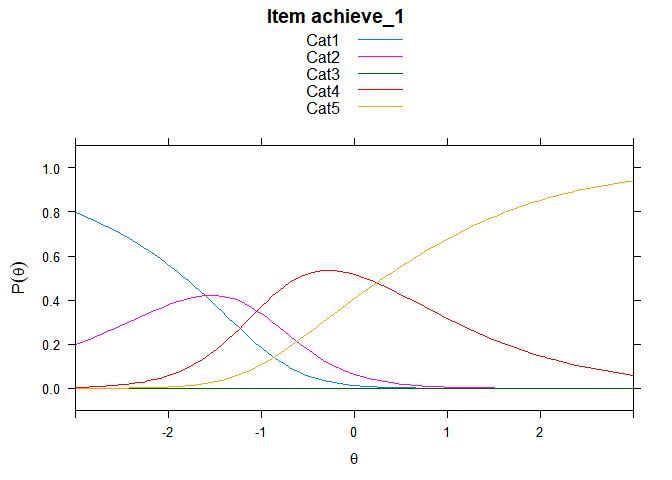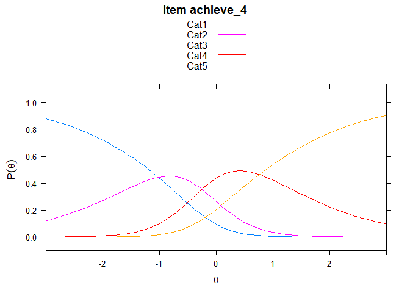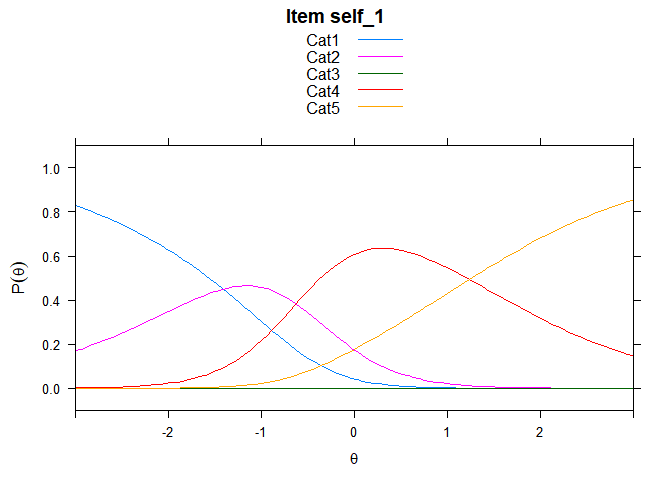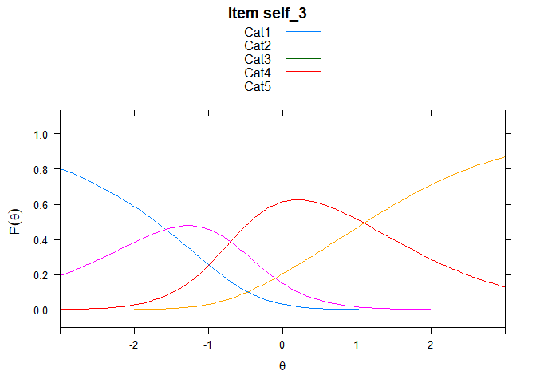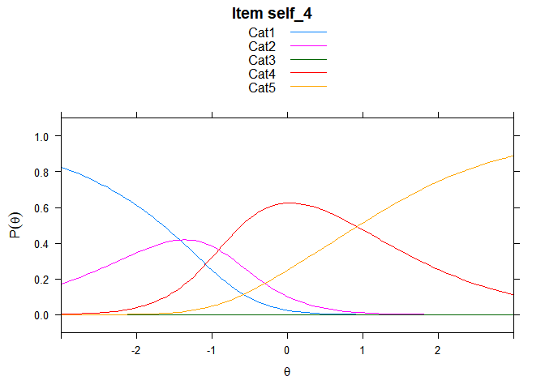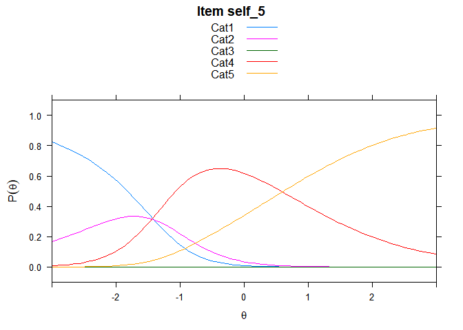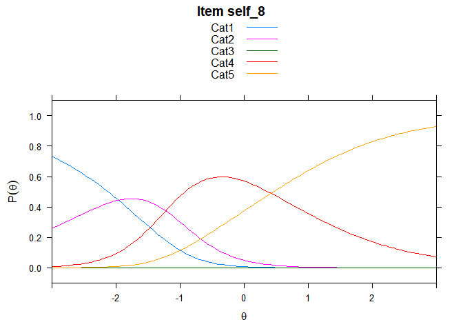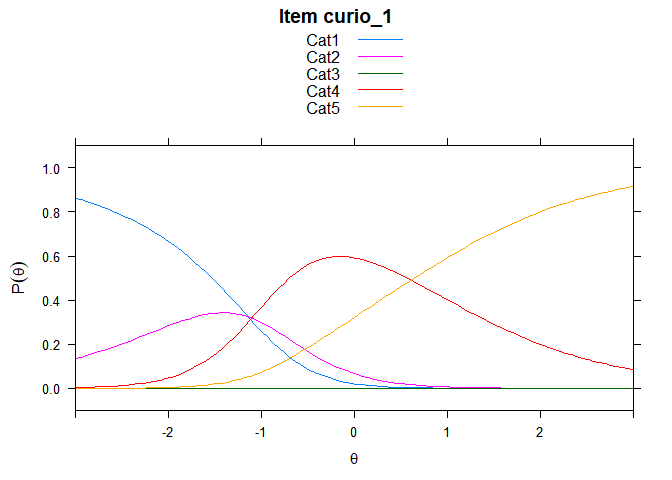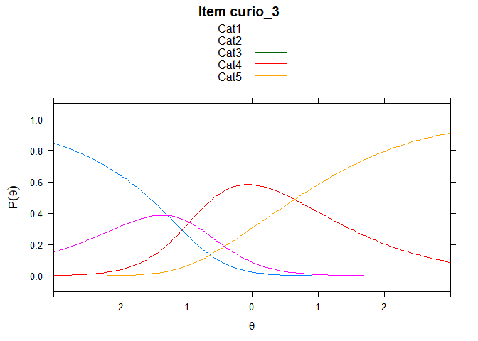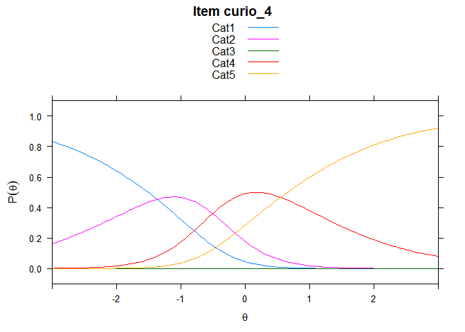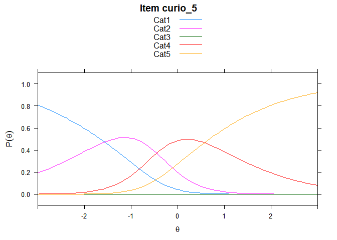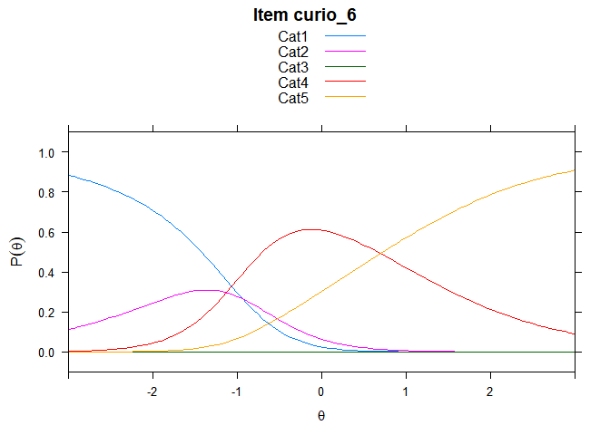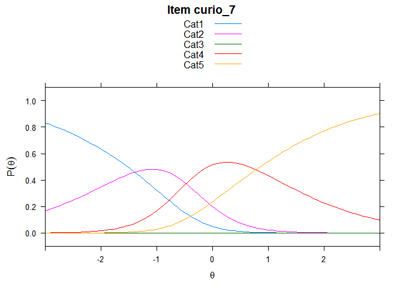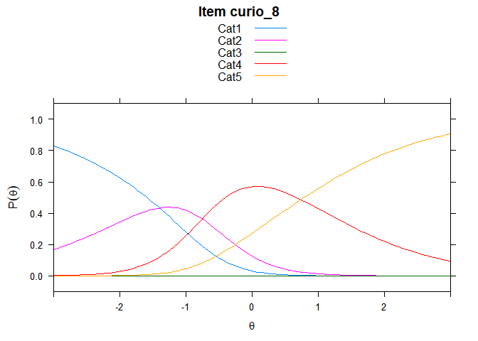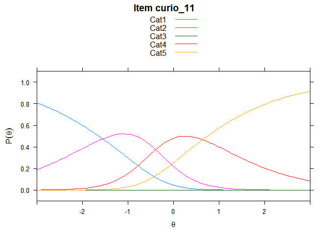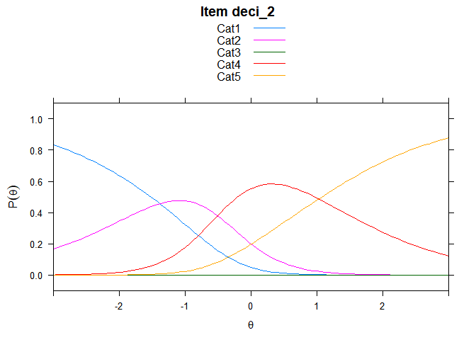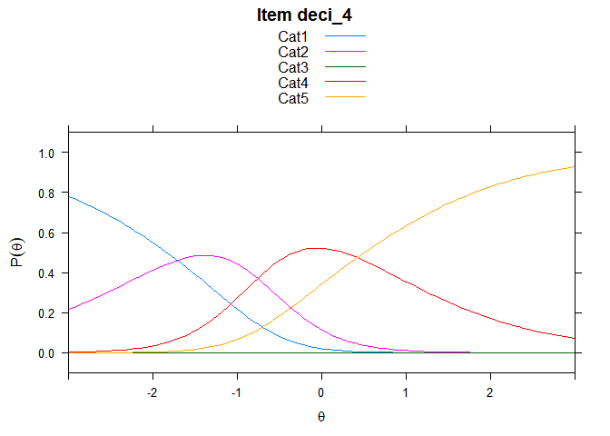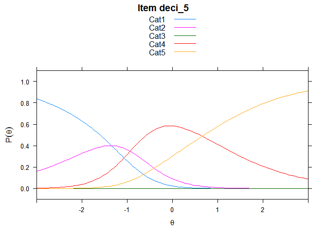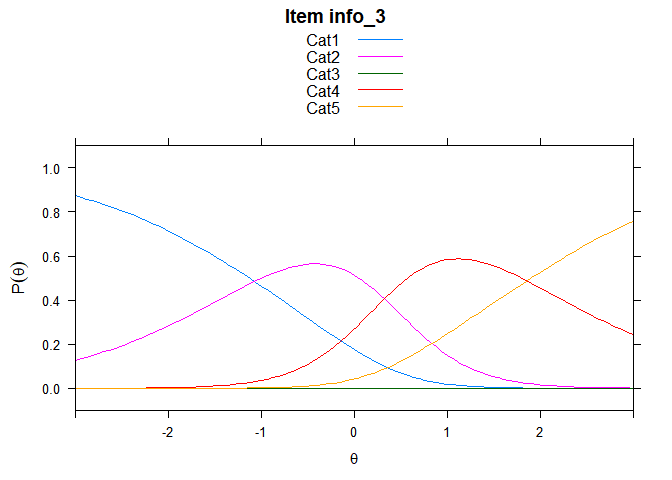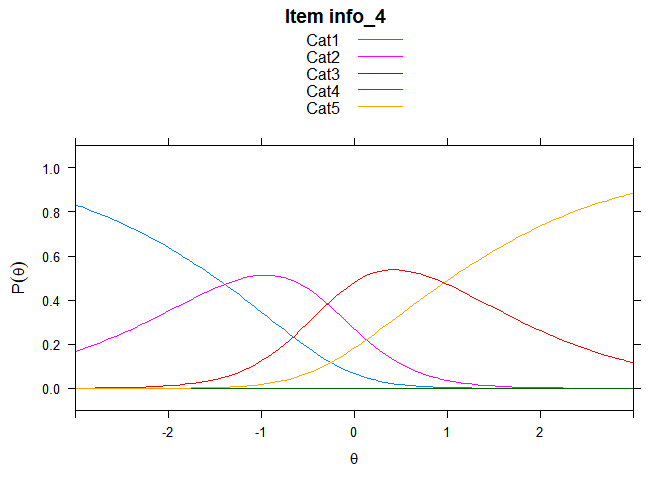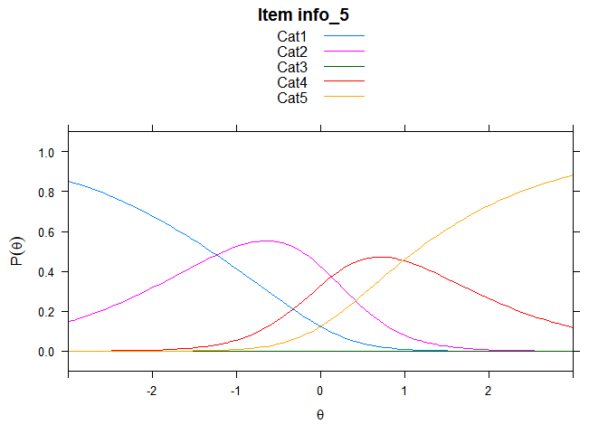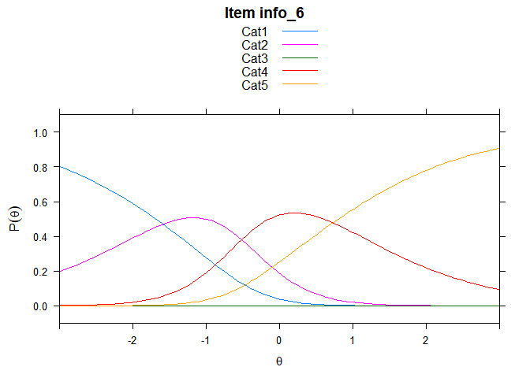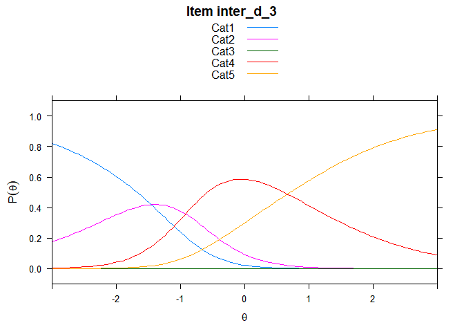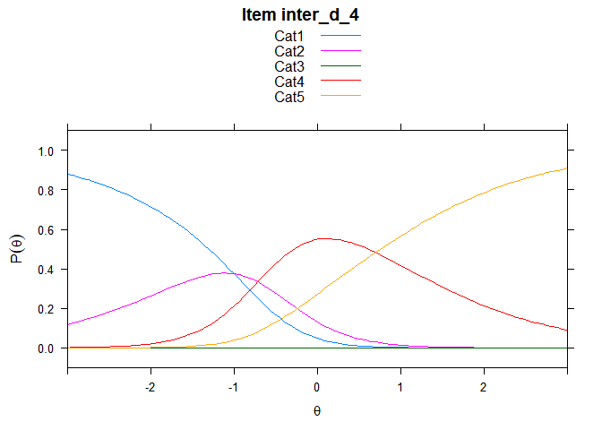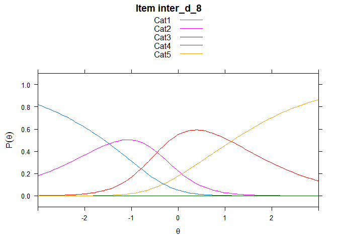

    ## ....................................................
    ##  Plots exported in png format into folder:
    ##  C:/Users/Park Jung/Documents/rasch/teachnic_paper/rasch/Plots

Note that the `echo = FALSE` parameter was added to the code chunk to prevent printing of the R code that generated the plot.
